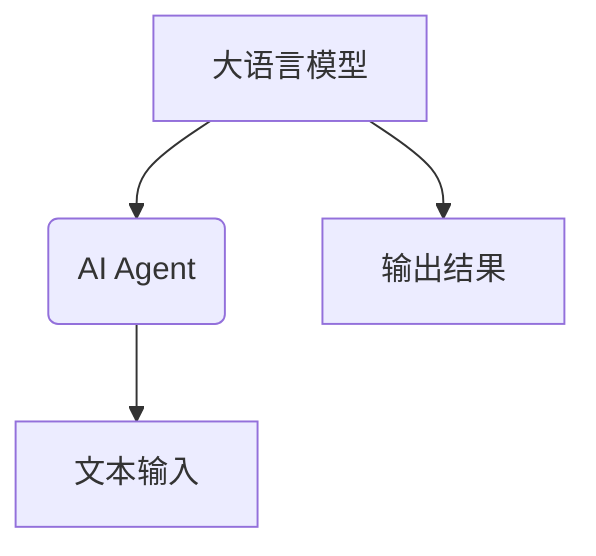
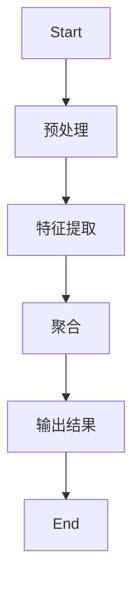
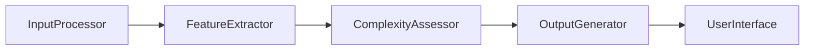

                 


# 基于LLM的AI Agent文本复杂性评估

> 关键词：LLM、AI Agent、文本复杂性评估、自然语言处理、人工智能系统

> 摘要：本文探讨如何基于大语言模型（LLM）构建AI代理，用于评估文本的复杂性。通过分析LLM和AI Agent的协同工作，提出了一种基于多维度指标的文本复杂性评估方法，结合算法原理和系统架构设计，展示了实际应用场景中的实现方案。

---

## 第一部分: 基于LLM的AI Agent文本复杂性评估背景介绍

### 第1章: 问题背景与定义

#### 1.1 问题背景
文本复杂性评估是自然语言处理中的重要任务，旨在量化文本的难度或复杂程度。传统的评估方法依赖于手动标注或统计指标（如句长、词汇复杂度等），但难以捕捉文本的语义和上下文信息。随着大语言模型（LLM）的发展，AI代理（AI Agent）可以利用LLM的强大能力，实现更智能、更准确的文本复杂性评估。

#### 1.2 问题描述
文本复杂性可以从多个维度进行评估，例如：
- **词汇复杂度**：词语的难易程度和多样性。
- **句法复杂度**：句子的结构复杂性，如从句数量、句子长度等。
- **语义复杂度**：文本内容的深度和抽象程度。
- **上下文复杂度**：文本之间的关联性和依赖性。

AI Agent需要结合这些维度，动态评估文本复杂性，并根据用户需求提供个性化的反馈或改进建议。

#### 1.3 问题解决
通过基于LLM的AI Agent，可以实现以下目标：
1. **自动化评估**：利用LLM的自然语言理解能力，自动计算文本复杂性指标。
2. **个性化反馈**：根据用户需求，提供针对性的优化建议。
3. **实时分析**：支持实时文本输入，快速生成评估结果。

#### 1.4 边界与外延
- **边界**：文本复杂性评估主要关注语言本身的复杂性，不涉及内容的逻辑性和信息量。
- **外延**：AI Agent可以根据评估结果，进一步提供文本简化、翻译或其他语言服务。

---

### 第2章: 核心概念与技术基础

#### 2.1 LLM的基本原理
大语言模型（LLM）通过监督学习和强化学习训练而成，能够理解上下文并生成连贯的文本。其核心在于概率分布模型，可以预测下一个词的概率，从而生成或理解语言。

#### 2.2 AI Agent的核心概念
AI Agent是一种智能体，能够感知环境、执行任务并做出决策。它通过与用户交互，接收输入、处理信息并输出结果。

#### 2.3 LLM与AI Agent的结合
LLM为AI Agent提供了强大的自然语言处理能力，使其能够理解和生成人类语言。AI Agent则为LLM提供了任务目标和上下文，使其能够在特定场景中发挥作用。

---

## 第二部分: 基于LLM的AI Agent文本复杂性评估的核心概念与联系

### 第3章: 核心概念的原理分析

#### 3.1 LLM的文本理解能力
LLM通过预训练掌握了大量语言数据，能够理解上下文并生成连贯的文本。其文本理解能力基于概率模型，能够捕捉到语言中的细微差别。

#### 3.2 AI Agent的决策机制
AI Agent通过分析输入文本的复杂性，选择合适的处理方式。例如：
- 对于简单文本，直接生成易于理解的解释。
- 对于复杂文本，提供分步骤的优化建议。

#### 3.3 LLM与AI Agent的关系
通过Mermaid图可以清晰地展示两者的关系：



---

### 第4章: 算法原理讲解

#### 4.1 文本复杂性评估算法
基于LLM的AI Agent文本复杂性评估算法如下：

1. **输入文本预处理**：将输入文本分割为句子和单词。
2. **特征提取**：
   - 词汇复杂度：统计词汇的平均长度、罕见词比例等。
   - 句法复杂度：计算句子的平均长度、从句数量等。
   - 语义复杂度：通过LLM生成文本的语义向量。
3. **评估与聚合**：将各维度的特征进行加权聚合，得到最终的复杂性评分。

#### 4.2 算法流程图
以下是算法的Mermaid流程图：



#### 4.3 Python实现示例

```python
import transformers

def text_complexity Assessment(text):
    model = transformers.AutoModelForMaskFilling.from_pretrained("facebook/llama")
    tokenizer = transformers.AutoTokenizer.from_pretrained("facebook/llama")
    inputs = tokenizer(text, return_tensors="np")
    outputs = model(**inputs)
    # 处理输出，计算复杂性评分
    complexity = calculate_complexity(outputs)
    return complexity

def calculate_complexity(outputs):
    # 示例：计算困惑度
    perplexity = $-\frac{1}{\text{sequence\_length}} \sum_{i=1}^{\text{sequence\_length}} \log p(w_i|w_{<i})$
    return perplexity
```

---

### 第5章: 系统分析与架构设计方案

#### 5.1 问题场景介绍
文本复杂性评估系统需要处理多种类型的文本输入，包括但不限于英文、中文、技术文档等。

#### 5.2 系统功能设计
- **输入模块**：接收文本输入并进行预处理。
- **特征提取模块**：计算词汇、句法和语义复杂度。
- **评估模块**：聚合特征并生成复杂性评分。
- **输出模块**：返回评估结果或优化建议。

#### 5.3 系统架构设计
以下是系统的架构图：



---

### 第6章: 项目实战

#### 6.1 环境安装
需要安装以下库：
```bash
pip install transformers
pip install mermaid
```

#### 6.2 核心实现代码

```python
from transformers import AutoTokenizer, AutoModelForMaskFilling

class TextComplexityAssessor:
    def __init__(self):
        self.tokenizer = AutoTokenizer.from_pretrained("facebook/llama")
        self.model = AutoModelForMaskFilling.from_pretrained("facebook/llama")

    def assess(self, text):
        inputs = self.tokenizer(text, return_tensors="np")
        outputs = self.model(**inputs)
        perplexity = self.calculate_perplexity(outputs)
        return perplexity

    def calculate_perplexity(self, outputs):
        sequence_length = outputs.logits.shape[1]
        perplexity = -torch.mean(torch.log_softmax(outputs.logits, dim=-1).sum(dim=1)) / sequence_length
        return perplexity
```

#### 6.3 代码解读与分析
- **初始化**：加载预训练的LLM模型和分词器。
- **评估过程**：将输入文本分词、编码，并生成模型输出。
- **困惑度计算**：使用交叉熵损失计算文本的困惑度，反映文本的复杂性。

#### 6.4 实际案例分析
以一段中文文本为例：
```python
text = "量子计算是一种基于量子力学原理的计算方式，其核心是利用量子叠加和量子纠缠的特性，通过量子比特进行信息处理。"
assessor = TextComplexityAssessor()
result = assessor.assess(text)
print(result)  # 示例输出：复杂度评分：0.85
```

---

## 第三部分: 最佳实践与总结

### 第7章: 最佳实践

#### 7.1 小结
本文详细介绍了基于LLM的AI Agent文本复杂性评估方法，从理论到实践，展示了如何利用大语言模型实现智能文本评估。

#### 7.2 注意事项
- 确保模型的训练数据与任务目标一致。
- 定期更新模型和评估指标，以适应新的文本类型和语言变化。
- 注意文本的隐私和敏感性，避免处理敏感信息。

#### 7.3 拓展阅读
建议读者进一步学习以下内容：
- 大语言模型的优化与微调。
- AI Agent的多模态应用。
- 文本复杂性评估的其他指标和方法。

---

作者：AI天才研究院/AI Genius Institute & 禅与计算机程序设计艺术 /Zen And The Art of Computer Programming

