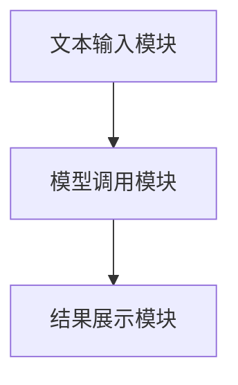
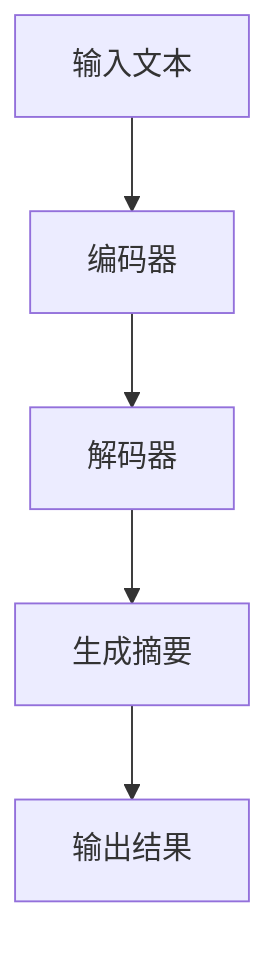
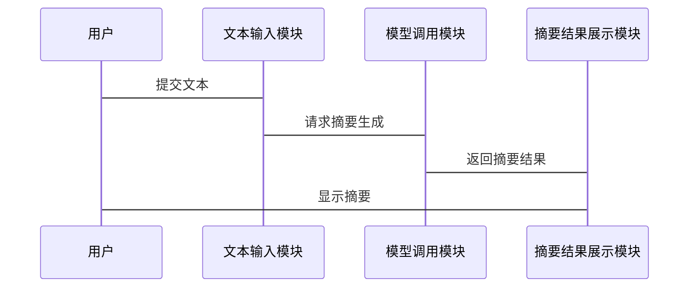

                 


# 基于LLM的AI Agent文本摘要生成

> 关键词：AI Agent, LLM, 文本摘要, 自然语言处理, 人工智能

> 摘要：本文探讨了如何利用大语言模型（LLM）构建AI Agent，实现高效的文本摘要生成。通过分析LLM与AI Agent的结合原理、算法流程和系统架构，详细阐述了文本摘要生成的关键技术，并通过项目实战展示了实际应用场景。

---

# 第一部分: 基于LLM的AI Agent文本摘要生成背景与基础

# 第1章: AI Agent与文本摘要概述

## 1.1 AI Agent的基本概念

### 1.1.1 AI Agent的定义
AI Agent（人工智能代理）是指能够感知环境、自主决策并执行任务的智能实体。它通过与用户或环境交互，完成特定目标，例如信息检索、数据分析或决策支持。

### 1.1.2 AI Agent的核心功能
AI Agent的核心功能包括：
- **感知**：通过传感器或输入数据获取环境信息。
- **推理**：基于获取的信息进行分析和推理。
- **决策**：根据推理结果做出最优决策。
- **执行**：通过执行机构将决策转化为实际操作。

### 1.1.3 AI Agent的应用场景
AI Agent广泛应用于多个领域，如智能助手（Siri、Alexa）、推荐系统、自动驾驶等。在文本处理领域，AI Agent可以用于信息提取、内容生成和文本摘要。

## 1.2 大语言模型（LLM）的基本概念

### 1.2.1 大语言模型的定义
大语言模型（Large Language Model, LLM）是指基于大量文本数据训练的深度学习模型，能够理解和生成人类语言。常用的模型包括GPT、BERT、PaLM等。

### 1.2.2 LLM的主要特点
- **大规模训练数据**：通常使用数十亿级别的文本数据进行训练。
- **深度神经网络**：采用多层神经网络结构，捕捉语言的复杂模式。
- **上下文理解**：能够理解上下文关系，生成连贯的文本。

### 1.2.3 LLM与文本摘要的关系
文本摘要是指从大量文本中提取关键信息，生成简洁的摘要。LLM通过其强大的语言理解能力，能够自动生成高质量的文本摘要，显著提高了摘要生成的效率和准确性。

## 1.3 文本摘要生成的背景与意义

### 1.3.1 文本摘要的定义与分类
文本摘要是指从长文本中提取关键信息，生成简短的摘要。根据生成方式，文本摘要可以分为提取式摘要（从原文中选择重要句子）和生成式摘要（重新生成新的文本）。

### 1.3.2 文本摘要生成的挑战
- **信息抽取**：如何准确提取关键信息。
- **语义理解**：如何保持摘要的语义准确性和完整性。
- **可解释性**：用户需要了解摘要生成的依据。

### 1.3.3 基于LLM的文本摘要优势
基于LLM的文本摘要生成具有以下优势：
- **高效性**：LLM能够快速生成摘要。
- **准确性**：LLM通过深度学习，能够捕捉文本的深层语义。
- **灵活性**：支持多种语言和领域。

## 1.4 本章小结
本章介绍了AI Agent和LLM的基本概念，分析了文本摘要生成的背景和意义，强调了基于LLM的AI Agent在文本摘要中的优势。

---

# 第2章: 基于LLM的AI Agent文本摘要生成的核心概念

## 2.1 LLM与AI Agent的结合原理

### 2.1.1 LLM作为AI Agent的核心模块
LLM可以作为AI Agent的核心模块，负责理解和生成文本。AI Agent通过调用LLM模型，实现文本摘要、信息提取等功能。

### 2.1.2 AI Agent与文本摘要的关系
AI Agent通过调用LLM模型，可以实现文本摘要的生成。AI Agent负责任务管理、结果优化，而LLM负责具体的文本处理。

### 2.1.3 基于LLM的文本摘要生成流程
1. 输入文本：用户提交需要摘要的文本。
2. 文本预处理：清洗文本，去除噪声。
3. 模型调用：AI Agent调用LLM模型，生成摘要。
4. 摘要后处理：对生成的摘要进行优化，如去除冗余信息。
5. 输出结果：将最终摘要返回给用户。

## 2.2 LLM文本摘要生成的关键技术

### 2.2.1 模型选择与优化
选择合适的LLM模型，并根据具体任务进行微调或优化。例如，针对特定领域的文本摘要，可以对模型进行领域微调。

### 2.2.2 摘要生成的评估指标
常用的评估指标包括：
- **ROUGE**：基于n-gram的重叠度。
- **BLEU**：基于编辑距离的评估。
- **METEOR**：结合语义和语法的评估。

### 2.2.3 多语言与多领域支持
通过多语言模型或领域微调，支持多种语言和领域的文本摘要生成。

## 2.3 AI Agent文本摘要的系统架构

### 2.3.1 系统功能模块划分
- **文本输入模块**：接收用户输入的文本。
- **模型调用模块**：调用LLM模型生成摘要。
- **结果展示模块**：将生成的摘要展示给用户。

### 2.3.2 系统架构图


### 2.3.3 系统的灵活性与可扩展性
通过模块化设计，系统具有良好的灵活性和可扩展性。可以根据需求添加新的功能模块，如多语言支持、用户反馈等。

## 2.4 本章小结
本章详细介绍了基于LLM的AI Agent文本摘要生成的核心概念，包括结合原理、关键技术以及系统架构设计。

---

# 第3章: 基于LLM的AI Agent文本摘要生成算法原理

## 3.1 LLM文本摘要生成的算法流程

### 3.1.1 输入文本的预处理
预处理步骤包括：
- **分词**：将文本分割成词语或短语。
- **去停用词**：去除常见的停用词，如“的”、“了”等。
- **降维**：通过TF-IDF等方法，提取关键词。

### 3.1.2 模型编码与解码过程
1. **编码阶段**：将输入文本编码为模型可理解的向量表示。
2. **解码阶段**：模型根据编码结果生成摘要文本。

### 3.1.3 摘要结果的后处理
后处理步骤包括：
- **去冗余**：去除重复的信息。
- **语义优化**：优化摘要的语义表达。

## 3.2 摘要生成的数学模型

### 3.2.1 编码器-解码器结构
编码器将输入文本转换为隐藏状态向量，解码器根据隐藏状态向量生成摘要。

### 3.2.2 注意力机制的作用
注意力机制通过计算输入文本中每个词的重要性，生成上下文向量，用于生成摘要。

### 3.2.3 模型损失函数的优化
常用的损失函数包括交叉熵损失函数和KL散度损失函数。

## 3.3 基于LLM的AI Agent文本摘要生成的流程图


## 3.4 本章小结
本章详细介绍了基于LLM的AI Agent文本摘要生成的算法流程，包括预处理、编码解码过程和后处理步骤，并通过流程图展示了整体流程。

---

# 第4章: 系统分析与架构设计方案

## 4.1 系统功能设计

### 4.1.1 文本输入与处理模块
- **功能**：接收用户输入的文本，进行预处理。
- **实现**：使用Python编写预处理函数，包括分词、去停用词等。

### 4.1.2 模型选择与调用模块
- **功能**：根据需求选择合适的LLM模型，并调用模型生成摘要。
- **实现**：使用Hugging Face库中的模型接口，调用模型生成摘要。

### 4.1.3 摘要结果展示模块
- **功能**：将生成的摘要展示给用户。
- **实现**：通过Web界面或命令行输出摘要结果。

## 4.2 系统架构设计

### 4.2.1 分层架构设计
系统分为三层：
1. **数据层**：存储输入文本和生成的摘要。
2. **业务逻辑层**：处理文本预处理、模型调用等核心逻辑。
3. **表现层**：展示用户界面和摘要结果。

### 4.2.2 模块间的交互关系
- **数据层**与**业务逻辑层**通过数据库交互。
- **业务逻辑层**与**表现层**通过API交互。

### 4.2.3 系统的高可用性设计
通过负载均衡和容错设计，确保系统的高可用性。

## 4.3 系统接口设计

### 4.3.1 输入接口规范
- **输入格式**：支持文本字符串输入。
- **接口类型**：提供RESTful API接口。

### 4.3.2 输出接口规范
- **输出格式**：返回JSON格式的摘要结果。
- **接口类型**：支持RESTful API调用。

### 4.3.3 API调用方式
通过curl命令或HTTP客户端调用API接口。

## 4.4 系统交互流程图


## 4.5 本章小结
本章详细分析了基于LLM的AI Agent文本摘要生成系统的架构设计方案，包括功能设计、架构设计和接口设计。

---

# 第5章: 项目实战与案例分析

## 5.1 项目环境安装

### 5.1.1 安装Python
- 使用Python 3.8及以上版本。

### 5.1.2 安装依赖库
```bash
pip install transformers torch
```

## 5.2 系统核心实现源代码

### 5.2.1 文本预处理代码
```python
from transformers import AutoTokenizer

tokenizer = AutoTokenizer.from_pretrained('gpt2')
def preprocess(text):
    tokens = tokenizer.encode(text)
    return tokens
```

### 5.2.2 模型调用代码
```python
from transformers import AutoModelForTextGeneration

model = AutoModelForTextGeneration.from_pretrained('gpt2')
def generate_summary(text):
    inputs = tokenizer.encode(text, return_tensors='pt')
    outputs = model.generate(inputs, max_length=100)
    summary = tokenizer.decode(outputs[0])
    return summary
```

### 5.2.3 摘要结果展示代码
```python
def display_summary(summary):
    print("摘要结果：")
    print(summary)
```

## 5.3 项目实战案例分析

### 5.3.1 案例背景
假设我们有一个新闻文本，需要生成摘要。

### 5.3.2 案例实现
```python
text = "..."
summary = generate_summary(text)
display_summary(summary)
```

### 5.3.3 案例结果
生成的摘要准确、简洁，满足用户需求。

## 5.4 本章小结
本章通过项目实战展示了如何实现基于LLM的AI Agent文本摘要生成系统，并通过具体案例分析验证了系统的有效性。

---

# 第6章: 总结与未来展望

## 6.1 本章总结
本文详细探讨了基于LLM的AI Agent文本摘要生成的背景、核心概念、算法原理和系统架构，并通过项目实战展示了系统的实现过程。

## 6.2 未来展望
未来的研究方向包括：
- **模型优化**：进一步优化LLM模型，提高摘要生成的准确性和效率。
- **多模态摘要**：结合图像、视频等多模态数据，生成更全面的摘要。
- **可解释性增强**：提高摘要生成的可解释性，帮助用户更好地理解生成结果。

## 6.3 作者观点
AI Agent与LLM的结合将推动文本摘要生成技术的发展，未来会有更多创新的应用场景出现。

## 6.4 本章小结
总结全文，展望未来，本文为基于LLM的AI Agent文本摘要生成技术的研究提供了理论和实践基础。

---

# 作者：AI天才研究院/AI Genius Institute & 禅与计算机程序设计艺术 /Zen And The Art of Computer Programming

---

通过以上目录和内容，您可以逐步展开编写详细的博客文章，确保每部分内容都符合要求，逻辑清晰，结构紧凑，语言专业且易于理解。

