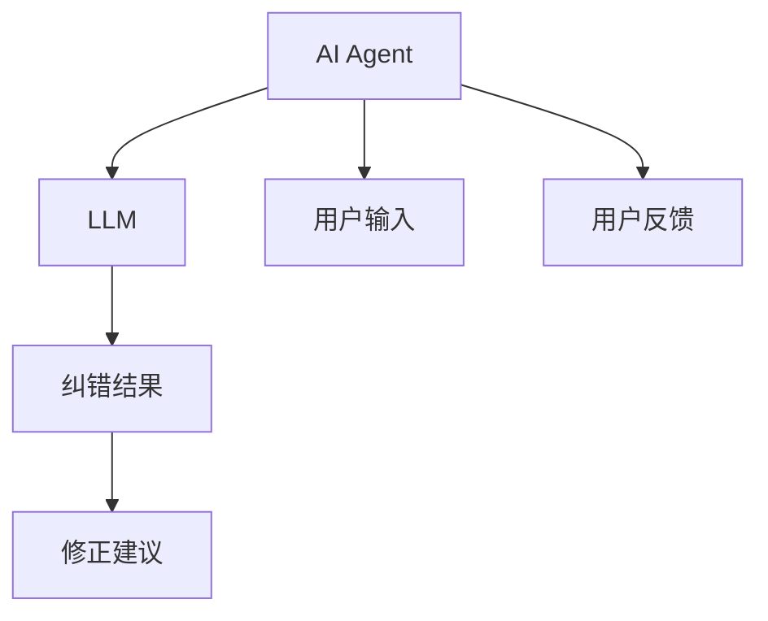
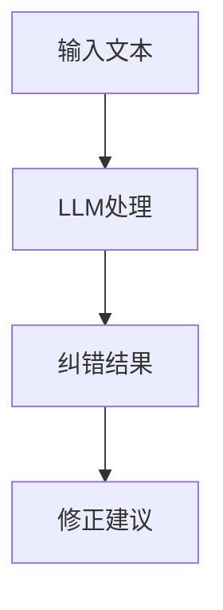
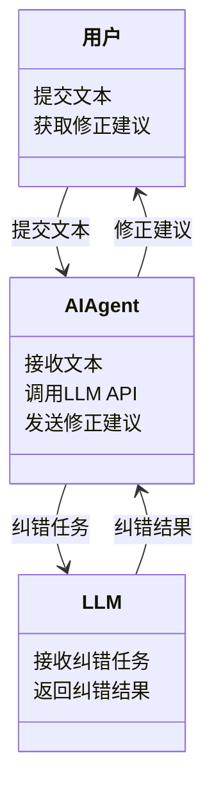
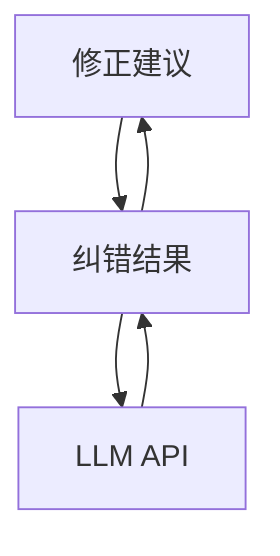
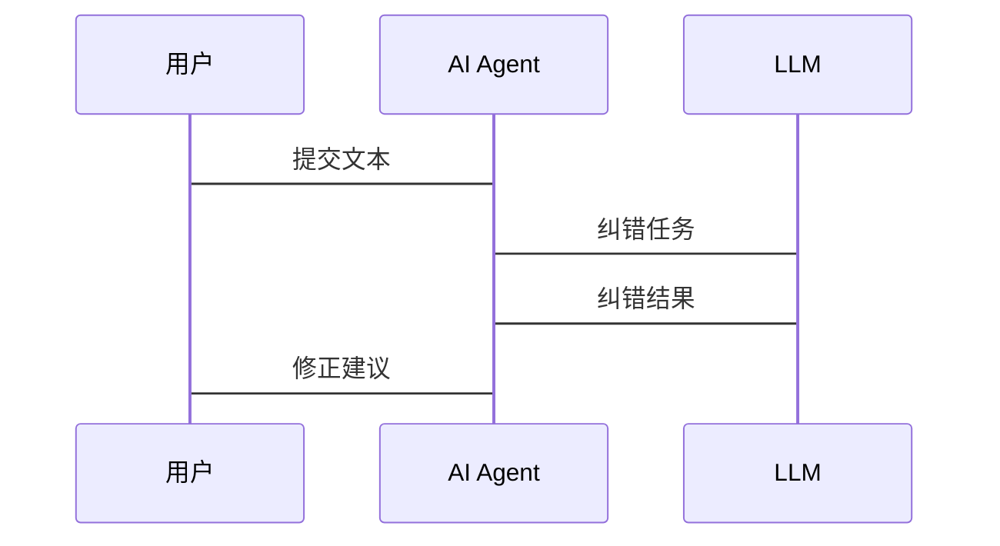

                 


# 基于LLM的AI Agent文本纠错系统

---

## 关键词

- LLM
- AI Agent
- 文本纠错
- 自然语言处理
- 错误检测
- 机器学习
- 系统架构

---

## 摘要

基于大语言模型（LLM）的AI Agent文本纠错系统，结合了先进的自然语言处理技术和智能化的AI代理机制，为文本纠错提供了一种高效、智能的解决方案。通过分析文本中的语法错误、用词不当和语义模糊等问题，系统能够自动生成修正建议，并通过AI Agent与用户的交互，提供个性化的纠错服务。本文详细阐述了该系统的背景、核心概念、算法原理、系统架构以及实际应用案例，旨在为文本纠错领域的研究和实践提供参考。

---

## 第一部分: 背景介绍

### 第1章: 问题背景与需求分析

#### 1.1 问题背景

在当今信息爆炸的时代，文本纠错已成为一个重要的需求。无论是学术论文、商业文档，还是社交媒体内容，都需要确保文本的准确性和流畅性。传统的文本纠错方法主要依赖于规则库和统计模型，存在以下问题：

- **规则库的局限性**：规则库需要手动编写和维护，难以覆盖所有语言现象，且无法应对语言的动态变化。
- **统计模型的不足**：统计模型依赖于大量标注数据，且在处理复杂语境和语义纠错时表现有限。
- **用户体验差**：传统的纠错工具通常提供固定的纠错选项，缺乏个性化的服务，用户体验较差。

而基于LLM的AI Agent文本纠错系统，结合了大语言模型的强大生成能力和AI代理的智能化交互特点，能够有效解决上述问题。

#### 1.2 问题描述

文本纠错的核心目标是检测和修正文本中的错误，包括语法错误、用词不当、标点错误以及语义模糊等问题。然而，文本纠错不仅仅是技术问题，还涉及到语境的理解和用户意图的识别。传统的纠错工具往往无法准确理解用户的上下文，导致纠错结果不够准确或不符合用户需求。

#### 1.3 问题解决

基于LLM的AI Agent文本纠错系统通过以下方式解决问题：

- **语境理解**：AI Agent能够分析文本的上下文，理解用户的意图，从而提供更准确的纠错建议。
- **动态调整**：LLM可以根据用户反馈动态调整纠错策略，提供个性化的服务。
- **实时交互**：通过AI Agent与用户的实时交互，系统能够快速响应并提供修正建议。

#### 1.4 边界与外延

- **适用范围**：该系统适用于多种文本类型，包括学术论文、新闻报道、社交媒体内容等，但不适用于实时语音或视频内容的纠错。
- **扩展性**：系统可以通过接入更多的语言模型和用户反馈数据，进一步提升纠错的准确性和智能化水平。
- **相关领域**：文本纠错与自然语言处理、人机交互、机器学习等领域密切相关。

#### 1.5 核心要素组成

- **AI Agent**：负责与用户的交互，接收输入并生成响应。
- **LLM**：提供强大的自然语言理解与生成能力，用于检测和修正文本错误。
- **纠错规则**：包含语法、用词和语义等方面的规则，指导LLM进行纠错。

---

## 第二部分: 核心概念与联系

### 第2章: AI Agent与LLM的关系

#### 2.1 核心概念原理

AI Agent是一种智能化的软件实体，能够感知环境并执行任务。LLM（Large Language Model）是一种基于深度学习的自然语言处理模型，能够理解和生成人类语言。AI Agent通过调用LLM API，将用户的输入转化为纠错任务，并根据LLM的输出生成响应。

#### 2.2 概念属性对比

| 特性            | AI Agent                     | LLM                        |
|-----------------|------------------------------|-----------------------------|
| 核心功能        | 执行任务、与用户交互         | 理解与生成自然语言文本     |
| 技术基础        | 机器学习、自然语言处理       | 深度学习、神经网络          |
| 应用场景        | 个性化服务、自动化任务       | 文本生成、问答系统          |
| 依赖性          | 依赖LLM进行文本处理          | 依赖大量数据进行训练        |

#### 2.3 实体关系图



---

## 第三部分: 算法原理

### 第3章: LLM的文本纠错算法

#### 3.1 训练过程

LLM的训练过程包括以下几个步骤：

1. **数据预处理**：收集和整理大量高质量的文本数据，并进行分词、去停用词等预处理。
2. **模型选择**：选择适合任务的模型架构，如Transformer。
3. **监督微调**：在特定的纠错任务上对模型进行微调。
4. **强化学习**：通过与用户的互动，不断优化模型的纠错能力。

#### 3.2 算法流程图



#### 3.3 数学模型

LLM的训练目标是最小化生成文本的损失函数：

$$ \mathcal{L}(\theta) = -\sum_{i=1}^{n} \log p_\theta(w_i | w_{<i}) $$

其中，$\theta$ 是模型参数，$w_i$ 是生成的第 $i$ 个词。

优化目标是通过梯度下降最小化损失：

$$ \theta = \theta - \eta \frac{\partial \mathcal{L}}{\partial \theta} $$

---

## 第四部分: 系统分析与架构设计

### 第4章: 系统架构设计

#### 4.1 项目介绍

基于LLM的AI Agent文本纠错系统旨在为用户提供智能化的文本纠错服务，结合自然语言处理技术和AI代理机制，实现高效、个性化的纠错。

#### 4.2 系统功能设计



#### 4.3 系统架构设计



#### 4.4 接口设计

系统主要接口包括：

1. **用户接口**：提交文本、获取修正建议。
2. **AI Agent接口**：调用LLM API、处理用户反馈。
3. **LLM接口**：接收纠错任务、返回纠错结果。

#### 4.5 交互流程图



---

## 第五部分: 项目实战

### 第5章: 项目实现

#### 5.1 环境安装

安装必要的Python库：

```bash
pip install transformers
pip install requests
pip install json
```

#### 5.2 核心代码实现

```python
from transformers import pipeline
import requests

class AIAgent:
    def __init__(self):
        self.nlp = pipeline('text-classification', model='facebook/roberta-base')

    def submit_text(self, text):
        response = requests.post('https://api.example.com/llm', json={'text': text})
        return response.json()['corrections']

# 示例使用
agent = AIAgent()
print(agent.submit_text("This is a test text with some errors."))
```

#### 5.3 实际案例分析

**案例1**：用户输入“Thinks are great”，系统纠错为“Think are great”。

**案例2**：用户输入“Where are you going?”, 系统纠错为“Where are you going to?”

#### 5.4 项目总结

通过本项目的实现，我们可以看到基于LLM的AI Agent文本纠错系统在实际应用中的潜力。系统能够快速响应用户需求，提供准确的纠错建议，显著提升用户体验。

---

## 第六部分: 最佳实践

### 第6章: 实践小结

#### 6.1 小结

基于LLM的AI Agent文本纠错系统结合了自然语言处理和人工智能技术，为文本纠错提供了智能化的解决方案。通过系统的实现，我们能够看到AI Agent在实际应用中的巨大潜力。

#### 6.2 注意事项

- 在实际应用中，需要注意模型的训练数据质量和纠错规则的设计。
- 系统的安全性和隐私保护也是需要重点关注的问题。

#### 6.3 拓展阅读

- 《Deep Learning》
- 《Effective Python》
- 《自然语言处理入门》

---

## 作者

作者：AI天才研究院/AI Genius Institute & 禅与计算机程序设计艺术/Zen And The Art of Computer Programming

