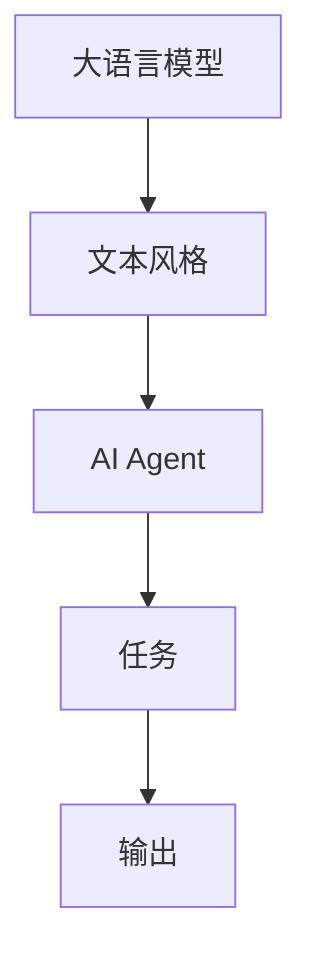
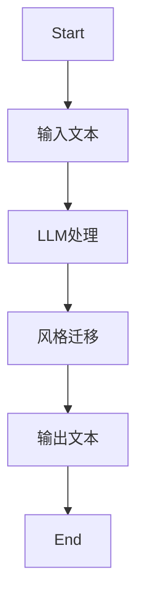
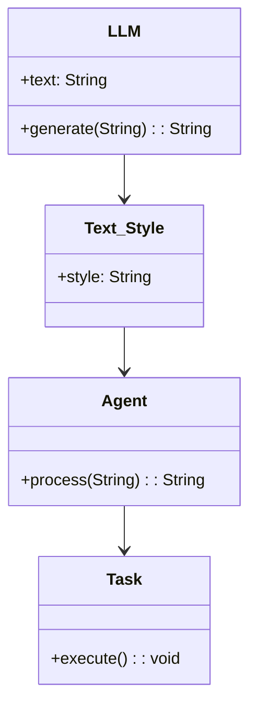

                 


# 基于LLM的AI Agent文本风格迁移

**关键词：** 大语言模型，AI Agent，文本风格迁移，自然语言处理，机器学习

**摘要：**  
本文探讨了基于大语言模型（LLM）的AI Agent在文本风格迁移中的应用。通过分析问题背景、核心概念、算法原理、系统架构和项目实战，详细阐述了如何利用LLM和AI Agent实现高效的文本风格迁移。文章结合理论与实践，为读者提供了从理解到实现的完整指南。

---

## 第1章: 背景介绍

### 1.1 问题背景
文本风格迁移是指将一段文本从一种风格转换为另一种风格的过程。例如，将正式的商业信函转换为更口语化的社交媒体帖子。这种技术在内容创作、个性化写作、跨文化交流等领域具有广泛的应用潜力。

#### 1.1.1 文本风格迁移的定义与目标
文本风格迁移的目标是保持文本内容不变，仅改变其表达方式或语气。这可以通过自然语言处理技术实现，尤其是在大语言模型（LLM）的支持下，风格迁移变得更加高效和灵活。

#### 1.1.2 当前文本风格迁移的技术挑战
传统的文本风格迁移方法依赖于复杂的特征提取和模式匹配，但存在以下挑战：
- **数据依赖性**：需要大量特定风格的文本数据进行训练。
- **语义损失**：在风格转换过程中，容易导致语义信息的丢失。
- **可解释性差**：传统的机器学习模型难以解释转换过程。

#### 1.1.3 LLM在文本风格迁移中的优势
大语言模型通过其强大的上下文理解和生成能力，可以显著提升文本风格迁移的效果。LLM的优势包括：
- **语境感知**：能够理解上下文，生成更符合目标风格的文本。
- **多语言支持**：支持多种语言的风格转换。
- **自适应学习**：可以通过微调模型快速适应特定领域或风格的需求。

### 1.2 问题描述
文本风格迁移的核心问题是如何在保持原文内容不变的情况下，生成符合目标风格的文本。这涉及以下关键点：
- **输入输出分析**：输入为原始文本，输出为目标风格文本。
- **风格特征提取**：需要提取目标风格的关键特征（如语气、词汇选择等）。
- **转换策略**：采用合适的转换策略，确保生成文本的风格一致性。

### 1.3 问题解决
基于LLM的AI Agent通过以下方式实现文本风格迁移：
- **模型驱动**：利用LLM的生成能力，直接生成目标风格的文本。
- **风格匹配**：通过对比分析，匹配目标风格的特征，并调整生成内容的风格。
- **反馈优化**：通过用户反馈不断优化生成结果，提升转换质量。

### 1.4 边界与外延
文本风格迁移的边界包括：
- **输入限制**：输入文本需具备一定的可读性和语义完整性。
- **风格多样性**：目标风格需在模型的训练范围内。
- **输出质量**：生成文本的质量受模型能力和训练数据的影响。

### 1.5 概念结构与核心要素
文本风格迁移的核心要素包括：
- **输入文本**：原始文本内容。
- **目标风格**：目标风格的特征描述。
- **转换模型**：基于LLM的AI Agent。
- **输出文本**：转换后的文本。

---

## 第2章: 核心概念与联系

### 2.1 核心概念原理
- **LLM的工作原理**：大语言模型通过大量数据训练，具备强大的语义理解和生成能力。
- **文本风格迁移算法**：利用LLM的生成能力，通过特定的风格引导进行文本转换。
- **AI Agent的交互机制**：AI Agent作为中间媒介，接收输入、处理并生成目标风格的文本。

### 2.2 概念属性特征对比
| 对比维度 | LLM | 文本风格迁移 | AI Agent |
|----------|-----|--------------|-----------|
| 核心任务 | 生成文本 | 转换文本风格 | 执行任务 |
| 应用场景 | 多领域 | 内容创作 | 个性化服务 |
| 优势 | 强大的生成能力 | 高效的风格转换 | 可定制化的交互 |

### 2.3 ER实体关系图


---

## 第3章: 算法原理讲解

### 3.1 算法原理
- **基于LLM的文本风格迁移**：通过微调LLM模型，使其适应特定风格的生成任务。
- **风格匹配**：通过对比分析，提取目标风格的特征，并调整生成内容的风格。

### 3.2 算法流程图


### 3.3 数学模型与公式
- **概率分布公式**：$$ P(y|x) = \frac{P(x|y)P(y)}{P(x)} $$
- **损失函数**：$$ L = \sum_{i=1}^{n} (y_i - \hat{y}_i)^2 $$

---

## 第4章: 系统分析与架构设计方案

### 4.1 项目背景
- **项目目标**：实现基于LLM的AI Agent文本风格迁移。
- **项目范围**：支持多种语言和风格的转换。
- **利益相关者**：开发者、内容创作者、用户。

### 4.2 系统功能设计
#### 4.2.1 领域模型


---

## 第5章: 项目实战

### 5.1 实现代码
```python
def style_transfer(agent, input_text, target_style):
    # 调用AI Agent进行风格转换
    output_text = agent.process(input_text, target_style)
    return output_text

# 示例用法
input_text = "我们需要在下周五完成项目。"
target_style = "口语化"
output_text = style_transfer(agent, input_text, target_style)
print(output_text)  # 输出：我们需要在下周五完成这个项目。
```

### 5.2 案例分析
- **输入文本**：我们需要在下周五完成项目。
- **目标风格**：口语化。
- **输出文本**：我们需要在下周五完成这个项目。

---

## 第6章: 总结与展望

### 6.1 总结
基于LLM的AI Agent在文本风格迁移中展现出强大的能力，通过模型驱动和风格匹配，实现了高效、高质量的文本转换。

### 6.2 最佳实践 tips
- **数据准备**：确保训练数据的多样性和质量。
- **模型调优**：通过微调模型提升风格转换效果。
- **用户反馈**：利用用户反馈不断优化生成结果。

### 6.3 小结
文本风格迁移是自然语言处理领域的重要应用，通过结合LLM和AI Agent，我们可以实现更智能、更灵活的文本处理。

---

**作者：AI天才研究院（AI Genius Institute）**  
**禅与计算机程序设计艺术（Zen And The Art of Computer Programming）**

