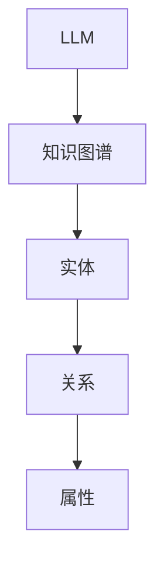

                 


# 基于LLM的AI Agent知识图谱构建

---

## 关键词：
- 基于LLM的AI Agent
- 知识图谱构建
- 大语言模型
- 实体识别
- 知识融合
- 图嵌入

---

## 摘要：
随着大语言模型（LLM）的快速发展，知识图谱在AI Agent中的应用日益重要。本文章系统地介绍了基于LLM的AI Agent知识图谱构建的核心概念、算法原理、系统架构及实战案例。文章从知识图谱与AI Agent的背景出发，深入分析了LLM与知识图谱的结合方式，详细讲解了知识图谱构建的关键算法，包括实体识别、关系抽取、图嵌入等技术，并通过实际案例展示了如何利用这些技术构建高效的AI Agent知识图谱。最后，文章总结了构建过程中的关键经验与注意事项，为读者提供了全面的指导。

---

## 目录大纲：

### 第一部分：背景介绍

#### 第1章：知识图谱与AI Agent概述

- **1.1 知识图谱的定义与特点**
  - 1.1.1 知识图谱的定义
  - 1.1.2 知识图谱的核心特点
  - 1.1.3 知识图谱与传统数据库的区别

- **1.2 AI Agent的定义与特点**
  - 1.2.1 AI Agent的定义
  - 1.2.2 AI Agent的核心特点
  - 1.2.3 AI Agent与传统程序的区别

- **1.3 基于LLM的AI Agent知识图谱构建的背景**
  - 1.3.1 大语言模型的发展现状
  - 1.3.2 知识图谱在AI Agent中的作用
  - 1.3.3 当前技术面临的挑战

- **1.4 本章小结**

---

### 第二部分：核心概念与联系

#### 第2章：LLM与知识图谱的核心概念与联系

- **2.1 LLM的核心原理**
  - 2.1.1 大语言模型的基本原理
  - 2.1.2 LLM的训练过程
  - 2.1.3 LLM的输出机制

- **2.2 知识图谱的构建原理**
  - 2.2.1 知识抽取与表示
  - 2.2.2 知识融合与推理
  - 2.2.3 知识存储与管理

- **2.3 LLM与知识图谱的结合方式**
  - 2.3.1 基于LLM的知识抽取
  - 2.3.2 基于知识图谱的LLM优化
  - 2.3.3 LLM与知识图谱的联合训练

- **2.4 核心概念对比分析**
  - 2.4.1 LLM与知识图谱的对比表格
  - 2.4.2 实体关系图的ER图架构



---

### 第三部分：算法原理讲解

#### 第3章：知识图谱构建算法原理

- **3.1 知识抽取算法**
  - 3.1.1 基于LLM的实体识别算法
  ```mermaid
  graph TD
      A[输入文本] --> B[LLM实体识别]
      B --> C[实体列表]
  ```

  - 3.1.2 实体链接算法
  ```mermaid
  graph TD
      A[实体候选] --> B[实体链接]
      B --> C[实体映射]
  ```

- **3.2 知识融合算法**
  - 3.2.1 基于LLM的知识融合流程
  ```mermaid
  graph TD
      A[输入知识片段] --> B[LLM知识融合]
      B --> C[融合知识图谱]
  ```

- **3.3 图嵌入算法**
  - 3.3.1 基于节点嵌入的知识表示方法
    - 使用Word2Vec或GloVe进行节点嵌入
  - 3.3.2 图神经网络（Graph Neural Networks, GNN）的应用
    - GNN的图传播机制
  - 3.3.3 知识图谱中的注意力机制
    - 注意力权重分配的数学公式
  - 3.3.4 基于LLM的动态图嵌入
    - 动态知识更新的流程

---

### 第四部分：系统分析与架构设计

#### 第4章：系统架构与设计

- **4.1 问题场景介绍**
  - 4.1.1 AI Agent的知识需求
  - 4.1.2 知识图谱的实时更新需求

- **4.2 系统功能设计**
  - 4.2.1 数据预处理模块
    - 文本清洗与分词
  - 4.2.2 知识抽取模块
    - 实体识别与关系抽取
  - 4.2.3 知识融合模块
    - 知识冲突检测与消解
  - 4.2.4 知识图谱存储模块
    - 图数据库的选择与设计
  - 4.2.5 知识查询与推理模块
    - 基于LLM的推理机制

- **4.3 系统架构设计**
  ```mermaid
  graph TD
      A[用户查询] --> B[知识查询模块]
      B --> C[知识图谱存储]
      C --> D[知识推理模块]
      D --> E[LLM推理]
      E --> F[结果返回]
  ```

- **4.4 系统交互设计**
  ```mermaid
  graph TD
      A[用户] --> B[知识查询模块]
      B --> C[知识图谱存储]
      C --> D[知识推理模块]
      D --> E[LLM推理]
      E --> F[结果返回]
      F --> A[用户]
  ```

---

### 第五部分：项目实战

#### 第5章：基于LLM的AI Agent知识图谱实战

- **5.1 项目背景与目标**
  - 5.1.1 项目背景
  - 5.1.2 项目目标

- **5.2 环境配置与工具安装**
  - 5.2.1 开发环境配置
    - Python版本要求
    - 依赖库安装（如TensorFlow、PyTorch、Neo4j等）
  - 5.2.2 数据集准备
    - 文本数据来源
    - 数据清洗与预处理

- **5.3 系统核心实现**
  - 5.3.1 数据预处理代码
    ```python
    import re
    def preprocess(text):
        return re.sub(r'\s+', ' ', text).strip()
    ```
  - 5.3.2 知识抽取代码
    ```python
    def extract_entities(text):
        # 使用LLM进行实体识别
        return entities
    ```
  - 5.3.3 知识融合代码
    ```python
    def merge_knowledge(knowledge1, knowledge2):
        # 知识融合逻辑
        return merged_knowledge
    ```
  - 5.3.4 知识图谱存储代码
    ```python
    from neo4j import GraphDatabase
    def store_kg(neo4j_uri, entities, relations):
        driver = GraphDatabase.driver(neo4j_uri)
        # 存储逻辑
        return
    ```

- **5.4 实际案例分析**
  - 5.4.1 案例背景
  - 5.4.2 数据处理与分析
  - 5.4.3 知识图谱构建与展示
  - 5.4.4 实验结果与优化

- **5.5 项目小结**
  - 5.5.1 项目总结
  - 5.5.2 经验分享
  - 5.5.3 改进建议

---

### 第六部分：最佳实践与总结

#### 第6章：最佳实践与总结

- **6.1 关键经验总结**
  - 数据质量的重要性
  - 知识抽取的准确性优化
  - 知识图谱的动态更新机制

- **6.2 注意事项**
  - 数据隐私与安全
  - 算法的可解释性
  - 系统性能优化

- **6.3 拓展阅读**
  - 推荐书籍与论文
  - 在线课程与资源

- **6.4 未来研究方向**
  - 多模态知识图谱
  - 知识图谱的实时更新
  - 更高效的图嵌入算法

---

## 作者：AI天才研究院/AI Genius Institute & 禅与计算机程序设计艺术 /Zen And The Art of Computer Programming

