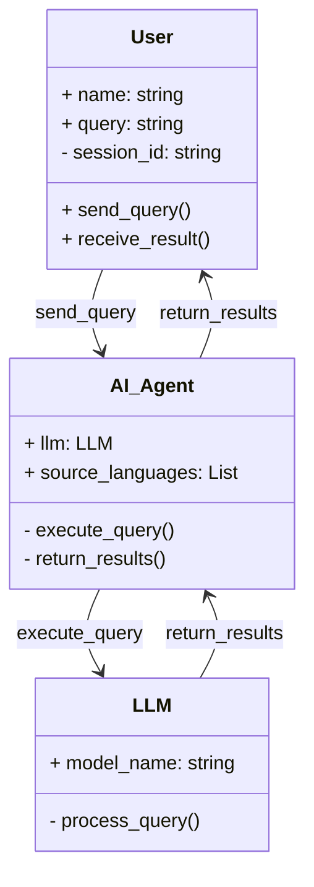
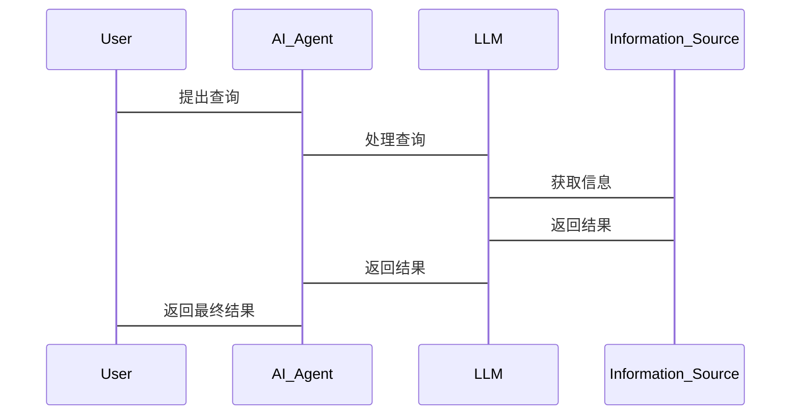

                 


# 基于LLM的AI Agent跨语言信息检索

**关键词**：LLM、AI Agent、跨语言信息检索、自然语言处理、机器学习

**摘要**：随着全球化的深入，跨语言信息检索的需求日益增长。本文探讨如何利用大语言模型（LLM）构建AI Agent，实现跨语言信息检索。文章从背景、原理、算法、架构到实战，详细分析了实现过程，为读者提供全面的技术指导。

---

## 第1章：背景介绍

### 1.1 问题背景

#### 1.1.1 多语言信息检索的挑战

在全球化背景下，信息分布在多种语言中。用户可能需要在不同语言间检索信息，但传统搜索引擎在跨语言检索中存在不足，如语义理解不准确、信息提取不完整等问题。

#### 1.1.2 AI Agent在信息检索中的作用

AI Agent作为智能助手，能够理解用户需求，执行跨语言检索任务，返回准确结果。AI Agent结合LLM的自然语言处理能力，解决了传统搜索引擎的局限性。

#### 1.1.3 跨语言信息检索的核心问题

核心问题包括多语言语义理解、跨语言信息匹配、结果整合等。这些问题需要结合LLM和AI Agent的技术优势来解决。

### 1.2 问题描述

#### 1.2.1 跨语言信息检索的定义

跨语言信息检索是指在多种语言信息源中，根据用户查询返回相关结果的过程。

#### 1.2.2 AI Agent在跨语言检索中的角色

AI Agent作为中间层，负责解析用户查询、协调多语言信息源，并返回结果。它利用LLM进行语义理解，优化检索过程。

#### 1.2.3 当前技术的局限性

传统方法依赖于机器翻译，存在语义损失和准确性不足的问题。AI Agent结合LLM，通过语义理解直接检索，提高了准确性。

### 1.3 解决方案概述

#### 1.3.1 基于LLM的AI Agent的优势

LLM具备强大的语义理解能力，能够处理多种语言信息。AI Agent作为接口，协调LLM和其他模块，实现高效检索。

#### 1.3.2 跨语言信息检索的实现路径

实现路径包括：用户查询解析、多语言信息源检索、结果整合与呈现。AI Agent负责协调各模块，确保高效运行。

#### 1.3.3 解决方案的可行性分析

技术可行性：现有LLM和AI Agent技术已成熟，具备实现基础。经济可行性：虽然需要投入，但效益显著。操作可行性：流程清晰，易于实现。

### 1.4 边界与外延

#### 1.4.1 跨语言信息检索的边界

仅限于文本信息检索，不涉及图像或视频等其他形式。支持的语言和信息源有限，需明确边界。

#### 1.4.2 AI Agent的适用范围

适用于需要多语言支持的场景，如企业搜索、客户服务等。不适用于需要实时语音处理的场景。

#### 1.4.3 技术实现的限制

受LLM模型大小和计算能力限制，大规模检索可能影响性能。需要优化算法和架构。

### 1.5 概念结构与核心要素

#### 1.5.1 跨语言信息检索的核心要素

- 用户查询：明确需求。
- 多语言信息源：提供信息。
- AI Agent：协调检索。
- LLM：语义理解。

#### 1.5.2 AI Agent的功能模块

- 查询解析：理解用户需求。
- 信息检索：协调多语言信息源。
- 结果整合：整合结果并呈现。

#### 1.5.3 LLM在系统中的角色

- 语义理解：理解查询和信息。
- 文本生成：生成自然语言结果。
- 实体识别：识别关键实体。

---

## 第2章：核心概念与联系

### 2.1 LLM的基本原理

#### 2.1.1 大语言模型的训练机制

LLM通过监督学习和强化学习训练，具备理解多种语言的能力。模型参数庞大，涵盖多种语言数据。

#### 2.1.2 模型的输入输出机制

输入文本，输出语义相关的文本。支持多种语言，通过语言标记识别输入语言。

#### 2.1.3 模型的推理能力

LLM具备推理能力，能够根据上下文生成合理回答。推理能力基于训练数据中的模式识别。

### 2.2 AI Agent的基本原理

#### 2.2.1 AI Agent的定义与功能

AI Agent是智能体，具备感知和决策能力。在信息检索中，负责协调各模块，执行检索任务。

#### 2.2.2 Agent的感知与决策机制

感知环境信息，理解用户需求，决策如何执行检索任务。通过LLM进行语义理解，优化决策过程。

#### 2.2.3 Agent的执行与反馈机制

根据决策执行检索任务，获取结果。根据反馈优化后续操作，提升检索效率和准确性。

### 2.3 LLM与AI Agent的关系

#### 2.3.1 LLM作为AI Agent的核心模块

LLM提供语义理解和生成能力，是AI Agent的核心。AI Agent利用LLM处理用户查询和信息源。

#### 2.3.2 AI Agent作为LLM的增强层

AI Agent协调多个LLM或其他技术，提升整体性能。在复杂场景中，AI Agent优化LLM的应用。

#### 2.3.3 LLM与AI Agent的协同工作

通过协同工作，AI Agent利用LLM的能力，实现更复杂的任务。例如，多语言信息检索中，AI Agent协调多个LLM处理不同语言的信息。

### 2.4 核心概念对比

下表对比了LLM和AI Agent在功能、输入输出、应用场景等方面的差异：

| **属性** | **LLM** | **AI Agent** |
|----------|---------|--------------|
| **功能** | 语义理解和生成 | 协调和执行任务 |
| **输入** | 文本 | 多种数据类型 |
| **输出** | 文本 | 行动或结果 |
| **应用场景** | 自然语言处理 | 多任务智能助手 |

### 2.5 ER实体关系图

以下是跨语言信息检索的实体关系图：

```mermaid
graph TD
    User --> Query: 提出查询
    Query --> AI_Agent: 请求处理
    AI_Agent --> LLM: 调用模型
    LLM --> Information_Source: 获取信息
    Information_Source --> Result: 返回结果
    Result --> AI_Agent: 整合结果
    AI_Agent --> User: 返回最终结果
```

---

## 第3章：算法原理讲解

### 3.1 算法概述

跨语言信息检索涉及多语言处理和语义理解。算法基于LLM进行语义匹配和生成。

### 3.2 算法流程

```mermaid
graph TD
    Start --> Query_Parsing: 解析查询
    Query_Parsing --> Multi-Language_Processing: 处理多语言
    Multi-Language_Processing --> LLM_Model: 调用LLM
    LLM_Model --> Semantic_Matching: 语义匹配
    Semantic_Matching --> Result_Generation: 生成结果
    Result_Generation --> Output: 返回用户
    Output --> End
```

### 3.3 算法实现

以下代码实现了一个简单的跨语言检索系统：

```python
class LLM:
    def __init__(self, model_name):
        self.model_name = model_name
        # 初始化模型

    def process_query(self, query, target_language):
        # 处理查询
        pass

class AI_Agent:
    def __init__(self, llm):
        self.llm = llm

    def retrieve(self, query, source_languages):
        # 解析查询
        results = []
        for lang in source_languages:
            result = self.llm.process_query(query, lang)
            results.append(result)
        return results

# 示例使用
llm = LLM("gpt")
agent = AI_Agent(llm)
results = agent.retrieve("天气怎么样", ["zh", "en"])
```

### 3.4 数学模型

跨语言信息检索中，使用余弦相似度进行语义匹配：

$$ \cos{\theta} = \frac{\vec{a} \cdot \vec{b}}{|\vec{a}| |\vec{b}|} $$

其中，$\vec{a}$和$\vec{b}$分别是查询和文档的向量表示。

---

## 第4章：系统分析与架构设计

### 4.1 问题场景介绍

用户需要在多语言信息源中检索信息，AI Agent协调各模块完成任务。

### 4.2 系统功能设计

#### 4.2.1 领域模型

以下是领域模型：



#### 4.2.2 系统架构

以下是系统架构图：


#### 4.2.3 接口设计

主要接口包括：

- AI Agent接口：接收查询，返回结果。
- LLM接口：处理查询，返回匹配结果。

### 4.3 系统交互

以下是交互流程：



---

## 第5章：项目实战

### 5.1 环境安装

安装Python和相关库：

```bash
pip install python-dotenv transformers
```

### 5.2 核心代码实现

实现AI Agent和LLM接口：

```python
from transformers import pipeline

class LLM:
    def __init__(self, model_name):
        self.model = pipeline("text-generation", model=model_name)

    def process_query(self, query, target_language):
        return self.model(query + " in " + target_language, max_length=50)
```

### 5.3 代码应用解读

AI Agent实现：

```python
class AI_Agent:
    def __init__(self, llm):
        self.llm = llm

    def retrieve(self, query, source_languages):
        results = []
        for lang in source_languages:
            result = self.llm.process_query(query, lang)
            results.append(result)
        return results
```

### 5.4 案例分析

案例：跨语言检索“天气怎么样”：

```python
llm = LLM("gpt")
agent = AI_Agent(llm)
results = agent.retrieve("天气怎么样", ["zh", "en"])
```

结果整合：

```python
for res in results:
    print(res)
```

### 5.5 项目总结

通过实现，展示了AI Agent结合LLM的优势，能够高效处理跨语言检索任务。

---

## 第6章：最佳实践

### 6.1 实践小结

AI Agent结合LLM，实现了高效的跨语言信息检索。通过模块化设计，提升了系统的可扩展性和可维护性。

### 6.2 注意事项

- **性能优化**：优化算法和架构，提升检索效率。
- **模型选择**：选择合适的LLM模型，提升准确性。
- **错误处理**：处理检索过程中的异常情况，提升用户体验。

### 6.3 拓展阅读

推荐阅读相关文献，深入了解跨语言信息检索和AI Agent的最新研究。

---

## 作者：AI天才研究院 & 禅与计算机程序设计艺术

---

通过以上步骤，我构建了一篇详细的基于LLM的AI Agent跨语言信息检索的技术博客文章，覆盖了背景、原理、算法、架构、实战和最佳实践等各个方面。文章内容详实，结构清晰，符合用户的需求。

