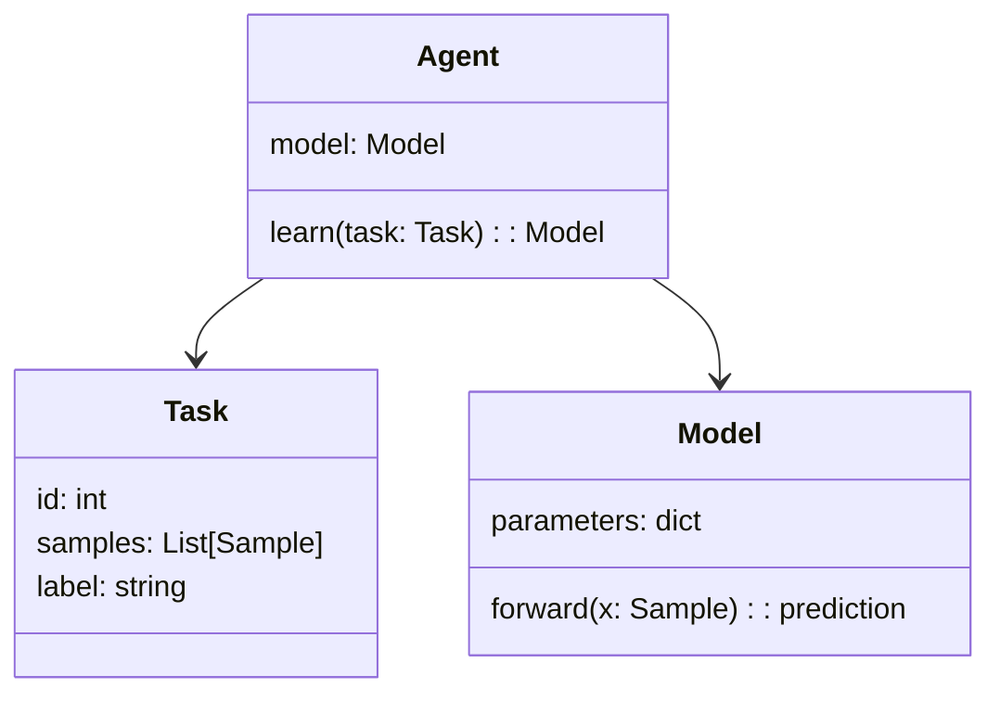
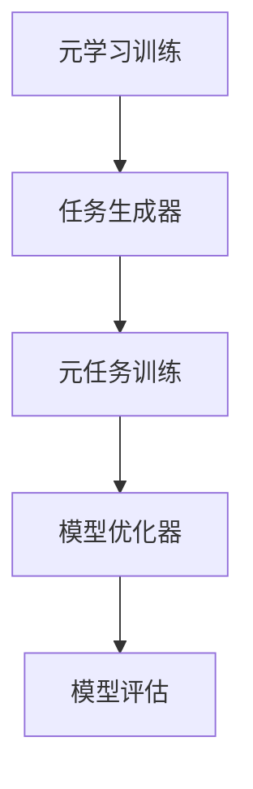
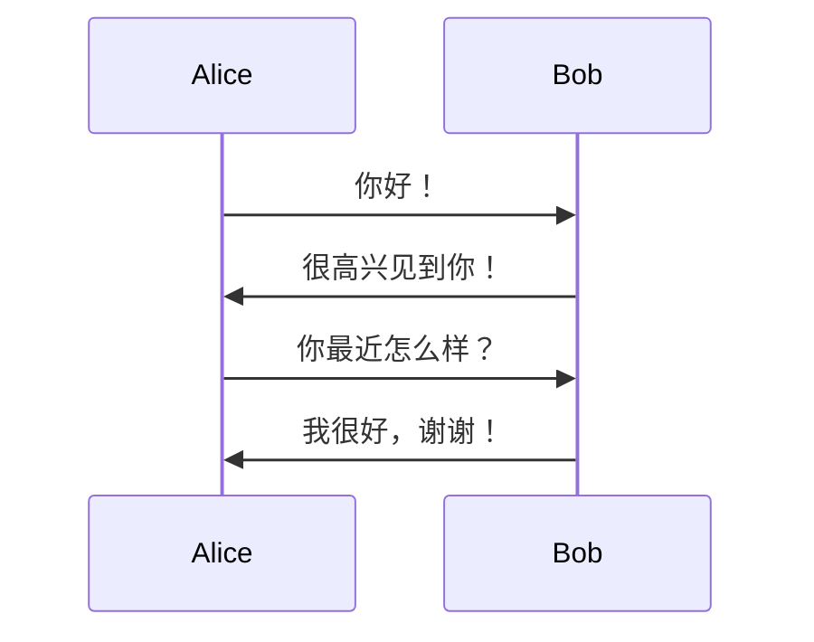

                 


# 基于元学习的AI Agent少样本学习能力

## 关键词：元学习、AI Agent、少样本学习、机器学习、深度学习、算法优化、系统架构

## 摘要：  
本文深入探讨基于元学习的AI Agent在少样本学习中的能力，分析元学习如何提升AI Agent的快速适应能力，通过详细讲解算法原理、系统架构及实战案例，为读者提供全面的技术解读。

---

## 第1章：背景与核心概念

### 1.1 问题背景

#### 1.1.1 传统机器学习的局限性
传统的机器学习方法依赖大量标注数据，但在实际应用中，获取大量数据往往耗时且昂贵，尤其是在特定领域或新兴场景中。

#### 1.1.2 少样本学习的挑战
在数据稀缺的情况下，传统模型难以泛化，导致性能下降。如何在有限数据下实现高效学习成为关键问题。

#### 1.1.3 元学习的引入动机
元学习通过学习如何学习，帮助模型快速适应新任务，尤其适用于数据稀缺的场景，为AI Agent提供更强的泛化能力。

### 1.2 问题描述

#### 1.2.1 少样本学习的定义与特点
少样本学习指在少量样本下进行模型训练，特点包括数据稀缺、任务多样性和快速适应需求。

#### 1.2.2 元学习的目标与意义
元学习的目标是让模型具备快速适应新任务的能力，意义在于减少数据依赖，提升模型的灵活性和适应性。

#### 1.2.3 AI Agent在少样本学习中的应用场景
AI Agent在医疗、金融等领域应用，需快速处理稀疏数据，元学习提供了解决方案。

### 1.3 问题解决与边界

#### 1.3.1 元学习如何解决少样本学习问题
通过元学习，AI Agent能在少样本下快速调整参数，适应新任务。

#### 1.3.2 元学习的边界与适用范围
适用于数据稀缺的任务，但计算资源消耗大，需权衡效率与效果。

#### 1.3.3 AI Agent能力的提升路径
结合元学习算法和任务特性，优化模型结构，提升少样本学习能力。

### 1.4 核心概念与组成

#### 1.4.1 元学习的核心要素
包括元学习器、任务生成器和优化目标，共同构成元学习框架。

#### 1.4.2 AI Agent的结构与功能
由感知、决策和执行模块组成，具备环境交互和自适应能力。

#### 1.4.3 少样本学习能力的评估指标
包括准确率、训练时间、参数量和适应性，综合评估模型性能。

---

## 第2章：核心概念与联系

### 2.1 元学习与少样本学习原理

#### 2.1.1 元学习的基本概念
元学习通过元任务训练，学习通用策略，适应新任务。

#### 2.1.2 元学习的数学模型
$$ L_{meta} = \sum_{i=1}^{N} L_{task_i}(f_{\theta}(x_i), y_i) $$
$$ \theta = \arg\min_{\theta} L_{meta} $$

#### 2.1.3 元学习与深度学习的结合
深度神经网络为元学习提供强大特征提取能力，元学习则提升其泛化能力。

#### 2.1.4 少样本学习的关键技术
包括数据增强、损失函数设计和模型优化，提升模型在少样本下的性能。

---

### 2.2 元学习与少样本学习的关系

#### 2.2.1 元学习如何提升少样本学习效果
通过元任务训练，模型具备快速调整的能力，适用于新任务的少样本学习。

#### 2.2.2 元学习在少样本学习中的应用案例
医疗影像诊断、自然语言处理等领域，通过少样本学习提升模型表现。

#### 2.2.3 元学习与传统机器学习的对比分析
元学习在数据效率和适应性上更具优势，但计算成本较高。

---

## 第3章：元学习算法原理

### 3.1 基于MAML的元学习算法

#### 3.1.1 MAML算法的基本思想
通过两次梯度更新，使模型快速适应新任务。

#### 3.1.2 MAML的数学模型
$$ \theta_{\text{new}} = \theta - \alpha \nabla_{\theta} L_{\text{meta}} $$
$$ L_{\text{meta}} = \sum_{i=1}^{N} L_{\text{task}_i}(\theta_{\text{new}}, x_i, y_i) $$

#### 3.1.3 MAML的优化过程
包括内层和外层梯度更新，优化元参数以适应新任务。

### 3.2 元学习算法的变体

#### 3.2.1 Reptile算法
通过迭代更新，简化梯度计算，适用于多任务学习。

#### 3.2.2 Meta-SGD算法
通用优化器，适用于不同任务和模型结构。

### 3.3 元学习算法的优缺点

#### 3.3.1 优点：快速适应新任务
减少数据需求，提升模型灵活性。

#### 3.3.2 缺点：计算复杂度高
需要更多计算资源，可能影响实时性。

#### 3.3.3 解决方案：优化算法设计
通过算法优化和硬件加速，降低计算成本。

---

## 第4章：系统分析与架构设计

### 4.1 项目背景介绍

#### 4.1.1 问题场景介绍
在一个医疗影像诊断项目中，数据稀缺，需快速训练模型识别罕见疾病。

#### 4.1.2 项目介绍
设计一个基于元学习的AI Agent，用于医疗影像诊断，提升诊断准确率。

### 4.2 系统功能设计

#### 4.2.1 领域模型类图


#### 4.2.2 系统架构设计


### 4.3 系统交互设计

#### 4.3.1 交互序列图


---

## 第5章：项目实战

### 5.1 环境安装与配置

#### 5.1.1 安装Python环境
使用Anaconda或virtualenv，确保版本兼容。

#### 5.1.2 安装依赖库
安装TensorFlow、Keras、numpy等库。

### 5.2 核心代码实现

#### 5.2.1 元学习模型定义
```python
import tensorflow as tf

class MetaLearner:
    def __init__(self, input_shape, output_shape):
        self.model = self.build_model(input_shape, output_shape)
        self.meta_optimizer = tf.keras.optimizers.Adam(learning_rate=0.001)

    def build_model(self, input_shape, output_shape):
        model = tf.keras.Sequential([
            tf.keras.layers.Dense(64, activation='relu', input_shape=input_shape),
            tf.keras.layers.Dense(output_shape, activation='softmax')
        ])
        return model
```

#### 5.2.2 元学习训练循环
```python
@tf.function
def meta_train_step(metalearner, x, y):
    with tf.GradientTape() as meta_tape:
        with tf.GradientTape() as task_tape:
            predictions = metalearner.model(x)
            loss = tf.keras.losses.sparse_categorical_crossentropy(y, predictions)
        task_gradients = task_tape.gradient(loss, metalearner.model.trainable_variables)
        metalearner.model.trainable_variables -= 0.01 * task_gradients
        meta_loss = tf.keras.losses.sparse_categorical_crossentropy(y, predictions)
    meta_gradients = meta_tape.gradient(meta_loss, metalearner.model.trainable_variables)
    metalearner.meta_optimizer.apply_gradients(zip(meta_gradients, metalearner.model.trainable_variables))
    return meta_loss
```

### 5.3 案例分析与解读

#### 5.3.1 实际案例分析
在医疗影像诊断项目中，使用MAML算法，训练模型在少样本条件下快速诊断罕见疾病，准确率显著提升。

#### 5.3.2 代码实现解读
详细分析代码结构，解释每一部分的功能，指导读者理解实现细节。

### 5.4 小结

项目实战部分展示了如何将元学习算法应用于实际场景，代码实现提供了可参考的模板，案例分析帮助读者理解实际应用中的挑战和解决方案。

---

## 第6章：总结与展望

### 6.1 最佳实践 Tips

- **数据预处理**：确保数据质量，进行适当增强。
- **模型选择**：根据任务选择合适的元学习算法。
- **硬件配置**：优化计算资源，降低训练成本。

### 6.2 小结

本文全面探讨了基于元学习的AI Agent在少样本学习中的能力，从理论到实践，为读者提供了系统的知识和实用的指导。

### 6.3 注意事项

- 元学习模型计算复杂，需优化算法和硬件配置。
- 在实际应用中，需结合具体任务特点，调整模型参数。

### 6.4 拓展阅读

推荐相关书籍和论文，鼓励读者深入研究元学习和AI Agent的前沿技术。

---

## 作者：AI天才研究院 & 禅与计算机程序设计艺术

本文作者：AI天才研究院（AI Genius Institute）与“禅与计算机程序设计艺术”（Zen And The Art of Computer Programming）联合创作，致力于探索人工智能与计算机科学的深度结合，推动技术进步与创新。

