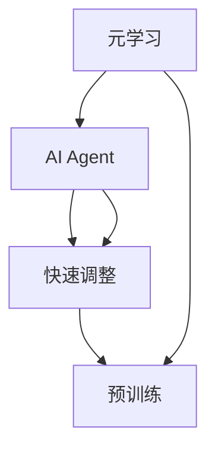
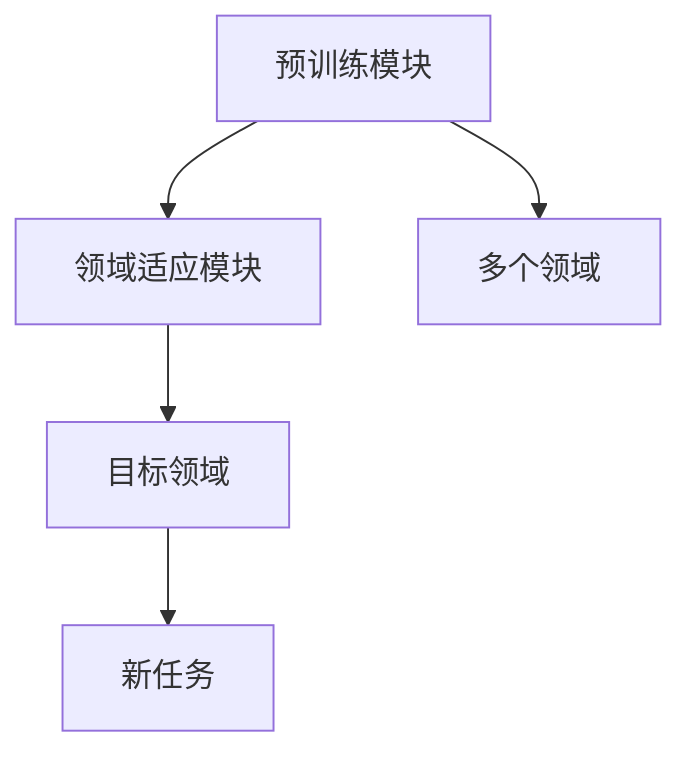
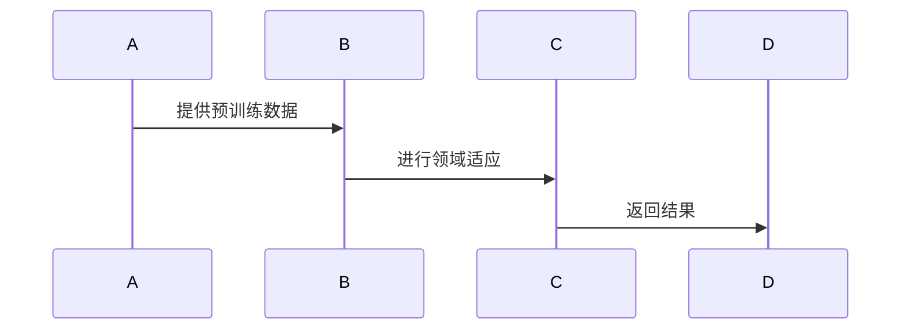

                 


# 基于元学习的AI Agent快速领域适应

> 关键词：元学习，AI Agent，领域适应，快速学习，机器学习

> 摘要：  
本文深入探讨了基于元学习的AI Agent在快速领域适应中的应用。通过分析元学习的核心原理、AI Agent的领域适应机制，以及它们的结合方式，本文提出了基于元学习的AI Agent快速领域适应的解决方案。结合实际案例和算法实现，本文为读者提供了从理论到实践的全面指导。

---

# 第一部分: 基于元学习的AI Agent快速领域适应背景介绍

## 第1章: 元学习与AI Agent概述

### 1.1 元学习的基本概念

#### 1.1.1 元学习的定义与核心思想

元学习是一种机器学习方法，旨在通过学习如何学习来提高模型在新任务上的适应能力。其核心思想是让模型学会如何快速调整自身参数，以适应不同的任务或领域。

$$
\text{元学习的目标是：} \quad \text{快速适应新任务}
$$

#### 1.1.2 元学习与传统机器学习的区别

传统机器学习方法需要针对每个新任务重新训练模型，而元学习通过预训练模型，能够在新任务上快速调整参数，减少训练时间。

| 对比维度 | 传统机器学习 | 元学习 |
|----------|--------------|--------|
| 适应性   | 低           | 高     |
| 训练时间 | 长           | 短     |
| 适用场景 | 固定任务     | 多任务  |

#### 1.1.3 元学习的典型应用场景

- 多领域自然语言处理
- 零样本学习
- 自适应推荐系统

### 1.2 AI Agent的基本概念

#### 1.2.1 AI Agent的定义与特点

AI Agent是一种智能体，能够感知环境、执行任务并做出决策。其特点包括自主性、反应性、目标导向性和社会性。

#### 1.2.2 AI Agent的分类与功能

- **简单反射型Agent**：基于当前输入做出反应。
- **基于模型的反射型Agent**：利用内部模型进行决策。
- **目标驱动型Agent**：通过优化目标函数来执行任务。

#### 1.2.3 AI Agent在不同领域的应用实例

- 智能音箱（如Alexa）
- 自动驾驶系统（如Tesla）
- 智能客服机器人

### 1.3 元学习与AI Agent的结合

#### 1.3.1 元学习在AI Agent中的作用

元学习使AI Agent能够快速适应新领域，减少领域适应的时间和数据需求。

#### 1.3.2 基于元学习的AI Agent的优势

- 快速领域适应
- 低数据依赖性
- 高灵活性

#### 1.3.3 元学习与AI Agent结合的核心问题

- 如何设计高效的元学习算法
- 如何实现领域适应的快速收敛

---

## 第2章: 基于元学习的AI Agent快速领域适应的背景与挑战

### 2.1 问题背景

#### 2.1.1 AI Agent在不同领域中的适应性问题

AI Agent在不同领域中需要重新调整模型参数，导致适应性差。

#### 2.1.2 领域适应的重要性与挑战

- 领域适应是AI Agent实现通用性的关键。
- 领域适应需要大量数据和计算资源。

#### 2.1.3 元学习在领域适应中的潜在价值

元学习通过预训练模型，能够在新领域中快速调整参数。

### 2.2 问题描述

#### 2.2.1 基于元学习的AI Agent快速领域适应的目标

- 快速适应新领域
- 减少领域适应的数据需求
- 提高领域适应的效率

#### 2.2.2 领域适应的核心问题与关键挑战

- 如何设计高效的元学习算法
- 如何实现领域适应的快速收敛
- 如何处理领域间差异性

### 2.3 问题解决

#### 2.3.1 元学习算法在领域适应中的解决方案

- 使用元学习算法（如MAML、ReMAML）进行预训练
- 在新领域中快速调整模型参数

#### 2.3.2 基于元学习的AI Agent的设计思路

- 预训练阶段：在多个领域上进行元学习训练
- 领域适应阶段：在目标领域上进行微调

#### 2.3.3 领域适应的具体实现方法

- 使用元学习算法进行领域适应
- 利用迁移学习技术加速适应

---

## 第3章: 基于元学习的AI Agent快速领域适应的核心概念与联系

### 3.1 核心概念原理

#### 3.1.1 元学习的基本原理

元学习通过预训练模型，使其能够快速适应新任务。其核心在于学习如何调整模型参数。

#### 3.1.2 AI Agent的领域适应机制

AI Agent通过调整模型参数或改变行为策略，快速适应新领域。

#### 3.1.3 元学习与领域适应的结合原理

元学习使AI Agent能够在预训练阶段学习通用特征，从而在新领域中快速调整。

### 3.2 核心概念对比

通过对比元学习与其他领域适应方法，明确元学习的优势。

| 方法 | 预训练需求 | 领域适应时间 | 数据需求 |
|------|------------|--------------|----------|
| 元学习 | 高         | 短           | 低       |
| 迁移学习 | 中         | 中           | 中       |
| 零样本学习 | 高         | 长           | 高       |

### 3.3 实体关系图

使用Mermaid绘制元学习与领域适应的关系图。



---

## 第4章: 基于元学习的AI Agent快速领域适应的算法原理

### 4.1 算法原理概述

#### 4.1.1 MAML算法原理

MAML（Meta-Automated Learning）是一种典型的元学习算法，通过在训练阶段优化模型的更新规则，使得模型能够快速适应新任务。

#### 4.1.2 ReMAML算法原理

ReMAML（Recursive Meta-Learning）是一种递归元学习算法，通过递归方式优化模型参数，适用于复杂任务。

### 4.2 算法实现步骤

#### 4.2.1 MAML算法实现步骤

1. 预训练阶段：在多个领域上训练模型。
2. 领域适应阶段：在目标领域上进行微调。

#### 4.2.2 ReMAML算法实现步骤

1. 初始化模型参数。
2. 递归优化模型参数。
3. 在目标领域上进行适应。

### 4.3 算法对比与选择

分析MAML和ReMAML的优缺点，选择适合具体场景的算法。

---

## 第5章: 基于元学习的AI Agent快速领域适应的系统分析与架构设计

### 5.1 系统分析

#### 5.1.1 问题场景介绍

AI Agent需要快速适应新领域，减少数据需求。

#### 5.1.2 项目介绍

基于元学习的AI Agent快速领域适应系统。

### 5.2 系统功能设计

#### 5.2.1 预训练模块

负责在多个领域上训练模型。

#### 5.2.2 领域适应模块

负责在目标领域上进行微调。

### 5.3 系统架构设计

使用Mermaid绘制系统架构图。



### 5.4 系统接口设计

定义系统接口，确保模块间通信。

### 5.5 系统交互设计

使用Mermaid绘制交互序列图。



---

## 第6章: 基于元学习的AI Agent快速领域适应的项目实战

### 6.1 环境安装

安装必要的库和工具。

### 6.2 核心实现

#### 6.2.1 MAML算法实现

编写MAML算法的Python代码。

```python
def maml_update(model, optimizer, x_s, y_s, x_q, y_q):
    # 具体实现
    pass
```

#### 6.2.2 ReMAML算法实现

编写ReMAML算法的Python代码。

```python
def remaml_update(model, optimizer, x_s, y_s, x_q, y_q):
    # 具体实现
    pass
```

### 6.3 代码解读

详细解读代码实现。

### 6.4 案例分析

通过具体案例展示算法的应用。

### 6.5 项目小结

总结项目实现的经验和教训。

---

## 第7章: 总结与展望

### 7.1 全文总结

总结全文的主要内容和结论。

### 7.2 未来展望

提出未来的研究方向和改进措施。

### 7.3 最佳实践 tips

提供一些实用的建议和注意事项。

---

# 作者：AI天才研究院/AI Genius Institute & 禅与计算机程序设计艺术 /Zen And The Art of Computer Programming

