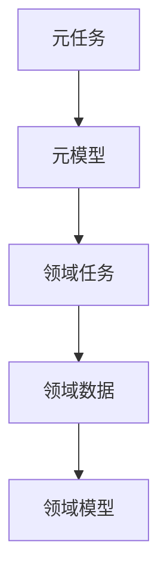
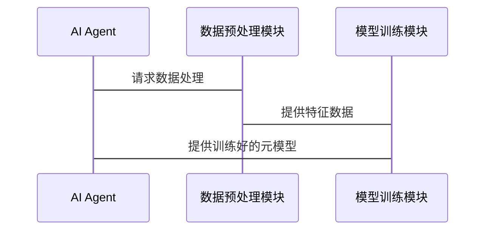

                 


# 基于元学习的AI Agent快速领域适应技术

> 关键词：元学习、AI Agent、领域适应、MAML、迁移学习

> 摘要：本文深入探讨了基于元学习的AI Agent在快速领域适应方面的技术原理与应用。通过分析元学习的核心概念、算法原理、系统架构以及实际案例，展示了如何利用元学习实现AI Agent在不同领域间的快速适应，提升其通用性和实用性。

---

# 第一部分: 元学习与AI Agent的背景介绍

## 第1章: 元学习与AI Agent概述

### 1.1 元学习的背景与问题背景

#### 1.1.1 传统机器学习的局限性
传统机器学习方法在处理新任务时需要大量数据和训练时间，难以快速适应新领域或任务，尤其在数据稀疏的情况下表现不佳。

#### 1.1.2 快速领域适应的必要性
AI Agent需要在不同领域间快速切换，如从医疗领域切换到金融领域，传统方法难以高效适应，导致效率低下。

#### 1.1.3 元学习的提出与目标
元学习通过预训练模型在多个任务上学习，使其能够快速适应新任务，减少对新领域数据的依赖。

### 1.2 元学习的核心概念

#### 1.2.1 元任务与元模型
元任务是用于训练元模型的任务，元模型负责学习如何快速适应新任务。

#### 1.2.2 元学习的基本原理
元学习通过优化元模型的参数，使其能够在新任务上快速调整，减少对新数据的需求。

#### 1.2.3 元学习与传统迁移学习的对比
元学习注重通过元任务学习通用策略，而迁移学习侧重直接迁移已有任务的知识。

### 1.3 AI Agent的快速领域适应技术

#### 1.3.1 AI Agent的定义与特点
AI Agent是能够自主决策和适应环境的智能体，需在不同领域间快速切换。

#### 1.3.2 领域适应的核心问题
领域适应涉及将模型从一个领域迁移到另一个领域，需要解决数据分布差异问题。

#### 1.3.3 元学习在AI Agent中的应用价值
元学习使AI Agent能够快速适应新领域，提升其通用性和灵活性。

## 第2章: 元学习的核心概念与联系

### 2.1 元学习的原理与框架

#### 2.1.1 MAML（Meta-Automated Learning）
MAML通过优化元模型的参数，使其能够在新任务上快速调整。

#### 2.1.2 ReMAML（Recurrent Meta-Learning）
ReMAML通过递归方式优化元模型，适用于序列任务。

### 2.2 核心概念对比表
| 概念 | 元学习 | 迁移学习 |
|------|--------|----------|
| 定义 | 学习如何快速适应新任务 | 直接迁移已有任务的知识 |
| 优势 | 通用性强 | 任务间相似性高 |

### 2.3 元学习的ER实体关系图


---

# 第二部分: 元学习的算法原理

## 第3章: 元学习算法的数学模型与公式

### 3.1 MAML算法的数学推导

#### 3.1.1 MAML的目标函数
$$ \mathcal{L}(\theta) = \sum_{i=1}^{N} \mathcal{L}_{i}(\theta) $$
其中，$\theta$ 是元模型的参数，$N$ 是元任务的数量。

#### 3.1.2 新任务的损失函数
$$ \mathcal{L}_{new}(\theta + \delta\theta) = \sum_{j=1}^{n} \mathcal{L}_{j}(\theta + \delta\theta) $$
其中，$\delta\theta$ 是针对新任务的调整参数。

### 3.2 ReMAML算法的流程

#### 3.2.1 递归优化
通过递归方式优化元模型的参数，适用于序列任务的领域适应。

---

# 第三部分: 系统分析与架构设计

## 第4章: 系统架构与接口设计

### 4.1 问题场景介绍

#### 4.1.1 领域切换场景
AI Agent在医疗和金融领域间切换，需要快速适应新领域的数据和任务。

### 4.2 系统功能设计

#### 4.2.1 数据预处理模块
处理不同领域的数据，提取特征。

#### 4.2.2 模型训练模块
训练元模型，使其能够快速适应新任务。

### 4.3 系统架构设计

#### 4.3.1 微服务架构
采用微服务架构，各模块独立运行，便于扩展和维护。

#### 4.3.2 模块交互流程图


---

# 第四部分: 项目实战

## 第5章: 项目实现与案例分析

### 5.1 环境搭建与安装

#### 5.1.1 安装Python库
安装PyTorch和Meta-Learning库。

### 5.2 核心代码实现

#### 5.2.1 MAML算法实现
```python
def maml_loss(theta, theta_prime, data):
    # 计算梯度
    grads = torch.autograd.grad(loss(theta, data), theta)
    # 更新参数
    theta_prime = theta - learning_rate * grads
    return loss(theta_prime, data)
```

### 5.3 实际案例分析

#### 5.3.1 图像分类任务
使用MAML算法在图像分类任务中进行领域适应。

---

# 第五部分: 最佳实践与总结

## 第6章: 最佳实践与总结

### 6.1 小结与注意事项
数据质量对元学习效果影响较大，需确保数据多样性。

### 6.2 未来发展趋势
元学习将与强化学习结合，提升AI Agent的自主适应能力。

---

作者：AI天才研究院/AI Genius Institute & 禅与计算机程序设计艺术 /Zen And The Art of Computer Programming

