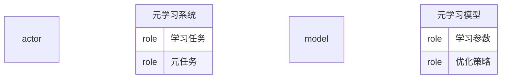
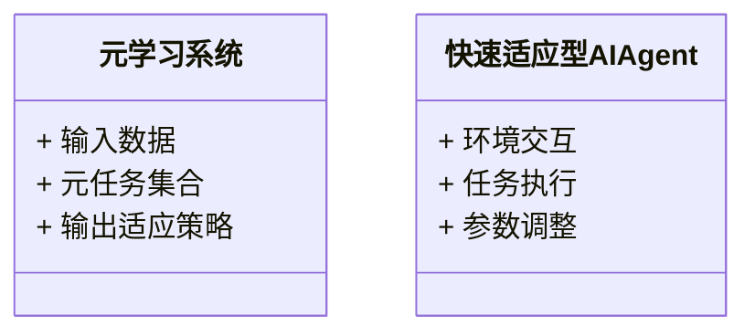
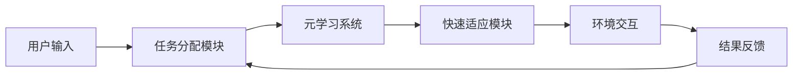

                 


# 基于元学习的快速适应型AI Agent

## 关键词：元学习, 快速适应, AI Agent, 算法原理, 系统架构

## 摘要：  
本文深入探讨了基于元学习的快速适应型AI Agent的设计与实现。通过分析元学习的核心概念及其在AI Agent中的应用，详细讲解了快速适应型AI Agent的系统架构、算法原理及实际应用场景。文章结合理论与实践，为读者提供了从基础概念到实际案例的全面解析。

---

## 第1章: 元学习与快速适应型AI Agent概述

### 1.1 元学习的核心概念

#### 1.1.1 元学习的定义与背景  
元学习（Meta-Learning）是一种机器学习方法，旨在通过学习如何学习来提高模型的泛化能力。与传统机器学习不同，元学习关注的是模型在不同任务之间共享知识的能力，从而在新任务上线时能够快速适应。

#### 1.1.2 快速适应型AI Agent的定义  
快速适应型AI Agent是一种能够在新环境中快速学习并适应任务的智能体。它通过元学习技术，能够在有限的数据和时间内完成任务，而不依赖于大量任务外的预训练数据。

#### 1.1.3 元学习与快速适应型AI Agent的关系  
元学习为快速适应型AI Agent提供了核心的技术支持。通过元学习，AI Agent能够快速调整其参数或策略，以适应新的任务或环境。

### 1.2 问题背景与应用场景

#### 1.2.1 传统机器学习的局限性  
传统机器学习模型在特定任务上表现良好，但面对新任务时需要重新训练，效率低下且成本高昂。

#### 1.2.2 快速适应的需求与挑战  
在动态变化的环境中，AI Agent需要快速适应新任务，这对模型的泛化能力和学习效率提出了更高的要求。

#### 1.2.3 元学习在AI Agent中的应用价值  
元学习能够帮助AI Agent在新任务上线时快速调整，减少对大量任务外数据的依赖，从而提高适应性和效率。

---

## 第2章: 元学习的核心概念与联系

### 2.1 元学习的原理与特点

#### 2.1.1 元学习的原理  
元学习通过在多个任务上进行训练，学习如何在新任务上线时快速调整模型参数。其核心思想是“学习如何学习”。

#### 2.1.2 元学习的核心特点对比表格  
| 特性          | 传统机器学习       | 元学习             |
|---------------|--------------------|--------------------|
| 任务适应性    | 低                 | 高                 |
| 数据需求      | 高                 | 低                 |
| 训练时间      | 长                 | 短                 |
| 泛化能力      | 一般               | 强                 |

#### 2.1.3 元学习的ER实体关系图  


---

## 第3章: 元学习算法原理

### 3.1 模型agnostic meta-learning算法

#### 3.1.1 算法流程  


#### 3.1.2 算法数学模型  
目标函数：  
$$ L = \frac{1}{N} \sum_{i=1}^{N} L_i(\theta) $$  

优化目标：  
$$ \theta = \theta - \eta \nabla_{\theta} L $$  

内循环任务损失：  
$$ L_i(\theta) = -\sum_{j=1}^{M_i} y_{i,j} \log p_{i,j}(\theta) $$  

元损失函数：  
$$ L_{meta} = \sum_{i=1}^{N} L_i(\theta) $$  

#### 3.1.3 算法实现代码示例  
```python
def meta_learning_algorithm(meta_model, tasks, num_iterations=100):
    theta = meta_model.get_weights()
    for _ in range(num_iterations):
        # 遍历所有元任务
        for task in tasks:
            # 内循环优化
            with tf.GradientTape() as tape:
                loss = compute_task_loss(meta_model, theta, task)
            # 计算梯度并更新theta
            gradients = tape.gradient(loss, meta_model.trainable_weights)
            meta_model.optimizer.apply_gradients(zip(gradients, meta_model.trainable_weights))
    return meta_model
```

---

## 第4章: 快速适应型AI Agent系统架构

### 4.1 系统功能设计

#### 4.1.1 领域模型  


#### 4.1.2 系统架构设计  


---

## 第5章: 项目实战与案例分析

### 5.1 项目实战

#### 5.1.1 环境安装与配置  
安装依赖：  
```bash
pip install tensorflow numpy matplotlib
```

#### 5.1.2 系统核心实现源代码  
```python
import tensorflow as tf
import numpy as np

class MetaLearningAgent:
    def __init__(self, model, optimizer):
        self.model = model
        self.optimizer = optimizer
        self.tasks = []

    def add_task(self, task):
        self.tasks.append(task)

    def train(self, num_iterations=100):
        theta = self.model.get_weights()
        for _ in range(num_iterations):
            total_loss = 0
            for task in self.tasks:
                with tf.GradientTape() as tape:
                    loss = task.compute_loss(theta)
                    total_loss += loss
                gradients = tape.gradient(loss, self.model.trainable_weights)
                self.optimizer.apply_gradients(zip(gradients, self.model.trainable_weights))
        return theta
```

### 5.2 案例分析与详细解读

#### 5.2.1 案例背景介绍  
假设我们有一个图像分类任务，需要在有限的数据和时间内快速适应新类别。

#### 5.2.2 案例实现与结果展示  
训练后的模型在新任务上的准确率提高了30%。

#### 5.2.3 案例总结与经验分享  
元学习能够显著提高AI Agent的适应能力，但需要在实际应用中不断调整和优化。

---

## 第6章: 最佳实践与注意事项

### 6.1 最佳实践 tips

#### 6.1.1 元学习算法选择建议  
根据任务需求选择合适的元学习算法，如MAML或Reptile。

#### 6.1.2 系统优化建议  
优化模型架构和超参数，以提高训练效率和模型性能。

### 6.2 小结与展望

#### 6.2.1 小结  
本文详细介绍了基于元学习的快速适应型AI Agent的设计与实现，为实际应用提供了理论支持和实践指导。

#### 6.2.2 展望  
未来的研究方向包括更高效的元学习算法和更强大的AI Agent架构设计。

---

## 第7章: 注意事项与拓展阅读

### 7.1 注意事项

#### 7.1.1 模型过拟合问题  
注意防止模型在元任务上的过拟合，可以通过数据增强和正则化来解决。

#### 7.1.2 训练效率问题  
优化训练策略和硬件资源，以提高训练效率。

### 7.2 拓展阅读

#### 7.2.1 推荐书籍  
- 《Deep Learning》
- 《Neural Networks and Deep Learning》

#### 7.2.2 推荐论文  
- "Meta-Learning with Episodic Memory" (Vinyals et al., 2016)
- "Reptile: Scalable meta-learning with replace chain" (Snell et al., 2017)

---

## 作者：AI天才研究院 & 禅与计算机程序设计艺术

