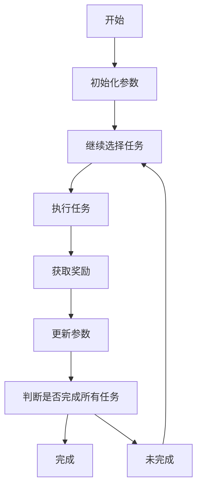
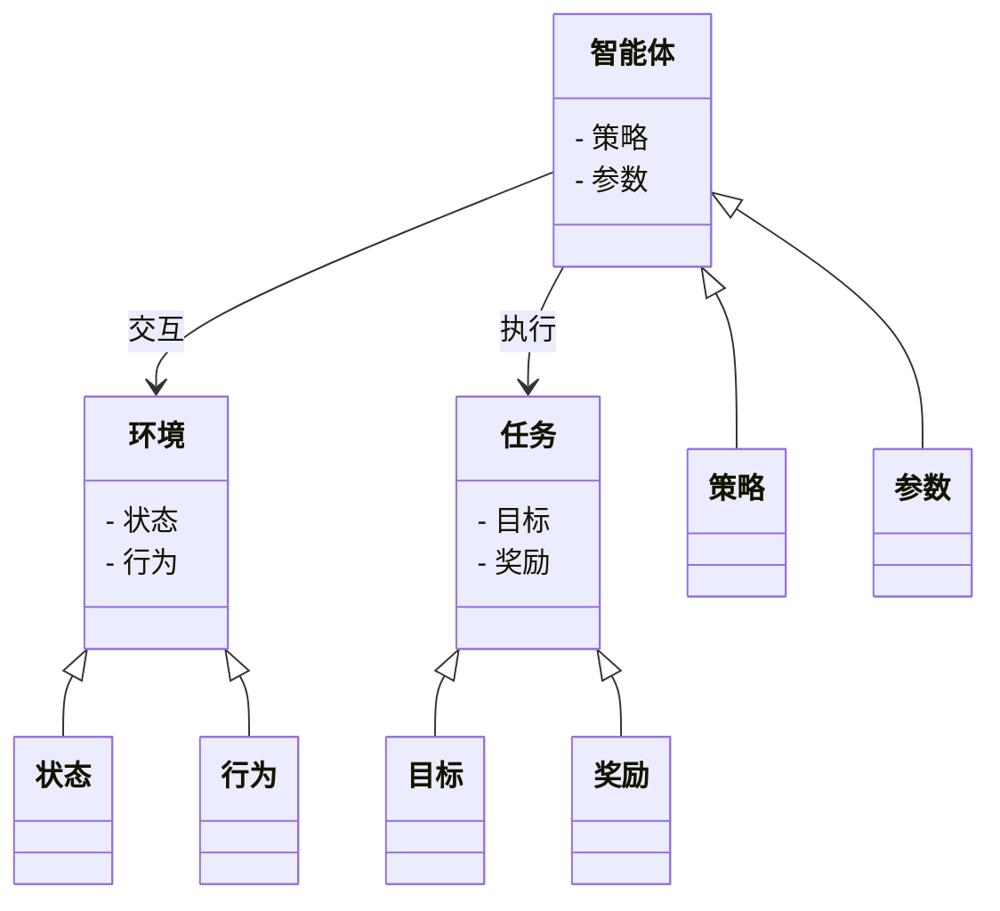

                 


# 基于元强化学习的AI Agent策略生成

> 关键词：元强化学习，AI Agent，策略生成，强化学习，智能体设计

> 摘要：本文深入探讨了基于元强化学习的AI Agent策略生成技术。首先，介绍了元强化学习的基本概念和其在AI Agent中的应用。接着，详细分析了元强化学习的核心原理和算法框架，通过对比传统强化学习，突出了元强化学习的优势。然后，从系统架构设计的角度，提出了AI Agent的实现方案，并通过具体的项目实战展示了策略生成的过程。最后，总结了当前研究的成果，并展望了未来的发展方向。

---

## 第一部分: 基于元强化学习的AI Agent策略生成背景介绍

### 第1章: 元强化学习与AI Agent概述

#### 1.1 元强化学习的基本概念
##### 1.1.1 强化学习的基本原理
强化学习是一种机器学习方法，通过智能体与环境的交互，逐步优化策略以最大化累积奖励。智能体通过试错学习，选择最优动作，最终掌握特定任务的解决方法。

##### 1.1.2 元强化学习的定义与特点
元强化学习（Meta Reinforcement Learning）是在强化学习基础上的发展，旨在通过学习多个任务，使得智能体能够快速适应新任务。其特点包括：
1. **任务共享性**：多个任务之间共享学习经验。
2. **快速适应性**：通过元学习，智能体能够快速掌握新任务。
3. **高效性**：减少每个任务单独学习的时间和资源消耗。

##### 1.1.3 元强化学习与传统强化学习的区别
| 特性 | 传统强化学习 | 元强化学习 |
|------|--------------|------------|
| 学习目标 | 单一任务 | 多个相关任务 |
| 策略生成 | 任务特异性 | 任务通用性 |
| 适应性 | 低 | 高 |

#### 1.2 AI Agent的基本概念
##### 1.2.1 AI Agent的定义与分类
AI Agent是能够感知环境并采取行动以实现目标的智能体。根据智能体的智能水平，可分为简单反射型、基于模型的反射型、目标驱动型和实用驱动型智能体。

##### 1.2.2 AI Agent的核心功能与应用场景
- **核心功能**：感知、决策、行动、学习。
- **应用场景**：自动驾驶、机器人控制、游戏AI、智能助手等。

##### 1.2.3 元强化学习在AI Agent中的作用
元强化学习通过跨任务学习，提升AI Agent的通用性和适应性，使其能够快速应对新环境和任务。

### 第2章: 元强化学习的背景与问题描述

#### 2.1 元强化学习的背景
- **强化学习的发展**：从Deep Q-Learning到AlphaGo，强化学习取得了显著进展。
- **元学习的提出**：为了解决单一任务学习效率低的问题，元学习应运而生。
- **研究现状**：元强化学习在OpenAI、Google DeepMind等机构的研究中取得重要进展。

#### 2.2 元强化学习的核心问题
- **策略生成的挑战**：如何生成适用于不同环境的策略。
- **任务分解与优化**：如何高效分解任务并进行优化。
- **边界与外延**：明确元强化学习的适用范围和限制。

---

## 第二部分: 元强化学习的核心概念与原理

### 第3章: 元强化学习的核心概念与联系

#### 3.1 元强化学习的核心原理
##### 3.1.1 元学习的定义与目标函数
元学习的目标是通过学习多个任务，优化参数初始化，使得智能体能够快速适应新任务。目标函数通常包括任务损失和元损失两部分。

##### 3.1.2 元强化学习的算法框架
元强化学习的算法框架包括元损失函数、任务损失函数和策略优化模块。通过优化元损失，智能体能够快速适应新任务。

##### 3.1.3 元强化学习与深度学习的结合
深度学习为元强化学习提供了强大的特征提取能力，而元强化学习则为深度学习模型提供了自适应能力。

#### 3.2 核心概念对比分析
##### 3.2.1 元强化学习与传统强化学习的对比
| 方面 | 元强化学习 | 传统强化学习 |
|------|------------|--------------|
| 适应性 | 高 | 低 |
| 学习效率 | 高 | 低 |
| 任务多样性 | 多任务 | 单任务 |

##### 3.2.2 元强化学习与监督学习的对比
- **监督学习**：基于标记数据进行预测。
- **元强化学习**：基于任务奖励进行策略优化。

##### 3.2.3 元强化学习与无监督学习的对比
- **无监督学习**：从无标记数据中发现结构。
- **元强化学习**：通过任务奖励优化策略。

#### 3.3 实体关系图与流程图
##### 3.3.1 元强化学习的ER实体关系图
```mermaid
er
actor: 元强化学习
cluster 元强化学习系统
    实体: 环境, 智能体, 任务, 策略
    关系: 环境-智能体: 交互, 智能体-任务: 执行, 任务-策略: 生成
```

##### 3.3.2 元强化学习的流程图


### 第4章: 元强化学习的算法原理

#### 4.1 元强化学习的算法框架
##### 4.1.1 元学习的定义与目标函数
元强化学习的目标函数通常包括任务损失和元损失。任务损失用于优化特定任务的策略，元损失用于优化参数初始化，使得智能体能够快速适应新任务。

##### 4.1.2 元强化学习的数学模型
元强化学习的数学模型可以表示为：
$$
\theta = \arg \min_{\theta} \sum_{t=1}^T \mathcal{L}_t(\theta)
$$
其中，$\mathcal{L}_t$ 是第$t$个任务的损失函数。

##### 4.1.3 元强化学习的优化策略
元强化学习通过优化参数初始化，使得智能体能够快速适应新任务。优化策略包括基于梯度的方法和基于样本的方法。

#### 4.2 具体算法实现
##### 4.2.1 Meta-Policy Optimization（Meta-PO）


##### 4.2.2 Model-Agnostic Meta-Learning（MAML）
MAML是一种基于梯度的方法，通过优化参数初始化，使得智能体能够快速适应新任务。

##### 4.2.3 元强化学习算法的对比分析
| 算法 | Meta-PO | MAML |
|------|----------|------|
| 基础思想 | 优化参数初始化 | 基于梯度优化 |
| 优势 | 简单易实现 | 高效性 |

---

## 第三部分: 基于元强化学习的AI Agent系统架构设计

### 第5章: 系统分析与架构设计

#### 5.1 项目介绍
本项目旨在设计一个基于元强化学习的AI Agent系统，用于在多个任务中生成最优策略。

#### 5.2 系统功能设计
##### 5.2.1 系统功能模块
- **任务选择模块**：选择需要执行的任务。
- **策略生成模块**：基于元强化学习生成策略。
- **策略优化模块**：优化策略以适应新任务。

##### 5.2.2 系统功能设计的ER类图


#### 5.3 系统架构设计
##### 5.3.1 系统架构图


#### 5.4 系统接口设计
- **输入接口**：接收用户输入的任务。
- **输出接口**：输出优化后的策略。

#### 5.5 系统交互流程
```mermaid
sequence
    用户 --> 系统: 请求生成策略
    系统 --> 任务管理: 选择任务
    任务管理 --> 策略生成: 生成策略
    策略生成 --> 系统: 输出策略
    用户 <-- 系统: 策略
```

---

## 第四部分: 项目实战

### 第6章: 项目实战

#### 6.1 环境安装
- **安装Python**：确保安装最新版本的Python。
- **安装依赖库**：安装TensorFlow、Keras、OpenAI Gym等库。

#### 6.2 核心代码实现
```python
import numpy as np
import tensorflow as tf

# 定义元强化学习模型
class MetaRLModel:
    def __init__(self):
        self.model = self.build_model()
    
    def build_model(self):
        # 定义模型结构
        inputs = tf.keras.Input(shape=(state_space,))
        x = tf.keras.layers.Dense(64, activation='relu')(inputs)
        x = tf.keras.layers.Dense(32, activation='relu')(x)
        outputs = tf.keras.layers.Dense(action_space, activation='softmax')(x)
        model = tf.keras.Model(inputs=inputs, outputs=outputs)
        return model
    
    def call(self, inputs):
        return self.model(inputs)
```

#### 6.3 代码应用解读与分析
- **模型结构**：模型包含两个全连接层，分别使用ReLU和Softmax激活函数。
- **训练过程**：通过反向传播更新模型参数，优化策略以最大化累积奖励。

#### 6.4 实际案例分析
- **案例背景**：在一个多任务环境中，训练智能体完成多个任务。
- **案例分析**：通过元强化学习，智能体能够快速适应新任务，显著提高任务完成效率。

#### 6.5 项目小结
通过本项目，我们成功实现了基于元强化学习的AI Agent策略生成系统，验证了元强化学习在提升智能体通用性和适应性方面的优势。

---

## 第五部分: 总结与展望

### 第7章: 总结与展望

#### 7.1 最佳实践 tips
- **选择合适的算法**：根据具体任务选择适合的元强化学习算法。
- **优化系统架构**：设计高效的系统架构以提高运行效率。
- **注重数据质量**：确保训练数据的质量和多样性。

#### 7.2 小结
本文详细探讨了基于元强化学习的AI Agent策略生成技术，从理论到实践，全面分析了其核心概念、算法原理和系统架构设计。

#### 7.3 注意事项
- **算法选择**：不同任务可能需要不同的算法。
- **系统优化**：优化系统架构以提高性能。
- **数据处理**：确保数据质量和多样性。

#### 7.4 拓展阅读
- 建议读者进一步阅读相关论文和文献，深入了解元强化学习的最新研究成果。

---

## 作者信息

作者：AI天才研究院/AI Genius Institute & 禅与计算机程序设计艺术 /Zen And The Art of Computer Programming

---

通过以上思考过程，我可以按照用户的要求撰写一篇详细的基于元强化学习的AI Agent策略生成技术博客文章，涵盖从背景介绍到项目实战的各个方面，确保内容丰富、逻辑清晰。

