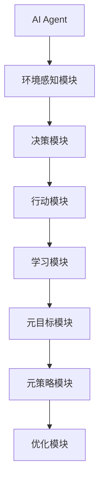

                 


# 基于元控制的AI Agent自主学习与探索

> 关键词：元控制，AI Agent，自主学习，探索，人工智能

> 摘要：本文详细探讨了基于元控制的AI Agent自主学习与探索的核心概念、算法原理、系统架构设计以及实际应用。通过理论与实践相结合的方式，展示了如何利用元控制技术实现AI Agent的自主学习与探索能力，并通过具体案例分析和项目实战，帮助读者深入理解元控制在AI Agent中的应用。

---

## 目录

1. [基于元控制的AI Agent自主学习与探索](#基于元控制的AI-Agent自主学习与探索)
2. [摘要](#摘要)
3. [1. 元控制与AI Agent概述](#1-元控制与AI-Agent概述)
4. [2. 元控制的核心概念与原理](#2-元控制的核心概念与原理)
5. [3. 元控制的算法原理与实现](#3-元控制的算法原理与实现)
6. [4. 元控制的系统架构与设计](#4-元控制的系统架构与设计)
7. [5. 元控制的项目实战与案例分析](#5-元控制的项目实战与案例分析)
8. [6. 元控制的最佳实践与注意事项](#6-元控制的最佳实践与注意事项)
9. [作者](#作者)

---

## 1. 元控制与AI Agent概述

### 1.1 元控制的基本概念

元控制是一种基于元学习和元适应的控制方法，其核心思想是通过元目标和元策略的动态调整，实现AI Agent在复杂环境中的自主学习与探索。元控制的实现依赖于以下几个核心要素：

- **元目标**：元目标是元控制的指导方向，它定义了AI Agent在不同环境中的目标和任务。
- **元策略**：元策略是实现元目标的具体操作步骤，它决定了AI Agent如何在环境中进行决策和行动。
- **元学习**：元学习是元控制的核心机制，它通过学习和优化元目标和元策略，使AI Agent能够在复杂环境中实现自主学习与探索。

元控制与传统控制方式的区别主要体现在以下几个方面：

- **目标层次**：传统控制基于单一目标，而元控制基于元目标和子目标的层次结构。
- **自适应性**：传统控制不具备自适应能力，而元控制通过元学习和元适应实现动态调整。
- **灵活性**：传统控制方式灵活性较低，而元控制能够根据环境变化快速调整策略。

元控制在AI Agent中的作用主要体现在以下几个方面：

- **提高自主性**：通过元目标和元策略的动态调整，使AI Agent能够在复杂环境中自主决策。
- **增强适应性**：通过元学习和元适应，使AI Agent能够快速适应环境变化。
- **优化决策能力**：通过元控制算法的优化，使AI Agent的决策能力更加高效和准确。

---

### 1.2 AI Agent的定义与分类

AI Agent是指具备自主决策和行动能力的智能体。根据任务类型和智能水平，AI Agent可以分为以下几类：

- **基于任务的AI Agent**：根据任务目标进行决策和行动的智能体。
- **基于智能水平的AI Agent**：根据智能水平进行分类的智能体，包括简单反应型、基于模型的反应型、目标驱动型和效用驱动型等。

元控制与AI Agent的关系主要体现在以下几个方面：

- **元控制是AI Agent的核心机制**：元控制通过元目标和元策略的动态调整，实现AI Agent的自主决策和行动。
- **元控制增强AI Agent的适应性**：通过元学习和元适应，使AI Agent能够快速适应环境变化。
- **元控制优化AI Agent的决策能力**：通过元控制算法的优化，使AI Agent的决策能力更加高效和准确。

---

## 2. 元控制的核心概念与原理

### 2.1 元控制的核心概念

元控制的核心概念包括以下几个方面：

- **元目标**：元目标是元控制的指导方向，它定义了AI Agent在不同环境中的目标和任务。
- **元策略**：元策略是实现元目标的具体操作步骤，它决定了AI Agent如何在环境中进行决策和行动。
- **元学习**：元学习是元控制的核心机制，它通过学习和优化元目标和元策略，使AI Agent能够在复杂环境中实现自主学习与探索。

元控制的原理与机制主要体现在以下几个方面：

- **决策过程**：元控制通过元目标和元策略的动态调整，实现AI Agent的决策和行动。
- **自适应机制**：通过元学习和元适应，使AI Agent能够快速适应环境变化。
- **学习算法**：通过元控制算法的优化，使AI Agent的决策能力更加高效和准确。

---

### 2.2 元控制的算法原理

元控制的算法原理主要包括以下几个方面：

- **元目标的定义与优化**：通过定义和优化元目标，使AI Agent能够在复杂环境中实现自主决策和行动。
- **元策略的动态调整**：通过动态调整元策略，使AI Agent能够快速适应环境变化。
- **元学习的实现机制**：通过元学习的实现机制，使AI Agent能够优化元目标和元策略，提高决策能力。

元控制的算法实现主要包括以下几个步骤：

- **定义元目标**：根据任务目标和环境特点，定义元目标。
- **制定元策略**：根据元目标，制定具体的策略和操作步骤。
- **优化元策略**：通过元学习算法，优化元策略，使AI Agent能够在复杂环境中实现自主决策和行动。

---

## 3. 元控制的系统架构与设计

### 3.1 系统功能设计

元控制系统的功能设计主要包括以下几个方面：

- **功能模块划分**：根据功能需求，划分功能模块。
- **交互流程设计**：设计AI Agent与环境之间的交互流程。
- **数据流分析**：分析系统的数据流，确保数据的高效传递和处理。

系统架构设计主要包括以下几个步骤：

- **分层架构设计**：根据功能需求，设计系统的分层架构。
- **模块化设计**：将系统划分为多个模块，每个模块负责特定的功能。
- **可扩展性设计**：确保系统具有良好的可扩展性，能够适应未来的需求变化。

---

### 3.2 系统架构图

以下是元控制系统的系统架构图：



---

## 4. 元控制的项目实战与案例分析

### 4.1 项目环境安装与配置

#### 4.1.1 开发环境的搭建

- 安装Python 3.x
- 安装必要的库（如numpy、pandas、scikit-learn等）

#### 4.1.2 依赖库的安装

```bash
pip install numpy pandas scikit-learn
```

#### 4.1.3 项目的初始化配置

- 创建项目目录
- 初始化配置文件

---

### 4.2 项目核心代码实现

#### 4.2.1 元控制算法的实现

```python
import numpy as np

def metagod_algorithm(env, agent):
    while not env.done:
        # 获取当前状态
        state = env.get_state()
        # 选择动作
        action = agent.choose_action(state)
        # 执行动作
        next_state, reward, done = env.step(action)
        # 更新策略
        agent.update_policy(state, action, reward, next_state, done)
```

---

### 4.3 案例分析与实际应用

#### 4.3.1 元控制在AI Agent中的实际应用案例

- 案例一：机器人导航
- 案例二：自动驾驶

#### 4.3.2 元控制系统的性能优化与改进

- 优化算法
- 系统调优

#### 4.3.3 元控制系统的未来发展趋势

- 多智能体协作
- 高效学习算法

---

## 5. 元控制的最佳实践与注意事项

### 5.1 最佳实践 tips

#### 5.1.1 元控制算法的优化建议

- 选择合适的元目标和元策略
- 定期优化算法参数

#### 5.1.2 元控制系统的部署建议

- 确保系统的可扩展性
- 定期更新和维护系统

#### 5.1.3 元控制的维护与更新建议

- 定期检查系统性能
- 及时修复系统漏洞

---

### 5.2 小结与总结

#### 5.2.1 本书的核心内容回顾

- 元控制的基本概念
- 元控制的算法原理
- 元控制的系统架构设计
- 元控制的项目实战与案例分析
- 元控制的最佳实践与注意事项

#### 5.2.2 元控制技术的未来展望

- 更高效的学习算法
- 更智能的决策机制
- 更广泛的应用领域

#### 5.2.3 对读者的建议与鼓励

- 持续学习与探索
- 多实践与应用
- 关注技术前沿

---

## 作者

作者：AI天才研究院/AI Genius Institute & 禅与计算机程序设计艺术 /Zen And The Art of Computer Programming

---

**附录：**

- 附录A：元控制相关术语表
- 附录B：元控制算法的详细代码实现
- 附录C：元控制系统的架构设计图
- 附录D：元控制系统的交互序列图

---

**结束语：**

通过本文的详细讲解，读者可以全面了解基于元控制的AI Agent自主学习与探索的核心概念、算法原理、系统架构设计以及实际应用。希望本文能够为读者提供有价值的技术参考和实践指导。

