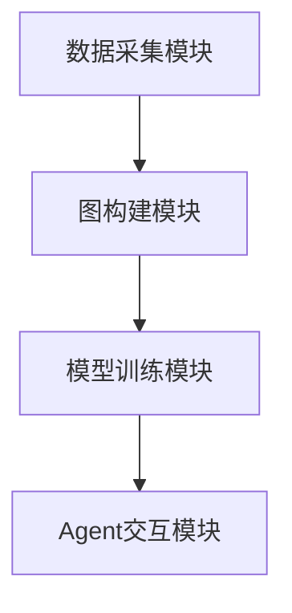

                 


# 基于图卷积网络的AI Agent社交网络分析

## 关键词：图卷积网络，AI Agent，社交网络分析，算法原理，项目实战

## 摘要：  
本文深入探讨了基于图卷积网络（Graph Convolutional Networks, GCN）的AI Agent在社交网络分析中的应用。通过结合GCN的强大图数据处理能力与AI Agent的智能化交互特性，本文提出了一个高效的社交网络分析框架。文章从背景、原理、系统架构到实战案例，详细阐述了如何利用GCN构建AI Agent，并通过实际案例展示了该方法在社交网络分析中的优势和应用价值。

---

# 第一部分：背景与核心概念

## 第1章：社交网络分析的背景与挑战

### 1.1 社交网络分析的重要性  
社交网络分析是理解人类行为、信息传播和社会关系的重要工具。通过分析社交网络中的节点（用户）和边（关系），可以揭示网络的结构特征、信息扩散路径以及关键节点的影响。

### 1.2 图卷积网络的基本概念  
图卷积网络是一种处理图结构数据的深度学习模型。它通过将图的节点特征与节点之间的关系进行聚合，生成更高级的节点表示。

### 1.3 AI Agent的基本概念  
AI Agent是一种智能体，能够感知环境、自主决策并执行任务。在社交网络分析中，AI Agent可以用于实时监控、用户行为分析和个性化推荐。

---

## 第2章：图卷积网络的核心原理

### 2.1 图的表示与图论基础  
图由节点和边组成。节点表示社交网络中的用户，边表示用户之间的关系。图的表示方法包括邻接矩阵、边列表和邻接列表。

### 2.2 图卷积网络的数学模型  
图卷积网络的核心思想是将节点的特征与其邻居的特征进行聚合。数学上，GCN的前向传播公式为：
$$ h^{(l+1)} = \sigma(A h^{(l)}) $$
其中，$A$是归一化邻接矩阵，$h^{(l)}$是第$l$层的节点表示，$\sigma$是激活函数。

### 2.3 图卷积网络与传统卷积网络的对比  
图卷积网络与传统卷积网络的主要区别在于数据结构。GCN处理的是图结构数据，而传统卷积网络处理的是网格数据（如图像）。

---

## 第3章：AI Agent在社交网络分析中的应用

### 3.1 社交网络分析的主要任务  
包括社交网络结构分析（如社区发现）、社会影响力分析（如关键节点识别）和社交网络预测与推荐（如用户行为预测）。

### 3.2 图卷积网络在社交网络分析中的优势  
GCN能够有效捕捉图结构中的局部和全局特征，适合处理社交网络中的复杂关系。

### 3.3 AI Agent在社交网络分析中的实现  
AI Agent通过GCN模型获取社交网络中的节点表示，并基于这些表示进行决策和交互。

---

# 第二部分：算法与系统架构

## 第4章：图卷积网络的算法实现

### 4.1 图卷积网络的数学推导  
GCN的数学模型基于图的邻接矩阵和节点特征矩阵。通过矩阵乘法和激活函数，GCN可以生成节点的高层特征表示。

### 4.2 图卷积网络的算法流程  
1. 输入图的邻接矩阵和节点特征矩阵。  
2. 计算归一化邻接矩阵。  
3. 前向传播：将节点特征与归一化邻接矩阵相乘，得到新的节点表示。  
4. 使用激活函数和池化操作，逐步生成高层特征。  
5. 输出最终的节点表示。

### 4.3 图卷积网络的Python实现  
以下是GCN的Python实现示例：
```python
import numpy as np

class GCNLayer:
    def __init__(self, input_dim, output_dim):
        self.W = np.random.randn(input_dim, output_dim)
        self.b = np.zeros(output_dim)
    
    def forward(self, A, h):
        # A: normalized adjacency matrix
        # h: input features
        self.h = h
        self.output = np.dot(A, h) + self.b
        return self.output
    
    def backward(self, delta):
        # 计算梯度
        pass
```

---

## 第5章：系统分析与架构设计

### 5.1 项目背景与目标  
本项目旨在利用GCN构建一个智能化的AI Agent，用于实时分析社交网络中的用户行为和关系。

### 5.2 系统功能设计  
- 数据采集：从社交平台获取用户数据和关系数据。  
- 图构建：将用户和关系数据转化为图结构。  
- 模型训练：使用GCN对图数据进行训练，生成节点表示。  
- Agent交互：基于节点表示，AI Agent进行实时决策和交互。

### 5.3 系统架构图  


### 5.4 系统接口设计  
- 数据接口：与社交平台API对接，获取用户数据。  
- 模型接口：与AI Agent交互，提供节点表示和决策建议。

---

## 第6章：项目实战

### 6.1 环境安装  
需要安装以下库：numpy、scipy、networkx、tensorflow。

### 6.2 核心代码实现  
```python
import tensorflow as tf
from tensorflow import keras

# 定义GCN模型
class GCN(tf.keras.Model):
    def __init__(self, input_dim, hidden_dim, output_dim):
        super(GCN, self).__init__()
        self.gc1 = keras.layers.Dense(hidden_dim)
        self.gc2 = keras.layers.Dense(output_dim)
    
    def call(self, inputs):
        A, h = inputs
        h = tf.matmul(A, h)
        h = self.gc1(h)
        h = tf.nn.relu(h)
        h = tf.matmul(A, h)
        h = self.gc2(h)
        return h

# 数据准备
A = # 图的邻接矩阵
h = # 输入特征矩阵

# 模型训练
model = GCN(input_dim, hidden_dim, output_dim)
model.compile(optimizer='adam', loss='mse')
model.fit([A, h], y_true, epochs=100)
```

### 6.3 实际案例分析  
以Twitter社交网络为例，利用GCN模型分析用户影响力和信息传播路径。

### 6.4 代码解读与分析  
- GCN模型由两个图卷积层组成，每个层包含权重矩阵和激活函数。  
- 训练过程中，模型通过反向传播更新参数，优化节点表示。

---

## 第7章：最佳实践与小结

### 7.1 最佳实践  
- 数据预处理：确保图数据的质量和完整性。  
- 模型调优：通过交叉验证选择最优的模型参数。  
- 系统优化：优化模型训练时间和内存占用。

### 7.2 小结  
本文详细介绍了基于GCN的AI Agent在社交网络分析中的应用，从理论到实践，全面展示了如何利用深度学习技术解决复杂的社会网络问题。

### 7.3 注意事项  
- 数据隐私：在处理用户数据时，需遵守相关隐私保护法规。  
- 模型泛化能力：需验证模型在不同社交网络中的适用性。

### 7.4 拓展阅读  
推荐阅读《Graph Convolutional Networks: A Comprehensive Survey》和《Deep Learning for Social Network Analysis》。

---

## 作者：AI天才研究院/AI Genius Institute & 禅与计算机程序设计艺术 /Zen And The Art of Computer Programming

