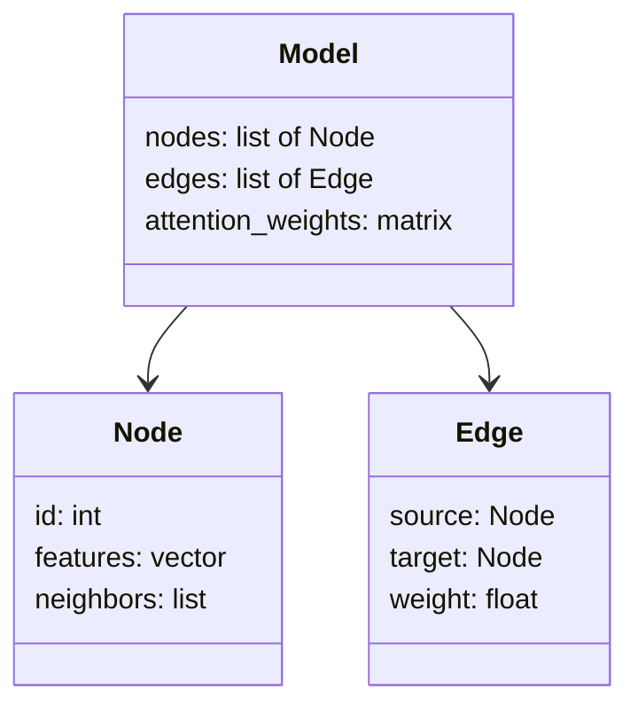

                 


# 基于图注意力网络的AI Agent关系推理

## 关键词：AI Agent，图注意力网络，关系推理，系统架构，项目实战

## 摘要：本文深入探讨了基于图注意力网络的AI Agent关系推理方法，结合理论分析和实际案例，详细阐述了图注意力网络的核心原理、系统设计与实现，以及在实际项目中的应用。

---

# 第一部分: 基于图注意力网络的AI Agent关系推理概述

## 第1章: 问题背景与核心概念

### 1.1 问题背景介绍

#### 1.1.1 当前AI Agent关系推理的挑战
AI Agent（人工智能代理）在复杂环境中需要处理大量信息，进行关系推理以做出决策。传统方法依赖规则或基于统计的模型，难以有效处理复杂的关系结构和动态变化。图注意力网络通过建模实体之间的关系，能够更准确地捕捉上下文信息，提供更强大的推理能力。

#### 1.1.2 图注意力网络的提出背景
图注意力网络（Graph Attention Network，GAT）是一种结合图结构和注意力机制的模型，能够处理图中的节点关系，适用于需要考虑实体间关系的场景。其核心思想是将图结构中的节点表示与注意力机制相结合，以捕捉节点间的依赖关系。

#### 1.1.3 问题解决的意义与价值
通过引入图注意力网络，AI Agent能够更高效地进行关系推理，提升决策的准确性和实时性。这在智能客服、社交网络分析、自动驾驶等领域具有重要应用价值。

---

### 1.2 核心概念定义与对比

#### 1.2.1 图注意力网络的定义
图注意力网络是一种基于图结构的深度学习模型，通过注意力机制捕捉节点之间的关系，能够动态调整节点的重要性权重，从而生成更精细的节点表示。

#### 1.2.2 AI Agent的定义与特点
AI Agent是一种智能实体，能够感知环境、执行任务并做出决策。其特点包括自主性、反应性、目标导向性和社交能力。

#### 1.2.3 图注意力网络与传统注意力机制的对比（表格形式）

| 对比维度            | 图注意力网络                   | 传统注意力机制               |
|---------------------|-------------------------------|-----------------------------|
| 输入结构            | 图结构（节点间关系）           | 序列或向量形式                 |
| 关系建模能力         | 能捕捉节点间复杂关系           | 无法直接建模节点间关系         |
| 应用场景             | 社交网络分析、知识图谱推理       | 机器翻译、文本摘要             |

---

### 1.3 图注意力网络的核心要素

#### 1.3.1 图结构的表示方法
图通常由节点（Nodes）和边（Edges）组成，节点表示为向量，边表示为权重或标签。常用的图表示方法包括邻接矩阵、边列表和节点特征矩阵。

#### 1.3.2 注意力机制在图中的应用
注意力机制用于计算节点之间的注意力权重，通过聚合周围节点的信息生成当前节点的表示。注意力权重反映了节点之间的重要性关系。

#### 1.3.3 关系推理的数学模型
图注意力网络通过计算节点间的注意力权重，结合节点特征生成新的节点表示，用于关系推理。

---

## 1.4 本章小结
本章介绍了AI Agent关系推理的背景和挑战，定义了图注意力网络的核心概念，并对比了其与传统注意力机制的差异。图注意力网络通过建模图结构中的关系，为AI Agent的关系推理提供了新的思路。

---

# 第二部分: 图注意力网络的核心原理

## 第2章: 图注意力网络的原理与实现

### 2.1 图注意力网络的基本原理

#### 2.1.1 图结构的节点表示
节点表示为向量，边表示为权重或标签。图注意力网络通过计算节点间的注意力权重，生成新的节点表示。

#### 2.1.2 注意力机制的计算流程
注意力机制计算节点之间的权重，公式如下：
$$ a_{ij} = \text{softmax}(W_q h_i^T W_k h_j) $$
其中，$h_i$和$h_j$是节点i和j的特征向量，$W_q$和$W_k$是查询和键的变换矩阵。

#### 2.1.3 图注意力网络的训练方法
图注意力网络通过反向传播算法进行训练，损失函数通常采用交叉熵损失或均方差损失。

---

### 2.2 图注意力网络的数学模型

#### 2.2.1 注意力权重的计算公式
$$ a_{ij} = \text{softmax}(W_q h_i^T W_k h_j) $$
其中，$a_{ij}$是节点i对j的注意力权重，$W_q$和$W_k$是参数矩阵。

#### 2.2.2 节点表示的更新公式
$$ h_i^{new} = \sum_{j \in N(i)} a_{ij} h_j $$
其中，$N(i)$是节点i的邻居节点集合。

---

### 2.3 图注意力网络的实现步骤

#### 2.3.1 数据预处理
将图数据转换为邻接矩阵和节点特征矩阵，归一化处理。

#### 2.3.2 模型构建
定义图注意力网络的层，包括注意力计算和节点表示更新。

#### 2.3.3 模型训练与优化
使用反向传播算法训练模型，优化目标函数。

---

### 2.4 图注意力网络的性能分析

#### 2.4.1 时间复杂度分析
图注意力网络的时间复杂度主要取决于注意力计算和节点表示更新，复杂度为$O(N^2)$，其中$N$是节点数。

#### 2.4.2 空间复杂度分析
空间复杂度主要取决于节点特征和边的存储，复杂度为$O(N + E)$，其中$E$是边数。

#### 2.4.3 模型的可解释性
注意力权重可以解释节点间的关系重要性，提供了一定的可解释性。

---

### 2.5 本章小结
本章详细讲解了图注意力网络的核心原理，包括节点表示、注意力计算和模型训练。图注意力网络通过建模节点间的关系，能够有效进行关系推理。

---

# 第三部分: AI Agent关系推理的系统架构

## 第3章: 系统分析与架构设计

### 3.1 问题场景介绍

#### 3.1.1 AI Agent的典型应用场景
智能客服、社交网络分析、自动驾驶等领域。

#### 3.1.2 关系推理的系统需求分析
需要处理复杂的关系结构，实时推理能力，高准确性。

---

### 3.2 项目介绍

#### 3.2.1 项目目标
构建一个基于图注意力网络的AI Agent系统，能够进行关系推理。

---

### 3.3 系统功能设计

#### 3.3.1 领域模型（Mermaid类图）


---

#### 3.3.2 系统架构设计（Mermaid架构图）


---

#### 3.3.3 系统接口设计
系统接口包括数据输入接口、模型训练接口、模型推理接口和结果输出接口。

---

### 3.4 本章小结
本章分析了AI Agent关系推理的系统架构，设计了系统的功能模块和架构图，为后续的实现奠定了基础。

---

# 第四部分: 项目实战

## 第4章: 项目实现与案例分析

### 4.1 环境安装

#### 4.1.1 安装Python和相关库
安装Python 3.8及以上版本，安装PyTorch、numpy、scikit-learn等库。

#### 4.1.2 安装其他工具
安装Jupyter Notebook用于开发和调试。

---

### 4.2 核心代码实现

#### 4.2.1 数据预处理代码
```python
import torch
import numpy as np

class GraphData:
    def __init__(self, nodes, edges):
        self.nodes = nodes
        self.edges = edges
```

#### 4.2.2 图注意力网络模型
```python
class GATLayer(torch.nn.Module):
    def __init__(self, in_dim, out_dim):
        super(GATLayer, self).__init__()
        self.W_q = torch.nn.Linear(in_dim, out_dim)
        self.W_k = torch.nn.Linear(in_dim, out_dim)
        self.W_v = torch.nn.Linear(in_dim, out_dim)
    
    def forward(self, h, adj):
        h_q = self.W_q(h)
        h_k = self.W_k(h)
        h_v = self.W_v(h)
        attention = torch.softmax(torch.matmul(h_q, h_k.transpose(-2, -1)) / h_q.shape[-1], dim=-1)
        output = torch.matmul(attention, h_v)
        return output
```

---

#### 4.2.3 训练与推理代码
```python
def train(model, optimizer, data, epochs=100):
    for epoch in range(epochs):
        optimizer.zero_grad()
        output = model(data.nodes, data.edges)
        loss = torch.nn.MSELoss()(output, data.targets)
        loss.backward()
        optimizer.step()

def inference(model, data):
    with torch.no_grad():
        output = model(data.nodes, data.edges)
        return output.numpy()
```

---

### 4.3 案例分析与详细解读

#### 4.3.1 案例分析
以智能客服场景为例，构建一个基于图注意力网络的AI Agent系统，用于客户意图识别和关系推理。

#### 4.3.2 代码解读
详细解读数据预处理、模型训练和推理代码，说明每部分的功能。

---

### 4.4 本章小结
本章通过项目实战，详细讲解了基于图注意力网络的AI Agent系统实现，包括环境配置、核心代码实现和案例分析。

---

# 第五部分: 最佳实践与总结

## 第5章: 最佳实践与总结

### 5.1 最佳实践 tips

#### 5.1.1 数据预处理
确保数据的完整性和准确性，进行归一化处理。

#### 5.1.2 模型调参
选择合适的超参数，如学习率、批量大小等。

#### 5.1.3 结果分析
通过可视化注意力权重，分析模型的推理过程。

---

### 5.2 本章小结
本章总结了基于图注意力网络的AI Agent关系推理的核心内容，提出了实际应用中的注意事项和最佳实践。

---

# 作者：AI天才研究院 & 禅与计算机程序设计艺术

---

**全文完**

