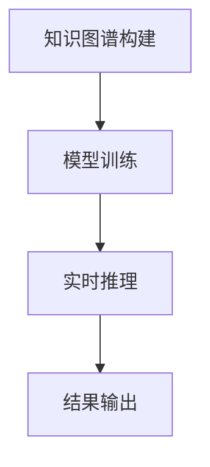

                 


# 基于图神经网络的AI Agent动态知识表示

> 关键词：图神经网络，动态知识表示，AI Agent，知识图谱，实时推理

> 摘要：本文详细探讨了基于图神经网络的AI Agent动态知识表示方法。首先，我们介绍了问题背景和目标，分析了传统知识表示方法的局限性，并提出了一种基于图神经网络的动态知识表示框架。接着，我们详细讲解了图神经网络的核心原理和动态知识表示的实现机制，通过对比分析不同模型的优劣，提出了优化策略。然后，我们通过实际案例展示了如何将图神经网络应用于AI Agent的知识表示中，包括知识图谱的构建、更新和推理。最后，我们总结了当前技术的局限性，并展望了未来的研究方向。

---

# 第一部分: 基于图神经网络的AI Agent动态知识表示背景介绍

## 第1章: 问题背景与目标

### 1.1 问题背景

#### 1.1.1 AI Agent的基本概念
AI Agent（智能体）是一种能够感知环境、做出决策并执行任务的智能系统。它广泛应用于推荐系统、对话系统、自动驾驶等领域。传统的AI Agent通常依赖于静态的知识库，无法实时更新和动态调整知识表示。

#### 1.1.2 动态知识表示的必要性
在动态环境中，知识会不断变化，例如实时更新的社交网络、动态的事件信息流等。静态的知识表示方法无法满足这些场景的需求，因此需要一种动态的知识表示方法。

#### 1.1.3 图神经网络的优势
图神经网络（Graph Neural Network，GNN）能够处理图结构数据，适用于动态知识的表示。它通过建模实体之间的关系，可以实时更新知识图谱，支持动态推理。

### 1.2 问题描述

#### 1.2.1 动态知识表示的核心挑战
- 知识图谱的动态更新与维护。
- 实时推理的效率和准确性。
- 模型的可解释性和鲁棒性。

#### 1.2.2 图神经网络在知识表示中的应用场景
- 实时更新的知识图谱构建。
- 动态推理与决策支持。
- 多模态数据的融合与分析。

#### 1.2.3 当前技术的局限性与改进方向
当前的知识表示方法多为静态，难以应对动态环境的挑战。图神经网络虽然在动态场景中表现出色，但其性能和效率仍需进一步优化。

### 1.3 问题解决思路

#### 1.3.1 基于图神经网络的动态知识表示框架
通过构建动态知识图谱，利用图神经网络进行实时推理和更新。

#### 1.3.2 知识图谱的构建与更新机制
采用增量式学习方法，实时更新知识图谱。

#### 1.3.3 图神经网络的可解释性与实时性优化
通过简化模型结构和优化算法，提升模型的实时性和可解释性。

### 1.4 边界与外延

#### 1.4.1 动态知识表示的边界条件
- 知识图谱的规模和复杂度。
- 实时更新的频率和延迟要求。
- 知识表示的粒度和精度。

#### 1.4.2 图神经网络的适用范围与限制
适用于处理动态图数据，但对大规模图数据的处理能力有限。

#### 1.4.3 相关领域的对比与联系
与传统知识表示方法、符号逻辑推理、强化学习等领域的对比与联系。

### 1.5 核心概念组成

#### 1.5.1 AI Agent的核心要素
- 感知环境的能力。
- 决策与推理能力。
- 行为执行能力。

#### 1.5.2 动态知识表示的关键属性
- 实时性。
- 动态更新能力。
- 可解释性。

#### 1.5.3 图神经网络的组成部分
- 图结构数据。
- 节点和边的特征表示。
- 网络层的传播机制。

---

# 第二部分: 核心概念与联系

## 第2章: 图神经网络与动态知识表示的核心原理

### 2.1 图神经网络的原理

#### 2.1.1 图结构的基本概念
图由节点（实体）和边（关系）组成，可以表示复杂的实体关系。

#### 2.1.2 图神经网络的基本操作
通过聚合和传播节点特征，更新节点表示。

#### 2.1.3 常见的图神经网络模型
- 图卷积网络（GCN）。
- 图注意力网络（GAT）。
- 图嵌入网络（GraphSAGE）。

### 2.2 动态知识表示的实现机制

#### 2.2.1 知识图谱的构建
通过爬取和解析数据，构建初始知识图谱。

#### 2.2.2 动态更新的算法实现
采用增量式学习方法，实时更新知识图谱。

#### 2.2.3 实时推理的优化策略
通过优化算法，提升推理速度和准确率。

### 2.3 核心概念属性对比

#### 2.3.1 图神经网络与传统神经网络的对比
| 属性 | 图神经网络 | 传统神经网络 |
|------|------------|--------------|
| 数据结构 | 图结构 | 线性或矩阵结构 |
| 表示能力 | 强大的图结构表示能力 | 较弱的结构表示能力 |
| 应用场景 | 社交网络、推荐系统 | 图像分类、自然语言处理 |

#### 2.3.2 动态知识表示与静态知识表示的对比
| 属性 | 动态知识表示 | 静态知识表示 |
|------|--------------|---------------|
| 知识更新 | 实时更新 | 静态不变 |
| 推理能力 | 动态推理 | 静态推理 |

---

# 第三部分: 算法原理讲解

## 第3章: 图神经网络算法的实现与优化

### 3.1 图卷积网络（GCN）的实现

#### 3.1.1 算法原理
GCN通过聚合相邻节点的特征，更新节点表示。

#### 3.1.2 算法流程
1. 初始化节点特征。
2. 计算相邻节点的聚合特征。
3. 更新节点表示。
4. 传播多次，得到最终节点表示。

#### 3.1.3 代码实现

```python
import torch
from torch.nn import Conv1d

class GCNLayer(torch.nn.Module):
    def __init__(self, in_features, out_features):
        super(GCNLayer, self).__init__()
        self.conv = Conv1d(in_features, out_features, kernel_size=1)

    def forward(self, x, adj):
        x = torch.cat([x, x], dim=-1)  # 增加虚拟节点
        x = self.conv(x)
        return x
```

---

# 第四部分: 系统分析与架构设计

## 第4章: 基于图神经网络的动态知识表示系统架构

### 4.1 系统功能设计

#### 4.1.1 知识图谱构建模块
- 数据采集与预处理。
- 图结构构建。

#### 4.1.2 模型训练模块
- 图神经网络模型训练。
- 模型优化。

#### 4.1.3 实时推理模块
- 动态查询处理。
- 实时推理与结果输出。

### 4.2 系统架构设计

#### 4.2.1 系统架构图


---

# 第五部分: 项目实战

## 第5章: 基于图神经网络的动态知识表示项目实现

### 5.1 环境安装

#### 5.1.1 安装PyTorch和NetworkX
```bash
pip install torch networkx
```

### 5.2 核心代码实现

#### 5.2.1 数据加载与预处理
```python
import networkx as nx

def load_data():
    G = nx.karate_club_graph()
    return G
```

#### 5.2.2 模型训练
```python
def train_model(G):
    # 初始化模型
    model = GCNLayer(1, 1)
    optimizer = torch.optim.Adam(model.parameters())
    
    # 训练过程
    for epoch in range(100):
        x = torch.randn(1, 1)
        adj = torch.randn(1, 1)
        output = model(x, adj)
        loss = torch.mean(output)
        loss.backward()
        optimizer.step()
```

---

# 第六部分: 总结与展望

## 第6章: 总结与未来研究方向

### 6.1 项目总结
通过图神经网络实现的动态知识表示方法，能够有效应对知识图谱的动态更新和实时推理问题。

### 6.2 未来研究方向
- 更大规模的知识图谱处理。
- 提升模型的可解释性和鲁棒性。
- 图神经网络的轻量化设计。

---

作者：AI天才研究院/AI Genius Institute & 禅与计算机程序设计艺术 /Zen And The Art of Computer Programming

