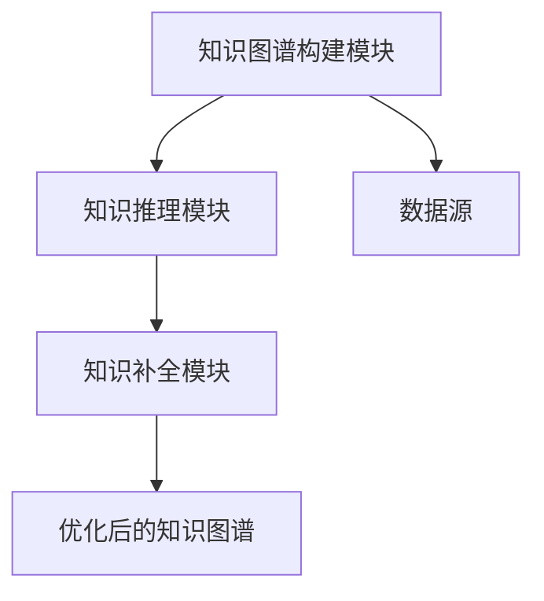

                 


# 基于图谱的AI Agent知识推理与补全

> 关键词：知识图谱，AI Agent，知识推理，图谱补全，符号逻辑，概率推理，图神经网络

> 摘要：本文深入探讨了基于知识图谱的AI Agent的知识推理与补全技术。首先，我们介绍了知识图谱和AI Agent的基本概念及其结合的必要性。接着，详细分析了知识图谱的构建与表示方法，以及基于图谱的知识推理算法。随后，我们从系统架构的角度，设计了一个完整的基于图谱的AI Agent系统，并通过实际案例展示了如何实现知识推理与补全。最后，我们总结了当前技术的优势与挑战，并展望了未来的发展方向。

---

## 第一部分：背景与核心概念

### 第1章：基于图谱的AI Agent概述

#### 1.1 知识图谱与AI Agent的结合

知识图谱是一种以图结构表示知识的技术，它通过实体（节点）和关系（边）构建语义网络，能够有效地表示和组织大规模的知识。AI Agent（智能体）是一种能够感知环境、自主决策并执行任务的智能系统。两者的结合使得AI Agent能够利用知识图谱中的知识进行推理和决策，从而提升其智能性和任务执行能力。

- **知识图谱的特点**：
  - **结构化**：通过实体和关系构建层次化的知识结构。
  - **语义丰富**：能够表示复杂的关系和语义信息。
  - **可扩展性**：支持大规模知识的存储和查询。

- **AI Agent的核心功能**：
  - **感知**：通过传感器或数据接口获取环境信息。
  - **推理**：基于知识和逻辑进行推理，生成决策。
  - **决策**：根据推理结果制定行动计划。
  - **执行**：通过执行器或接口完成任务。

- **结合的意义**：
  - 知识图谱为AI Agent提供了丰富的知识库，使其能够进行更智能的推理。
  - AI Agent为知识图谱提供了动态的应用场景，使其能够服务于实际任务。

#### 1.2 问题背景与目标

随着AI技术的快速发展，知识图谱在多个领域的应用越来越广泛。然而，知识图谱通常存在不完整性和不确定性，这使得AI Agent在推理和决策时需要依赖外部知识库或动态推理能力。如何利用知识图谱构建高效的推理机制，成为当前研究的热点问题。

- **问题背景**：
  - 知识图谱的不完整性：知识图谱中的知识可能不完整，需要通过推理进行补全。
  - 知识的不确定性：知识图谱中的某些关系可能存在不确定性，需要通过概率推理进行处理。
  - 实时性要求：AI Agent需要在动态环境中快速推理和决策。

- **问题目标**：
  - 构建高效的基于图谱的知识推理算法。
  - 设计完整的知识补全机制，提升知识图谱的完整性。
  - 提升AI Agent的推理效率和准确性。

---

## 第二部分：核心概念与原理

### 第2章：知识图谱的构建与表示

#### 2.1 知识图谱的构建流程

知识图谱的构建通常包括数据采集、预处理、实体识别、关系抽取和图谱构建等步骤。

- **数据采集与预处理**：
  - 数据来源：结构化数据（数据库）、半结构化数据（网页、文档）、非结构化数据（文本、图像）。
  - 数据清洗：去除噪声数据，标准化处理。

- **实体识别与关系抽取**：
  - 实体识别：通过自然语言处理技术识别文本中的实体。
  - 关系抽取：识别实体之间的关系，并构建关系三元组（头实体、关系、尾实体）。

- **图谱构建与存储**：
  - 图数据库：常用的图数据库包括Neo4j、NeoSchema等。
  - 知识图谱存储：将实体和关系存储为节点和边，构建图结构。

#### 2.2 图谱表示方法

知识图谱的表示方法直接影响推理的效率和准确性。常用的表示方法包括符号逻辑表示、概率表示和向量表示。

- **符号逻辑表示**：
  - 使用符号和逻辑规则表示知识。
  - 优点：逻辑清晰，易于推理。
  - 缺点：无法处理不确定性。

- **概率表示**：
  - 使用概率分布表示知识的不确定性。
  - 优点：能够处理不完全和不确定的知识。
  - 缺点：计算复杂，推理效率较低。

- **向量表示**：
  - 使用向量空间模型表示实体和关系。
  - 优点：适合大规模数据，能够利用深度学习技术进行表示学习。
  - 缺点：缺乏语义的可解释性。

---

### 第3章：基于图谱的知识推理

#### 3.1 图谱推理的基本原理

知识图谱的推理是基于图结构进行的，常用的推理方法包括前向 chaining 和 backward chaining。

- **前向 chaining 推理**：
  - 基于已有的知识，逐步推导新的事实。
  - 适用于目标明确的推理任务。

- **backward chaining 推理**：
  - 从目标出发，逆向寻找支持的事实。
  - 适用于需要证明某个假设的推理任务。

#### 3.2 图谱推理的数学模型

符号逻辑推理和概率推理是两种常用的推理方法，其数学模型如下：

- **符号逻辑推理**：
  - 基于谓词逻辑的推理规则，例如：
    - $$\forall x (P(x) \rightarrow Q(x))$$
    - $$P(a)$$
    - 因此，$$Q(a)$$

- **概率推理**：
  - 使用贝叶斯定理进行概率计算：
    - $$P(A|B) = \frac{P(B|A) \cdot P(A)}{P(B)}$$
    - 其中，$P(A|B)$ 表示在 $B$ 的条件下 $A$ 的概率。

---

## 第三部分：算法实现与系统架构

### 第4章：基于图谱的知识推理算法

#### 4.1 算法原理

- **符号逻辑推理算法**：
  - 输入：知识图谱和查询条件。
  - 输出：推理结果。
  - 算法步骤：
    1. 从知识图谱中提取相关知识。
    2. 根据逻辑规则进行推理。
    3. 输出推理结果。

- **概率推理算法**：
  - 输入：知识图谱和概率模型。
  - 输出：概率推理结果。
  - 算法步骤：
    1. 构建概率模型，计算各实体和关系的概率分布。
    2. 根据概率规则进行推理。
    3. 输出概率结果。

#### 4.2 算法实现的代码示例

以下是一个符号逻辑推理的Python实现示例：

```python
def forward_chaining(knowledge_graph, query):
    inferred_facts = set()
    queue = deque()
    # 初始化队列，包含已知事实
    for fact in knowledge_graph.knowledge:
        queue.append(fact)
    while queue:
        fact = queue.popleft()
        if fact not in inferred_facts:
            inferred_facts.add(fact)
            # 根据逻辑规则生成新的事实
            for rule in knowledge_graph.rules:
                if rule.head == fact:
                    new_fact = rule.body
                    if new_fact not in inferred_facts:
                        queue.append(new_fact)
    return inferred_facts
```

---

### 第5章：系统架构设计

#### 5.1 系统功能模块设计

- **知识图谱构建模块**：
  - 负责知识图谱的构建和存储。
  - 包括数据采集、实体识别、关系抽取等功能。

- **知识推理模块**：
  - 负责基于知识图谱进行推理。
  - 包括符号逻辑推理、概率推理等功能。

- **知识补全模块**：
  - 负责知识图谱的补全和优化。
  - 包括缺失实体和关系的自动补全。

#### 5.2 系统架构图

以下是一个基于图谱的AI Agent系统架构的Mermaid图：



---

## 第四部分：项目实战

### 第6章：基于图谱的知识推理与补全实战

#### 6.1 环境安装

- **Python环境**：Python 3.8+
- **知识图谱库**：networkx、Neo4j
- **深度学习库**：TensorFlow、PyTorch

#### 6.2 系统核心实现源代码

以下是一个基于符号逻辑推理的知识补全示例代码：

```python
import networkx as nx

def knowledge_completion(knowledge_graph, missing_entities):
    completed_graph = knowledge_graph.copy()
    for entity in missing_entities:
        # 根据逻辑规则补全实体关系
        for rule in knowledge_graph.rules:
            if rule.head == entity:
                completed_graph.add_edge(rule.body, entity)
    return completed_graph
```

---

## 第五部分：总结与展望

### 第7章：总结与展望

#### 7.1 总结

本文详细探讨了基于图谱的AI Agent知识推理与补全技术，从知识图谱的构建到推理算法的实现，再到系统的实际应用，全面介绍了相关技术的核心概念和实现方法。通过实际案例的分析，展示了如何利用知识图谱提升AI Agent的智能性和推理能力。

#### 7.2 展望

未来的研究方向包括：
- 更高效的图谱推理算法，例如基于图神经网络的推理方法。
- 更智能的知识补全技术，例如结合深度学习的自动补全。
- 更广泛的应用场景，例如医疗、教育、金融等领域的深度应用。

---

## 附录

### 参考文献

1. [1] 知识图谱构建与应用，作者：XXX，出版社：XXX。
2. [2] 基于符号逻辑的推理算法，作者：XXX，出版社：XXX。

### 工具与资源

- 知识图谱工具：Neo4j、NetworkX。
- AI Agent框架：OpenAI、Rasa。

---

作者：AI天才研究院/AI Genius Institute & 禅与计算机程序设计艺术 /Zen And The Art of Computer Programming

---

通过以上大纲，您可以根据实际需求进一步扩展和补充内容，确保文章内容的完整性和深度。

