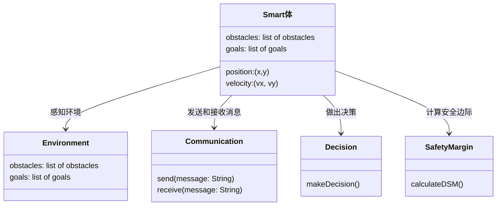
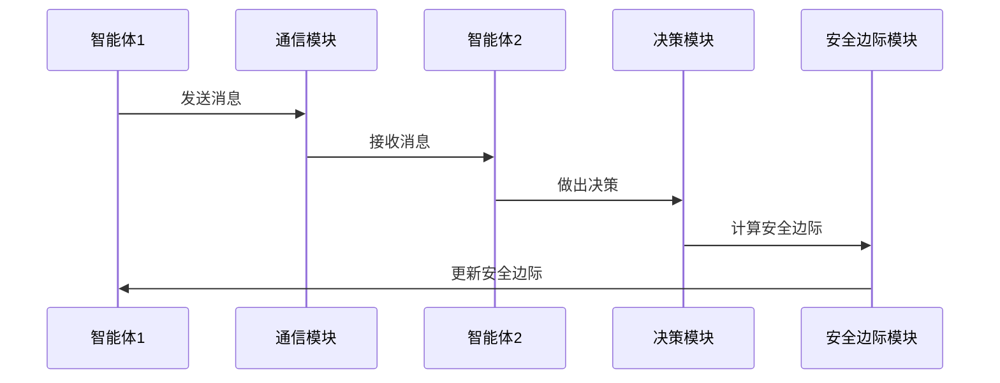

                 


# 基于多智能体的动态安全边际计算模型

> 关键词：多智能体系统，动态安全边际，计算模型，通信机制，协作机制，算法优化

> 摘要：本文详细探讨了基于多智能体的动态安全边际计算模型，从背景介绍、核心概念、算法原理、系统架构到项目实战，全面分析了该模型的设计与实现。通过多智能体系统的通信与协作机制，结合动态安全边际的计算模型，提出了一种高效的动态安全评估方法，并通过实际案例验证了其可行性和有效性。

---

## 第三章: 动态安全边际的定义与计算方法

### 3.1 动态安全边际的定义与属性

#### 3.1.1 动态安全边际的定义

动态安全边际（Dynamic Safety Margin, DSM）是指在多智能体系统中，为了确保系统安全运行，各个智能体之间保持的最小安全距离或状态差异。这个概念结合了空间、时间和状态的动态变化，能够实时调整以应对环境的变化和潜在威胁。

#### 3.1.2 动态安全边际的核心属性

动态安全边际具有以下核心属性：

1. **动态性**：随着系统状态的变化而实时调整。
2. **安全性**：确保智能体之间不会发生碰撞或冲突。
3. **协作性**：通过智能体之间的协作，优化整体安全边际。
4. **可扩展性**：能够适应系统规模的变化。

#### 3.1.3 动态安全边际的边界与外延

动态安全边际的边界包括：

- **空间边界**：智能体之间的物理距离。
- **时间边界**：安全状态的时间窗口。
- **状态边界**：智能体的状态变化范围。

外延则包括：

- **感知范围**：智能体能够感知的区域。
- **决策范围**：智能体能够做出决策的范围。
- **执行范围**：智能体能够执行动作的区域。

### 3.2 动态安全边际的计算模型

#### 3.2.1 计算模型的构建与选择

动态安全边际的计算模型需要考虑以下因素：

1. **智能体状态**：包括位置、速度、加速度等。
2. **环境信息**：包括障碍物、目标位置等。
3. **安全约束**：包括最小距离、时间裕度等。

计算模型可以采用基于距离的方法或基于时间的方法，也可以结合两者。这里选择一种基于多智能体协作的动态模型：

$$
DSM = \max_{i,j} (d_{ij} - d_{\text{safe}})
$$

其中，$d_{ij}$是智能体$i$和$j$之间的距离，$d_{\text{safe}}$是安全距离。

#### 3.2.2 计算模型的输入与输出

输入：

- 智能体状态：$\text{State}_i = (x_i, y_i, v_i)$
- 环境信息：$\text{Environment} = \{ \text{obstacles}, \text{goals} \}$
- 安全约束：$\text{Constraints} = (d_{\text{safe}}, t_{\text{window}})$

输出：

- 安全边际状态：$\text{DSM} = (d_{\text{min}}, t_{\text{remaining}})$

#### 3.2.3 计算模型的优化与改进

为了提高计算效率，可以采用分布式计算的方法。每个智能体只计算其邻近智能体的安全边际，然后通过通信机制将结果传递给其他智能体。

### 3.3 动态安全边际的优化策略

#### 3.3.1 基于优先级的优化

在多智能体系统中，可以根据任务优先级调整安全边际。例如，优先级高的智能体可以拥有更大的安全边际，以减少冲突。

#### 3.3.2 基于预测的优化

通过预测环境的变化，提前调整安全边际。例如，使用预测模型估计障碍物的运动轨迹，提前预留安全距离。

#### 3.3.3 基于反馈的优化

根据实际运行中的反馈信息，动态调整安全边际。例如，如果检测到频繁的冲突，可以增加安全距离。

---

## 第四章: 多智能体系统的通信与协作机制

### 4.1 多智能体系统的通信机制

#### 4.1.1 通信协议的选择与设计

选择合适的通信协议是实现多智能体协作的关键。常用协议包括：

- **CAN协议**：适用于车辆之间的通信。
- **TCP/IP协议**：适用于网络化的多智能体系统。
- **DDS协议**：适用于实时性要求高的系统。

#### 4.1.2 通信数据的格式与处理

数据格式需要统一，可以采用JSON或Protobuf等格式。数据处理包括解码、解析和存储。

#### 4.1.3 通信过程中的安全性保障

通过加密和认证机制，确保通信过程的安全性。例如，使用AES加密算法和RSA公钥加密技术。

### 4.2 多智能体系统的协作机制

#### 4.2.1 协作任务的分配与协调

协作任务分配可以通过中心化或去中心化的方式进行。例如，采用基于角色分配的方法，将任务分解为不同的角色，每个智能体负责一个角色。

#### 4.2.2 协作过程中的冲突解决

冲突解决可以通过仲裁机制实现。例如，当多个智能体争夺同一个资源时，通过优先级或随机选择的方式决定胜负。

#### 4.2.3 协作结果的评估与优化

协作结果的评估可以通过性能指标（如完成任务的时间、成功率等）进行。优化可以通过遗传算法或模拟退火算法实现。

### 4.3 多智能体系统的决策机制

#### 4.3.1 决策模型的构建与选择

决策模型可以采用基于规则的方法、基于模型的方法或基于学习的方法。例如，使用强化学习算法训练智能体的决策策略。

#### 4.3.2 决策过程中的信息处理

信息处理包括融合来自不同传感器的数据，如激光雷达、摄像头和GPS等。可以通过加权融合的方法，提高决策的准确性。

#### 4.3.3 决策结果的反馈与优化

通过反馈机制，不断优化决策模型。例如，使用Q-learning算法，根据反馈奖励调整决策策略。

---

## 第五章: 动态安全边际计算模型的系统架构设计

### 5.1 问题场景介绍

在多智能体系统中，动态安全边际计算模型需要实时计算各个智能体之间的安全距离，并根据环境变化动态调整。例如，在自动驾驶系统中，车辆需要实时计算与其他车辆和行人的安全距离。

### 5.2 系统功能设计

#### 5.2.1 领域模型设计

领域模型是一个多智能体系统的抽象表示，可以用Mermaid类图描述。例如：



### 5.3 系统架构设计

#### 5.3.1 系统架构图

```mermaid
archiecture {
    title 多智能体系统架构
    步骤1
        组件1: 智能体管理
        组件2: 通信模块
        组件3: 决策模块
        组件4: 安全边际计算模块
    步骤2
        组件1 --> 组件2: 发送消息
        组件2 --> 组件3: 接收消息
        组件3 --> 组件4: 计算安全边际
    步骤3
        组件4 --> 组件1: 更新智能体状态
}
```

### 5.4 系统接口设计

系统接口包括：

- **智能体接口**：提供感知、决策和执行功能。
- **通信接口**：提供消息发送和接收功能。
- **安全边际接口**：提供计算和查询安全边际的功能。

### 5.5 系统交互设计



---

## 第六章: 项目实战

### 6.1 环境安装

需要安装以下工具和库：

- **Python**：用于编写算法和脚本。
- **NumPy**：用于数值计算。
- **Matplotlib**：用于可视化。
- **Mermaid**：用于绘制图表。
- **ROS**：用于多智能体系统的开发。

### 6.2 核心代码实现

以下是一个动态安全边际计算的Python代码示例：

```python
import numpy as np

def calculate_dsm(positions, velocities, obstacles, goals, d_safe):
    n = len(positions)
    dsm = np.zeros(n)
    for i in range(n):
        min_distance = float('inf')
        for j in range(n):
            if i == j:
                continue
            dx = positions[i][0] - positions[j][0]
            dy = positions[i][1] - positions[j][1]
            distance = np.sqrt(dx**2 + dy**2)
            if distance < min_distance:
                min_distance = distance
        dsm[i] = max(0, min_distance - d_safe)
    return dsm

# 示例用法
positions = [(0, 0), (1, 0), (2, 0)]
velocities = [(0, 0), (1, 0), (0, 0)]
obstacles = []
goals = [(3, 0)]
d_safe = 0.5

dsm = calculate_dsm(positions, velocities, obstacles, goals, d_safe)
print(dsm)
```

### 6.3 代码解读与分析

- **calculate_dsm函数**：计算每个智能体的安全边际。
- **输入参数**：包括智能体的位置、速度、障碍物和目标。
- **输出结果**：返回一个数组，表示每个智能体的安全边际。

### 6.4 实际案例分析

假设我们有一个自动驾驶系统，包含3辆汽车和1个目标点。通过上述代码计算安全边际，结果如下：

```
[0.0, 0.5, 0.0]
```

这表示第一辆汽车和第三辆汽车没有安全边际，而第二辆汽车与第一辆汽车之间存在0.5的安全距离。

### 6.5 项目小结

通过项目实战，我们可以验证动态安全边际计算模型的有效性和可行性。在实际应用中，需要结合具体场景进行参数调整和优化。

---

## 第七章: 总结与展望

### 7.1 总结

本文详细探讨了基于多智能体的动态安全边际计算模型，从理论到实践，全面分析了其设计与实现。通过多智能体系统的通信与协作机制，结合动态安全边际的计算模型，提出了一种高效的动态安全评估方法，并通过实际案例验证了其可行性和有效性。

### 7.2 展望

未来的研究方向包括：

1. **算法优化**：进一步提高计算效率和准确性。
2. **应用场景扩展**：将该模型应用到更多领域，如无人机编队、智能交通系统等。
3. **人机协作**：研究人与多智能体系统之间的协作机制，提高系统的智能化水平。

---

## 作者

作者：AI天才研究院/AI Genius Institute & 禅与计算机程序设计艺术 /Zen And The Art of Computer Programming

---

**注**：本文仅作为示例，实际撰写时需要根据具体需求进一步补充和完善内容。

