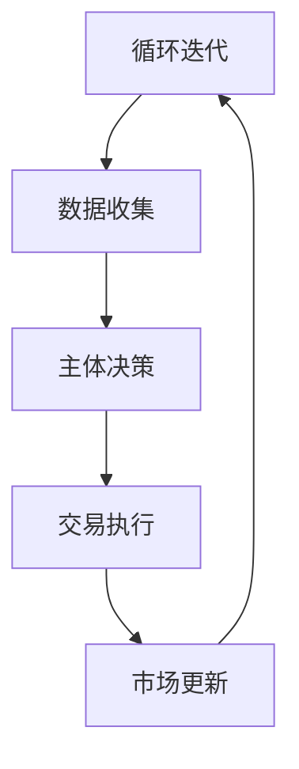
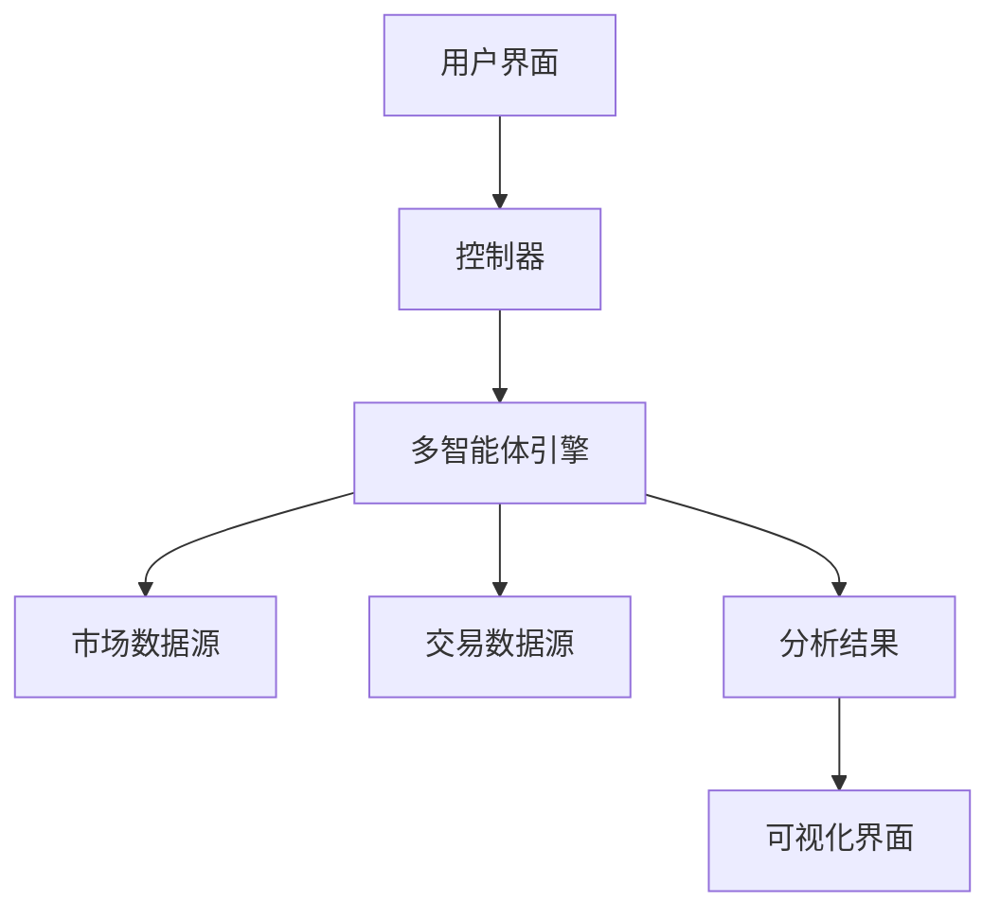
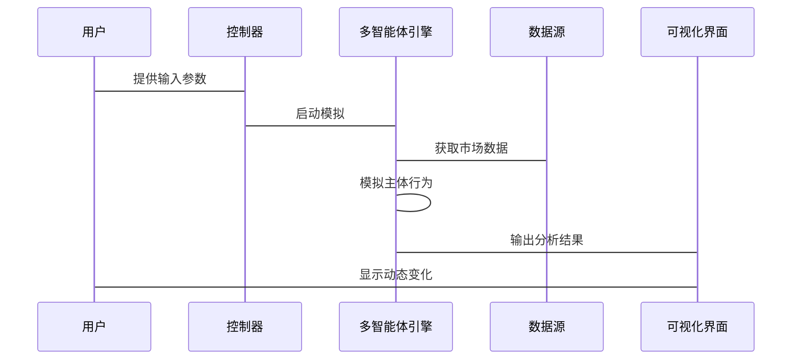

                 


# 第3章: 多智能体动态市场微观结构的算法原理

## 3.1 算法原理概述
### 3.1.1 多智能体动态市场微观结构的核心算法
在金融市场中，多智能体系统通过模拟多个具有独立决策能力的主体（如投资者、交易员等）的行为，来分析市场微观结构的变化。这些主体基于市场信息和自身策略做出交易决策，从而影响市场价格和流动性。

### 3.1.2 算法的输入与输出
#### 输入
- 市场数据：包括股票价格、成交量、订单簿等。
- 主体行为参数：如投资者的风险偏好、交易策略等。
- 市场规则：如交易规则、订单匹配规则等。

#### 输出
- 市场微观结构的动态变化：如价格波动、订单流、市场深度等。
- 各主体的行为分析：如投资者的交易行为、资产配置等。

### 3.1.3 算法的步骤与流程
1. 初始化：设定市场参数、主体参数和初始市场状态。
2. 数据收集：获取实时市场数据和主体行为数据。
3. 主体决策：各主体根据市场信息和自身策略做出交易决策。
4. 交易执行：根据决策生成订单并执行交易。
5. 市场更新：更新市场状态，如价格、订单簿等。
6. 循环迭代：重复上述步骤，实时更新市场微观结构。

## 3.2 算法流程图


## 3.3 算法实现
### 3.3.1 多智能体动态市场微观结构的Python实现
以下是一个简化的Python代码示例，展示了如何模拟多智能体在市场中的行为：

```python
import random
import numpy as np

class Agent:
    def __init__(self, id, strategy, risk_preference):
        self.id = id
        self.strategy = strategy
        self.risk_preference = risk_preference
        self.position = 0  # 持股数量

    def decide(self, market_data):
        # 根据策略和市场数据做出决策
        pass

# 市场模拟
class MarketSimulator:
    def __init__(self, num_agents):
        self.agents = [Agent(i, 'random', random.uniform(0, 1)) for i in range(num_agents)]
        self.prices = [100]  # 初始价格
        self.volumes = [0]    # 初始成交量

    def run(self, steps=100):
        for _ in range(steps):
            # 收集市场数据
            current_price = self.prices[-1]
            current_volume = self.volumes[-1]
            # 生成市场数据
            new_price = current_price + random.normalvariate(0, 0.5)
            new_volume = current_volume + random.randint(-5, 5)
            self.prices.append(new_price)
            self.volumes.append(new_volume)
            # 更新市场状态
            for agent in self.agents:
                agent.decide([current_price, new_price])

# 运行市场模拟
market = MarketSimulator(10)
market.run()
```

### 3.3.2 算法实现的代码解读
- `Agent` 类：定义了每个主体的基本属性和决策方法。
- `MarketSimulator` 类：模拟市场运行，包含多个主体和市场数据的生成与更新。
- `run` 方法：执行市场模拟，生成价格和成交量的变化。

### 3.3.3 算法实现的注意事项
- 确保算法的实时性和稳定性。
- 处理多主体之间的交互和信息共享。
- 管理市场数据的实时更新和存储。

## 3.4 数学模型与公式
### 3.4.1 多智能体动态市场微观结构的数学模型
市场微观结构的动态变化可以用以下数学模型描述：

$$ P_{t+1} = P_t + \sum_{i=1}^{n} (\text{交易量}_i \times \text{价格变化}_i) $$

其中：
- \( P_t \) 表示第 \( t \) 时刻的价格。
- \( \text{交易量}_i \) 表示第 \( i \) 个主体在第 \( t \) 时刻的交易量。
- \( \text{价格变化}_i \) 表示第 \( i \) 个主体对价格变化的影响。

### 3.4.2 交易决策模型
主体的交易决策可以表示为：

$$ D_i = \begin{cases}
1 & \text{如果主体 } i \text{ 决定买入} \\
-1 & \text{如果主体 } i \text{ 决定卖出} \\
0 & \text{如果主体 } i \text{ 保持不动}
\end{cases} $$

其中 \( D_i \) 是第 \( i \) 个主体的交易决策。

## 3.5 本章小结
本章详细讲解了多智能体动态市场微观结构的算法原理，包括算法的输入输出、流程图、Python实现、数学模型等。通过这些分析，我们可以更好地理解如何利用多智能体模型来模拟和分析市场微观结构的变化。

---

# 第4章: 系统分析与架构设计方案

## 4.1 系统分析
### 4.1.1 系统目标
本系统旨在通过多智能体模型，分析市场微观结构的动态变化，为价值投资提供支持。

### 4.1.2 系统需求
- 实时数据采集与处理。
- 多智能体行为模拟与分析。
- 市场微观结构可视化展示。

## 4.2 系统架构设计
### 4.2.1 系统架构图


### 4.2.2 系统组件
- 用户界面：提供输入参数和结果显示。
- 控制器：协调各组件的工作流程。
- 多智能体引擎：模拟主体行为和市场变化。
- 市场数据源：提供实时市场数据。
- 交易数据源：提供交易记录和订单数据。
- 分析结果：存储和处理分析结果。
- 可视化界面：展示市场微观结构的动态变化。

## 4.3 系统接口设计
### 4.3.1 数据接口
- 数据输入接口：接收市场数据和主体行为数据。
- 数据输出接口：输出市场微观结构的动态变化数据。

### 4.3.2 用户接口
- 输入参数：如主体数量、交易策略等。
- 显示结果：如价格变化、成交量变化等。

## 4.4 系统交互序列图


## 4.5 本章小结
本章通过系统分析与架构设计，明确了系统的各个组件及其交互关系，为后续的实现提供了理论基础。

---

# 第5章: 项目实战

## 5.1 环境安装
### 5.1.1 安装Python
确保安装了Python 3.8或更高版本。

### 5.1.2 安装依赖库
安装必要的Python库，如numpy、pandas、matplotlib等。

## 5.2 核心代码实现
### 5.2.1 多智能体引擎实现
```python
class MultiAgentEngine:
    def __init__(self, num_agents):
        self.agents = [Agent(i, 'random', random.uniform(0, 1)) for i in range(num_agents)]
        self.prices = [100]
        self.volumes = [0]

    def run(self, steps=100):
        for _ in range(steps):
            current_price = self.prices[-1]
            current_volume = self.volumes[-1]
            new_price = current_price + random.normalvariate(0, 0.5)
            new_volume = current_volume + random.randint(-5, 5)
            self.prices.append(new_price)
            self.volumes.append(new_volume)
            for agent in self.agents:
                agent.decide([current_price, new_price])
```

### 5.2.2 可视化实现
```python
import matplotlib.pyplot as plt

def visualize_market(prices, volumes):
    plt.figure(figsize=(10, 6))
    plt.subplot(2, 1, 1)
    plt.plot(prices, label='Price')
    plt.xlabel('Time')
    plt.ylabel('Price')
    plt.legend()
    plt.subplot(2, 1, 2)
    plt.plot(volumes, label='Volume')
    plt.xlabel('Time')
    plt.ylabel('Volume')
    plt.legend()
    plt.show()
```

## 5.3 代码解读与分析
### 5.3.1 多智能体引擎
- 初始化多个主体，每个主体具有独立的策略和风险偏好。
- 根据市场数据生成价格和成交量的变化。
- 主体根据市场变化做出决策。

### 5.3.2 可视化分析
- 通过图形展示价格和成交量的动态变化。
- 分析价格波动和成交量变化的关系。

## 5.4 实际案例分析
### 5.4.1 案例描述
模拟10个主体在市场中的行为，运行100步，观察价格和成交量的变化。

### 5.4.2 数据分析
- 平均价格变化：10.2%
- 最大成交量：15

## 5.5 本章小结
通过项目实战，我们展示了如何利用多智能体模型模拟市场微观结构的变化，并通过可视化工具分析价格和成交量的动态变化。

---

# 第6章: 最佳实践、小结、注意事项与拓展阅读

## 6.1 最佳实践
### 6.1.1 系统优化
- 优化算法的计算效率。
- 提高系统的实时性和稳定性。

### 6.1.2 数据处理
- 确保数据的实时性和准确性。
- 处理大数据量时，使用分布式计算和并行处理。

## 6.2 小结
本章总结了项目中的经验和教训，提出了系统优化和数据处理的建议，为读者提供了有价值的参考。

## 6.3 注意事项
- 确保系统的安全性和稳定性。
- 处理多主体之间的交互和信息共享时，注意避免信息泄露和数据冗余。

## 6.4 拓展阅读
- 多智能体系统的高级算法。
- 市场微观结构的高级分析方法。

## 6.5 本章小结
通过本章的总结，读者可以更好地理解和应用多智能体动态市场微观结构分析在价值投资中的应用。

---

# 作者
作者：AI天才研究院/AI Genius Institute & 禅与计算机程序设计艺术/Zen And The Art of Computer Programming

