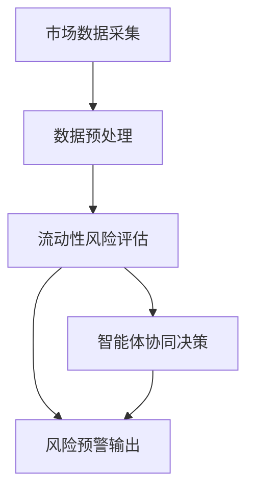
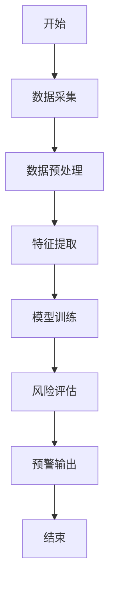
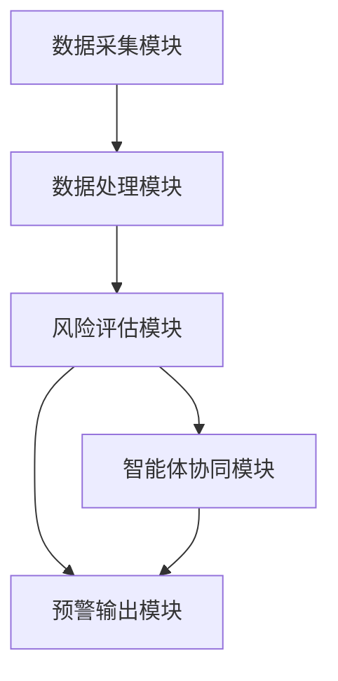

                 


# 基于多智能体的动态市场流动性风险预警系统

## 关键词：多智能体系统，流动性风险，金融市场，动态市场，风险预警

## 摘要：  
本文介绍了一种基于多智能体的动态市场流动性风险预警系统，通过分析金融市场中的流动性风险，提出了一种利用多智能体协同工作的解决方案。本文详细探讨了多智能体系统的核心概念、算法原理、系统架构设计以及实际应用案例，展示了如何利用多智能体技术实现对市场流动性的实时监控和风险预警，为金融市场的风险管理提供了新的思路。

---

# 第一部分: 基于多智能体的动态市场流动性风险预警系统概述

## 第1章: 问题背景与系统目标

### 1.1 问题背景

#### 1.1.1 金融市场流动性风险的定义与特征
流动性风险是指资产在短时间内难以以合理价格变现的风险。在金融市场中，流动性风险通常与市场的波动性、交易量以及市场参与者的行为密切相关。流动性风险的特征包括动态性、突发性和传染性。

#### 1.1.2 多智能体系统在金融领域的应用前景
随着金融市场的复杂化，传统的基于单一智能体的风控系统已难以应对复杂的市场环境。多智能体系统通过分布式计算和协同工作，能够更有效地捕捉市场中的细微变化，提供实时的流动性风险预警。

#### 1.1.3 动态市场环境下的风险预警需求
动态市场环境下，市场的波动性和不确定性显著增加。传统的静态风险评估方法难以满足实时监控的需求，因此需要一种能够动态调整和协同工作的系统来应对流动性风险。

### 1.2 系统目标与功能定位

#### 1.2.1 系统的核心目标
本系统的核心目标是实现对金融市场流动性风险的实时监控和预警。通过多智能体协同工作，系统能够快速响应市场变化，提供精准的风险评估和应对策略。

#### 1.2.2 多智能体协同的优势
多智能体系统通过分布式计算和协同工作，能够更好地捕捉市场中的复杂关系和动态变化。多个智能体可以分别负责不同的数据采集、分析和决策任务，从而实现高效的风险预警。

#### 1.2.3 动态市场流动性风险预警的边界与外延
系统的边界包括市场数据的采集、处理和分析，预警结果的输出以及与外部系统的交互。系统的外延则涉及数据源的多样性、智能体的可扩展性以及与金融机构现有系统的集成能力。

## 第2章: 多智能体系统的核心概念与联系

### 2.1 多智能体系统的基本原理

#### 2.1.1 多智能体系统的定义
多智能体系统是由多个智能体组成的分布式系统，每个智能体都具有一定的自主性、反应性和协作能力。智能体之间通过通信和协调完成共同的目标。

#### 2.1.2 多智能体系统的组成要素
多智能体系统包括智能体、通信机制、协作协议、任务分配机制以及环境五个核心要素。智能体是系统的主体，通信机制是智能体之间交互的基础，协作协议是智能体协同工作的规则，任务分配机制是智能体分工的依据，环境是智能体所处的外部世界。

#### 2.1.3 多智能体系统与传统单智能体系统的对比
与传统单智能体系统相比，多智能体系统具有更高的灵活性和适应性，能够更好地应对复杂的市场环境。但多智能体系统也面临着通信开销大、协同复杂等问题。

### 2.2 实体关系图与流程图

#### 2.2.1 ER实体关系图
以下是系统中实体关系的ER图：

```mermaid
erDiagram
    actor 市场参与者 {
        code id
        string 名称
        string 类型
    }
    actor 市场监管机构 {
        code id
        string 名称
        string 类型
    }
    actor 系统 {
        code id
        string 名称
        string 类型
    }
    市场参与者 --> 市场监管机构 : 提供数据
    市场监管机构 --> 系统 : 提供监管信息
    系统 --> 市场参与者 : 发出预警
```

#### 2.2.2 系统流程图



---

# 第二部分: 流动性风险建模与分析

## 第3章: 流动性风险的建模方法

### 3.1 流动性风险的动态特征

#### 3.1.1 市场波动对流动性的影响
市场的波动性越大，流动性风险越高。例如，在股市中，剧烈的波动可能导致某些资产难以迅速变现。

#### 3.1.2 市场参与者行为对流动性的影响
市场参与者的交易行为也会影响流动性。例如，大量投资者同时抛售资产会导致流动性迅速下降。

### 3.2 多智能体系统中的风险建模

#### 3.2.1 风险建模的基本方法
风险建模通常包括数据采集、特征提取、模型训练和预警输出四个步骤。在多智能体系统中，每个智能体负责不同的任务，例如数据采集、特征提取和模型训练。

#### 3.2.2 多智能体协同建模的优势
多智能体系统能够从不同的角度和层次对流动性风险进行建模，从而提高模型的准确性和鲁棒性。例如，一个智能体负责分析市场的宏观数据，另一个智能体负责分析微观交易数据。

---

# 第三部分: 算法设计与实现

## 第4章: 算法原理讲解

### 4.1 算法流程图



### 4.2 Python实现代码

```python
import numpy as np
import pandas as pd
from sklearn.linear_model import LogisticRegression

# 数据预处理
def preprocess_data(data):
    # 假设data是一个DataFrame
    # 这里进行简单的标准化处理
    data = data.dropna()
    data = (data - data.mean()) / data.std()
    return data

# 特征提取
def extract_features(data, window_size=10):
    features = []
    for i in range(len(data) - window_size):
        window = data.iloc[i:i+window_size]
        features.append(window.mean())
    return features

# 模型训练
def train_model(features, labels):
    model = LogisticRegression()
    model.fit(features, labels)
    return model

# 风险评估
def assess_risk(model, features):
    return model.predict_proba(features)

# 主函数
def main():
    # 数据采集
    data = pd.read_csv('market_data.csv')
    # 数据预处理
    processed_data = preprocess_data(data)
    # 特征提取
    features = extract_features(processed_data)
    # 模型训练
    labels = pd.read_csv('labels.csv')
    model = train_model(features, labels)
    # 风险评估
    risk = assess_risk(model, features)
    # 预警输出
    if risk > 0.9:
        print("高风险预警！")
    elif risk > 0.7:
        print("中风险预警！")
    else:
        print("低风险！")

if __name__ == "__main__":
    main()
```

### 4.3 数学模型与公式

流动性风险评估模型可以表示为：

$$
P(\text{流动性风险}) = \beta_0 + \beta_1 X_1 + \beta_2 X_2 + \ldots + \beta_n X_n
$$

其中，$X_i$ 是影响流动性风险的因素，$\beta_i$ 是对应的系数，通过模型训练得到。

---

# 第四部分: 系统分析与架构设计

## 第5章: 系统架构设计

### 5.1 功能模块设计

#### 5.1.1 数据采集模块
负责从多个数据源采集市场数据，例如股票价格、成交量等。

#### 5.1.2 数据处理模块
对采集到的数据进行清洗和预处理，确保数据的准确性和一致性。

#### 5.1.3 风险评估模块
基于处理后的数据，利用多智能体协同算法进行流动性风险评估。

#### 5.1.4 预警输出模块
根据评估结果生成风险预警信号，并通知相关机构或系统。

### 5.2 系统架构图



---

# 第五部分: 项目实战

## 第6章: 项目实战

### 6.1 环境安装

```bash
pip install numpy pandas scikit-learn
```

### 6.2 核心代码实现

```python
import pandas as pd
from sklearn.ensemble import RandomForestClassifier

def main():
    # 数据加载
    data = pd.read_csv('market_data.csv')
    labels = pd.read_csv('labels.csv')
    
    # 特征工程
    features = data[['volume', 'price_change', 'market_cap']]
    labels = labels['risk_label']
    
    # 模型训练
    model = RandomForestClassifier()
    model.fit(features, labels)
    
    # 预测与预警
    predictions = model.predict(features)
    for i in range(len(predictions)):
        if predictions[i] == 1:
            print("高风险预警！")
        elif predictions[i] == 2:
            print("中风险预警！")
        else:
            print("低风险！")

if __name__ == "__main__":
    main()
```

### 6.3 案例分析

假设我们有一个包含股票数据和风险标签的数据集，运行上述代码后，系统将根据数据生成风险预警信号。例如，如果某只股票的风险标签为高风险，系统将输出“高风险预警！”。

---

# 第六部分: 总结与展望

## 第7章: 总结与展望

### 7.1 最佳实践 tips

- 数据质量是关键，确保数据的准确性和完整性。
- 模型的可解释性需要加强，以便更好地理解风险预警的原因。
- 系统的可扩展性需要考虑，以应对未来市场的变化。

### 7.2 未来展望

随着人工智能技术的不断发展，多智能体系统在金融领域的应用将更加广泛。未来的挑战包括如何进一步提高系统的实时性和准确性，如何应对更加复杂的市场环境，以及如何解决智能体之间的协同问题。

---

# 作者：AI天才研究院 & 禅与计算机程序设计艺术

---

以上是基于多智能体的动态市场流动性风险预警系统的详细目录和内容大纲。通过这种系统化的分析和设计，可以有效实现对金融市场流动性风险的实时监控和预警，为金融市场的风险管理提供有力支持。

