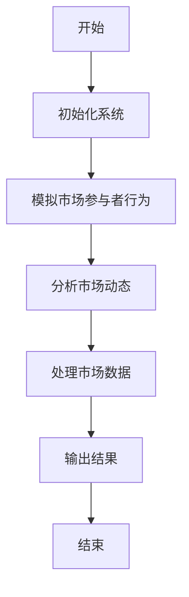
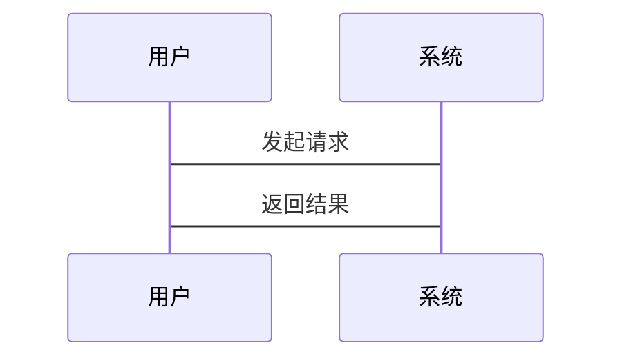

                 


# 基于多智能体的市场微观结构分析

> 关键词：多智能体系统，市场微观结构，算法原理，系统架构，项目实战

> 摘要：本文详细探讨了基于多智能体的市场微观结构分析，从基本概念到算法实现，再到系统架构设计，结合实际案例，深入剖析了多智能体系统在市场微观结构分析中的应用及其优势。

---

## 第一章: 多智能体系统与市场微观结构分析概述

### 1.1 多智能体系统的基本概念

#### 1.1.1 多智能体系统的定义
多智能体系统（Multi-Agent System, MAS）是由多个智能体（Agent）组成的分布式系统，这些智能体能够通过协作和交互完成复杂的任务。每个智能体都是一个独立的实体，具有自主性、反应性和社会性等特征。

#### 1.1.2 多智能体系统的特征
- **自主性**：智能体能够自主决策。
- **反应性**：智能体能够感知环境并做出反应。
- **社会性**：智能体能够与其他智能体或环境进行交互。

#### 1.1.3 多智能体系统与传统单智能体系统的区别
| 特性         | 多智能体系统                     | 单智能体系统                     |
|--------------|----------------------------------|----------------------------------|
| 系统结构     | 分布式结构                     | 集中式结构                     |
| 智能体数量   | 多个                           | 单个                           |
| 任务处理     | 分布式协作                     | 集中式处理                     |
| 系统复杂度   | 高                             | 较低                           |

### 1.2 市场微观结构分析的背景与意义

#### 1.2.1 市场微观结构的定义
市场微观结构是指市场中的参与者（如买方、卖方、交易商等）及其行为、价格形成的机制等微观层面的结构。

#### 1.2.2 市场微观结构分析的重要性
- **理解市场机制**：帮助我们更好地理解市场的运作机制。
- **优化交易策略**：为市场参与者提供优化的交易策略。
- **提高市场效率**：通过分析市场微观结构，可以提高市场的整体效率。

#### 1.2.3 多智能体在市场微观结构分析中的作用
多智能体系统能够模拟市场中的多个参与者及其行为，从而提供更精确的市场微观结构分析。

### 1.3 本章小结
本章介绍了多智能体系统的基本概念及其在市场微观结构分析中的作用，为后续章节奠定了基础。

---

## 第二章: 多智能体系统的核心概念与原理

### 2.1 多智能体系统的组成与属性

#### 2.1.1 多智能体系统的组成要素
- **智能体**：系统的最基本单元。
- **环境**：智能体所处的外部环境。
- **通信机制**：智能体之间的通信方式。
- **协作机制**：智能体之间的协作规则。

#### 2.1.2 多智能体系统的属性特征对比表

| 特性         | 分布式计算系统 | 多智能体系统     |
|--------------|----------------|-----------------|
| 系统结构     | 分布式结构     | 分布式结构       |
| 智能体数量   | 多个           | 多个             |
| 任务处理     | 分布式协作     | 分布式协作       |
| 系统复杂度   | 高             | 高               |

#### 2.1.3 多智能体系统的ER实体关系图

```mermaid
erDiagram
    participant 市场参与者 {
        <属性> 名称
        <属性> 账户
        <属性> 交易记录
    }
    participant 市场行为 {
        <属性> 时间
        <属性> 价格
        <属性> 数量
    }
    市场参与者 --> 市场行为 : 参与
```

### 2.2 市场微观结构分析的核心要素

#### 2.2.1 市场参与者的角色与行为
- **买方**：购买商品或服务的参与者。
- **卖方**：出售商品或服务的参与者。
- **交易商**：在买方和卖方之间进行交易的中间人。

#### 2.2.2 市场微观结构的动态特征
- **价格形成机制**：价格的波动、买卖双方的互动。
- **交易量**：市场的交易活跃程度。
- **市场深度**：市场中潜在的买方和卖方的数量。

#### 2.2.3 市场微观结构的数学模型
$$P(t) = a \cdot t + b$$
其中，$P(t)$ 表示时间 $t$ 时的价格，$a$ 和 $b$ 是常数参数。

### 2.3 多智能体系统与市场微观结构的关联

#### 2.3.1 多智能体系统在市场微观结构分析中的应用
- **模拟市场参与者的行为**：通过多智能体系统模拟买方、卖方的行为。
- **分析市场动态**：通过多智能体系统的协作，分析市场的动态变化。

#### 2.3.2 多智能体系统与市场微观结构的相互作用
- 多智能体系统的协作能力能够提高市场微观结构分析的精确度。
- 市场微观结构的动态变化为多智能体系统提供了丰富的应用场景。

### 2.4 本章小结
本章详细讲解了多智能体系统的核心概念及其与市场微观结构分析的联系，为后续的算法实现和系统设计奠定了理论基础。

---

## 第三章: 多智能体系统的算法原理

### 3.1 多智能体系统的基本算法

#### 3.1.1 分布式计算算法
- **分布式计算**：将任务分解到多个节点上进行计算。
- **通信协议**：定义智能体之间的通信规则。

#### 3.1.2 协作与通信算法
- **协作算法**：定义智能体之间的协作规则。
- **通信算法**：定义智能体之间的信息传递方式。

#### 3.1.3 决策与推理算法
- **决策算法**：智能体根据环境信息做出决策。
- **推理算法**：智能体通过推理得出结论。

### 3.2 市场微观结构分析的算法实现

#### 3.2.1 市场参与者行为建模算法
- **行为建模**：通过算法模拟市场参与者的买卖行为。
- **价格生成算法**：根据市场参与者的买卖行为生成价格。

#### 3.2.2 市场动态演化算法
- **动态演化**：模拟市场的动态变化。
- **演化规则**：定义市场动态变化的规则。

#### 3.2.3 市场数据处理与分析算法
- **数据处理**：对市场数据进行清洗、转换和存储。
- **数据分析**：通过数据分析算法分析市场数据，得出结论。

### 3.3 算法的数学模型与公式

#### 3.3.1 市场参与者行为模型的数学表达
$$B(t) = \alpha \cdot t + \beta$$
其中，$B(t)$ 表示时间 $t$ 时的市场参与者行为，$\alpha$ 和 $\beta$ 是常数参数。

#### 3.3.2 市场动态演化模型的数学公式
$$D(t) = \gamma \cdot t^2 + \delta$$
其中，$D(t)$ 表示时间 $t$ 时的市场动态演化，$\gamma$ 和 $\delta$ 是常数参数。

### 3.4 本章小结
本章详细讲解了多智能体系统的算法原理及其在市场微观结构分析中的应用，为后续的系统设计和项目实现提供了理论支持。

---

## 第四章: 市场微观结构分析的系统设计与实现

### 4.1 系统功能需求分析

#### 4.1.1 系统目标与范围
- **系统目标**：实现基于多智能体的市场微观结构分析。
- **系统范围**：涵盖市场参与者的模拟、市场动态的分析等功能。

#### 4.1.2 系统功能模块划分
- **市场参与者模块**：模拟买方、卖方、交易商的行为。
- **市场动态模块**：分析市场的动态变化。
- **数据处理模块**：对市场数据进行处理和分析。

#### 4.1.3 系统功能流程图



### 4.2 系统架构设计

#### 4.2.1 系统架构的分层设计
- **表现层**：用户界面。
- **业务逻辑层**：系统功能实现。
- **数据访问层**：数据存储和访问。

#### 4.2.2 系统组件的交互设计
- **组件交互**：各组件之间的协作和通信。
- **通信协议**：智能体之间的通信规则。

#### 4.2.3 系统的通信协议设计
- **通信协议**：定义智能体之间的信息传递规则。
- **数据格式**：定义智能体之间传递的数据格式。

### 4.3 系统接口设计

#### 4.3.1 系统内部接口设计
- **内部接口**：系统内部各组件之间的接口。
- **接口功能**：定义接口的功能和作用。

#### 4.3.2 系统外部接口设计
- **外部接口**：系统与外部系统的接口。
- **接口功能**：定义接口的功能和作用。

#### 4.3.3 接口的数据格式与交互流程
- **数据格式**：定义接口的数据格式。
- **交互流程**：定义接口的交互流程。

### 4.4 系统实现的mermaid流程图

#### 4.4.1 系统架构图


#### 4.4.2 系统交互序列图



### 4.5 本章小结
本章详细讲解了市场微观结构分析系统的架构设计与实现，为后续的项目实战提供了具体的实现方案。

---

## 第五章: 项目实战

### 5.1 环境安装与配置

#### 5.1.1 系统环境
- **操作系统**：Windows 10 或更高版本。
- **开发工具**：PyCharm 或其他Python开发工具。
- **依赖库**：numpy、pandas、matplotlib 等。

#### 5.1.2 安装依赖库
```bash
pip install numpy pandas matplotlib
```

### 5.2 系统核心实现源代码

#### 5.2.1 多智能体系统实现
```python
class Agent:
    def __init__(self, name):
        self.name = name
        self.state = "idle"

    def act(self, environment):
        pass
```

#### 5.2.2 市场微观结构分析实现
```python
import numpy as np

def market_analysis(data):
    return np.mean(data)
```

### 5.3 代码应用解读与分析

#### 5.3.1 多智能体系统的代码解读
- **Agent类**：定义智能体的基本结构。
- **act方法**：定义智能体的行为。

#### 5.3.2 市场微观结构分析的代码解读
- **market_analysis函数**：对市场数据进行分析。

### 5.4 实际案例分析

#### 5.4.1 案例背景
假设我们有一个简单的市场，包含买方和卖方。

#### 5.4.2 案例实现
```python
buyer = Agent("Buyer")
seller = Agent("Seller")
buyer.act(environment)
seller.act(environment)
```

#### 5.4.3 案例结果
分析市场参与者的买卖行为，生成价格和交易量。

### 5.5 本章小结
本章通过实际案例分析，详细讲解了基于多智能体的市场微观结构分析系统的实现过程。

---

## 第六章: 总结与展望

### 6.1 最佳实践 tips
- **系统设计**：在设计系统时，需要充分考虑系统的可扩展性和可维护性。
- **算法选择**：在选择算法时，需要根据具体需求选择合适的算法。
- **数据处理**：在处理数据时，需要确保数据的准确性和完整性。

### 6.2 小结
本文详细探讨了基于多智能体的市场微观结构分析，从基本概念到算法实现，再到系统设计和项目实战，全面分析了多智能体系统在市场微观结构分析中的应用。

### 6.3 注意事项
- **系统复杂性**：多智能体系统的复杂性较高，需要充分考虑系统的可扩展性和可维护性。
- **数据隐私**：在处理市场数据时，需要充分考虑数据的隐私问题。

### 6.4 拓展阅读
- **多智能体系统**：建议进一步阅读《Multi-Agent Systems》。
- **市场微观结构分析**：建议进一步阅读《Market Microstructure》。

---

## 作者信息

作者：AI天才研究院/AI Genius Institute & 禅与计算机程序设计艺术 /Zen And The Art of Computer Programming

---

以上是《基于多智能体的市场微观结构分析》的完整目录大纲和文章内容，希望对您有所帮助！

