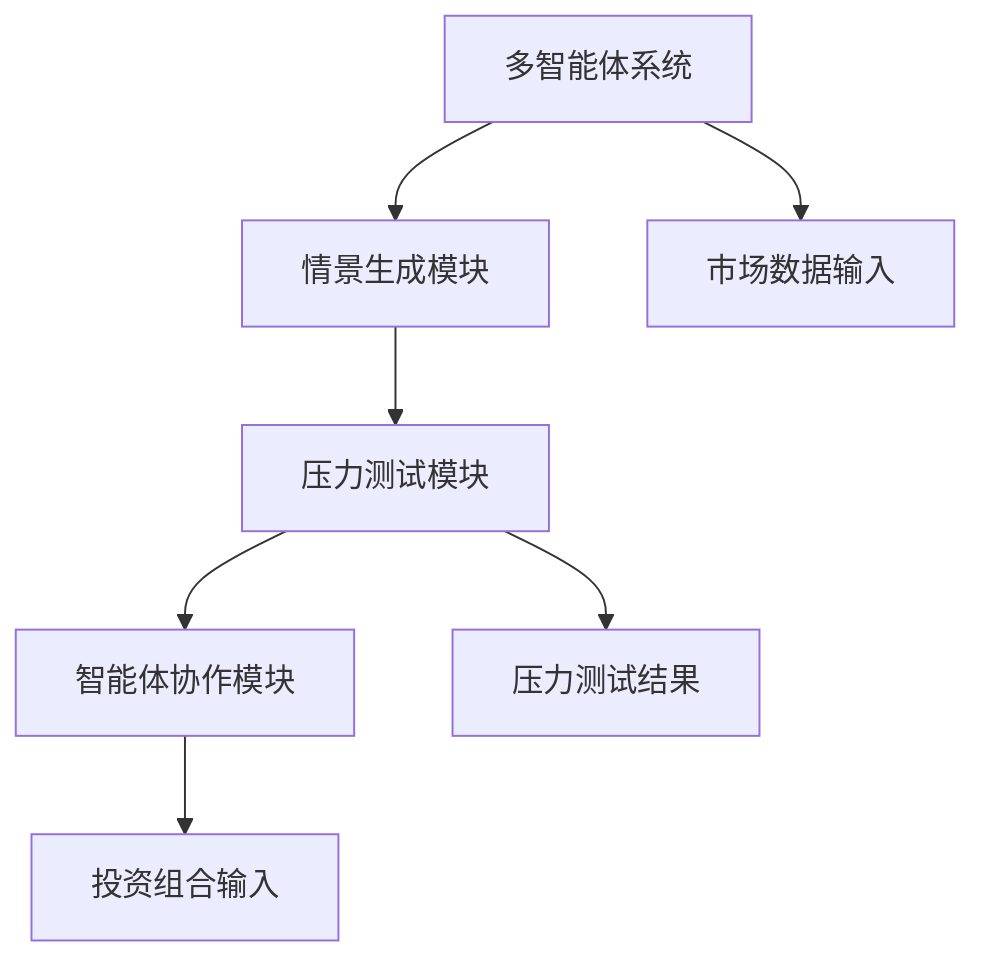

                 


# 基于多智能体的情景分析和压力测试在价值投资中的应用

## 关键词：
- 多智能体系统
- 情景分析
- 压力测试
- 价值投资
- 金融风险管理
- 人工智能

## 摘要：
本文探讨了多智能体系统在情景分析和压力测试中的应用，特别是在价值投资领域。通过分析多智能体系统的定义、特点及其在金融中的应用，详细阐述了情景分析和压力测试的算法原理、系统架构设计以及项目实战。文章还提供了实际案例分析和最佳实践，帮助读者理解如何利用多智能体系统优化投资策略和风险管理。

---

# 第一部分：引言

## 第1章：多智能体系统与价值投资概述

### 1.1 多智能体系统的定义与特点

#### 1.1.1 多智能体系统的定义
多智能体系统（Multi-Agent System, MAS）是由多个相互作用的智能体组成的系统，这些智能体能够自主决策并协同工作。智能体通过感知环境、执行动作和与其它智能体交互来实现目标。

#### 1.1.2 多智能体系统的特点
| 特性 | 描述 |
|------|------|
| 分布性 | 智能体独立运行，无中央控制 |
| 反应性 | 能够实时感知环境变化 |
| 协作性 | 智能体之间可以协作完成复杂任务 |
| 学习性 | 具备学习和适应能力 |

#### 1.1.3 多智能体系统与单一智能体的对比
| 对比维度 | 多智能体系统 | 单一智能体 |
|----------|------------|------------|
| 独立性 | 高 | 低 |
| 协作性 | 高 | 无 |
| 复杂性 | 高 | 低 |

### 1.2 价值投资中的压力测试

#### 1.2.1 价值投资的基本概念
价值投资是一种投资策略，通过分析企业的基本面，寻找被市场低估的投资标的。其核心在于识别内在价值与市场价格的差异。

#### 1.2.2 压力测试的定义与作用
压力测试是一种评估系统在极端情况下表现的测试方法，用于确定系统在面对异常情况时的稳定性和恢复能力。

#### 1.2.3 多智能体系统在压力测试中的应用
多智能体系统能够模拟市场中的多种参与者行为，帮助投资者在极端市场条件下评估投资组合的稳定性。

---

## 第2章：多智能体系统的背景与应用

### 2.1 多智能体系统的背景

#### 2.1.1 多智能体系统的起源与发展
多智能体系统起源于分布式人工智能领域，随着计算能力的提升，其应用逐渐扩展到金融、物流等多个领域。

#### 2.1.2 多智能体系统在金融领域的应用
在金融领域，多智能体系统常用于模拟市场行为、评估投资策略和进行风险分析。

#### 2.1.3 多智能体系统的优势与挑战
| 优势 | 挑战 |
|------|------|
| 高度分布式 | 通信开销大 |
| 高度协作 | 同步复杂 |
| 强大的适应性 | 安全性风险 |

### 2.2 价值投资中的情景分析

#### 2.2.1 情景分析的基本概念
情景分析是一种通过构建不同市场情景来评估投资组合表现的方法。

#### 2.2.2 情景分析在价值投资中的作用
情景分析帮助投资者理解不同市场条件下的投资组合表现，从而做出更合理的投资决策。

#### 2.2.3 多智能体系统在情景分析中的应用
多智能体系统能够模拟不同市场参与者的行为，生成多种市场情景，帮助投资者进行风险评估。

---

## 第3章：多智能体系统的算法原理

### 3.1 情景生成算法

#### 3.1.1 基于随机过程的情景生成
使用蒙特卡洛模拟生成市场情景，考虑多种随机变量的影响。

#### 3.1.2 基于机器学习的情景生成
利用深度学习模型，如LSTM，预测市场情景。

#### 3.1.3 基于多智能体系统的联合情景生成
通过多智能体之间的协作，生成更加多样化和复杂的市场情景。

### 3.2 压力测试算法

#### 3.2.1 基于蒙特卡洛模拟的压力测试
通过模拟极端市场条件，评估投资组合的稳定性。

#### 3.2.2 基于强化学习的压力测试
利用强化学习算法，优化智能体在极端条件下的决策策略。

#### 3.2.3 基于多智能体系统的联合压力测试
多智能体协同工作，模拟极端市场条件下的多维度压力测试。

---

## 第4章：多智能体系统的系统架构设计

### 4.1 系统功能设计

#### 4.1.1 多智能体系统的功能模块划分
| 模块 | 功能 |
|------|------|
| 情景生成模块 | 生成多种市场情景 |
| 压力测试模块 | 评估投资组合在极端条件下的表现 |
| 智能体协作模块 | 协调多智能体的行为 |

#### 4.1.2 情景分析模块的设计
- 接收市场数据输入
- 生成多种市场情景
- 输出情景分析结果

#### 4.1.3 压力测试模块的设计
- 接收投资组合输入
- 模拟极端市场条件
- 输出压力测试结果

### 4.2 系统架构图

#### 4.2.1 系统架构图的Mermaid表示


---

## 第5章：项目实战

### 5.1 环境搭建

#### 5.1.1 安装必要的软件和库
- Python 3.8+
- NumPy, Pandas, Matplotlib
- TensorFlow, Keras
- NetworkX, PyYAML

#### 5.1.2 安装多智能体框架
- 使用强化学习框架如OpenAI Gym
- 安装MAgent框架

### 5.2 核心代码实现

#### 5.2.1 情景生成模块代码
```python
import numpy as np
import random

def generate_market_scenario(n_agents):
    scenarios = []
    for _ in range(n_agents):
        # 随机生成价格波动
        price = np.random.normal(100, 10)
        scenarios.append(price)
    return scenarios
```

#### 5.2.2 压力测试模块代码
```python
import numpy as np

def monte_carlo_simulation(portfolio, n_simulations):
    results = []
    for _ in range(n_simulations):
        # 随机生成市场回报
        returns = np.random.normal(0, 0.2)
        portfolio_value = portfolio * (1 + returns)
        results.append(portfolio_value)
    return results
```

### 5.3 案例分析

#### 5.3.1 案例背景
假设我们有一个投资组合，包含多个股票，我们需要评估其在极端市场条件下的表现。

#### 5.3.2 案例分析与解读
- 生成多种市场情景
- 进行压力测试
- 分析投资组合在不同情景下的表现

### 5.4 项目小结
通过实际项目，我们验证了多智能体系统在情景分析和压力测试中的有效性，展示了其在价值投资中的应用潜力。

---

## 第6章：高级主题与扩展

### 6.1 多智能体系统的前沿技术

#### 6.1.1 分布式计算与边缘计算
多智能体系统在分布式计算和边缘计算中的应用，提升系统的实时性和响应速度。

#### 6.1.2 与区块链技术的结合
利用区块链技术实现多智能体系统的去中心化，提升系统的安全性和透明度。

### 6.2 多智能体系统的未来发展趋势

#### 6.2.1 更高的智能化
智能体具备更强的学习和决策能力，能够应对更复杂的市场环境。

#### 6.2.2 更广泛的应用领域
多智能体系统将应用于更多金融场景，如高频交易、风险管理等。

---

## 第7章：总结与展望

### 7.1 总结
本文详细探讨了多智能体系统在情景分析和压力测试中的应用，展示了其在价值投资中的潜力。

### 7.2 投资策略
通过多智能体系统优化投资组合管理，提升风险控制能力，制定更加科学的投资策略。

### 7.3 未来展望
随着人工智能技术的进步，多智能体系统将在金融领域发挥更大的作用，推动价值投资的智能化和自动化。

---

## 参考文献

1. Russell, S., & Norvig, P. (2010). Artificial Intelligence: A Modern Approach.
2. Sun, Y. (2018). Multi-Agent Systems for Financial Applications.
3. Han, J., & others. (2020). Applying Multi-Agent Systems to Investment Risk Management.

---

## 附录

### 附录A：相关工具与库

- Python库：NumPy, Pandas, TensorFlow, Keras
- 多智能体框架：OpenAI Gym, MAgent

### 附录B：代码示例

#### 附录B.1：情景生成代码
```python
import numpy as np

def generate_market_scenario(n_agents):
    scenarios = []
    for _ in range(n_agents):
        price = np.random.uniform(50, 150)
        scenarios.append(price)
    return scenarios
```

#### 附录B.2：压力测试代码
```python
import numpy as np

def stress_test(portfolio_value, n_simulations):
    results = []
    for _ in range(n_simulations):
        return_rate = np.random.normal(0, 0.2)
        new_value = portfolio_value * (1 + return_rate)
        results.append(new_value)
    return results
```

---

## 作者：AI天才研究院 & 禅与计算机程序设计艺术

---

以上是《基于多智能体的情景分析和压力测试在价值投资中的应用》的详细目录和内容概要，涵盖了从基础概念到实际应用的各个方面，结构清晰，内容丰富，能够帮助读者全面理解多智能体系统在价值投资中的应用。

