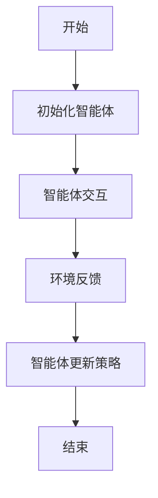
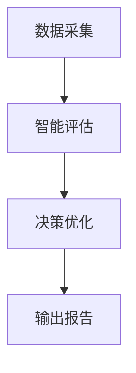
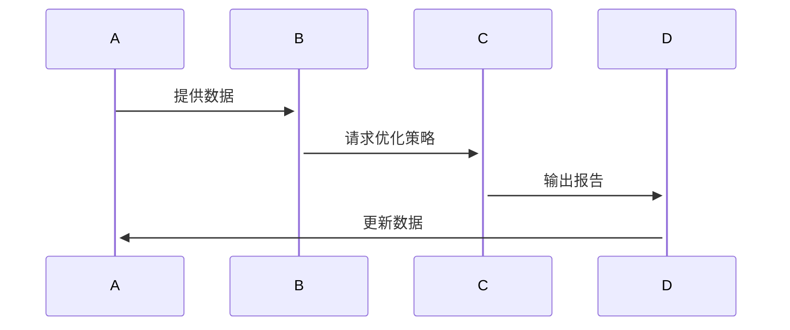

                 


# 基于多智能体的自动化公司可持续发展评估

> **关键词**: 多智能体系统, 可持续发展评估, 自动化评估, 强化学习, 系统架构, 项目实战

> **摘要**: 本文探讨了基于多智能体系统在公司可持续发展评估中的应用，通过详细分析多智能体系统的原理、算法实现、系统架构设计以及实际项目案例，展示了如何利用多智能体技术实现自动化、高效的可持续发展评估。文章从背景介绍、核心概念、算法原理、系统架构、项目实战到最佳实践，全面解析了基于多智能体的自动化公司可持续发展评估的理论与实践。

---

## 目录

### 第一部分: 背景介绍

### 第二部分: 核心概念与联系

### 第三部分: 算法原理讲解

### 第四部分: 系统分析与架构设计

### 第五部分: 项目实战

### 第六部分: 最佳实践

### 第七部分: 结论与展望

---

## 第一部分: 背景介绍

### 第1章: 可持续发展评估的背景与挑战

#### 1.1 问题背景
随着全球对企业可持续发展的关注日益增加，公司需要对其社会、环境和经济表现进行全面评估。传统的评估方法依赖于人工分析，存在效率低、主观性强、难以量化等问题。

#### 1.2 问题描述
公司可持续发展评估涉及多个维度，包括环境影响、社会责任、经济效益等。如何高效、准确地评估这些维度，并制定优化策略，成为企业面临的重要挑战。

#### 1.3 多智能体系统的优势
多智能体系统（Multi-Agent System, MAS）通过分布式计算和协同优化，能够高效地处理复杂问题。在可持续发展评估中，多智能体系统可以分别负责不同的评估维度，协同工作，提供全面的评估结果。

#### 1.4 边界与外延
多智能体系统在可持续发展评估中的应用边界包括数据采集、评估模型构建和优化策略生成。其外延则涉及与其他系统的集成，如企业资源规划（ERP）系统和数据分析平台。

---

## 第二部分: 核心概念与联系

### 第2章: 多智能体系统的核心概念

#### 2.1 智能体的定义与特征
智能体（Agent）是具有感知环境、自主决策和执行动作的实体。多智能体系统由多个智能体组成，通过协同完成复杂任务。

#### 2.2 多智能体系统的组成
多智能体系统包括：
- **智能体**：负责特定任务的执行单元。
- **环境**：智能体感知和交互的外部世界。
- **通信机制**：智能体之间的信息交换方式。
- **协同机制**：智能体合作完成任务的规则和策略。

#### 2.3 智能体之间的协同与通信
智能体之间的通信和协同是多智能体系统的核心。通过消息传递和状态共享，智能体能够协调行动，实现全局优化。

---

## 第三部分: 算法原理讲解

### 第3章: 多智能体协同算法

#### 3.1 基于强化学习的MAS架构
强化学习是一种通过试错优化策略的方法，适用于多智能体系统的协同优化。智能体通过与环境的交互，学习最优策略。

#### 3.2 分布式计算与协同机制
在多智能体系统中，每个智能体负责特定的任务，通过分布式计算实现协同。智能体之间的通信和协作是关键，确保系统的高效运行。

#### 3.3 联合优化算法
联合优化算法通过多个智能体的协同，实现全局最优。常用的方法包括Q-learning和分布式强化学习。

---

### 第4章: 算法实现与案例分析

#### 4.1 算法流程图


#### 4.2 核心代码实现
```python
class Agent:
    def __init__(self, state_space, action_space):
        self.state_space = state_space
        self.action_space = action_space
        self.q_table = {}  # Q-learning 表

    def perceive(self, state):
        # 返回当前智能体的状态
        return state

    def act(self, state):
        # 根据当前状态选择动作
        if state not in self.q_table:
            self.q_table[state] = 0
        # 返回动作
        return self.action_space[0]

    def update(self, state, reward):
        # 更新 Q 表
        self.q_table[state] += reward
```

---

## 第四部分: 系统分析与架构设计

### 第4章: 系统架构设计

#### 4.1 问题场景介绍
公司可持续发展评估涉及多个维度，需要通过多智能体系统分别评估环境、社会责任和经济效益。

#### 4.2 系统功能设计
- 数据采集模块：收集公司运营数据。
- 智能评估模块：利用多智能体算法进行评估。
- 决策优化模块：生成优化策略。

#### 4.3 系统架构图


#### 4.4 系统交互图


---

## 第五部分: 项目实战

### 第5章: 项目实战与案例分析

#### 5.1 项目背景与目标
通过多智能体系统实现对公司可持续发展的自动化评估。

#### 5.2 核心代码实现
```python
import numpy as np

class Environment:
    def __init__(self):
        self.state = np.random.rand(10)  # 示例状态

    def get_state(self):
        return self.state

    def step(self, action):
        # 返回新的状态和奖励
        reward = np.sum(action)
        return reward

# 初始化环境和智能体
env = Environment()
agent = Agent(env.state, env.action)
```

#### 5.3 案例分析与结果展示
通过实际案例分析，展示多智能体系统在可持续发展评估中的应用效果。

---

## 第六部分: 最佳实践

### 第6章: 最佳实践与注意事项

#### 6.1 小结
多智能体系统在公司可持续发展评估中的应用，能够提高评估效率和准确性。

#### 6.2 注意事项
- 数据质量是关键，需确保数据的准确性和完整性。
- 系统设计需考虑智能体之间的协同与通信机制。

#### 6.3 拓展阅读
推荐相关书籍和论文，进一步深入学习多智能体系统和可持续发展评估。

---

## 第七部分: 结论与展望

### 第7章: 结论与未来展望

#### 7.1 结论
本文详细探讨了基于多智能体的自动化公司可持续发展评估的理论与实践，展示了其在提高评估效率和准确性的优势。

#### 7.2 未来展望
未来，随着人工智能技术的发展，多智能体系统在可持续发展评估中的应用将更加广泛和深入，为企业提供更高效的解决方案。

---

## 作者

作者：AI天才研究院/AI Genius Institute & 禅与计算机程序设计艺术 /Zen And The Art of Computer Programming

---

通过以上结构，文章详细介绍了基于多智能体的自动化公司可持续发展评估的理论与实践，结合实际案例和代码实现，为读者提供了全面的指导和深度的技术解析。

