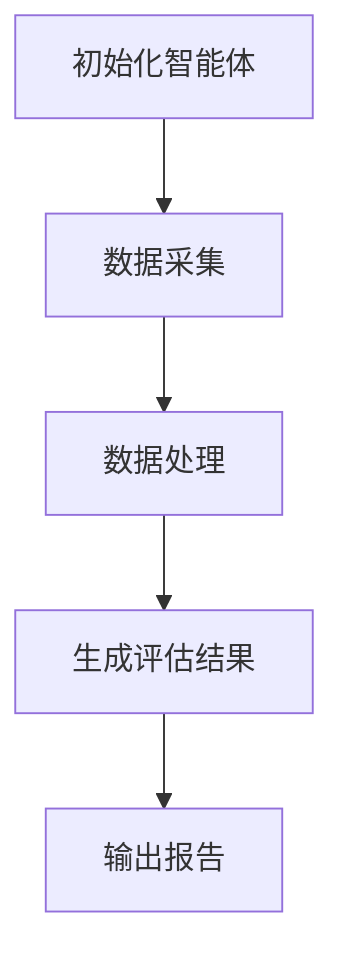
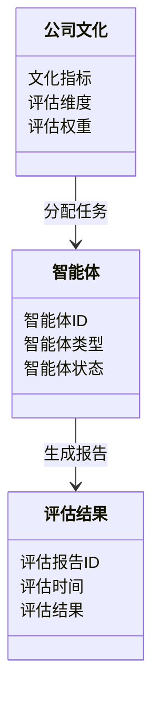
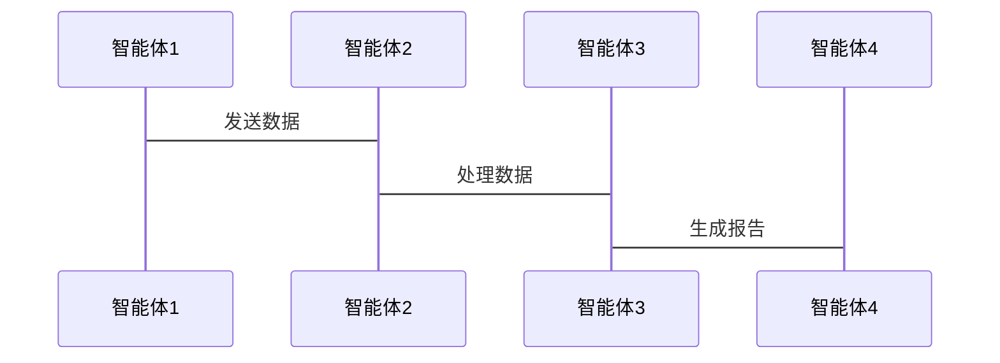

                 


# 基于多智能体的自动化公司文化影响评估

## 关键词：
- 多智能体系统
- 公司文化
- 自动化评估
- 文化影响
- 智能体协作

## 摘要：
本文探讨了如何利用多智能体系统来自动化评估公司文化的影响。通过分析多智能体系统的原理和公司文化评估的需求，提出了一种基于多智能体的自动化解决方案。该方案包括智能体的设计、协作机制、数据处理流程以及评估结果的生成。通过实际案例分析，展示了该方案在实际应用中的有效性和优势。

---

## 第1章: 背景介绍与核心概念

### 1.1 问题背景与描述

#### 1.1.1 公司文化的定义与作用
公司文化是指企业在经营活动中形成的价值观、行为准则和思维方式的总和。它是企业凝聚力的源泉，影响着员工的工作态度、团队协作能力以及企业的整体表现。

#### 1.1.2 文化影响评估的传统方法与局限性
传统的文化影响评估通常依赖于问卷调查、 interviews 和观察法。然而，这些方法存在耗时长、成本高、主观性强等问题，难以实现自动化和实时评估。

#### 1.1.3 自动化评估的需求与优势
随着企业规模的扩大和市场竞争的加剧，企业需要快速、准确地了解文化影响，以便及时调整管理策略。自动化评估能够提高效率、降低成本，并提供客观、全面的评估结果。

### 1.2 多智能体系统的基本概念

#### 1.2.1 多智能体系统的定义
多智能体系统（Multi-Agent System, MAS）是由多个智能体（Agent）组成的系统，这些智能体能够自主决策、协作完成任务。

#### 1.2.2 多智能体系统的特征
- 分布式：智能体独立运行，通过通信协作完成任务。
- 协作性：智能体之间通过协作实现整体目标。
- 自主性：智能体能够自主决策，无需外部干预。

#### 1.2.3 多智能体系统与单智能体系统的区别
| 特性       | 单智能体系统       | 多智能体系统       |
|------------|--------------------|--------------------|
| 结构化     | 集中控制           | 分布式控制         |
| 协作性     | 无                 | 高                 |
| 扩展性     | 低                 | 高                 |

### 1.3 问题解决思路

#### 1.3.1 多智能体系统在文化评估中的应用场景
- 数据采集：智能体收集员工反馈、行为数据。
- 数据分析：智能体处理数据，生成评估结果。
- 结果应用：根据评估结果优化公司文化。

#### 1.3.2 多智能体系统的建模与实现
- 建模：构建智能体模型，定义智能体的行为和协作规则。
- 实现：编写代码实现智能体功能，确保各智能体协同工作。

#### 1.3.3 文化影响评估的自动化流程
1. 数据采集：智能体通过问卷、日志等方式收集数据。
2. 数据处理：智能体对数据进行清洗、分析。
3. 评估结果生成：智能体生成评估报告，提出改进建议。

---

## 第2章: 核心概念与边界

### 2.1 多智能体系统的核心要素

#### 2.1.1 智能体的定义与分类
- 定义：智能体是具有感知和行动能力的实体。
- 分类：根据智能体的智能水平可分为反应式智能体、认知式智能体等。

#### 2.1.2 智能体的协作机制
- 通信：智能体之间通过消息传递进行协作。
- 协调：通过协商、仲裁等方式解决冲突。
- 分工：智能体根据任务分配角色。

#### 2.1.3 智能体的通信协议
- 消息格式：定义消息的结构和内容。
- 通信方式：包括同步和异步通信。
- 通信频率：根据任务需求确定。

### 2.2 文化影响评估的指标体系

#### 2.2.1 评估指标的分类
- 员工满意度：员工对公司的认可程度。
- 团队协作：团队内部的协作效率。
- 领导风格：领导者的行为方式对员工的影响。

#### 2.2.2 指标权重的确定
- 确定权重的方法：如层次分析法（AHP）。
- 权重的调整：根据实际情况动态调整。

#### 2.2.3 评估结果的量化方法
- 使用数学模型量化评估结果，如加权平均法。

### 2.3 系统边界与外延

#### 2.3.1 系统的输入与输出
- 输入：员工数据、公司政策等。
- 输出：评估报告、改进建议。

#### 2.3.2 系统的适用范围
- 适用于各类企业，特别是中大型企业。

#### 2.3.3 系统的局限性与改进方向
- 局限性：数据依赖性高，模型需要不断优化。
- 改进方向：引入机器学习技术，提高评估精度。

---

## 第3章: 多智能体系统的核心原理

### 3.1 多智能体系统的原理

#### 3.1.1 分布式计算与协作机制
- 分布式计算：各智能体独立计算，通过通信协作。
- 协作机制：智能体之间通过协商、协调完成任务。

#### 3.1.2 智能体之间的通信与协调
- 通信：通过消息传递实现。
- 协调：通过仲裁、协商解决冲突。

#### 3.1.3 多智能体系统的自适应性
- 系统能够根据环境变化自动调整。

### 3.2 多智能体系统的属性特征

#### 3.2.1 分布式性
- 系统由多个智能体组成，分布运行。

#### 3.2.2 协作性
- 智能体之间协作完成任务。

#### 3.2.3 自主性
- 智能体能够自主决策。

### 3.3 ER实体关系图

```mermaid
er
    entity 公司文化 {
        key 属性: 文化指标
        属性: 评估维度
        属性: 评估权重
    }
    entity 智能体 {
        key 属性: 智能体ID
        属性: 智能体类型
        属性: 智能体状态
    }
    entity 评估结果 {
        key 属性: 评估报告ID
        属性: 评估时间
        属性: 评估结果
    }
    公司文化 --> 智能体: 分配评估任务
    智能体 --> 评估结果: 生成报告
```

---

## 第4章: 算法原理讲解

### 4.1 算法原理

#### 4.1.1 算法概述
- 使用多智能体协作算法进行文化评估。

#### 4.1.2 算法流程
1. 初始化智能体。
2. 数据采集。
3. 数据处理。
4. 生成评估结果。

### 4.2 算法流程图



### 4.3 算法实现

```python
class Agent:
    def __init__(self, agent_id):
        self.agent_id = agent_id
        self.data = []

    def collect_data(self):
        # 从数据源采集数据
        pass

    def process_data(self):
        # 处理数据
        pass

    def generate_report(self):
        # 生成评估报告
        pass

# 初始化智能体
agents = [Agent(i) for i in range(5)]

# 数据采集
for agent in agents:
    agent.collect_data()

# 数据处理
for agent in agents:
    agent.process_data()

# 生成报告
for agent in agents:
    agent.generate_report()
```

### 4.4 数学模型

#### 4.4.1 模糊综合评价模型

$$ E = \sum_{i=1}^{n} w_i x_i $$

其中，$w_i$ 是指标权重，$x_i$ 是指标得分。

#### 4.4.2 考虑多智能体协作的模型

$$ E = \sum_{j=1}^{m} w_j \sum_{i=1}^{n} a_{ij} x_i $$

其中，$a_{ij}$ 是智能体 $j$ 对指标 $i$ 的权重。

---

## 第5章: 系统分析与架构设计方案

### 5.1 问题场景介绍

#### 5.1.1 问题场景描述
- 企业需要自动化评估公司文化的影响。

### 5.2 项目介绍

#### 5.2.1 项目目标
- 实现多智能体系统的自动化文化评估。

### 5.3 系统功能设计

#### 5.3.1 领域模型类图



### 5.4 系统架构设计

#### 5.4.1 系统架构图

```mermaid
archi
    架构层: 多智能体系统
        子系统1: 数据采集智能体
        子系统2: 数据处理智能体
        子系统3: 评估报告生成智能体
```

### 5.5 系统接口设计

#### 5.5.1 接口描述
- 智能体间通过REST API通信。

### 5.6 系统交互流程

#### 5.6.1 序列图



---

## 第6章: 项目实战

### 6.1 环境安装

#### 6.1.1 环境要求
- Python 3.8+

### 6.2 系统核心实现源代码

#### 6.2.1 数据采集智能体

```python
class DataCollector(Agent):
    def collect_data(self):
        # 从数据库采集数据
        pass
```

#### 6.2.2 数据处理智能体

```python
class DataProcessor(Agent):
    def process_data(self):
        # 数据清洗、分析
        pass
```

#### 6.2.3 评估报告生成智能体

```python
class ReportGenerator(Agent):
    def generate_report(self):
        # 生成评估报告
        pass
```

### 6.3 代码应用解读与分析

#### 6.3.1 代码功能分析
- 每个智能体负责特定任务，协同完成整体目标。

### 6.4 实际案例分析

#### 6.4.1 案例背景
- 某公司希望评估团队协作能力。

#### 6.4.2 实施步骤
1. 初始化智能体。
2. 采集数据。
3. 处理数据。
4. 生成报告。

### 6.5 详细讲解剖析

#### 6.5.1 案例结果
- 评估报告显示团队协作能力较强。

#### 6.5.2 案例分析
- 系统能够准确反映公司文化的影响。

### 6.6 项目小结

#### 6.6.1 项目总结
- 系统实现了自动化评估，提高了效率。

#### 6.6.2 项目经验
- 需要不断优化智能体协作机制。

---

## 第7章: 总结与展望

### 7.1 总结

#### 7.1.1 核心观点总结
- 多智能体系统能够有效评估公司文化影响。

### 7.2 未来展望

#### 7.2.1 研究方向
- 引入机器学习提高评估精度。

#### 7.2.2 应用前景
- 多智能体系统在企业管理中的应用将更加广泛。

---

## 作者

作者：AI天才研究院/AI Genius Institute & 禅与计算机程序设计艺术 /Zen And The Art of Computer Programming

