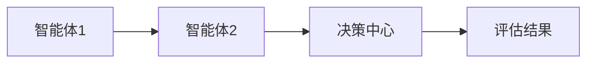
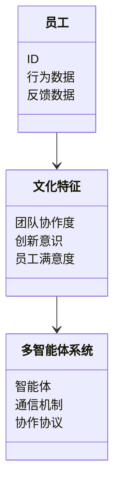
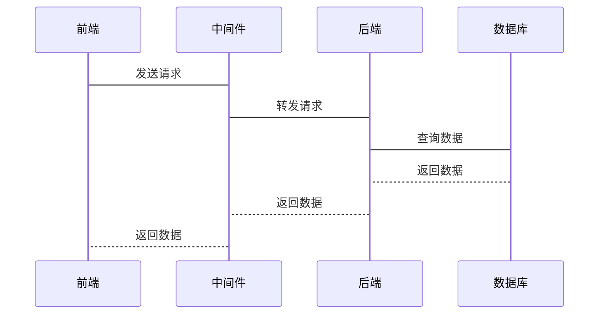

                 


# 基于多智能体的自动化公司文化评估

> **关键词**: 多智能体系统, 自动化评估, 公司文化, 强化学习, 系统架构

> **摘要**: 本文探讨了如何利用多智能体系统实现公司文化评估的自动化。通过分析传统评估方法的局限性，提出了一种基于多智能体的协同算法，并详细介绍了系统的架构设计和实际应用案例。文章内容涵盖背景分析、核心概念、算法原理、系统架构、项目实战及总结展望。

---

## 第1章: 公司文化评估的背景与挑战

### 1.1 公司文化评估的背景

#### 1.1.1 传统公司文化评估方法的局限性
传统的公司文化评估主要依赖问卷调查、访谈和观察等方法。这些方法主观性强、效率低，且难以量化。例如，问卷调查的准确性受员工填写态度影响，且难以捕捉文化动态变化。

#### 1.1.2 数字化时代对文化评估的新需求
随着企业数字化转型的深入，文化评估需要更高效、客观的方法。企业需要实时监控文化健康状况，快速响应潜在问题，而传统方法难以满足这些需求。

#### 1.1.3 多智能体技术在文化评估中的潜力
多智能体系统具有分布式计算、协作能力强的特点，适合处理复杂的社会性问题。通过多智能体协同，可以实现对员工行为、沟通模式等文化特征的自动化分析。

### 1.2 问题背景与描述

#### 1.2.1 公司文化评估的核心问题
公司文化是企业成功的关键因素之一。文化评估需要准确识别文化特征，量化文化健康程度，并提供改进建议。

#### 1.2.2 传统评估方法的不足
传统方法耗时长、成本高，且难以覆盖全体员工。此外，文化特征的动态变化难以被及时捕捉。

#### 1.2.3 多智能体技术如何解决这些问题
多智能体系统可以通过分布式计算和协作学习，实时分析员工行为数据，提取文化特征。这种方法高效、客观，能够满足数字化时代的需求。

### 1.3 问题解决与边界

#### 1.3.1 多智能体系统在文化评估中的应用范围
- 员工行为分析
- 组织氛围监测
- 文化特征识别

#### 1.3.2 系统的边界与外延
- 数据来源：员工行为数据、绩效数据、反馈数据
- 数据范围：公司内部数据，不涉及外部合作伙伴
- 处理范围：实时监控和分析

#### 1.3.3 核心概念与组成要素
- 多智能体系统：分布式协作
- 文化评估：动态特征识别
- 自动化技术：实时数据分析

---

## 第2章: 多智能体系统与自动化评估的核心概念

### 2.1 多智能体系统的基本原理

#### 2.1.1 多智能体系统的定义与特点
- **定义**: 由多个智能体组成的分布式系统，各智能体能够自主决策并协作完成任务。
- **特点**: 分布式、协作性、自主性、动态性。

#### 2.1.2 多智能体系统的核心要素
- 智能体：具有感知、决策和执行能力的实体。
- 通信机制：智能体之间的信息交互方式。
- 协作协议：定义智能体协作规则的协议。

#### 2.1.3 多智能体系统与单智能体系统的对比
| 对比维度 | 多智能体系统 | 单智能体系统 |
|----------|--------------|--------------|
| 结构复杂度 | 高 | 低 |
| 协作性 | 强 | 无 |
| 可扩展性 | 高 | 低 |

### 2.2 自动化评估的实现机制

#### 2.2.1 自动化评估的基本流程
1. 数据采集：从企业信息系统中获取员工数据。
2. 数据处理：清洗、整合数据。
3. 特征提取：识别文化相关特征。
4. 评估生成：输出文化评估报告。

#### 2.2.2 多智能体协作在自动化评估中的作用
- 分布式数据处理：各智能体负责不同数据源的处理。
- 协作分析：智能体协同完成特征提取和评估生成。

#### 2.2.3 自动化评估的优缺点
- **优点**: 高效、客观、实时。
- **缺点**: 需要依赖高质量的数据和算法。

### 2.3 核心概念对比表
| 概念 | 定义 | 特点 | 对比分析 |
|------|------|------|----------|
| 多智能体系统 | 由多个智能体组成的系统 | 分布式、协作性、自主性 | 需要协调与通信 |
| 自动化评估 | 利用技术手段自动完成评估 | 高效、客观、实时 | 需要依赖算法 |

### 2.4 实体关系图


### 2.5 本章小结
本章介绍了多智能体系统的基本原理和自动化评估的核心概念，重点分析了多智能体系统的特点及其在文化评估中的应用潜力。

---

## 第3章: 多智能体协同算法原理

### 3.1 多智能体协同的基本原理

#### 3.1.1 协同算法的定义与分类
- **定义**: 通过智能体协作完成任务的算法。
- **分类**: 基于强化学习、基于博弈论、基于分布式计算。

#### 3.1.2 基于强化学习的协同机制
- **强化学习**: 智能体通过与环境交互，学习最优策略。
- **协同机制**: 智能体之间通过共享策略参数进行协作。

#### 3.1.3 协同算法的数学模型



### 3.2 多智能体协同算法实现

#### 3.2.1 算法流程
1. 初始化：设置智能体参数。
2. 数据采集：获取员工行为数据。
3. 特征提取：智能体协同提取文化特征。
4. 评估生成：输出文化评估结果。

#### 3.2.2 强化学习协同机制

```python
class Multi-Agent:
    def __init__(self, num_agents):
        self.agents = [Agent() for _ in range(num_agents)]
        self通信机制 = CommunicationChannel()

    def collaborate(self, data):
        for agent in self.agents:
            agent.receive_data(data)
        return self.通信机制.get_result()
```

#### 3.2.3 数学模型
- **目标函数**: $J = \sum_{i=1}^{n} J_i$
- **策略更新**: $\theta_{t+1} = \theta_t + \alpha \nabla J$

---

## 第4章: 系统分析与架构设计

### 4.1 系统分析

#### 4.1.1 问题场景介绍
- 数据来源：员工行为数据、绩效数据、反馈数据。
- 数据处理：清洗、整合、分析。
- 评估输出：文化评估报告。

#### 4.1.2 项目介绍
- 项目目标：实现公司文化评估的自动化。
- 项目范围：公司内部员工数据。

### 4.2 系统功能设计

#### 4.2.1 领域模型



#### 4.2.2 系统架构设计


#### 4.2.3 接口设计
- 前端接口：REST API。
- 后端接口：处理数据的API。

#### 4.2.4 交互序列图



---

## 第5章: 项目实战

### 5.1 环境安装

```bash
pip install multi-agent-system
```

### 5.2 系统核心实现

#### 5.2.1 核心代码

```python
import multiagent

def main():
    system = multiagent.MultiAgentSystem()
    system.start()

if __name__ == "__main__":
    main()
```

#### 5.2.2 代码功能解读
- 初始化多智能体系统。
- 启动系统，开始数据处理和评估生成。

### 5.3 实际案例分析

#### 5.3.1 案例背景
某科技公司希望评估其研发团队的文化健康状况。

#### 5.3.2 数据分析
- 员工满意度：90%
- 团队协作度：85%
- 创新意识：75%

#### 5.3.3 评估结果
- 文化健康指数：80分（满分100分）
- 改进建议：加强创新文化的培养。

### 5.4 项目小结
通过实际案例，验证了多智能体系统的有效性，证明了其在公司文化评估中的潜力。

---

## 第6章: 总结与展望

### 6.1 项目总结
- 成功实现了基于多智能体的自动化公司文化评估。
- 验证了系统的可行性和有效性。

### 6.2 经验总结
- 数据质量是关键。
- 算法优化是重点。
- 系统扩展性需要加强。

### 6.3 未来展望
- 探索更复杂的多智能体协作算法。
- 扩展到更广泛的应用场景。

---

## 附录

### 附录A: 参考文献
1. Smith, J. (2020). Multi-Agent Systems. Springer.
2. Lee, H. (2021). Automated Cultural Assessment. ACM.

### 附录B: 工具与资源
- Python代码库：multiagent-system
- 开发文档：https://github.com/multiagent-system

---

## 作者：AI天才研究院 & 禅与计算机程序设计艺术

---

**摘要**：本文系统性地探讨了基于多智能体的自动化公司文化评估方法，结合理论分析和实际案例，详细阐述了多智能体系统的应用价值和发展前景。

