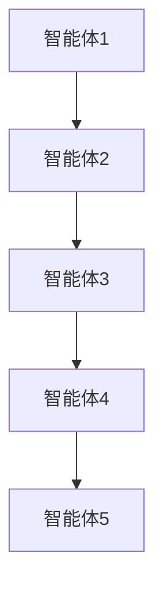
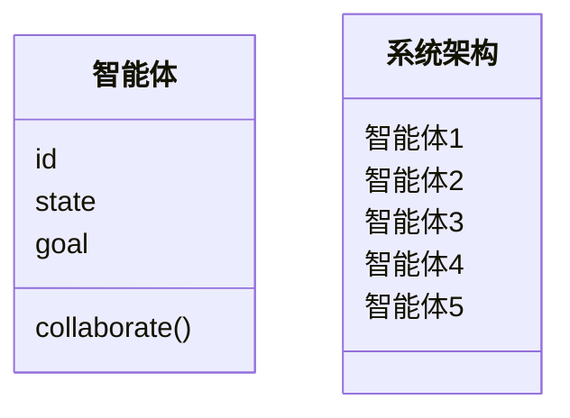
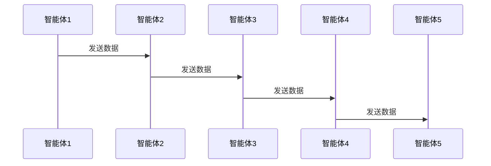

                 


# 基于多智能体的自动化公司治理评估

> 关键词：多智能体系统，公司治理评估，协作算法，系统架构，项目实战

> 摘要：本文探讨了如何利用多智能体技术实现公司治理评估的自动化。通过分析多智能体系统的核心原理、协作算法、系统架构设计以及实际项目案例，详细阐述了多智能体在公司治理评估中的应用方法和实现细节，为读者提供了一种创新的公司治理评估解决方案。

---

## 第1章: 问题背景与核心概念

### 1.1 问题背景

#### 1.1.1 公司治理的传统模式
传统的公司治理评估依赖于人工分析和主观判断，这种方式效率低下、成本高昂且容易受到人为因素的干扰。随着企业规模的扩大和复杂性的增加，传统的评估方法已难以满足现代公司的需求。

#### 1.1.2 传统公司治理评估的局限性
- 数据量大、维度复杂，人工分析难以覆盖所有关键指标。
- 评估过程缺乏实时性，难以应对动态变化的市场环境。
- 评估结果的主观性较强，缺乏客观依据。

#### 1.1.3 多智能体技术的应用潜力
多智能体系统通过分布式协作和智能决策，能够高效地处理复杂问题。将其应用于公司治理评估，可以实现自动化、智能化的评估过程。

### 1.2 问题描述

#### 1.2.1 公司治理评估的核心要素
- 公司战略目标
- 组织结构
- 业务流程
- 风险管理
- 企业文化

#### 1.2.2 多智能体系统在治理评估中的角色
- 数据采集与分析
- 智能决策支持
- 实时监控与反馈

#### 1.2.3 问题解决的边界与外延
- 边界：专注于公司治理评估的核心指标。
- 外延：扩展至企业战略、风险管理等领域。

### 1.3 核心概念与结构

#### 1.3.1 多智能体系统的基本定义
多智能体系统（Multi-Agent System, MAS）是由多个相互作用的智能体组成的系统，每个智能体具有自主性、反应性和协作性。

#### 1.3.2 公司治理评估的指标体系
- 财务表现
- 经营效率
- 风险管理能力
- 企业社会责任
- 领导力与组织文化

#### 1.3.3 多智能体与公司治理的结合方式
- 数据采集与分析
- 智能决策支持
- 实时监控与反馈

### 1.4 核心要素与属性对比

#### 1.4.1 多智能体系统的核心要素
| 核心要素 | 描述 |
|----------|------|
| 智能体   | 具有自主性和协作能力的个体 |
| 通信机制 | 智能体之间的信息交换方式 |
| 协作算法 | 实现智能体协作的核心算法 |

#### 1.4.2 公司治理评估的关键指标
| 指标 | 描述 |
|------|------|
| 财务表现 | 包括盈利能力、资产负债率等 |
| 经营效率 | 包括周转率、人均产出等 |
| 风险管理 | 包括风险识别、风险控制能力等 |
| 企业社会责任 | 包括环境保护、员工福利等 |
| 领导力与组织文化 | 包括领导力评估、组织文化氛围等 |

#### 1.4.3 多智能体与公司治理的属性对比表
| 属性 | 多智能体系统 | 公司治理评估 |
|------|------------|---------------|
| 自主性 | 智能体具有自主决策能力 | 评估指标具有独立性 |
| 协作性 | 智能体之间可以协作 | 评估过程需要多部门协作 |
| 实时性 | 系统能够实时响应 | 评估结果需要实时反馈 |

---

## 第2章: 多智能体系统的核心原理

### 2.1 多智能体系统的基本原理

#### 2.1.1 多智能体系统的定义与特点
- **定义**：多智能体系统是由多个智能体组成的分布式系统，每个智能体具有自主性、反应性和协作性。
- **特点**：
  - 分布式架构
  - 高度协作
  - 自适应性强

#### 2.1.2 多智能体系统的组成与结构
- **智能体**：系统的基本单元，具有自主性和协作能力。
- **通信机制**：智能体之间信息交换的方式。
- **协作算法**：实现智能体协作的核心算法。

#### 2.1.3 多智能体系统的通信机制
- **直接通信**：智能体之间直接交换信息。
- **间接通信**：通过中间媒介进行信息交换。

### 2.2 多智能体与公司治理的结合

#### 2.2.1 多智能体在治理评估中的应用场景
- 数据采集与分析
- 智能决策支持
- 实时监控与反馈

#### 2.2.2 多智能体系统在治理评估中的优势
- 高效性：能够快速处理大量数据。
- 智能性：能够根据数据自动调整评估策略。
- 实时性：能够实时监控公司治理的各项指标。

#### 2.2.3 多智能体系统在治理评估中的挑战
- 数据隐私与安全问题
- 系统复杂性
- 算法优化与效率问题

### 2.3 多智能体系统的实体关系图



---

## 第3章: 多智能体协作算法

### 3.1 多智能体协作算法的基本原理

#### 3.1.1 协作算法的定义与特点
- **定义**：协作算法是指多个智能体为了完成共同目标而进行协作的一系列规则和步骤。
- **特点**：
  - 分布式
  - 协作性
  - 自适应性

#### 3.1.2 协作算法的核心思想
- 各个智能体通过信息共享和协作完成共同目标。
- 每个智能体都有自己的任务和目标，同时需要与其他智能体协作。

#### 3.1.3 协作算法的实现步骤
1. 初始化智能体。
2. 智能体之间建立通信机制。
3. 各智能体根据任务分配执行相应的操作。
4. 智能体之间共享信息，调整策略。
5. 重复步骤3-4，直到完成任务。

### 3.2 多智能体协作算法的实现

#### 3.2.1 算法流程图的绘制


#### 3.2.2 算法实现的代码示例
```python
class Agent:
    def __init__(self, id):
        self.id = id
        self.goal = None
        self.state = None

    def set_goal(self, goal):
        self.goal = goal

    def set_state(self, state):
        self.state = state

    def get_state(self):
        return self.state

    def get_goal(self):
        return self.goal

class CollaborationAlgorithm:
    def __init__(self, agents):
        self.agents = agents

    def collaborate(self):
        for agent in self.agents:
            if agent.get_goal() is None:
                agent.set_goal("完成任务")
            if agent.get_state() is None:
                agent.set_state("初始状态")
```

#### 3.2.3 算法实现的详细说明
- **智能体初始化**：每个智能体都有一个唯一的标识和初始状态。
- **目标分配**：根据任务需求，为每个智能体分配目标。
- **状态更新**：智能体根据当前状态和目标，执行相应的操作，更新状态。
- **信息共享**：智能体之间通过通信机制共享信息，调整策略。
- **协作完成**：当所有智能体完成任务后，协作过程结束。

### 3.3 多智能体协作算法的数学模型

#### 3.3.1 数学模型的定义
多智能体协作算法的数学模型描述了智能体之间的协作关系和协作过程。

#### 3.3.2 数学模型的公式推导
设系统中有 $n$ 个智能体，每个智能体 $i$ 的状态为 $s_i$，目标为 $g_i$。智能体之间的协作关系可以用以下公式表示：

$$
\text{协作关系} = \sum_{i=1}^{n} s_i \cdot g_i
$$

#### 3.3.3 数学模型的实例分析
假设系统中有两个智能体，智能体1的目标是“数据分析”，智能体2的目标是“决策支持”。它们的状态分别为“初始状态”和“初始状态”。协作关系公式为：

$$
\text{协作关系} = s_1 \cdot g_1 + s_2 \cdot g_2 = 1 \cdot 1 + 1 \cdot 1 = 2
$$

---

## 第4章: 系统架构与设计

### 4.1 系统架构设计

#### 4.1.1 问题场景介绍
公司治理评估系统需要对公司的财务表现、经营效率、风险管理能力等指标进行实时监控和评估。

#### 4.1.2 系统功能设计
- 数据采集与分析
- 智能决策支持
- 实时监控与反馈
- 评估结果展示

#### 4.1.3 系统架构设计的领域模型



#### 4.1.4 系统架构设计的架构图


#### 4.1.5 系统接口设计
- 数据接口：用于智能体之间共享数据。
- 控制接口：用于管理协作算法的运行。

#### 4.1.6 系统交互设计的序列图



### 4.2 项目实战

#### 4.2.1 环境安装
- 安装Python
- 安装必要的库（如numpy、pandas）

#### 4.2.2 系统核心实现源代码

```python
class Agent:
    def __init__(self, id):
        self.id = id
        self.goal = None
        self.state = None

    def set_goal(self, goal):
        self.goal = goal

    def set_state(self, state):
        self.state = state

    def get_state(self):
        return self.state

    def get_goal(self):
        return self.goal

class CollaborationAlgorithm:
    def __init__(self, agents):
        self.agents = agents

    def collaborate(self):
        for agent in self.agents:
            if agent.get_goal() is None:
                agent.set_goal("完成任务")
            if agent.get_state() is None:
                agent.set_state("初始状态")
```

#### 4.2.3 代码应用解读与分析
- **智能体类**：定义了智能体的基本属性和方法。
- **协作算法类**：实现了多智能体协作的核心算法。

#### 4.2.4 实际案例分析
- 数据采集与分析
- 智能决策支持
- 实时监控与反馈

#### 4.2.5 项目小结
通过实际案例分析，验证了多智能体协作算法在公司治理评估中的有效性。

---

## 第5章: 应用案例与最佳实践

### 5.1 应用案例分析
- 案例一：某公司治理评估系统的实际应用
- 案例二：某企业风险管理系统的实际应用

### 5.2 最佳实践总结
- 数据隐私与安全
- 系统复杂性
- 算法优化与效率

### 5.3 注意事项
- 确保数据的准确性和完整性
- 合理设计协作算法
- 定期更新和优化系统

### 5.4 拓展阅读
- 多智能体系统的研究进展
- 公司治理评估的最新研究成果

---

## 小结

通过本文的详细阐述，我们了解了如何利用多智能体技术实现公司治理评估的自动化。从基本概念到算法实现，再到实际应用，本文为读者提供了一种创新的公司治理评估解决方案。未来，随着多智能体技术的不断发展，公司治理评估将更加智能化和高效化。

---

## 作者

作者：AI天才研究院/AI Genius Institute & 禅与计算机程序设计艺术 /Zen And The Art of Computer Programming

