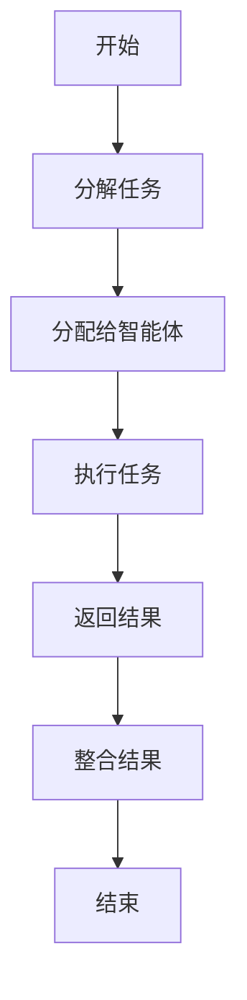
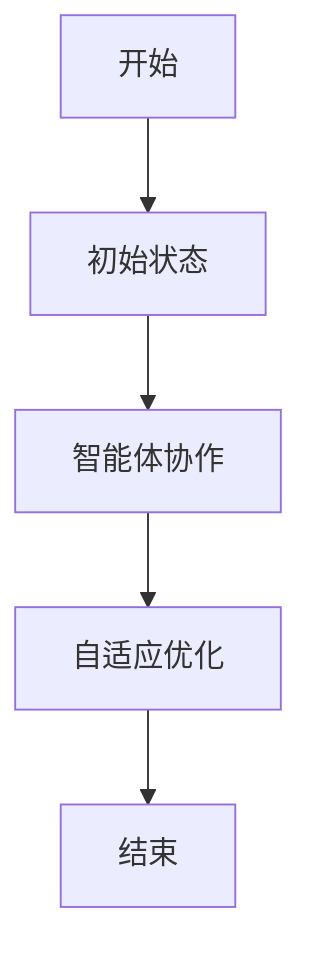
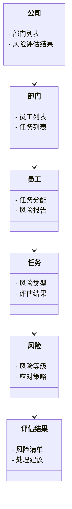
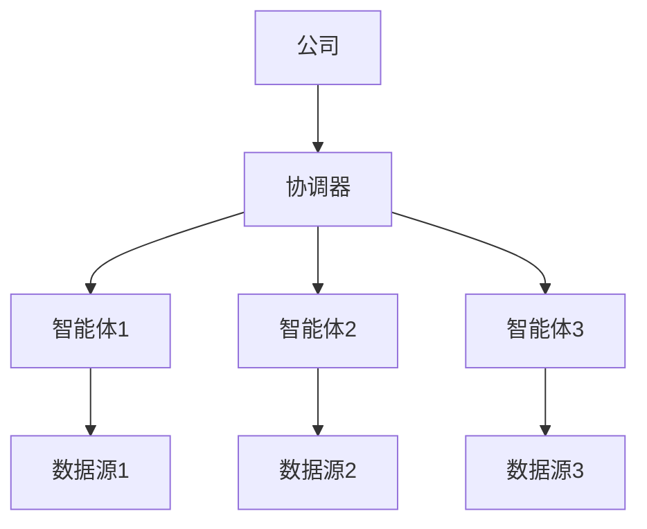
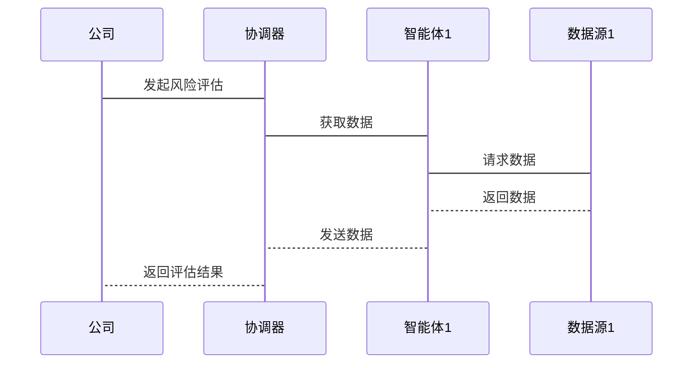

                 


# 基于多智能体的自动化公司治理风险评估

## 关键词：多智能体系统、公司治理、风险评估、自动化、分布式计算、协调机制、系统架构设计

## 摘要：本文探讨了基于多智能体的自动化公司治理风险评估方法，详细介绍了多智能体系统的核心概念、算法原理、系统架构设计及项目实战案例，分析了其在公司治理风险评估中的应用价值。

---

# 第一部分：背景介绍

## 第1章：问题背景与描述

### 1.1 问题背景

#### 1.1.1 当前公司治理面临的挑战

公司在运营过程中面临诸多风险，包括市场风险、操作风险、法律风险等。传统风险评估方法依赖人工分析，效率低下且容易出错。随着企业规模扩大，复杂性增加，传统方法难以应对多样化的风险。

#### 1.1.2 风险评估的重要性

风险评估是公司治理的关键环节，直接影响企业决策的科学性和准确性。及时识别和评估潜在风险，有助于制定有效的应对策略，避免重大损失。

#### 1.1.3 多智能体系统的优势

多智能体系统通过分布式计算和协作机制，能够高效处理复杂问题。其灵活性和可扩展性使其成为自动化公司治理风险评估的理想选择。

### 1.2 问题描述

#### 1.2.1 公司治理中的风险类型

包括市场风险、操作风险、信用风险、流动性风险等。每种风险都有其独特的评估指标和方法。

#### 1.2.2 风险评估的传统方法及其局限性

传统方法依赖人工分析，效率低，且容易受到主观因素影响。难以处理大规模和复杂的风险评估任务。

#### 1.2.3 多智能体系统在风险评估中的应用潜力

多智能体系统能够实时收集、分析数据，快速识别潜在风险，并制定应对策略。其分布式架构能够处理大规模数据，提高评估效率。

### 1.3 问题解决与边界

#### 1.3.1 多智能体系统如何解决公司治理风险评估问题

通过分布式计算和协作机制，多智能体系统能够高效处理复杂数据，提供准确的风险评估结果。

#### 1.3.2 系统的边界与外延

系统边界包括数据输入、处理和输出。外延则涉及与外部系统的接口和数据源的整合。

#### 1.3.3 核心要素与组成结构

系统由多个智能体组成，每个智能体负责特定任务，通过通信和协作完成整体目标。

---

# 第二部分：核心概念与联系

## 第2章：多智能体系统与公司治理

### 2.1 多智能体系统的核心概念

#### 2.1.1 多智能体系统的定义

多智能体系统是由多个智能体组成的分布式系统，每个智能体能够独立决策并与其他智能体协作完成任务。

#### 2.1.2 多智能体系统的属性特征对比表

| 特性 | 单智能体系统 | 多智能体系统 |
|------|--------------|--------------|
| 决策 | 中央控制     | 分布式       |
| 通信 | 无           | 有           |
| 协作 | 无           | 有           |

#### 2.1.3 实体关系图（ER图）展示


### 2.2 公司治理与风险评估

#### 2.2.1 公司治理的基本概念

公司治理涉及公司内部和外部利益相关者的权利和责任分配，确保公司有效运作和合规经营。

#### 2.2.2 风险评估的定义与分类

风险评估是对潜在风险的识别、测量和分析过程。常见的分类包括操作风险、市场风险等。

#### 2.2.3 多智能体系统在公司治理中的应用

多智能体系统可以通过实时数据采集、分析和协作，帮助公司快速识别和应对潜在风险。

### 2.3 多智能体系统与风险评估的关系

#### 2.3.1 多智能体系统如何支持风险评估

通过分布式计算和协作机制，多智能体系统能够高效处理复杂数据，提供准确的风险评估结果。

#### 2.3.2 风险评估的流程与多智能体系统的交互

风险评估的流程包括数据收集、分析、识别潜在风险和制定应对策略。多智能体系统在每个阶段提供支持。

#### 2.3.3 实体关系图（ER图）展示


---

# 第三部分：算法原理讲解

## 第3章：多智能体系统算法原理

### 3.1 分布式计算与协调机制

#### 3.1.1 分布式计算的基本原理

分布式计算将任务分解成多个部分，分配给不同的计算节点执行，通过通信和协作完成整体任务。

#### 3.1.2 协调机制的实现方法

协调机制通过消息传递、同步协议等方式，确保多个智能体协同工作，避免冲突。

#### 3.1.3 算法流程图展示



### 3.2 协作学习与自适应优化

#### 3.2.1 协作学习的基本原理

协作学习是多个智能体通过共享知识和经验，共同提高学习效果。

#### 3.2.2 自适应优化的实现方法

自适应优化通过实时反馈和调整，优化智能体的行为策略。

#### 3.2.3 算法流程图展示



### 3.3 数学模型与公式解析

#### 3.3.1 多智能体系统中的通信模型

通信模型定义了智能体之间的消息传递方式和内容。

公式：
$$
通信 = \sum_{i=1}^{n} message\_i
$$

#### 3.3.2 协作学习中的知识共享机制

知识共享机制定义了智能体如何共享知识和经验。

公式：
$$
知识共享 = \prod_{i=1}^{n} knowledge\_i
$$

---

# 第四部分：系统分析与架构设计方案

## 第4章：系统架构设计

### 4.1 问题场景介绍

公司治理风险评估需要实时数据处理和快速决策，传统的集中式系统难以满足需求。

### 4.2 项目介绍

项目目标是开发一个基于多智能体的自动化风险评估系统，实现高效的风险识别和应对。

### 4.3 系统功能设计

#### 4.3.1 领域模型设计

领域模型包括公司、部门、员工、任务、风险和评估结果等实体。



### 4.4 系统架构设计

#### 4.4.1 系统架构图



#### 4.4.2 系统交互图



### 4.5 系统接口设计

系统接口包括数据输入接口、智能体通信接口和结果输出接口。

---

# 第五部分：项目实战

## 第5章：项目实战

### 5.1 环境安装

安装Python、依赖库和开发工具，配置开发环境。

### 5.2 核心代码实现

#### 5.2.1 智能体类实现

```python
class Agent:
    def __init__(self, id):
        self.id = id
        self.data = None

    def receive_message(self, message):
        self.data = message

    def process_data(self):
        # 处理数据并返回结果
        return self.data
```

#### 5.2.2 协调器类实现

```python
class Coordinator:
    def __init__(self, agents):
        self.agents = agents

    def distribute_task(self, task):
        for agent in self.agents:
            agent.receive_message(task)

    def collect_results(self):
        results = []
        for agent in self.agents:
            results.append(agent.process_data())
        return results
```

### 5.3 代码应用解读与分析

通过具体案例分析，展示如何使用上述代码实现多智能体系统的风险评估功能。

### 5.4 实际案例分析

案例分析包括数据收集、处理和评估结果展示。

### 5.5 项目小结

总结项目实现的关键点和成功经验，为后续优化提供参考。

---

# 第六部分：最佳实践与总结

## 第6章：总结与建议

### 6.1 最佳实践 tips

- 定期更新系统，以适应新的风险类型和评估标准。
- 加强智能体之间的协作机制，提高评估效率。

### 6.2 小结

本文详细介绍了基于多智能体的自动化公司治理风险评估方法，通过理论分析和项目实战，验证了其可行性和有效性。

### 6.3 注意事项

- 确保数据安全，防止信息泄露。
- 定期进行系统维护，确保系统稳定运行。

### 6.4 拓展阅读

推荐相关书籍和论文，供读者深入研究多智能体系统在其他领域的应用。

---

# 作者：AI天才研究院 & 禅与计算机程序设计艺术

