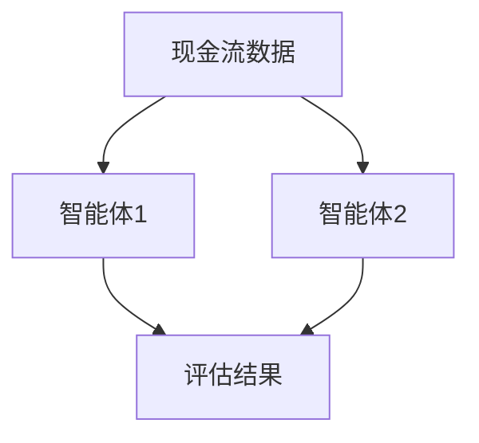
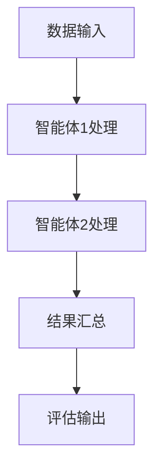
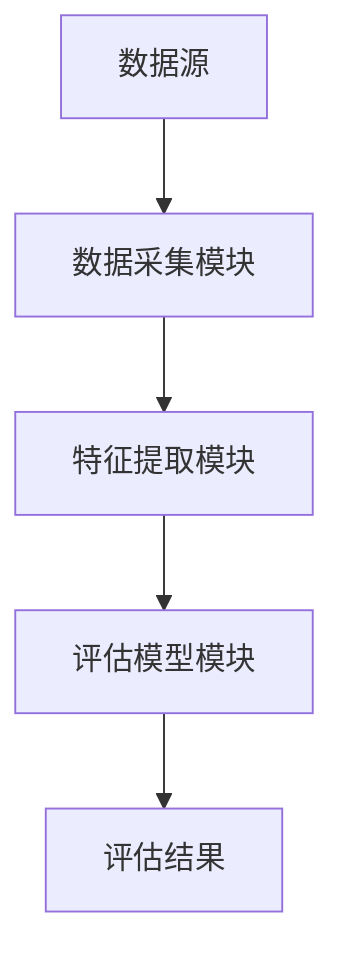
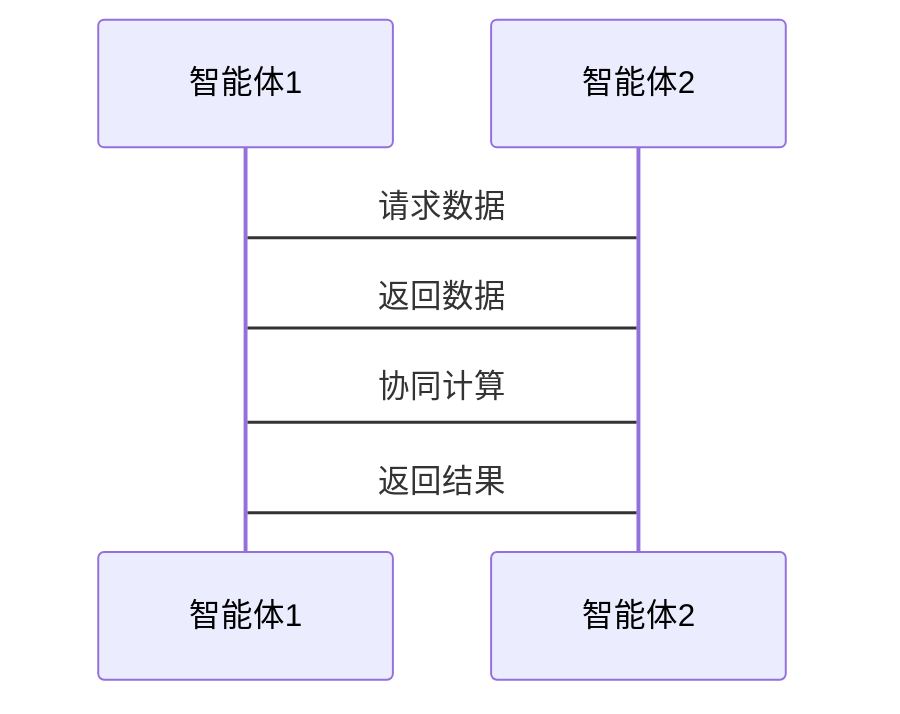

                 


# 基于多智能体的自动化公司现金流质量评估

> 关键词：多智能体系统、现金流质量评估、协同学习、分布式计算、实时监控

> 摘要：本文探讨了基于多智能体系统的公司现金流质量评估方法，结合分布式计算和协同学习，提出了一种高效的自动化评估方案，包括系统架构设计、算法实现和实际案例分析。

---

## 第一部分: 背景介绍与核心概念

### 第1章: 公司现金流质量评估的背景与意义

#### 1.1 问题背景
现金流是衡量企业财务健康的核心指标，直接关系到企业的生存与发展。传统现金流评估方法依赖人工分析，存在效率低、主观性强、难以实时监控等问题。随着企业规模扩大和业务复杂化，传统方法已难以满足需求。

#### 1.2 多智能体系统的优势
多智能体系统通过分布式计算和协作学习，能够高效处理海量数据，实时分析现金流情况，提供精准的评估结果。其优势包括：
- **高效率**：并行计算能力提升评估速度。
- **准确性**：多维度数据融合降低误判风险。
- **实时性**：支持实时监控与预警。

### 第2章: 多智能体系统的核心概念与联系

#### 2.1 多智能体系统的核心要素
- **智能体**：独立决策的实体，负责数据处理与分析。
- **交互机制**：智能体间的通信与协作方式。
- **任务分配**：智能体协同完成特定任务的策略。

#### 2.2 现金流评估的核心指标
- **现金流稳定性**：波动幅度反映企业财务风险。
- **现金流流动性**：资金周转能力。
- **现金流风险性**：潜在问题的预警能力。

#### 2.3 实体关系图


---

## 第二部分: 算法原理与数学模型

### 第3章: 多智能体协同学习算法

#### 3.1 算法概述
- **分布式计算**：任务分解与并行处理。
- **协作学习**：知识共享与模型优化。

#### 3.2 算法实现流程
1. 数据预处理：清洗、标准化与特征提取。
2. 模型训练：分布式训练与超参数优化。
3. 结果汇总：多智能体协同输出评估结果。

#### 3.3 算法流程图


#### 3.4 数学模型与公式
- 协作学习模型：
  $$ f_{\text{shared}}(x) = \sigma(w_{\text{shared}}x + b_{\text{shared}}) $$
  $$ w_{\text{unique}} = w_{\text{shared}} + \Delta w $$

---

## 第三部分: 系统分析与架构设计

### 第4章: 系统架构设计

#### 4.1 系统功能模块
- 数据采集模块：实时获取现金流数据。
- 特征提取模块：关键特征提取与处理。
- 评估模型模块：多智能体协同评估。

#### 4.2 系统架构图


#### 4.3 系统交互图


---

## 第四部分: 项目实战与最佳实践

### 第5章: 项目实战

#### 5.1 环境安装
- Python 3.8+
- 安装库：numpy、pandas、scikit-learn、flask

#### 5.2 核心代码实现
```python
import numpy as np
from sklearn import linear_model

# 智能体类
class Agent:
    def __init__(self, data):
        self.data = data
        self.model = linear_model.LinearRegression()

    def train(self):
        X = self.data[['收入', '支出']]
        y = self.data['现金流']
        self.model.fit(X, y)

    def predict(self, X):
        return self.model.predict(X)

# 多智能体协同
class MultiAgentSystem:
    def __init__(self, data):
        self.agents = [Agent(data), Agent(data)]

    def evaluate(self, X):
        results = []
        for agent in self.agents:
            agent.train()
            results.append(agent.predict(X))
        return np.mean(results, axis=0)
```

#### 5.3 实际案例分析
以某公司2022年现金流数据为例，展示系统如何协同计算并输出评估结果。

### 第6章: 最佳实践与总结

#### 6.1 小结
- 系统优势：高效、准确、实时。
- 注意事项：数据质量、模型调优、系统维护。

#### 6.2 拓展阅读
推荐相关书籍与论文，深入学习多智能体与现金流评估。

---

## 作者

作者：AI天才研究院/AI Genius Institute & 禅与计算机程序设计艺术 /Zen And The Art of Computer Programming

