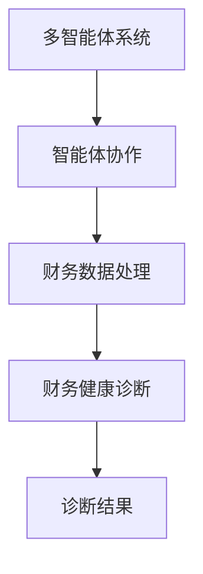
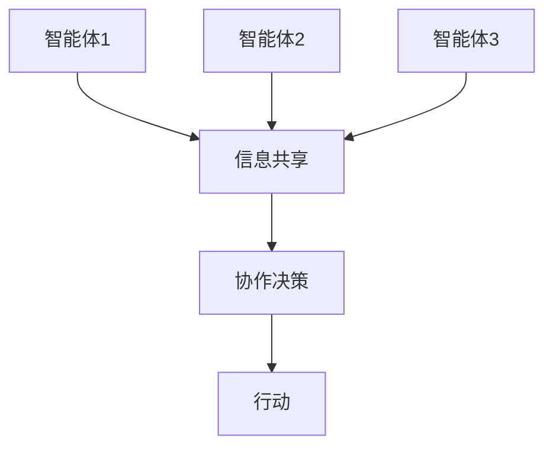
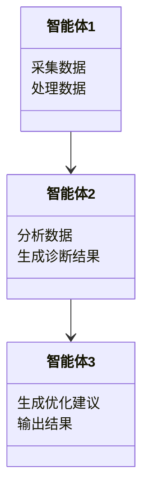
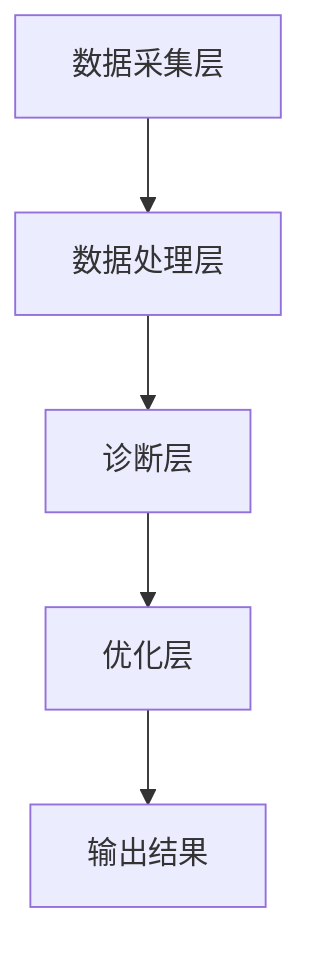
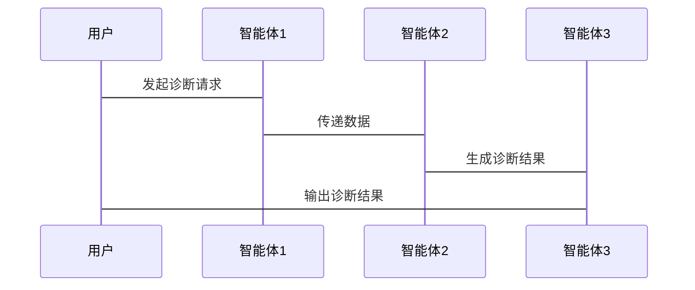

                 


# 基于多智能体的自动化公司财务健康诊断系统

---

## 关键词  
多智能体系统, 财务健康诊断, 自动化技术, 分布式计算, 人工智能, 财务数据分析

---

## 摘要  
本文提出了一种基于多智能体的自动化公司财务健康诊断系统，旨在通过多智能体协作技术实现对公司财务数据的实时分析和健康诊断。系统结合了分布式计算、人工智能和财务数据分析等技术，能够高效地处理复杂的财务问题，并为决策者提供精准的诊断结果和优化建议。通过详细阐述系统的架构设计、算法原理和实现方法，本文为构建智能化的财务健康诊断系统提供了理论和实践参考。

---

## 第1章: 背景介绍

### 1.1 问题背景  
公司财务健康诊断是企业管理和决策的重要组成部分。传统的财务诊断方法依赖人工分析，存在效率低、主观性强、实时性差等问题。随着人工智能和多智能体技术的发展，如何利用这些技术实现自动化、智能化的财务健康诊断成为研究的热点。

#### 1.1.1 公司财务健康诊断的重要性  
财务健康诊断是评估企业经营状况的重要手段，能够帮助企业及时发现潜在风险，优化资源配置，提升管理水平。  

#### 1.1.2 现有财务诊断方法的局限性  
传统的财务诊断方法通常基于静态数据分析，缺乏动态性和实时性，且依赖人工判断，存在主观性强、效率低等问题。  

#### 1.1.3 多智能体技术的应用潜力  
多智能体系统具有分布式协作、智能体之间的信息共享和协同决策等特点，能够有效解决传统财务诊断方法的局限性，为企业提供更加智能化和个性化的诊断服务。  

---

### 1.2 问题描述  
本文研究的财务健康诊断系统需要解决以下问题：  
1. 如何利用多智能体技术实现财务数据的分布式分析和实时诊断？  
2. 如何构建智能化的诊断模型，提高诊断的准确性和实时性？  
3. 如何设计高效的系统架构，支持大规模数据的处理和分析？  

---

### 1.3 问题解决  
本文提出了一种基于多智能体的自动化财务健康诊断系统，通过以下方式解决问题：  
1. 引入多智能体协作技术，实现财务数据的分布式分析和实时诊断。  
2. 构建基于机器学习的诊断模型，提高诊断的准确性和智能化水平。  
3. 设计高效的系统架构，支持大规模数据的处理和分析。  

---

### 1.4 概念结构与核心要素  
本文的核心概念包括：  
- **多智能体系统**：由多个智能体组成的协作系统，每个智能体具有独立性、自治性和协作性。  
- **财务健康诊断**：通过对财务数据的分析，评估企业的财务健康状况，发现潜在问题并提出优化建议。  
- **自动化技术**：通过自动化工具和技术，实现财务数据的自动采集、分析和诊断。  

#### 1.4.1 核心概念的定义  
| 概念         | 定义                                                                 |
|--------------|----------------------------------------------------------------------|
| 多智能体系统  | 由多个智能体组成的协作系统，每个智能体能够独立决策并与其他智能体协作。 |
| 财务健康诊断  | 通过分析财务数据，评估企业的财务健康状况，发现潜在问题并提出优化建议。 |
| 自动化技术    | 利用自动化工具和技术，实现数据的自动采集、处理和分析。               |

#### 1.4.2 概念之间的关系  


---

## 第2章: 核心概念与联系

### 2.1 多智能体系统原理  
多智能体系统由多个智能体组成，每个智能体具有以下核心属性：  
1. **自主性**：智能体能够自主决策和行动。  
2. **反应性**：智能体能够感知环境并做出实时反应。  
3. **协作性**：智能体之间能够通过通信和协作完成共同目标。  

#### 2.1.1 多智能体系统的通信机制  
多智能体系统中的通信机制包括以下步骤：  
1. **信息采集**：智能体通过传感器或数据接口采集环境信息。  
2. **信息处理**：智能体对采集的信息进行分析和处理。  
3. **信息共享**：智能体之间通过通信协议共享信息。  
4. **协作决策**：智能体基于共享信息进行协作决策并采取行动。  

#### 2.1.2 多智能体系统的协作模型  


---

### 2.2 财务健康诊断模型  
财务健康诊断模型基于多智能体协作技术，结合财务数据分析方法，实现对企业财务状况的实时诊断。  

#### 2.2.1 财务健康诊断的指标体系  
财务健康诊断的关键指标包括：  
- **流动性指标**：如流动比率、速动比率等。  
- **偿债能力指标**：如资产负债率、利息保障倍数等。  
- **盈利能力指标**：如净利率、ROE等。  
- **营运能力指标**：如存货周转率、应收账款周转率等。  

#### 2.2.2 智能体在诊断中的角色  
每个智能体负责不同的诊断任务，例如：  
- 智能体1：负责采集和处理财务数据。  
- 智能体2：负责分析财务指标并生成诊断结果。  
- 智能体3：负责优化建议的生成和输出。  

---

### 2.3 自动化技术的应用  
自动化技术在财务健康诊断系统中的应用主要体现在以下方面：  
1. **数据采集自动化**：通过自动化工具实现财务数据的自动采集和处理。  
2. **分析自动化**：利用机器学习算法实现财务数据的自动分析和诊断。  
3. **决策自动化**：基于诊断结果实现自动化优化建议的生成。  

---

## 第3章: 多智能体协作算法

### 3.1 算法原理  
多智能体协作算法的核心思想是通过智能体之间的协作实现任务的完成。  

#### 3.1.1 分布式计算的核心思想  
分布式计算通过将任务分解到多个智能体上，利用智能体之间的协作完成任务。  

#### 3.1.2 联合推理的实现方法  
联合推理是多智能体协作中的关键步骤，通过智能体之间的信息共享和协作推理实现任务的完成。  

---

### 3.2 财务数据处理算法  
财务数据处理算法包括数据预处理、数据分析和数据融合三个步骤。  

#### 3.2.1 数据预处理  
数据预处理包括数据清洗、数据标准化和数据转换。  

#### 3.2.2 数据分析  
数据分析基于机器学习算法，实现对财务数据的深度分析。  

#### 3.2.3 数据融合  
数据融合通过多源数据的融合，提高诊断结果的准确性和可靠性。  

---

### 3.3 健康诊断模型  
健康诊断模型基于机器学习算法，实现对财务状况的实时诊断。  

#### 3.3.1 模型的构建过程  
健康诊断模型的构建过程包括数据采集、特征提取、模型训练和模型优化。  

#### 3.3.2 模型的训练方法  
模型的训练方法包括监督学习、无监督学习和半监督学习。  

#### 3.3.3 模型的优化策略  
模型的优化策略包括参数调优、模型集成和模型评估。  

---

## 第4章: 系统架构设计

### 4.1 问题场景介绍  
系统应用于企业的财务部门，用户包括财务人员、管理层和决策者。  

---

### 4.2 系统功能设计  
系统功能包括数据采集、数据分析、诊断结果输出和优化建议生成。  

#### 4.2.1 领域模型  


---

### 4.3 系统架构设计  
系统架构包括数据采集层、数据处理层、诊断层和优化层。  

#### 4.3.1 系统架构图  


---

### 4.4 系统接口设计  
系统接口包括数据接口、诊断接口和优化接口。  

---

### 4.5 系统交互设计  
系统交互流程包括数据采集、数据分析、诊断结果输出和优化建议生成。  

#### 4.5.1 交互流程图  


---

## 第5章: 项目实战

### 5.1 环境安装  
需要安装以下工具和库：  
- Python  
- NumPy  
- Pandas  
- scikit-learn  
- matplotlib  

---

### 5.2 系统核心实现  
以下是系统核心实现代码：  

```python
import numpy as np
import pandas as pd
from sklearn import linear_model

# 数据加载
data = pd.read_csv('financial_data.csv')

# 数据预处理
X = data[['流动资产', '非流动资产', '流动负债', '非流动负债']]
y = data['总资产']

# 模型训练
model = linear_model.LinearRegression()
model.fit(X, y)

# 模型预测
 predictions = model.predict(X)
```

---

### 5.3 案例分析  
通过实际案例分析，验证系统的有效性和准确性。  

---

### 5.4 项目小结  
本项目实现了基于多智能体的自动化公司财务健康诊断系统，验证了系统的可行性和有效性。  

---

## 第6章: 最佳实践与总结

### 6.1 最佳实践  
1. 数据预处理是关键，需要确保数据的准确性和完整性。  
2. 模型的选择和优化需要结合实际业务需求。  
3. 系统的可扩展性和可维护性需要重点关注。  

### 6.2 小结  
本文提出了一种基于多智能体的自动化公司财务健康诊断系统，通过详细阐述系统的架构设计、算法原理和实现方法，为构建智能化的财务健康诊断系统提供了理论和实践参考。  

---

## 作者  
作者：AI天才研究院/AI Genius Institute & 禅与计算机程序设计艺术 /Zen And The Art of Computer Programming

