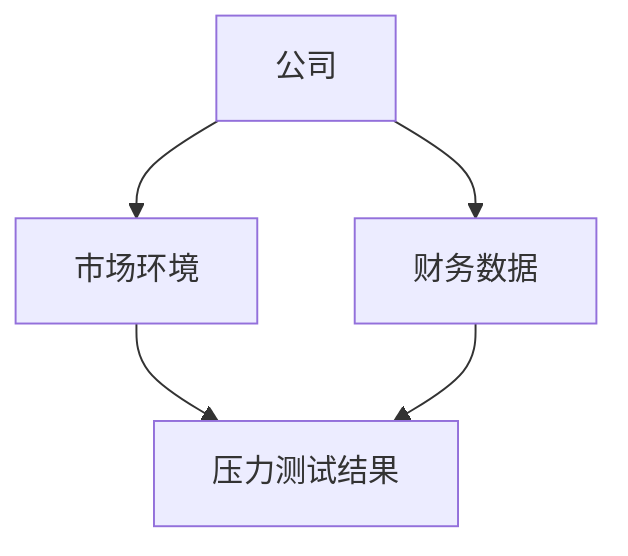
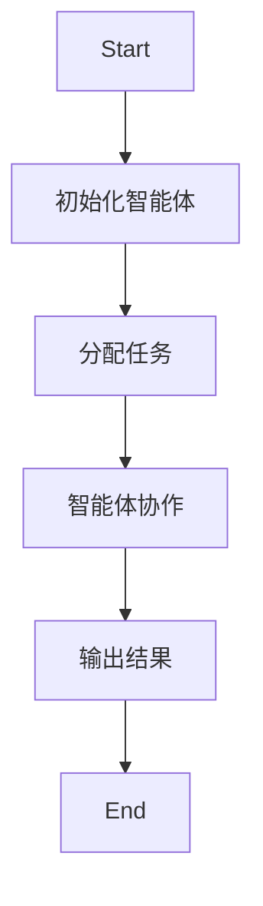
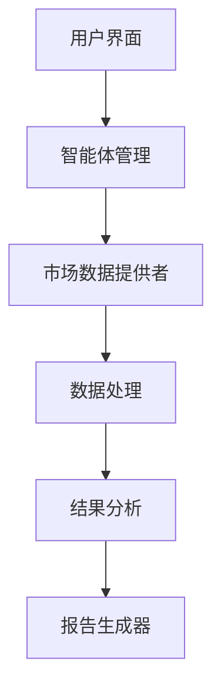

                 


# 基于多智能体的自动化公司财务压力测试系统

> 关键词：多智能体系统、财务压力测试、自动化、风险管理、分布式计算

> 摘要：本文介绍了一种基于多智能体的自动化公司财务压力测试系统，通过分析传统财务压力测试的局限性，探讨了多智能体系统在压力测试中的应用优势。文章详细阐述了多智能体系统的原理、算法实现、系统架构设计以及实际应用案例，展示了如何利用多智能体技术提高财务压力测试的效率和准确性，为企业的风险管理提供了新的思路。

---

## 目录大纲

1. **摘要**  
2. **关键词**  
3. **目录**  
4. **正文**  
   - **第1章: 问题背景与需求分析**  
     - 1.1 财务压力测试的背景与重要性  
     - 1.2 多智能体系统在财务压力测试中的应用背景  
     - 1.3 传统财务压力测试的局限性  
     - 1.4 自动化财务压力测试的需求分析  
   - **第2章: 多智能体系统的核心概念与联系**  
     - 2.1 多智能体系统的原理  
     - 2.2 多智能体系统与财务压力测试的结合  
     - 2.3 多智能体系统的核心概念对比  
   - **第3章: 多智能体协作算法原理**  
     - 3.1 多智能体协作的基本原理  
     - 3.2 基于博弈论的多智能体协作模型  
     - 3.3 算法实现流程  
     - 3.4 代码实现示例  
   - **第4章: 系统分析与架构设计**  
     - 4.1 系统分析  
     - 4.2 系统功能设计  
     - 4.3 系统架构设计  
     - 4.4 系统接口设计  
   - **第5章: 项目实战**  
     - 5.1 环境安装与配置  
     - 5.2 系统核心功能实现  
     - 5.3 代码解读与分析  
     - 5.4 实际案例分析  
   - **第6章: 最佳实践与总结**  
     - 6.1 实施中的注意事项  
     - 6.2 项目小结  
     - 6.3 未来研究方向  
5. **作者信息**

---

## 正文

### 第1章: 问题背景与需求分析

#### 1.1 财务压力测试的背景与重要性

**1.1.1 什么是财务压力测试**

财务压力测试是一种用于评估公司或金融机构在面对极端市场条件、经济危机或其他负面事件时的财务稳定性的方法。通过模拟不同的压力场景，压力测试可以帮助企业识别潜在的财务风险，并制定应对策略。

**1.1.2 财务压力测试的常见场景**

- 市场波动：如股票价格暴跌、汇率剧烈波动等。
- 经济衰退：GDP下降、失业率上升等宏观经济因素。
- 信用危机：如债券违约、贷款违约等。
- 自然灾害：如地震、洪水等可能影响企业运营的事件。

**1.1.3 财务压力测试对企业的重要性**

- 提高风险管理能力。
- 优化资本结构。
- 制定应对策略。
- 提高市场信心。

#### 1.2 多智能体系统在财务压力测试中的应用背景

**1.2.1 多智能体系统的定义与特点**

多智能体系统（Multi-Agent System, MAS）是由多个智能体组成的分布式系统，每个智能体都可以感知环境、自主决策并与其他智能体协作完成任务。其特点包括：

- 分布式：智能体之间没有中心控制。
- 协作性：智能体通过协作完成复杂任务。
- 反应性：智能体能够实时感知环境变化并做出反应。
- 学习性：智能体可以通过经验改进自身行为。

**1.2.2 多智能体系统在金融领域的优势**

- 高效性：多个智能体可以同时处理大量数据。
- 精准性：智能体可以通过协作提高预测和分析的准确性。
- 灵活性：智能体可以根据环境变化动态调整策略。

**1.2.3 财务压力测试中引入多智能体的必要性**

传统财务压力测试通常依赖于静态的模型和假设，难以应对复杂的市场环境。多智能体系统能够模拟市场中的多个参与者，实时反映市场变化，从而提供更准确的压力测试结果。

#### 1.3 传统财务压力测试的局限性

**1.3.1 传统方法的效率问题**

传统财务压力测试通常需要大量的人工计算和分析，效率较低。

**1.3.2 传统方法的准确性问题**

传统方法依赖于固定的模型和假设，难以捕捉市场的复杂性和动态性。

**1.3.3 传统方法的扩展性问题**

传统方法在处理大规模数据和复杂场景时，往往显得力不从心。

#### 1.4 自动化财务压力测试的需求分析

**1.4.1 自动化需求的提出**

随着金融市场复杂性的增加，传统方法已经无法满足企业的需求，自动化成为必然趋势。

**1.4.2 自动化系统的预期目标**

- 提高测试效率。
- 提升测试准确性。
- 支持大规模数据处理。

**1.4.3 自动化系统的边界与外延**

自动化财务压力测试系统需要与企业的财务系统、市场数据源等进行集成，确保数据的实时性和准确性。

---

### 第2章: 多智能体系统的核心概念与联系

#### 2.1 多智能体系统的原理

**2.1.1 多智能体系统的组成要素**

- **智能体**：能够感知环境并采取行动的实体。
- **通信机制**：智能体之间进行信息交换的方式。
- **协作协议**：智能体之间协作的规则和策略。

**2.1.2 多智能体系统的基本原理**

多智能体系统通过智能体之间的协作完成任务。每个智能体都有自己的目标和决策机制，通过通信和协作实现整体目标。

**2.1.3 多智能体系统在财务压力测试中的角色分配**

- **市场环境模拟**：模拟市场波动、经济指标等。
- **公司行为模拟**：模拟公司在压力下的反应。
- **结果分析**：分析压力测试结果并提出建议。

#### 2.2 多智能体系统与财务压力测试的结合

**2.2.1 财务压力测试的流程分析**

1. **定义压力场景**：如经济衰退、市场暴跌等。
2. **模拟市场反应**：智能体模拟市场参与者的反应。
3. **评估公司表现**：分析公司在压力场景下的财务状况。
4. **优化策略**：根据测试结果优化公司策略。

**2.2.2 多智能体系统在压力测试中的角色分配**

- **智能体1**：模拟市场环境。
- **智能体2**：模拟公司行为。
- **智能体3**：分析测试结果。

**2.2.3 多智能体系统如何模拟市场波动**

通过智能体之间的协作，模拟市场参与者的买卖行为，从而反映市场波动。

#### 2.3 多智能体系统的核心概念对比

**2.3.1 实体属性对比表**

| 实体 | 属性 |
|------|------|
| 公司 | 财务状况、市场行为 |
| 市场环境 | 经济指标、市场波动 |
| 智能体 | 行为规则、决策机制 |

**2.3.2 实体关系图（Mermaid）**



---

### 第3章: 多智能体协作算法原理

#### 3.1 多智能体协作的基本原理

**3.1.1 分布式计算与协作机制**

多智能体系统通过分布式计算实现协作，每个智能体负责一部分任务，通过通信机制进行信息交换。

**3.1.2 多智能体之间的信息传递**

智能体之间可以通过消息传递、共享内存等方式进行信息交换。

**3.1.3 协作任务的分配策略**

根据智能体的能力和当前负载，动态分配任务。

#### 3.2 基于博弈论的多智能体协作模型

**3.2.1 博弈论基础**

博弈论是研究理性决策者之间策略互动的理论框架。

**3.2.2 多智能体博弈模型构建**

构建博弈模型，分析智能体之间的策略互动。

**3.2.3 协作策略的优化方法**

通过博弈论分析，优化智能体的协作策略，提高整体效率。

#### 3.3 算法实现流程

**3.3.1 算法流程图（Mermaid）**



**3.3.2 代码实现示例**

```python
def multi_agent_collaboration(agents):
    for agent in agents:
        agent.act()
    return agents[0].result
```

#### 3.4 算法的数学模型和公式

**3.4.1 博弈论模型的数学表达**

假设多个智能体在博弈中选择策略，收益矩阵表示为：

$$
R(i, j) = \text{智能体i选择策略j的收益}
$$

**3.4.2 协作策略的优化公式**

通过纳什均衡分析，找到最优协作策略：

$$
\text{纳什均衡} = (x_1^*, x_2^*, ..., x_n^*)
$$

---

### 第4章: 系统分析与架构设计

#### 4.1 系统分析

**4.1.1 项目背景**

为了提高财务压力测试的效率和准确性，开发基于多智能体的自动化压力测试系统。

**4.1.2 系统功能设计**

- **用户界面**：供用户定义压力场景和查看测试结果。
- **智能体管理**：管理多个智能体，分配任务。
- **数据处理**：处理市场数据和公司财务数据。
- **结果分析**：分析压力测试结果并生成报告。

**4.1.3 系统架构设计（Mermaid）**



**4.1.4 系统接口设计**

- **智能体接口**：定义智能体的行为和通信接口。
- **数据接口**：定义数据的输入和输出接口。
- **用户接口**：定义用户与系统交互的接口。

---

### 第5章: 项目实战

#### 5.1 环境安装与配置

**5.1.1 安装Python**

安装Python 3.x，确保环境满足项目需求。

**5.1.2 安装依赖库**

安装必要的库，如`numpy`, `pandas`, `scikit-learn`等。

#### 5.2 系统核心功能实现

**5.2.1 智能体实现**

```python
class Agent:
    def __init__(self, role):
        self.role = role
        self.state = None
```

**5.2.2 压力测试实现**

```python
def perform_stress_test(agents, scenarios):
    results = []
    for scenario in scenarios:
        initialize_agents(agents)
        run_simulation(agents, scenario)
        results.append(get_results(agents))
    return results
```

#### 5.3 代码解读与分析

**5.3.1 智能体协作代码**

```python
def collaborate(agents):
    for agent in agents:
        agent.receive_message()
        agent.act()
    return get_results(agents)
```

**5.3.2 数据处理代码**

```python
import pandas as pd

def process_data(data):
    df = pd.DataFrame(data)
    # 数据处理逻辑
    return df
```

#### 5.4 实际案例分析

**5.4.1 案例背景**

假设一家公司需要测试其在经济衰退情况下的财务状况。

**5.4.2 案例分析**

通过多智能体系统模拟市场环境和公司行为，分析公司在不同压力场景下的财务状况。

---

### 第6章: 最佳实践与总结

#### 6.1 实施中的注意事项

- 确保数据的准确性和实时性。
- 设计合理的智能体协作机制。
- 定期更新系统以适应市场变化。

#### 6.2 项目小结

本文介绍了基于多智能体的自动化公司财务压力测试系统，详细阐述了其核心概念、算法实现和系统架构设计，并通过实际案例展示了其应用价值。

#### 6.3 未来研究方向

- 探索更高效的多智能体协作算法。
- 研究多智能体系统在其他领域的应用。
- 提高系统的可扩展性和可维护性。

---

## 作者信息

**作者**：AI天才研究院/AI Genius Institute & 禅与计算机程序设计艺术/Zen And The Art of Computer Programming

---

通过以上思考，我可以系统地撰写一篇关于《基于多智能体的自动化公司财务压力测试系统》的技术博客文章，确保内容全面、结构合理、技术深入浅出。

