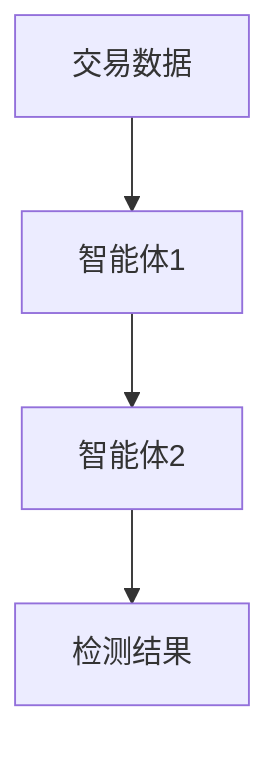
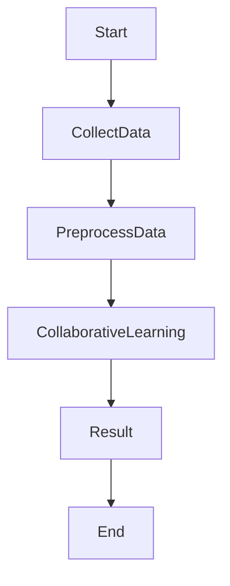
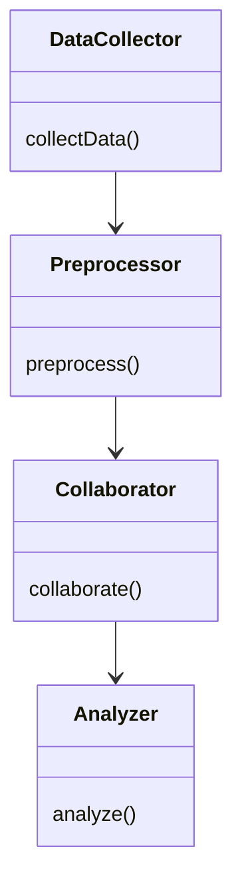

                 


```markdown
# 基于多智能体的自动化公司财务舞弊检测系统

> 关键词：多智能体系统，财务舞弊检测，协同学习，算法原理，系统架构

> 摘要：本文详细探讨了基于多智能体的自动化公司财务舞弊检测系统的构建与应用。从背景介绍到系统实现，系统地分析了多智能体在财务领域的优势，详细阐述了系统的算法原理、架构设计和项目实战，并给出了最佳实践建议，为财务舞弊检测提供了新的思路和解决方案。

---

## 第一章：背景介绍

### 1.1 财务舞弊的现状与挑战
#### 1.1.1 财务舞弊的定义与常见类型
#### 1.1.2 传统财务舞弊检测方法的局限性
#### 1.1.3 引入多智能体系统的优势

### 1.2 多智能体系统的概念与特点
#### 1.2.1 多智能体系统的定义
#### 1.2.2 多智能体系统的特征：分布式计算、协作性、自主性
#### 1.2.3 多智能体系统在财务领域的应用潜力

---

## 第二章：核心概念与联系

### 2.1 多智能体系统在财务舞弊检测中的作用
#### 2.1.1 实体关系分析
#### 2.1.2 多智能体系统的协作机制

### 2.2 实体关系分析


---

## 第三章：算法原理

### 3.1 算法概述
#### 3.1.1 分布式计算与协作学习
#### 3.1.2 联合推理算法

### 3.2 协作学习算法
#### 3.2.1 分布式数据处理
#### 3.2.2 智能体间的通信与同步

### 3.3 联合推理算法
#### 3.3.1 贝叶斯网络模型
#### 3.3.2 联合概率计算
$$P(A|B) = \frac{P(B|A)P(A)}{P(B)}$$

### 3.4 算法实现流程


---

## 第四章：系统分析与架构设计

### 4.1 系统应用场景
#### 4.1.1 财务数据实时监控
#### 4.1.2 异常交易预警
#### 4.1.3 财务报表自动审核

### 4.2 系统功能设计


### 4.3 系统架构设计
#### 4.3.1 分层架构设计
#### 4.3.2 智能体协作网络架构

---

## 第五章：项目实战

### 5.1 环境安装
#### 5.1.1 安装Python
#### 5.1.2 安装相关库（如numpy、pandas、scikit-learn）

### 5.2 核心代码实现
#### 5.2.1 数据收集模块
```python
def collect_data():
    # 数据收集逻辑
    pass
```

#### 5.2.2 数据预处理模块
```python
def preprocess(data):
    # 数据预处理逻辑
    return processed_data
```

#### 5.2.3 智能体协作模块
```python
def collaborate(processed_data):
    # 协作逻辑
    return result
```

### 5.3 实际案例分析
#### 5.3.1 案例背景
#### 5.3.2 系统应用与结果解读
#### 5.3.3 案例总结与经验分享

---

## 第六章：最佳实践与注意事项

### 6.1 最佳实践
#### 6.1.1 数据预处理的重要性
#### 6.1.2 系统维护与更新
#### 6.1.3 数据隐私与安全保护

### 6.2 注意事项
#### 6.2.1 系统性能优化
#### 6.2.2 智能体协作效率
#### 6.2.3 系统可扩展性设计

---

## 结语

通过本文的详细阐述，我们展示了基于多智能体的自动化公司财务舞弊检测系统的强大功能与实际应用价值。从算法原理到系统实现，从项目实战到最佳实践，为财务舞弊检测提供了一种高效、智能的新思路。

---

## 作者

作者：AI天才研究院/AI Genius Institute & 禅与计算机程序设计艺术 /Zen And The Art of Computer Programming
```

