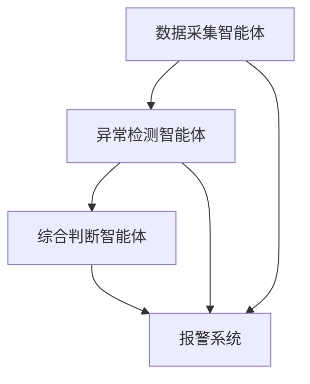

                 


# 基于多智能体的自动化公司财务造假检测系统

> **关键词**：多智能体系统，财务造假检测，自动化检测，异常检测，机器学习，强化学习

> **摘要**：本文介绍了一种基于多智能体的自动化公司财务造假检测系统。该系统利用多智能体协同技术，结合机器学习和强化学习算法，实现对公司财务数据的实时监控和异常检测。文章详细阐述了系统的背景、核心概念、算法原理、系统架构设计、项目实现及最佳实践，为读者提供了一套完整的财务造假检测解决方案。

---

## 第1章: 问题背景与目标

### 1.1 财务造假的现状与挑战

#### 1.1.1 财务造假的定义与表现形式
财务造假是指通过虚构、篡改或隐瞒财务数据，以虚增收入、虚减支出、虚增资产等方式欺骗利益相关者的行为。常见的财务造假手段包括虚构交易、虚增收入、隐瞒债务、虚减费用等。

#### 1.1.2 当前财务造假检测的主要问题
传统的财务造假检测方法主要依赖人工审查或基于规则的检测，存在以下问题：
- **效率低下**：人工审查耗时长，成本高。
- **规则有限**：基于规则的方法只能检测已知的造假模式，难以应对新型造假手段。
- **数据复杂性**：现代财务数据涉及多维度、多来源的信息，传统方法难以有效处理。

#### 1.1.3 多智能体技术在财务检测中的应用潜力
多智能体系统（Multi-Agent System, MAS）通过多个智能体的协同工作，能够有效处理复杂问题。在财务造假检测中，多智能体可以分别负责数据采集、异常检测、综合判断等任务，从而提高检测的准确性和效率。

### 1.2 多智能体系统的基本概念

#### 1.2.1 多智能体系统（MAS）的定义
多智能体系统是由多个智能体组成的分布式系统，智能体是具有感知、决策和行动能力的实体。MAS的核心在于智能体之间的协作与通信。

#### 1.2.2 多智能体系统的特征与优势
- **分布式计算**：智能体独立运行，能够并行处理任务。
- **协同合作**：智能体之间通过通信和协作完成复杂任务。
- **适应性**：智能体能够动态调整行为以应对变化。

#### 1.2.3 多智能体与传统单智能体算法的对比
- **单智能体算法**：集中式处理，计算效率高，但难以应对复杂任务。
- **多智能体算法**：分布式处理，任务分解更合理，适合复杂场景。

---

## 第2章: 多智能体系统与财务检测的核心概念

### 2.1 多智能体系统在财务检测中的角色划分

#### 2.1.1 数据采集智能体
- **职责**：收集公司财务数据，包括收入、支出、资产、负债等。
- **实现方式**：通过API接口或数据爬取工具从财务系统中获取数据。

#### 2.1.2 异常检测智能体
- **职责**：分析财务数据，识别异常模式。
- **实现方式**：基于机器学习的异常检测算法，如Isolation Forest、XGBoost等。

#### 2.1.3 综合判断智能体
- **职责**：结合多个智能体的检测结果，进行最终判断。
- **实现方式**：使用强化学习模型，根据多个异常标志综合评分。

### 2.2 财务数据特征分析

#### 2.2.1 财务报表的关键指标
- **收入与支出**：收入突然增长，支出突然下降可能是造假迹象。
- **资产与负债**：资产虚增、负债虚减可能是虚增资产的表现。

#### 2.2.2 异常交易模式的识别
- **交易频率**：异常交易往往集中在特定时间段。
- **交易金额**：金额波动较大可能是虚构交易的标志。

#### 2.2.3 多维度数据关联性分析
- **数据关联性**：通过分析收入、支出、资产等多维度数据的关联性，识别虚假交易。

### 2.3 实体关系与系统架构



---

## 第3章: 多智能体协同机制

### 3.1 多智能体之间的通信与协作

#### 3.1.1 信息传递机制
- **消息队列**：智能体之间通过消息队列进行通信。
- **数据共享**：通过共享数据库或消息中间件实现数据同步。

#### 3.1.2 协作任务分配
- **任务分解**：将复杂任务分解为多个子任务，分配给不同的智能体。
- **任务协调**：通过协调器智能体进行任务分配和状态同步。

#### 3.1.3 系统状态同步
- **状态同步**：定期同步各智能体的状态，确保系统一致性。

### 3.2 基于多智能体的决策流程

#### 3.2.1 初步异常识别
- **数据预处理**：清洗和标准化数据。
- **异常检测**：使用基于规则或机器学习的算法初步识别异常。

#### 3.2.2 多维度数据验证
- **关联分析**：分析异常数据与其他数据的关联性。
- **上下文验证**：结合业务背景验证异常的合理性。

#### 3.2.3 综合判断与结果输出
- **综合评分**：根据多个异常标志综合评分，确定最终判断结果。
- **报警输出**：根据评分结果输出报警信息。

---

## 第4章: 多智能体协同算法原理

### 4.1 分布式计算与多智能体协作

#### 4.1.1 分布式计算的基本原理
- **分布式计算**：将任务分解为多个子任务，分布在不同的节点上执行。
- **任务分配**：通过任务分配算法确定每个节点的任务。

#### 4.1.2 多智能体协作的数学模型
$$
\text{协作效率} = \frac{\sum_{i=1}^{n} \text{智能体 }i \text{ 的贡献}}{\text{总任务量}}
$$

#### 4.1.3 算法的收敛性分析
- **收敛速度**：算法在有限步内收敛。
- **稳定性**：算法在动态环境下的稳定性。

### 4.2 基于强化学习的智能体训练

#### 4.2.1 强化学习的基本概念
- **强化学习**：通过智能体与环境的交互，学习最优策略。
- **奖励机制**：根据智能体的行为给予奖励或惩罚。

#### 4.2.2 智能体在财务检测中的训练策略
- **策略优化**：通过强化学习优化异常检测策略。
- **经验回放**：通过经验回放增强学习效果。

#### 4.2.3 跨智能体协作的强化学习框架
- **多智能体强化学习**：智能体之间通过协作提高整体奖励。

---

## 第5章: 财务数据异常检测算法

### 5.1 基于规则的异常检测

#### 5.1.1 常见财务造假规则
- **收入虚增**：收入与销售量不匹配。
- **支出虚减**：支出低于行业平均水平。

#### 5.1.2 规则匹配算法实现
- **规则库**：预定义的财务造假规则。
- **规则匹配**：将财务数据与规则库进行匹配，识别异常。

#### 5.1.3 规则库的动态更新
- **规则更新**：根据新发现的财务造假手段动态更新规则库。

### 5.2 基于机器学习的异常检测

#### 5.2.1 常见机器学习算法选择
- **Isolation Forest**：用于异常值检测。
- **XGBoost**：用于分类任务。

#### 5.2.2 特征提取与降维
- **特征选择**：选择重要的财务特征。
- **降维方法**：如PCA，用于降低计算复杂度。

#### 5.2.3 模型训练与优化
- **模型训练**：使用训练数据训练异常检测模型。
- **模型优化**：通过交叉验证优化模型参数。

---

## 第6章: 系统架构与接口设计

### 6.1 系统整体架构

#### 6.1.1 分层架构设计
- **数据层**：存储原始财务数据。
- **计算层**：进行数据处理和异常检测。
- **应用层**：提供用户界面和报警功能。

#### 6.1.2 各模块功能描述
- **数据采集模块**：从财务系统中采集数据。
- **异常检测模块**：进行异常检测。
- **综合判断模块**：综合判断异常结果。

#### 6.1.3 系统可扩展性分析
- **模块化设计**：便于扩展和维护。
- **接口标准化**：便于与其他系统集成。

### 6.2 系统接口

#### 6.2.1 接口设计
- **数据接口**：与财务系统对接。
- **报警接口**：与报警系统对接。

#### 6.2.2 接口交互流程
- **数据采集**：通过数据接口获取数据。
- **异常检测**：通过计算层进行异常检测。
- **报警输出**：通过报警接口输出报警信息。

---

## 第7章: 项目实战

### 7.1 环境搭建

#### 7.1.1 环境需求
- **编程语言**：Python 3.8+
- **框架**：TensorFlow 2.0+, Scikit-learn
- **工具**：Jupyter Notebook, Git

#### 7.1.2 安装依赖
```bash
pip install numpy pandas scikit-learn tensorflow
```

### 7.2 系统核心实现

#### 7.2.1 数据采集智能体实现
```python
import requests

def fetch_financial_data(company_id):
    # 通过API获取数据
    url = f"https://api.financialdata.com/{company_id}"
    response = requests.get(url)
    return response.json()
```

#### 7.2.2 异常检测智能体实现
```python
from sklearn.ensemble import IsolationForest

def detect_anomaly(data):
    model = IsolationForest(random_state=42)
    model.fit(data)
    return model.predict(data)
```

#### 7.2.3 综合判断智能体实现
```python
def comprehensive_judgment(scores):
    # 综合评分算法
    threshold = 0.5
    result = []
    for score in scores:
        if score > threshold:
            result.append("异常")
        else:
            result.append("正常")
    return result
```

### 7.3 案例分析

#### 7.3.1 数据来源
- **数据集**：虚构的公司财务数据，包含收入、支出、资产、负债等字段。

#### 7.3.2 数据分析
```python
import pandas as pd

data = pd.read_csv("financial_data.csv")
print(data.head())
```

#### 7.3.3 异常检测结果
```python
scores = detect_anomaly(data)
print(scores)
```

---

## 第8章: 最佳实践与小结

### 8.1 最佳实践 tips
- **数据质量**：确保数据准确性和完整性。
- **模型更新**：定期更新模型，保持检测准确性。
- **系统维护**：定期检查系统运行状态，及时修复问题。

### 8.2 小结
本文介绍了一种基于多智能体的自动化公司财务造假检测系统，通过多智能体协同技术，结合机器学习和强化学习算法，实现对公司财务数据的实时监控和异常检测。该系统具有高效、准确、可扩展的特点，能够有效应对复杂的财务造假手段。

---

## 作者：AI天才研究院 & 禅与计算机程序设计艺术

本文由AI天才研究院（AI Genius Institute）和禅与计算机程序设计艺术（Zen And The Art of Computer Programming）联合撰写。

