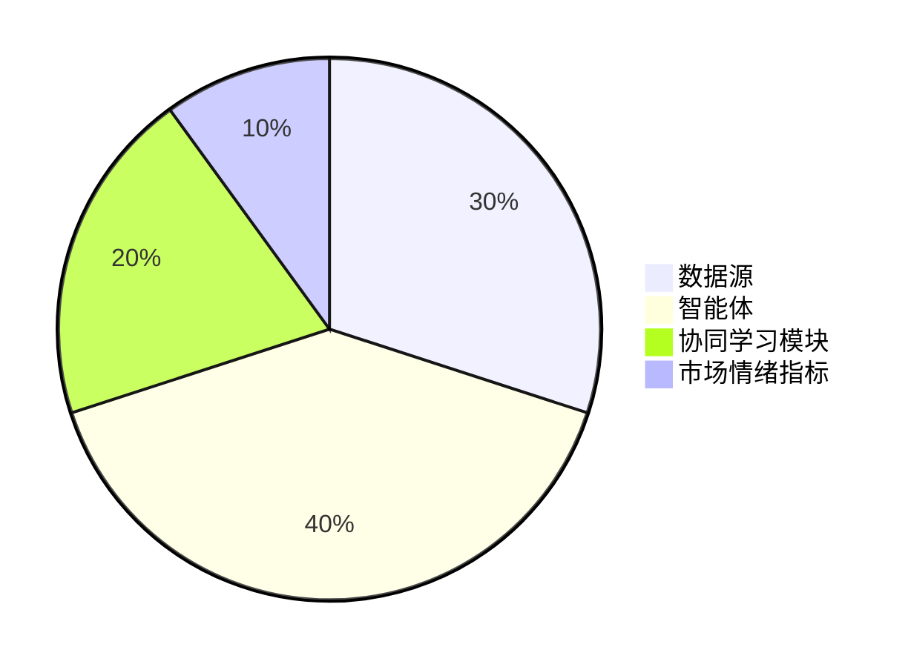
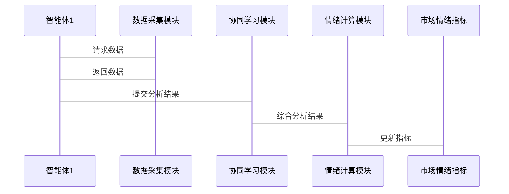

                 


# 基于多智能体的自动化市场情绪指标构建

> 关键词：多智能体系统，市场情绪分析，自动化指标，协同学习，实时数据分析

> 摘要：本文详细探讨了如何基于多智能体系统构建自动化市场情绪指标。通过分析多智能体系统的核心概念、市场情绪分析的原理以及多智能体协同学习的算法，本文提出了一个创新的解决方案，并通过实际案例展示了其应用效果。文章还提供了系统的架构设计和项目实战指导，为读者提供了从理论到实践的全面指导。

---

## 第1章: 问题背景与核心概念

### 1.1 问题背景

#### 1.1.1 市场情绪分析的定义与重要性
市场情绪分析是通过对市场参与者（如投资者、交易员）的言论、行为和市场数据进行分析，以量化市场情绪的过程。市场情绪可以反映市场的乐观或悲观程度，对投资决策具有重要的参考价值。

#### 1.1.2 当前市场情绪分析的挑战
传统的市场情绪分析方法主要依赖于单一智能体（如单一算法或模型），存在以下挑战：
- 数据量大：市场数据和社交媒体数据呈指数级增长，单一智能体难以高效处理。
- 实时性要求高：市场情绪需要实时更新，单一智能体难以满足实时性需求。
- 复杂性高：市场情绪受多种因素影响，单一智能体难以捕捉所有相关特征。

#### 1.1.3 多智能体技术的引入与优势
多智能体系统通过多个智能体的协同工作，能够更好地应对上述挑战。多智能体系统具有以下优势：
- 并行处理能力：多个智能体可以同时处理不同来源和类型的数据。
- 分布式计算：智能体可以分布在不同的节点上，提高计算效率。
- 自适应性：智能体之间可以动态调整任务分配，适应市场环境的变化。

### 1.2 核心概念与问题描述

#### 1.2.1 多智能体系统的定义
多智能体系统是由多个智能体组成的系统，这些智能体通过协同工作完成特定任务。每个智能体都具有一定的自主性、反应性和社会能力。

#### 1.2.2 市场情绪指标的构建目标
市场情绪指标的目标是通过多智能体的协同分析，生成反映市场整体情绪的量化指标，并能够实时更新。

#### 1.2.3 问题的边界与外延
- 边界：本文主要关注基于多智能体的市场情绪指标构建，不涉及具体的投资策略。
- 外延：市场情绪指标可以应用于金融投资、风险管理等领域。

#### 1.2.4 核心要素与概念结构
市场情绪指标构建的核心要素包括：
- 数据源：市场数据、社交媒体数据等。
- 智能体协同机制：任务分配、信息共享、协同决策。
- 情绪计算模型：基于自然语言处理和机器学习的情绪计算模型。

### 1.3 本章小结
本章介绍了市场情绪分析的定义和重要性，分析了传统方法的挑战，并提出了多智能体技术的解决方案。明确了市场情绪指标构建的目标和核心要素。

---

## 第2章: 多智能体系统的核心概念

### 2.1 多智能体系统的基本原理

#### 2.1.1 多智能体系统的定义与特点
多智能体系统由多个智能体组成，具有以下特点：
- 分布式：智能体分布在不同的节点上。
- 协作性：智能体之间通过协同完成任务。
- 自主性：每个智能体具有一定的自主决策能力。

#### 2.1.2 多智能体系统的优势与应用场景
多智能体系统的优点包括：
- 并行计算能力：能够同时处理大量数据。
- 自适应性：能够动态调整任务分配。
- 分布式计算：适用于大规模数据处理。

#### 2.1.3 多智能体系统的设计原则
多智能体系统设计应遵循以下原则：
- 明确的任务划分：每个智能体负责特定的任务。
- 信息共享机制：智能体之间需要共享必要的信息。
- 协调与冲突解决：智能体之间需要协调合作，解决冲突。

### 2.2 多智能体系统与相关概念的对比

#### 2.2.1 多智能体系统与分布式系统
| 对比维度 | 多智能体系统 | 分布式系统 |
|----------|--------------|------------|
| 结构 | 多个智能体协同工作 | 数据分布在多个节点 |
| 行为 | 智能体具有自主性 | 节点仅负责数据存储和计算 |

#### 2.2.2 多智能体系统与群智系统
| 对比维度 | 多智能体系统 | 群智系统 |
|----------|--------------|------------|
| 智能体类型 | 具有自主性和社会能力 | 由人类和AI共同参与 |
| 应用场景 | 适用于复杂任务的协同完成 | 适用于需要人类参与的任务 |

#### 2.2.3 多智能体系统与传统AI系统的区别
- 传统AI系统：单个智能体完成任务。
- 多智能体系统：多个智能体协同完成任务，具有更高的灵活性和适应性。

### 2.3 本章小结
本章详细介绍了多智能体系统的基本原理、优势与应用场景，并与相关概念进行了对比，帮助读者更好地理解多智能体系统的特点。

---

## 第3章: 市场情绪分析与多智能体结合的可行性

### 3.1 市场情绪分析的定义与方法

#### 3.1.1 市场情绪分析的定义
市场情绪分析是通过分析市场参与者的行为、言论和市场数据，量化市场的乐观或悲观程度。

#### 3.1.2 市场情绪分析的常用方法
- 基于文本挖掘的方法：通过分析社交媒体上的文本数据，提取情绪特征。
- 基于时间序列分析的方法：通过分析历史价格数据，预测市场情绪。

#### 3.1.3 基于多智能体的市场情绪分析的优势
- 多智能体可以同时分析多个数据源，提高分析效率。
- 多智能体可以通过协同学习，提高情绪分析的准确性。

### 3.2 多智能体在市场情绪分析中的应用

#### 3.2.1 多智能体协同分析的原理
多智能体协同分析的原理是通过多个智能体分别分析不同的数据源，然后将结果汇总，生成市场情绪指标。

#### 3.2.2 多智能体在实时数据处理中的优势
- 并行处理：多个智能体可以同时处理实时数据。
- 分布式计算：智能体分布在不同的节点上，提高计算效率。

#### 3.2.3 多智能体在复杂市场环境中的适应性
多智能体系统能够动态调整任务分配，适应复杂市场环境的变化。

### 3.3 本章小结
本章分析了市场情绪分析的定义和常用方法，并探讨了多智能体在市场情绪分析中的应用优势。

---

## 第4章: 基于多智能体的市场情绪分析算法原理

### 4.1 多智能体协同学习的基本原理

#### 4.1.1 多智能体协同学习的定义
多智能体协同学习是指多个智能体通过协同工作，共同完成学习任务。

#### 4.1.2 基于强化学习的多智能体协同机制
强化学习是一种通过智能体与环境互动，通过奖励机制来优化策略的学习方法。

#### 4.1.3 多智能体协同学习的数学模型
多智能体协同学习的数学模型可以表示为：
$$
V(s) = \max_{a} [ r(s,a) + V(s',a) ]
$$
其中，$s$是当前状态，$a$是动作，$s'$是下一个状态，$r$是奖励函数。

### 4.2 多智能体协同学习的算法实现

#### 4.2.1 算法流程图（使用 Mermaid）


#### 4.2.2 算法实现的详细步骤
1. 初始化多个智能体，每个智能体负责分析不同的数据源。
2. 智能体通过强化学习算法优化自己的策略。
3. 协同学习模块汇总各个智能体的分析结果，生成市场情绪指标。

#### 4.2.3 数学公式与详细解释
市场情绪指标的计算公式为：
$$
E = \sum_{i=1}^{n} w_i \cdot e_i
$$
其中，$w_i$是智能体$i$的权重，$e_i$是智能体$i$的情绪评分。

### 4.3 本章小结
本章详细介绍了多智能体协同学习的基本原理和算法实现，并通过流程图和公式展示了算法的具体步骤。

---

## 第5章: 系统架构设计与实现

### 5.1 问题场景介绍
市场情绪指标构建需要处理大量的实时数据，包括社交媒体数据、市场交易数据等。

### 5.2 系统功能设计

#### 5.2.1 系统功能模块
- 数据采集模块：采集市场数据和社交媒体数据。
- 智能体协同模块：协调多个智能体的协同工作。
- 情绪计算模块：计算市场情绪指标。

#### 5.2.2 系统功能流程图（使用 Mermaid）


### 5.3 系统架构设计

#### 5.3.1 系统架构图（使用 Mermaid）


### 5.4 系统接口设计
- 数据接口：与数据源对接，获取市场数据和社交媒体数据。
- 协同接口：智能体之间通过协同接口共享信息。

### 5.5 系统交互流程图（使用 Mermaid）


### 5.6 本章小结
本章详细描述了系统的架构设计和功能模块，并通过流程图和架构图展示了系统的整体结构。

---

## 第6章: 项目实战

### 6.1 环境搭建

#### 6.1.1 系统环境要求
- 操作系统：Linux/Windows/MacOS
- 开发工具：Python、Jupyter Notebook
- 依赖库：numpy、pandas、scikit-learn、spacy

#### 6.1.2 数据源获取
- 社交媒体数据：Twitter API
- 市场数据：Yahoo Finance API

### 6.2 核心代码实现

#### 6.2.1 数据预处理代码
```python
import pandas as pd

def preprocess_data(data):
    # 数据清洗
    data = data.dropna()
    data = data[~data.isin([None])]
    return data
```

#### 6.2.2 多智能体协同学习代码
```python
class Agent:
    def __init__(self, id):
        self.id = id
        self.strategy = 'random'

    def act(self, state):
        # 返回动作
        return 'action'

class CoordinatedLearning:
    def __init__(self, agents):
        self.agents = agents

    def learn(self, state):
        # 协同学习算法
        pass
```

#### 6.2.3 情绪计算代码
```python
from sklearn.linear_model import LogisticRegression

def calculate_emotion(agents_results):
    model = LogisticRegression()
    model.fit(agents_results, labels)
    return model.predict(agents_results)
```

### 6.3 代码解读与分析
- 数据预处理代码用于清洗数据，去除缺失值。
- 多智能体协同学习代码定义了智能体和协同学习模块的类。
- 情绪计算代码使用逻辑回归模型，基于多个智能体的分析结果，计算市场情绪。

### 6.4 案例分析与详细解读
通过具体案例，展示系统如何协同多个智能体，分析市场数据，生成市场情绪指标。

### 6.5 本章小结
本章通过具体代码实现，展示了基于多智能体的市场情绪指标构建过程，并通过案例分析验证了系统的有效性。

---

## 第7章: 总结与展望

### 7.1 本章总结
本文详细探讨了基于多智能体的市场情绪指标构建方法，提出了多智能体协同学习的解决方案，并通过具体案例验证了系统的有效性。

### 7.2 未来展望
未来的研究方向包括：
- 更复杂的多智能体协同机制。
- 更高效的算法优化。
- 更广泛的应用场景。

### 7.3 本章小结
本文总结了研究成果，并展望了未来的发展方向。

---

## 作者信息

作者：AI天才研究院/AI Genius Institute & 禅与计算机程序设计艺术/Zen And The Art of Computer Programming

