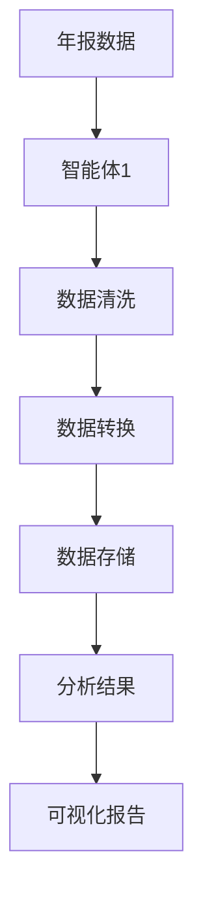
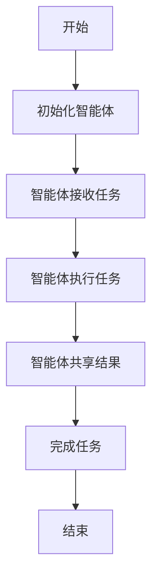
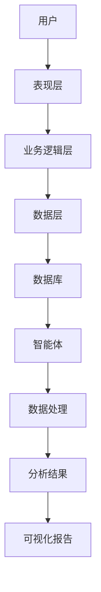
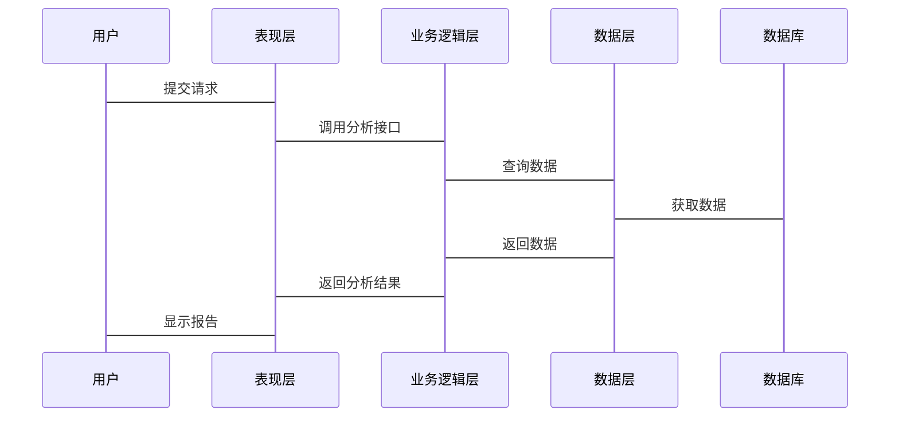

                 


# 基于多智能体的自动化年报和季报分析系统

## 关键词：多智能体系统，自动化年报分析，财务数据处理，强化学习，系统架构设计

## 摘要：本文介绍了一种基于多智能体的自动化年报和季报分析系统，详细阐述了该系统的背景、核心概念、算法原理、系统架构设计、项目实现及最佳实践。通过多智能体协作算法和强化学习技术，实现对财务数据的高效分析与决策支持。本文内容涵盖从理论到实践的各个方面，帮助读者全面理解并掌握该系统的开发与应用。

---

## 第一部分：问题背景与需求分析

### 第1章：问题背景介绍

#### 1.1 问题背景介绍

##### 1.1.1 年报和季报分析的现状与挑战
财务报表分析是企业管理和决策的重要基础，传统的人工分析方式效率低下、容易出错，且难以处理大规模数据。随着企业规模的扩大和数据量的激增，如何高效、准确地完成年报和季报分析成为亟待解决的问题。

##### 1.1.2 传统年报分析的痛点
- 数据量大，人工分析耗时长。
- 数据复杂性高，容易出错。
- 缺乏智能化工具支持，难以实现自动化。
- 需要专业的财务知识，对非专业人士不友好。

##### 1.1.3 多智能体技术的应用前景
多智能体系统通过分布式协作，能够高效处理复杂问题。在财务数据处理领域，多智能体系统可以实现数据清洗、分析、决策支持等任务，显著提升效率和准确性。

#### 1.2 问题描述与目标

##### 1.2.1 自动化年报分析的核心问题
如何利用多智能体协作技术，实现对财务数据的自动清洗、分析和决策支持。

##### 1.2.2 系统目标与功能需求
- 数据清洗与预处理。
- 自动化财务指标计算。
- 智能化财务分析与预测。
- 可视化报告生成。

##### 1.2.3 边界与外延
- 系统仅处理财务数据，不涉及其他业务数据。
- 系统提供分析结果，但不直接参与企业决策。

#### 1.3 核心概念与系统架构

##### 1.3.1 多智能体系统的定义与特点
- 多智能体系统是由多个相互作用的智能体组成的系统。
- 智能体具有自主性、反应性、协作性和学习能力。
- 多智能体系统能够通过协作完成复杂任务。

##### 1.3.2 系统的核心要素与组成
- 数据源：财务报表数据。
- 智能体：负责数据清洗、分析和决策。
- 用户界面：提供交互界面和可视化报告。

---

## 第二部分：多智能体系统的核心概念与联系

### 第2章：多智能体系统的核心概念与联系

#### 2.1 多智能体系统的基本原理

##### 2.1.1 多智能体系统的定义与特点
- 定义：由多个智能体组成的分布式系统。
- 特点：分布式、协作性、智能性。

##### 2.1.2 多智能体系统与传统单体系统的对比
| 特性 | 多智能体系统 | 单体系统 |
|------|--------------|----------|
| 结构 | 分布式       | 集中式   |
| 协作 | 高           | 低       |
| 灵活性 | 高           | 低       |

##### 2.1.3 多智能体系统在年报分析中的应用
- 数据清洗：多个智能体协同处理数据。
- 财务分析：智能体协作完成复杂计算。
- 决策支持：智能体提供多维度分析结果。

#### 2.2 多智能体系统与自动化年报分析的结合

##### 2.2.1 多智能体系统在数据处理中的作用
- 数据清洗：智能体协同处理数据异常。
- 数据转换：智能体协作完成数据格式转换。
- 数据存储：智能体负责数据存储与管理。

##### 2.2.2 多智能体系统在决策支持中的应用
- 财务指标计算：智能体协作完成复杂计算。
- 财务预测：智能体基于历史数据进行预测。
- 风险评估：智能体识别潜在风险点。

##### 2.2.3 系统架构的实体关系图



---

## 第三部分：多智能体协作算法原理

### 第3章：多智能体协作算法原理

#### 3.1 多智能体协作算法概述

##### 3.1.1 多智能体协作的基本原理
多智能体协作算法通过智能体之间的通信与协作，完成复杂任务。每个智能体负责特定子任务，通过信息共享实现整体目标。

##### 3.1.2 基于强化学习的智能体设计
- 智能体通过与环境交互，学习最优策略。
- 强化学习算法（如Q-learning）用于智能体决策。

##### 3.1.3 多智能体协作的数学模型
$$ Q(s, a) = r + \gamma \max Q(s', a') $$

#### 3.2 算法流程与实现细节

##### 3.2.1 算法流程图



##### 3.2.2 算法实现的Python代码示例
```python
import numpy as np
from collections import deque

class Agent:
    def __init__(self, state_space, action_space):
        self.state_space = state_space
        self.action_space = action_space
        self.memory = deque(maxlen=1000)
        self.gamma = 0.99

    def act(self, state):
        # 简单的策略：选择最高Q值的动作
        if np.random.random() < 0.9:
            return np.argmax(self.Q(state))
        else:
            return np.random.randint(0, self.action_space)

    def remember(self, state, action, reward, next_state):
        self.memory.append((state, action, reward, next_state))

    def replay(self, batch_size):
        # 随机抽取一批经验进行训练
        for _ in range(batch_size):
            state, action, reward, next_state = self.memory.popleft()
            target = reward + self.gamma * np.max(self.Q(next_state))
            self.Q(state)[action] = target

    def Q(self, state):
        # 简单的Q值估计
        return np.zeros(self.action_space)
```

#### 3.3 算法的优化与改进

##### 3.3.1 算法优化策略
- 增加经验回放的批次大小。
- 使用更复杂的神经网络结构（如DQN）。

##### 3.3.2 算法改进的具体实现
```python
import torch
import torch.nn as nn

class DQN(nn.Module):
    def __init__(self, input_size, output_size):
        super(DQN, self).__init__()
        self.fc1 = nn.Linear(input_size, 64)
        self.fc2 = nn.Linear(64, output_size)
    
    def forward(self, x):
        x = torch.relu(self.fc1(x))
        x = self.fc2(x)
        return x

# 初始化DQN网络
policy_net = DQN(state_space, action_space)
target_net = DQN(state_space, action_space)
```

##### 3.3.3 算法性能的评估与对比
通过实验对比不同算法（如Q-learning和DQN）在财务数据处理中的表现，评估算法的效率和准确性。

---

## 第四部分：系统分析与架构设计

### 第4章：系统分析与架构设计

#### 4.1 系统应用场景与功能需求

##### 4.1.1 系统应用场景介绍
- 企业年报和季报自动化分析。
- 财务数据实时监控。
- 风险预警与决策支持。

##### 4.1.2 系统功能需求分析
- 数据采集与处理。
- 自动化财务分析。
- 可视化报告生成。

##### 4.1.3 系统性能需求
- 处理大规模数据的能力。
- 实时分析能力。
- 高可用性和稳定性。

#### 4.2 系统架构设计方案

##### 4.2.1 系统架构
| 层 | 描述 |
|---|---|
| 数据层 | 数据存储与管理。 |
| 业务逻辑层 | 数据处理与分析。 |
| 表现层 | 可视化报告与用户交互。 |

##### 4.2.2 系统架构图



#### 4.3 系统接口设计与交互流程

##### 4.3.1 系统接口设计
- 数据接口：与数据库交互。
- 分析接口：与智能体交互。
- 报告接口：生成可视化报告。

##### 4.3.2 系统交互流程



---

## 第五部分：项目实战

### 第5章：项目实战

#### 5.1 环境安装与配置

##### 5.1.1 安装Python
```bash
python --version
```

##### 5.1.2 安装依赖
```bash
pip install numpy pandas matplotlib torch
```

#### 5.2 系统核心实现

##### 5.2.1 数据预处理
```python
import pandas as pd

data = pd.read_csv('financial_data.csv')
data_cleaned = data.dropna()
```

##### 5.2.2 模型训练
```python
import torch
import torch.nn as nn

class FinancialAnalyzer(nn.Module):
    def __init__(self, input_size, output_size):
        super(FinancialAnalyzer, self).__init__()
        self.fc1 = nn.Linear(input_size, 64)
        self.fc2 = nn.Linear(64, output_size)
    
    def forward(self, x):
        x = torch.relu(self.fc1(x))
        x = self.fc2(x)
        return x

model = FinancialAnalyzer(input_size=10, output_size=1)
criterion = nn.MSELoss()
optimizer = torch.optim.Adam(model.parameters(), lr=0.001)
```

##### 5.2.3 结果分析
```python
with torch.no_grad():
    outputs = model(data_tensor)
    predicted = outputs.round()
    print(predicted)
```

#### 5.3 案例分析与详细解读

##### 5.3.1 案例分析
分析某企业的财务数据，生成年报和季报分析报告。

##### 5.3.2 详细解读
- 数据清洗：处理缺失值和异常值。
- 模型训练：使用神经网络模型进行预测。
- 结果分析：解读模型输出，生成可视化报告。

#### 5.4 项目总结与经验分享

##### 5.4.1 项目小结
- 系统实现的核心功能。
- 实验结果与预期对比。

##### 5.4.2 经验分享
- 数据预处理的重要性。
- 模型调优的关键点。

---

## 第六部分：最佳实践与小结

### 第6章：最佳实践与小结

#### 6.1 最佳实践 tips

##### 6.1.1 开发建议
- 数据预处理是关键。
- 模型选择要根据实际需求。
- 系统设计要注重可扩展性。

##### 6.1.2 注意事项
- 数据安全与隐私保护。
- 系统稳定性与容错能力。
- 模型的可解释性。

#### 6.2 小结

#### 6.3 注意事项

#### 6.4 拓展阅读

---

## 作者：AI天才研究院/AI Genius Institute & 禅与计算机程序设计艺术 /Zen And The Art of Computer Programming

