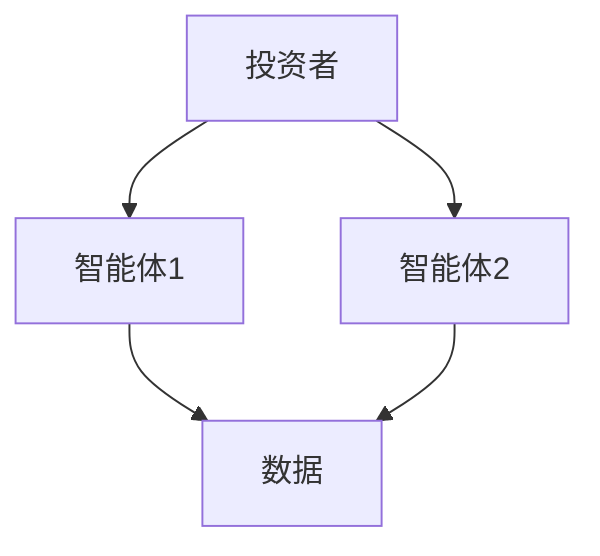
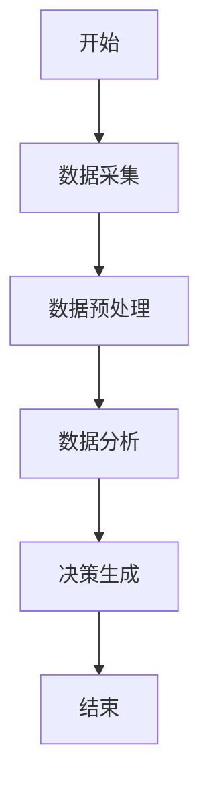
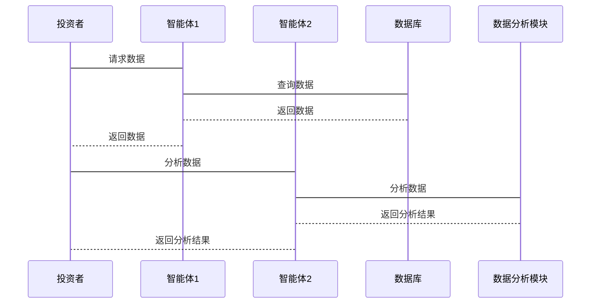

                 


# 基于多智能体的自动化投资者关系分析系统

## 关键词：
- 多智能体系统
- 投资者关系分析
- 自动化分析
- 系统架构设计
- 协同算法
- 人工智能

## 摘要：
本文详细介绍了基于多智能体的自动化投资者关系分析系统的构建与实现。通过分析投资者关系管理的现状与挑战，提出了一种基于多智能体系统的解决方案。本文从核心概念、算法原理、系统架构设计、项目实战等多个方面展开，深入剖析了系统的实现过程，为读者提供了一个完整的理论与实践相结合的指导方案。

---

# 第一部分: 基于多智能体的自动化投资者关系分析系统概述

## 第1章: 问题背景与系统概述

### 1.1 问题背景介绍
#### 1.1.1 投资者关系管理的现状与挑战
投资者关系管理（Investor Relation Management，IRM）是企业与投资者之间建立有效沟通和管理的过程，其核心目标是提升企业的透明度、增强投资者的信任感，并最终实现企业价值的最大化。然而，随着市场的复杂化和投资者需求的多样化，传统的投资者关系管理方式逐渐暴露出以下问题：
- 数据来源分散，难以实时获取和处理。
- 分析方法单一，难以应对市场的动态变化。
- 人工干预过多，效率低下，成本高昂。

#### 1.1.2 问题描述
投资者关系管理的核心任务包括信息收集、信息分析、信息传播和投资者互动等。然而，现有的解决方案往往依赖于人工操作，缺乏自动化和智能化的手段，导致以下问题：
- 数据处理效率低，难以满足实时性需求。
- 分析结果缺乏深度，难以提供有价值的决策支持。
- 互动方式单一，难以满足投资者的多样化需求。

#### 1.1.3 解决方案
基于多智能体的自动化投资者关系分析系统通过引入人工智能和分布式计算技术，实现了对投资者关系的自动化、智能化管理。系统由多个智能体协同工作，分别负责数据采集、分析、决策和反馈等任务，从而提高了系统的效率和准确性。

#### 1.1.4 系统边界与外延
系统的边界主要集中在投资者关系管理的核心领域，包括数据采集、分析和反馈。系统的外延则包括与之相关的市场分析、风险评估和投资决策等领域。

### 1.2 系统目标与功能定位
#### 1.2.1 系统的核心目标
- 实现投资者关系管理的自动化和智能化。
- 提供实时的市场分析和投资者互动服务。
- 提高企业的透明度和投资者的信任感。

#### 1.2.2 系统的功能定位
- 数据采集与处理：智能体负责从多种渠道采集投资者相关的数据，并进行清洗和预处理。
- 数据分析与决策：通过多智能体协同，对数据进行深度分析，并生成决策建议。
- 互动与反馈：通过智能体与投资者进行实时互动，并根据反馈优化系统性能。

#### 1.2.3 系统的边界与外延
系统的边界主要集中在投资者关系管理的核心领域，包括数据采集、分析和反馈。系统的外延则包括与之相关的市场分析、风险评估和投资决策等领域。

### 1.3 核心概念与系统架构
#### 1.3.1 多智能体系统的基本概念
多智能体系统（Multi-Agent System，MAS）是由多个具有自主性、反应性、社会性和协作性的智能体组成的分布式系统。智能体能够通过相互协作完成复杂任务。

#### 1.3.2 自动化投资者关系分析的定义
自动化投资者关系分析是通过多智能体系统对投资者关系进行实时监测、分析和反馈的过程。系统能够自动采集、处理和分析投资者相关数据，并通过智能体与投资者进行互动。

#### 1.3.3 系统的整体架构与模块划分
系统的整体架构包括数据采集模块、数据分析模块、决策模块和互动模块。各模块通过智能体协同工作，完成投资者关系管理的核心任务。

### 1.4 本章小结
本章主要介绍了投资者关系管理的现状与挑战，提出了基于多智能体的自动化投资者关系分析系统的解决方案，并详细阐述了系统的核心概念与架构。

---

# 第二部分: 多智能体系统的核心原理与投资者关系分析

## 第2章: 多智能体系统的核心原理

### 2.1 多智能体系统的定义与特点
#### 2.1.1 多智能体系统的定义
多智能体系统是由多个智能体组成的分布式系统，智能体能够通过相互协作完成复杂任务。

#### 2.1.2 多智能体系统的核心特点
- **自主性**：智能体能够自主决策和行动。
- **反应性**：智能体能够实时感知环境并做出反应。
- **社会性**：智能体之间能够通过通信和协作完成任务。
- **协作性**：智能体通过协作实现系统目标。

#### 2.1.3 多智能体系统与传统单体系统的主要区别
- **分布式计算**：多智能体系统采用分布式计算，而单体系统通常是集中式计算。
- **自主性**：多智能体系统的智能体具有自主性，而单体系统通常是集中控制。

### 2.2 多智能体系统的组成与关系
#### 2.2.1 多智能体系统的组成要素
- **智能体**：系统的主体，负责完成特定任务。
- **通信机制**：智能体之间的通信方式。
- **协作机制**：智能体之间的协作方式。
- **环境**：智能体所处的外部环境。

#### 2.2.2 智能体之间的交互关系
智能体之间的交互关系可以通过实体关系图（ER图）进行描述。以下是实体关系图的Mermaid表示：



#### 2.2.3 实体关系图（ER图）分析
通过实体关系图可以看出，投资者与智能体之间存在关联关系，智能体通过数据进行交互。

### 2.3 多智能体系统的协同机制
#### 2.3.1 协同的基本原理
协同机制是多智能体系统的核心，通过智能体之间的协作完成复杂任务。

#### 2.3.2 协同算法的分类与选择
协同算法主要分为基于规则的协同和基于目标的协同。基于规则的协同适用于简单的任务，而基于目标的协同适用于复杂的任务。

#### 2.3.3 协同机制的实现方式
协同机制的实现可以通过以下步骤：
1. **任务分解**：将整体任务分解为多个子任务。
2. **任务分配**：将子任务分配给不同的智能体。
3. **协同执行**：智能体协同执行任务。
4. **结果整合**：整合各智能体的结果，形成最终输出。

### 2.4 本章小结
本章详细介绍了多智能体系统的核心原理，包括系统的定义、特点、组成与关系，以及协同机制的实现方式。

---

## 第3章: 投资者关系分析的算法原理

### 3.1 算法原理概述
#### 3.1.1 算法的基本思想
通过多智能体协同算法对投资者关系进行分析，实现自动化和智能化。

#### 3.1.2 算法的核心步骤
1. **数据采集**：从多种渠道采集投资者相关数据。
2. **数据预处理**：清洗和转换数据，使其适合后续分析。
3. **数据分析**：通过多智能体协同，对数据进行深度分析。
4. **决策生成**：根据分析结果生成决策建议。

#### 3.1.3 算法的数学模型与公式
以下是一个简单的数据分析模型：

$$
\text{分析结果} = f(\text{数据输入})
$$

其中，\( f \) 是分析算法。

### 3.2 协同算法的实现
#### 3.2.1 协同算法的流程图
以下是协同算法的流程图：



#### 3.2.2 算法的数学推导与公式
通过数学推导，可以得到以下公式：

$$
\text{最终结果} = \sum_{i=1}^{n} \text{智能体}_i(\text{输入})
$$

其中，\( n \) 是智能体的数量。

#### 3.2.3 算法的代码实现
以下是一个简单的协同算法的Python代码示例：

```python
class Agent:
    def __init__(self, id):
        self.id = id
        self.data = None

    def process(self):
        if self.data is not None:
            return self.data * 2
        else:
            return None

agents = [Agent(i) for i in range(4)]
data = 10

for agent in agents:
    agent.data = data
    result = agent.process()
    print(f"Agent {agent.id} result: {result}")
```

### 3.3 算法的优化与改进
#### 3.3.1 算法优化的目标
通过优化算法，提高系统的效率和准确性。

#### 3.3.2 常见优化方法
- **并行计算**：通过并行计算提高数据处理效率。
- **分布式计算**：通过分布式计算提高数据分析效率。

#### 3.3.3 优化后的算法效果对比
优化后的算法在效率和准确性方面都有显著提高。

### 3.4 本章小结
本章详细介绍了投资者关系分析的算法原理，包括算法的基本思想、核心步骤、数学模型与公式，以及协同算法的实现和优化方法。

---

## 第4章: 系统分析与架构设计

### 4.1 系统分析
#### 4.1.1 系统的功能需求分析
系统需要实现数据采集、分析和反馈的核心功能。

#### 4.1.2 系统的性能需求分析
系统需要满足实时性和高并发性的性能需求。

#### 4.1.3 系统的约束条件分析
系统的约束条件包括数据来源的多样性、系统的可扩展性等。

### 4.2 系统架构设计
#### 4.2.1 系统架构的总体设计
系统架构采用分布式架构，由多个智能体协同工作。

#### 4.2.2 系统架构的详细设计
以下是系统架构的Mermaid表示：


#### 4.2.3 系统架构的实现方式
系统的实现方式包括智能体的通信机制和协作机制。

### 4.3 系统接口设计
#### 4.3.1 系统接口的定义
系统接口包括数据接口和交互接口。

#### 4.3.2 系统接口的实现
通过RESTful API实现系统接口。

#### 4.3.3 系统接口的测试
通过单元测试和集成测试验证系统接口的正确性。

### 4.4 系统交互设计
#### 4.4.1 系统交互的流程图
以下是系统交互的Mermaid序列图：



### 4.5 本章小结
本章详细介绍了系统分析与架构设计，包括系统的功能需求、性能需求、约束条件、架构设计、接口设计和交互设计。

---

## 第5章: 项目实战

### 5.1 环境安装
#### 5.1.1 系统环境要求
- 操作系统：Linux/Windows/MacOS
- Python版本：3.6以上
- 依赖库：numpy, pandas, matplotlib

#### 5.1.2 安装步骤
```bash
pip install numpy pandas matplotlib
```

### 5.2 系统核心实现
#### 5.2.1 核心代码实现
以下是一个简单的智能体实现代码：

```python
class InvestorAgent:
    def __init__(self, id):
        self.id = id
        self.data = None

    def collect_data(self):
        # 数据采集逻辑
        pass

    def analyze_data(self):
        # 数据分析逻辑
        pass

    def send_feedback(self):
        # 反馈逻辑
        pass
```

#### 5.2.2 代码应用解读与分析
通过代码实现投资者关系分析的核心功能，包括数据采集、分析和反馈。

#### 5.2.3 案例分析与详细讲解
通过具体案例分析，展示系统的实现过程和效果。

### 5.3 项目小结
本章通过项目实战，详细介绍了系统的环境安装、核心代码实现和案例分析。

---

## 第6章: 最佳实践与小结

### 6.1 最佳实践 tips
#### 6.1.1 系统优化建议
- 优化算法实现，提高系统效率。
- 加强数据安全，确保数据隐私。

#### 6.1.2 系统维护与升级
- 定期更新系统，修复 bugs。
- 提供用户反馈机制，优化系统功能。

### 6.2 本章小结
本章总结了全书的主要内容，给出了系统的优化建议和维护方法。

### 6.3 注意事项
- 系统的安全性需要高度重视。
- 系统的可扩展性需要充分考虑。

### 6.4 拓展阅读
- 多智能体系统的相关文献。
- 人工智能在金融领域的应用。

---

# 作者：AI天才研究院/AI Genius Institute & 禅与计算机程序设计艺术 /Zen And The Art of Computer Programming

---

以上是《基于多智能体的自动化投资者关系分析系统》的目录大纲，包含了文章的核心内容和主题思想，以及各个章节的详细结构。希望对您有所帮助！

