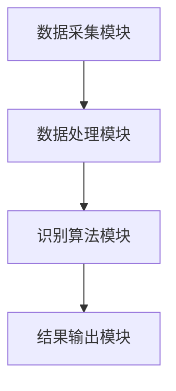
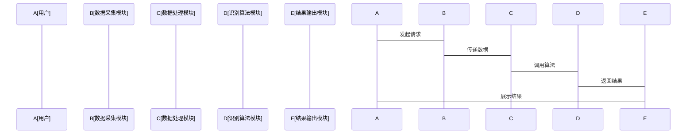

                 


# 基于多智能体的自动化行业领导者识别

> 关键词：多智能体系统、行业领导者识别、自动化、协作算法、系统架构、数学模型

> 摘要：本文深入探讨了基于多智能体的自动化行业领导者识别方法，从多智能体系统的背景与概念出发，分析了行业领导者识别的核心算法与系统架构，结合实际案例，详细讲解了如何通过多智能体系统的协作算法实现行业领导者的自动识别。文章从理论到实践，结合数学模型和系统架构图，全面阐述了该领域的技术细节与实现方案。

---

# 第一部分: 多智能体系统与行业领导者识别概述

## 第1章: 多智能体系统的核心概念与背景介绍

### 1.1 多智能体系统的基本概念

#### 1.1.1 多智能体系统的定义
多智能体系统（Multi-Agent System, MAS）是由多个智能体（Agent）组成的分布式系统，这些智能体通过通信和协作完成复杂任务。智能体是具有感知、决策和执行能力的实体，可以是软件程序或物理设备。

#### 1.1.2 多智能体系统的特征
- **自主性**：智能体能够自主决策。
- **反应性**：智能体能实时感知环境并做出反应。
- **协作性**：多个智能体之间可以协作完成任务。
- **分布式性**：系统中的智能体分布在网络中，不依赖于中心节点。

#### 1.1.3 多智能体系统的应用场景
- 智能交通管理
- 智能制造
- 智能物流
- 机器人协作

### 1.2 行业领导者识别的背景与意义

#### 1.2.1 行业领导者识别的定义
行业领导者是指在特定领域内具有领先地位和影响力的主体，包括企业、组织或个人。

#### 1.2.2 行业领导者识别的重要性
- 为企业制定战略提供数据支持。
- 为市场分析提供参考。
- 为投资决策提供依据。

#### 1.2.3 基于多智能体的领导者识别的优势
- **高效性**：多智能体系统能够快速处理海量数据。
- **准确性**：通过协作算法提高识别精度。
- **灵活性**：系统能够适应动态变化的环境。

---

## 第2章: 行业领导者识别的核心概念与理论基础

### 2.1 多智能体系统中的通信与协作

#### 2.1.1 智能体之间的通信机制
- **直接通信**：智能体之间通过消息传递进行交流。
- **间接通信**：通过中间媒介进行信息传递。

#### 2.1.2 协作与竞争的关系
- **协作**：智能体为了共同目标而合作。
- **竞争**：智能体为了资源分配而竞争。

#### 2.1.3 协作算法的基本原理
- **任务分配**：将任务分解为子任务，分配给不同的智能体。
- **协调机制**：通过协商解决冲突，确保任务顺利执行。

### 2.2 多智能体系统的任务分配与协调

#### 2.2.1 任务分配的基本原则
- **均衡性**：任务分配要尽量均衡。
- **有效性**：确保任务分配能够最大化系统效率。
- **动态性**：任务分配需要根据环境变化动态调整。

#### 2.2.2 协调机制的实现方式
- **协商机制**：智能体之间通过协商解决任务冲突。
- **仲裁机制**：通过仲裁者解决无法协商的任务分配问题。

#### 2.2.3 任务分配的数学模型

$$
\text{任务分配问题} = \arg \min_{x} \sum_{i=1}^{n} c_i x_i
$$

其中，$c_i$ 是任务 $i$ 的成本，$x_i$ 是任务分配的变量。

### 2.3 多智能体系统的决策机制

#### 2.3.1 基于规则的决策
- **规则定义**：预先定义智能体的行为规则。
- **优点**：简单易实现，适用于规则明确的场景。

#### 2.3.2 基于学习的决策
- **机器学习算法**：如支持向量机、神经网络等。
- **优点**：能够适应复杂场景，具有更高的灵活性。

#### 2.3.3 基于群体智能的决策
- **群体智能**：通过多个智能体的协作，形成集体决策。
- **优点**：能够处理高度动态和不确定的环境。

---

## 第3章: 基于多智能体的行业领导者识别算法

### 3.1 基于规则的领导者识别算法

#### 3.1.1 算法的基本原理
- **规则定义**：根据行业指标（如市场份额、增长率等）定义领导者的判定规则。
- **实现步骤**：
  1. 收集行业数据。
  2. 根据规则筛选出符合条件的主体。
  3. 输出结果。

#### 3.1.2 算法的优缺点
- **优点**：简单易实现，适用于规则明确的场景。
- **缺点**：难以应对复杂和动态变化的环境。

### 3.2 基于学习的领导者识别算法

#### 3.2.1 算法的基本原理
- **机器学习模型**：如随机森林、支持向量机等。
- **实现步骤**：
  1. 收集和预处理行业数据。
  2. 构建训练模型。
  3. 使用模型进行预测。

#### 3.2.2 算法的优缺点
- **优点**：能够处理复杂场景，具有更高的灵活性。
- **缺点**：需要大量的数据和计算资源。

### 3.3 基于群体智能的领导者识别算法

#### 3.3.1 算法的基本原理
- **群体智能**：通过多个智能体的协作，形成集体决策。
- **实现步骤**：
  1. 分布式数据采集。
  2. 智能体之间协作处理数据。
  3. 输出结果。

#### 3.3.2 算法的优缺点
- **优点**：能够处理高度动态和不确定的环境。
- **缺点**：实现复杂，需要较高的计算资源。

---

## 第4章: 多智能体系统在行业领导者识别中的应用

### 4.1 多智能体系统在行业领导者识别中的优势

#### 4.1.1 高效性
- 多智能体系统能够快速处理海量数据。

#### 4.1.2 灵活性
- 系统能够适应动态变化的环境。

#### 4.1.3 可扩展性
- 系统能够根据需求扩展智能体的数量。

### 4.2 多智能体系统在行业领导者识别中的实际案例

#### 4.2.1 案例背景
- 某行业需要识别领导者，使用多智能体系统进行数据处理和分析。

#### 4.2.2 系统实现
- 数据采集：分布式数据采集。
- 数据处理：多智能体协作处理数据。
- 结果输出：智能体之间协作输出结果。

#### 4.2.3 案例分析
- 通过案例分析，验证多智能体系统在行业领导者识别中的有效性。

---

## 第5章: 基于多智能体的行业领导者识别系统架构设计

### 5.1 系统功能设计

#### 5.1.1 功能模块划分
- 数据采集模块
- 数据处理模块
- 识别算法模块
- 结果输出模块

#### 5.1.2 系统功能流程
- 数据采集模块采集行业数据。
- 数据处理模块对数据进行预处理。
- 识别算法模块对数据进行分析，识别出领导者。
- 结果输出模块输出识别结果。

### 5.2 系统架构设计

#### 5.2.1 系统架构图


#### 5.2.2 系统接口设计
- 数据采集模块接口：数据输入接口。
- 数据处理模块接口：数据预处理接口。
- 识别算法模块接口：算法调用接口。
- 结果输出模块接口：结果展示接口。

### 5.3 系统交互设计

#### 5.3.1 系统交互流程


---

## 第6章: 项目实战与案例分析

### 6.1 项目环境安装与配置

#### 6.1.1 环境需求
- 操作系统：Linux/Windows/MacOS
- 开发工具：Python/Java/C++
- 数据库：MySQL/PostgreSQL
- 框架：TensorFlow/Scikit-learn

#### 6.1.2 安装步骤
1. 安装Python和相关库：
   ```bash
   pip install numpy pandas scikit-learn
   ```
2. 安装数据库驱动：
   ```bash
   pip install pymysql
   ```

### 6.2 系统核心实现源代码

#### 6.2.1 数据采集模块
```python
import requests

def fetch_data(url):
    response = requests.get(url)
    return response.json()
```

#### 6.2.2 数据处理模块
```python
import pandas as pd

def preprocess_data(data):
    df = pd.DataFrame(data)
    df = df.dropna()
    return df
```

#### 6.2.3 识别算法模块
```python
from sklearn.ensemble import RandomForestClassifier

def train_model(data):
    X = data.drop('label', axis=1)
    y = data['label']
    model = RandomForestClassifier().fit(X, y)
    return model
```

#### 6.2.4 结果输出模块
```python
def display_result(result):
    print("行业领导者识别结果:", result)
    return
```

### 6.3 实际案例分析与结果解读

#### 6.3.1 案例背景
- 数据来源：某行业市场份额数据。
- 数据预处理：清洗和特征提取。
- 算法选择：随机森林分类器。

#### 6.3.2 案例分析
- 训练模型：使用训练数据训练模型。
- 测试模型：使用测试数据验证模型。
- 结果分析：分析模型的准确率和召回率。

#### 6.3.3 模型优化
- 参数调优：调整随机森林的参数。
- 模型评估：评估模型的性能。

---

## 第7章: 总结与展望

### 7.1 最佳实践 tips
- 数据预处理是关键，确保数据质量。
- 选择合适的算法，根据场景选择规则、学习或群体智能算法。
- 系统架构设计要合理，确保系统的可扩展性和可维护性。

### 7.2 小结
本文详细探讨了基于多智能体的自动化行业领导者识别方法，从理论到实践，结合实际案例，全面阐述了该领域的技术细节与实现方案。

### 7.3 注意事项
- 数据隐私和安全问题需要高度重视。
- 系统的可扩展性和可维护性需要考虑。
- 模型的准确性和实时性需要平衡。

### 7.4 拓展阅读
- 多智能体系统的最新研究进展。
- 基于深度学习的行业领导者识别算法。
- 多智能体系统在其他领域的应用。

---

作者：AI天才研究院/AI Genius Institute & 禅与计算机程序设计艺术 /Zen And The Art of Computer Programming

