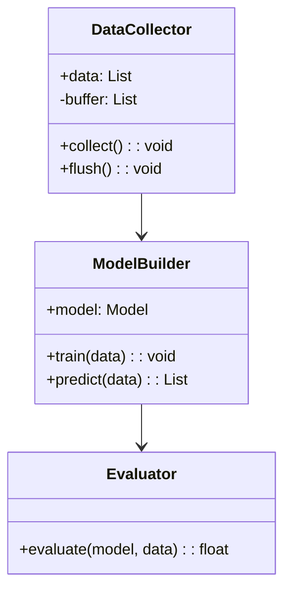
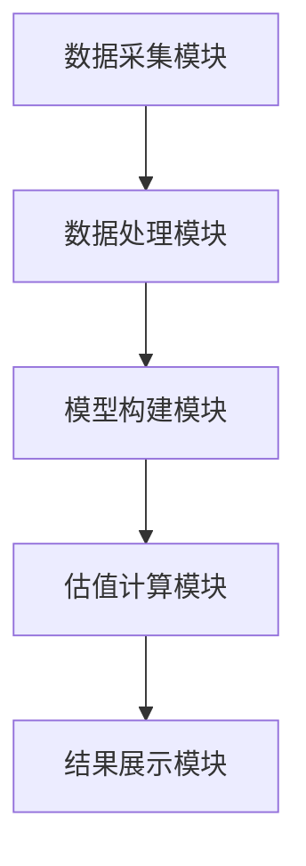
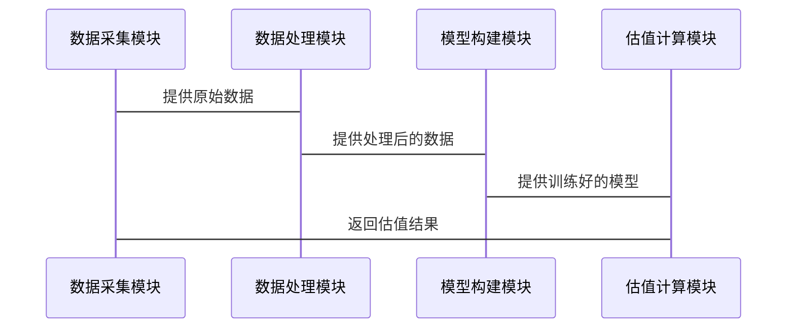

                 


# 基于多智能体的自动化财务建模和估值系统

## 关键词：多智能体系统、自动化财务建模、估值系统、分布式计算、协作优化、人工智能

## 摘要：  
本文系统地探讨了基于多智能体的自动化财务建模和估值系统的构建与应用。首先，介绍了多智能体系统的基本概念及其在金融领域的优势。接着，详细分析了自动化财务建模的核心原理与技术实现，重点阐述了多智能体系统在数据处理、模型构建与优化中的应用。随后，深入讲解了基于多智能体的估值算法，包括协作优化算法的设计与实现。最后，通过实际案例分析，展示了该系统的实际应用价值与未来发展方向。

---

# 第1章: 多智能体系统概述

## 1.1 多智能体系统的基本概念  
### 1.1.1 多智能体系统的定义  
多智能体系统（Multi-Agent System, MAS）是由多个智能体（Agent）组成的分布式系统，每个智能体能够自主决策并与其他智能体协作完成复杂任务。  

### 1.1.2 多智能体系统的特征  
- **分布式性**：智能体分布在不同的位置，通过通信进行协作。  
- **协作性**：智能体之间通过协作完成共同目标。  
- **反应性**：智能体能够感知环境并实时调整行为。  
- **自主性**：智能体具有自主决策能力。  

### 1.1.3 多智能体系统与传统单智能体系统的区别  
| 特性                | 多智能体系统                | 单智能体系统                |  
|---------------------|---------------------------|---------------------------|  
| 结构                | 分布式                    | 集中式                    |  
| 智能体数量          | 多个                      | 单个                      |  
| 协作方式            | 分布式协作                | 中央控制                  |  
| 应用场景            | 金融、工业、物流等        | 单一任务或简单场景        |  

---

## 1.2 多智能体系统的核心原理  
### 1.2.1 分布式智能  
多智能体系统通过分布式计算实现任务分配与协作，每个智能体负责一部分数据的处理与分析。  

### 1.2.2 协作与通信机制  
智能体之间通过通信模块进行信息共享与协作，常见的通信方式包括发布-订阅模型和点对点通信。  

### 1.2.3 多智能体系统的架构  
- **层次化架构**：分为高层和低层智能体，高层负责决策，低层负责执行。  
- **分布式架构**：所有智能体地位平等，通过通信模块协作完成任务。  

---

## 1.3 多智能体系统在金融领域的应用  
### 1.3.1 金融领域的应用  
多智能体系统在金融领域的应用包括股票交易、风险管理、信用评估等。  

### 1.3.2 工业自动化中的应用  
多智能体系统可以用于工业自动化中的设备控制与优化。  

### 1.3.3 其他领域的应用  
多智能体系统在物流、交通管理等领域也有广泛应用。  

---

## 1.4 多智能体系统的发展趋势  
### 1.4.1 技术进步对多智能体系统的影响  
人工智能、大数据技术的发展推动了多智能体系统的智能化与高效化。  

### 1.4.2 多智能体系统的未来发展方向  
- **智能化**：增强智能体的自主决策能力。  
- **实时性**：提高系统的实时响应能力。  
- **可扩展性**：支持更大规模的智能体协作。  

---

## 1.5 本章小结  
本章介绍了多智能体系统的基本概念、核心原理及其在金融和其他领域的应用，为后续章节的深入分析奠定了基础。

---

# 第2章: 自动化财务建模基础  

## 2.1 财务建模的基本概念  
### 2.1.1 财务建模的定义  
财务建模是通过数学模型描述企业财务状况、经营成果和未来发展趋势的过程。  

### 2.1.2 财务建模的流程  
1. 数据采集与处理。  
2. 模型构建与优化。  
3. 模型评估与验证。  

### 2.1.3 财务建模的常见方法  
- **静态模型**：假设条件不变，分析单一变量的影响。  
- **动态模型**：考虑多变量的动态变化。  
- **蒙特卡洛模拟**：用于风险评估与情景分析。  

---

## 2.2 自动化财务建模的必要性  
### 2.2.1 传统财务建模的局限性  
- 数据处理繁琐，效率低。  
- 模型更新与维护成本高。  

### 2.2.2 自动化财务建模的优势  
- 提高数据处理效率。  
- 实现模型的自动更新与优化。  

### 2.2.3 自动化财务建模的应用场景  
- 实时财务分析。  
- 自动化报告生成。  
- 风险管理与预测。  

---

## 2.3 自动化财务建模的核心技术  
### 2.3.1 数据采集与处理  
- 数据清洗与预处理。  
- 数据共享与协作机制。  

### 2.3.2 模型构建与优化  
- 分布式模型构建。  
- 模型优化算法。  

### 2.3.3 模型评估与验证  
- 模型准确性的评估方法。  
- 模型的可解释性分析。  

---

## 2.4 本章小结  
本章介绍了自动化财务建模的基本概念、必要性及其核心技术，为后续章节的多智能体系统应用奠定了基础。

---

# 第3章: 多智能体系统在财务建模中的应用  

## 3.1 多智能体系统与财务建模的结合  
### 3.1.1 多智能体系统在财务建模中的优势  
- 提高数据处理的并行性。  
- 实现模型的分布式优化。  

### 3.1.2 多智能体系统在财务建模中的实现方式  
- 分布式数据处理。  
- 多智能体协作优化。  

### 3.1.3 多智能体系统与自动化财务建模的关系  
多智能体系统为自动化财务建模提供了分布式计算和协作优化的框架。  

---

## 3.2 多智能体系统在财务数据处理中的应用  
### 3.2.1 数据采集与分布式处理  
- 数据的分布式采集与存储。  
- 数据清洗与预处理的协作机制。  

### 3.2.2 数据共享与协作机制  
- 数据共享的安全性与隐私保护。  
- 数据协作的通信协议设计。  

---

## 3.3 多智能体系统在模型构建中的应用  
### 3.3.1 分布式模型构建  
- 分布式数据的特征提取与建模。  
- 模型参数的分布式优化。  

### 3.3.2 多智能体协作优化  
- 协作优化算法的设计与实现。  
- 模型的分布式训练与更新。  

---

## 3.4 本章小结  
本章详细探讨了多智能体系统在财务数据处理与模型构建中的应用，展示了其在自动化财务建模中的优势。

---

# 第4章: 自动化估值系统的核心算法  

## 4.1 自动化估值系统的基本原理  
### 4.1.1 估值系统的定义  
自动化估值系统通过算法实现对资产或项目的自动估值。  

### 4.1.2 估值系统的输入与输出  
- 输入：财务数据、市场数据等。  
- 输出：估值结果与不确定性分析。  

### 4.1.3 估值系统的算法选择  
- 选择适合的算法，如蒙特卡洛模拟、随机森林等。  

---

## 4.2 多智能体协作算法  
### 4.2.1 分布式优化算法  
- 分布式优化的数学模型。  
- 算法的实现步骤。  

### 4.2.2 多智能体协作流程  
1. 数据采集与分配。  
2. 分布式计算与协作。  
3. 结果汇总与优化。  

---

## 4.3 基于多智能体的估值算法实现  
### 4.3.1 算法实现步骤  
1. 数据预处理与特征提取。  
2. 分布式计算与协作优化。  
3. 估值结果的汇总与分析。  

### 4.3.2 算法的Python代码实现  
```python
def distributed_optimization(data, agents):
    # 分配数据到各个智能体
    data_per_agent = distribute_data(data, agents)
    # 各智能体进行优化计算
    optimized_results = [agent.optimize(data) for agent in agents]
    # 汇总结果
    final_result = aggregate_results(optimized_results)
    return final_result
```

### 4.3.3 算法的数学模型与公式  
$$ \text{目标函数} = \sum_{i=1}^{n} w_i x_i $$  
其中，$w_i$ 是权重，$x_i$ 是输入特征。  

---

## 4.4 本章小结  
本章详细讲解了自动化估值系统的核心算法，包括多智能体协作算法的设计与实现，为后续章节的系统设计提供了算法基础。

---

# 第5章: 系统分析与架构设计  

## 5.1 问题场景介绍  
### 5.1.1 项目背景  
本项目旨在构建一个基于多智能体的自动化财务建模和估值系统。  

### 5.1.2 项目目标  
实现财务数据的分布式处理、模型构建与优化、以及自动化估值。  

---

## 5.2 系统功能设计  
### 5.2.1 领域模型设计  


### 5.2.2 系统架构设计  


### 5.2.3 系统接口设计  
- 数据采集接口：`collect_data()`
- 模型构建接口：`train_model()`
- 估值计算接口：`calculate_value()`

---

## 5.3 系统交互设计  


---

## 5.4 本章小结  
本章通过系统分析与架构设计，明确了各模块的功能与交互关系，为系统的实现奠定了基础。

---

# 第6章: 项目实战  

## 6.1 环境安装与配置  
### 6.1.1 开发环境  
- Python 3.8+  
- Jupyter Notebook  
- 其他依赖库（如numpy、pandas、scikit-learn）  

### 6.1.2 系统安装  
安装必要的库：  
```bash
pip install numpy pandas scikit-learn
```

---

## 6.2 核心代码实现  
### 6.2.1 数据采集模块  
```python
import pandas as pd

def collect_data():
    # 从数据库或文件中读取数据
    data = pd.read_csv('financial_data.csv')
    return data
```

### 6.2.2 模型构建模块  
```python
from sklearn.ensemble import RandomForestRegressor

def build_model(data):
    # 特征选择与模型训练
    model = RandomForestRegressor(n_estimators=100)
    model.fit(data.drop('target', axis=1), data['target'])
    return model
```

### 6.2.3 估值计算模块  
```python
def calculate_value(model, new_data):
    # 使用模型进行估值
    value = model.predict(new_data)
    return value
```

---

## 6.3 案例分析与实际应用  
### 6.3.1 案例分析  
以某公司财务数据为例，展示系统的实际应用。  

### 6.3.2 实际应用  
通过实际数据验证系统的有效性与准确性。  

---

## 6.4 本章小结  
本章通过项目实战，展示了如何基于多智能体系统实现自动化财务建模和估值，验证了系统的可行性和有效性。

---

# 第7章: 最佳实践与未来展望  

## 7.1 最佳实践 tips  
### 7.1.1 系统设计建议  
- 确保数据的安全性与隐私保护。  
- 优化智能体之间的通信效率。  

### 7.1.2 算法优化建议  
- 使用更高效的分布式优化算法。  
- 引入机器学习模型的解释性分析。  

---

## 7.2 小结  
本章总结了项目中的经验和教训，提出了改进建议。  

## 7.3 注意事项  
- 确保系统的可扩展性。  
- 定期更新模型与算法。  

## 7.4 拓展阅读  
- 推荐阅读相关领域的学术论文与技术博客。  

---

# 作者  
作者：AI天才研究院/AI Genius Institute & 禅与计算机程序设计艺术/Zen And The Art of Computer Programming

