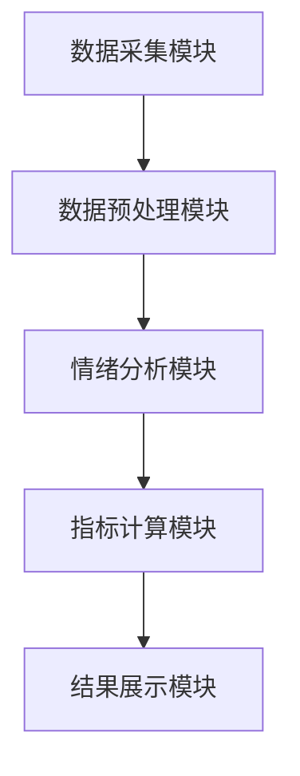
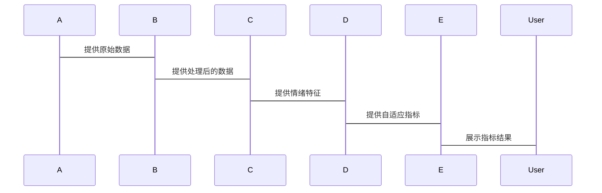

                 


# 基于多智能体的自适应市场情绪指标在价值投资中的应用

> 关键词：多智能体，自适应市场情绪指标，价值投资，算法，金融市场，深度学习

> 摘要：本文探讨了基于多智能体的自适应市场情绪指标在价值投资中的应用。通过分析市场情绪指标的重要性，多智能体系统的优势，自适应指标的构建，以及具体的算法实现，展示了如何利用多智能体技术优化市场情绪分析，提升投资决策的准确性。

---

## 第1章: 市场情绪指标的背景与意义

### 1.1 市场情绪指标的定义与重要性

#### 1.1.1 市场情绪的定义
市场情绪是指投资者在金融市场中的整体心理状态，通常反映为对市场走势的乐观或悲观态度。市场情绪可以通过多种指标来衡量，如恐慌指数、投资者信心指数等。

#### 1.1.2 市场情绪指标在价值投资中的作用
市场情绪指标是价值投资者评估市场健康状况的重要工具。通过分析市场情绪，投资者可以判断市场的非理性波动，从而做出更明智的投资决策。

#### 1.1.3 市场情绪指标的局限性与改进方向
传统市场情绪指标往往基于固定的模型，难以适应市场的动态变化。通过引入多智能体系统，可以实现指标的自适应调整，提升其准确性和实用性。

### 1.2 传统市场情绪分析方法

#### 1.2.1 基于统计的市场情绪分析
传统统计方法通过分析市场数据的波动性来判断市场情绪。例如，利用波动率指标来衡量市场的恐慌程度。

#### 1.2.2 基于文本挖掘的市场情绪分析
通过分析新闻、社交媒体等文本数据，提取市场情绪的关键词和情感倾向，从而构建情绪指标。

#### 1.2.3 基于机器学习的市场情绪分析
利用机器学习算法，如支持向量机（SVM）和随机森林（Random Forest），对市场数据和文本数据进行特征提取和分类，预测市场情绪。

---

## 第2章: 多智能体系统概述

### 2.1 多智能体系统的定义与特点

#### 2.1.1 多智能体系统的定义
多智能体系统是由多个相互作用的智能体组成的分布式系统，每个智能体都有自己的目标和决策机制。

#### 2.1.2 多智能体系统的核心特点
- **分布式计算**：多个智能体协同工作，避免单点故障。
- **自主性**：每个智能体能够自主决策。
- **反应性**：智能体能够实时感知环境变化并做出反应。
- **协作性**：智能体之间通过协作完成复杂任务。

#### 2.1.3 多智能体系统与传统单智能体系统的对比
多智能体系统在复杂任务中的表现优于传统单智能体系统，尤其是在需要并行处理和动态适应的场景中。

### 2.2 多智能体系统在金融领域的应用

#### 2.2.1 多智能体系统在金融市场的优势
- **实时性**：多智能体系统能够快速响应市场变化。
- **鲁棒性**：系统能够适应市场的不确定性。
- **智能化**：智能体能够自主学习和优化。

#### 2.2.2 多智能体系统在金融分析中的具体应用案例
- **股票交易策略**：多个智能体协同分析市场数据，制定交易策略。
- **风险管理**：通过智能体实时监控市场风险，及时发出预警。

#### 2.2.3 多智能体系统在市场情绪分析中的潜力
多智能体系统可以通过分布式计算和协作学习，更准确地捕捉市场情绪的变化，为价值投资提供实时反馈。

---

## 第3章: 自适应市场情绪指标的构建

### 3.1 自适应市场情绪指标的定义

#### 3.1.1 自适应指标的核心概念
自适应市场情绪指标是一种能够根据市场变化动态调整的指标，能够更好地反映市场的实际情况。

#### 3.1.2 自适应指标与传统指标的对比
自适应指标能够实时更新，而传统指标往往基于固定模型，难以适应市场的动态变化。

#### 3.1.3 自适应指标的动态调整机制
通过多智能体系统，自适应指标可以根据市场反馈实时调整参数，提升准确性。

### 3.2 多智能体系统在自适应指标中的作用

#### 3.2.1 多智能体系统如何实现市场情绪的实时监测
多个智能体协同工作，实时收集和分析市场数据，捕捉情绪变化。

#### 3.2.2 多智能体系统如何优化市场情绪指标的计算
通过分布式计算和协作学习，多智能体系统能够更高效地计算市场情绪指标。

#### 3.2.3 多智能体系统如何提升指标的自适应性
智能体之间的协作和反馈机制，使得指标能够根据市场变化自动调整。

---

## 第4章: 基于多智能体的自适应指标算法

### 4.1 算法原理

#### 4.1.1 数据预处理与特征提取
- **数据清洗**：去除噪声数据，确保数据质量。
- **特征提取**：从市场数据和文本数据中提取有用的特征，如波动率、关键词情感值等。

#### 4.1.2 模型训练与优化
- **机器学习模型**：使用深度学习模型（如LSTM）对特征进行训练，预测市场情绪。
- **多智能体协作**：多个智能体协同训练，优化模型参数。

#### 4.1.3 指标计算与自适应调整
- **实时计算**：根据最新的市场数据，实时计算市场情绪指标。
- **动态调整**：根据市场反馈，动态调整指标的权重和参数。

### 4.2 算法实现

#### 4.2.1 数据预处理
```python
import pandas as pd
data = pd.read_csv('market_data.csv')
data = data.dropna()  # 去除缺失值
data = data[ ['close', 'volume', 'sentiment_score'] ]  # 提取相关特征
```

#### 4.2.2 模型训练
```python
import keras
from keras.models import Sequential
from keras.layers import LSTM, Dense

model = Sequential()
model.add(LSTM(64, input_shape=(None, 3)))
model.add(Dense(1))
model.compile(loss='mean_squared_error', optimizer='adam')
model.fit(X_train, y_train, epochs=10, batch_size=32)
```

#### 4.2.3 指标计算
```python
def calculate_emotion_index(data, model):
    predictions = model.predict(data)
    emotion_index = pd.Series(predictions.flatten(), index=data.index)
    return emotion_index
```

### 4.3 算法的数学模型

#### 4.3.1 LSTM模型
$$
f(x) = \text{LSTM}(x, units=64)
$$

#### 4.3.2 情绪指标计算
$$
\text{emotion\_index} = \alpha \cdot \text{LSTM\_output} + (1-\alpha) \cdot \text{传统指标}
$$
其中，$\alpha$ 是调节参数，控制自适应指标的权重。

---

## 第5章: 系统架构设计

### 5.1 系统功能设计

#### 5.1.1 系统模块划分
- **数据采集模块**：实时采集市场数据和文本数据。
- **情绪分析模块**：对文本数据进行情感分析，提取情绪特征。
- **指标计算模块**：基于多智能体系统，计算自适应市场情绪指标。

#### 5.1.2 系统功能流程
1. 数据采集模块获取市场数据和文本数据。
2. 情绪分析模块对文本数据进行情感分析，生成情绪特征。
3. 指标计算模块结合市场数据和情绪特征，计算自适应市场情绪指标。

### 5.2 系统架构设计

#### 5.2.1 系统架构图


#### 5.2.2 系统交互流程


---

## 第6章: 项目实战

### 6.1 环境搭建

#### 6.1.1 安装依赖
```bash
pip install pandas keras numpy matplotlib
```

### 6.2 核心代码实现

#### 6.2.1 数据采集
```python
import pandas_datareader as pdr
data = pdr.get_data_yahoo('AAPL', start='2020-01-01', end='2023-01-01')
```

#### 6.2.2 情绪分析
```python
from textblob import TextBlob
def get_sentiment(text):
    return TextBlob(text).sentiment.polarity
```

#### 6.2.3 指标计算
```python
import keras
from keras.models import Sequential
from keras.layers import LSTM, Dense

model = Sequential()
model.add(LSTM(64, input_shape=(None, 3)))
model.add(Dense(1))
model.compile(loss='mean_squared_error', optimizer='adam')
model.fit(X_train, y_train, epochs=10, batch_size=32)
```

### 6.3 案例分析

#### 6.3.1 数据分析
```python
data['emotion_index'] = calculate_emotion_index(data)
data.plot()
plt.show()
```

#### 6.3.2 结果解读
通过分析情绪指数的变化，投资者可以更好地判断市场的非理性波动，从而做出更明智的投资决策。

---

## 第7章: 扩展与展望

### 7.1 当前研究的前沿
目前，研究者正在探索如何将强化学习和图神经网络应用于市场情绪分析，进一步提升指标的准确性和实时性。

### 7.2 未来的发展方向
- **多模态数据融合**：结合市场数据、文本数据和社交网络数据，构建更全面的市场情绪指标。
- **自适应算法优化**：进一步提升算法的自适应能力，使其能够更好地应对市场的复杂变化。
- **实时计算优化**：通过分布式计算和边缘计算技术，提升系统的实时性和计算效率。

### 7.3 实际应用中的挑战
- **数据质量**：如何获取高质量的市场数据和文本数据。
- **模型解释性**：如何提升模型的可解释性，便于投资者理解和使用。
- **计算效率**：如何在保证准确性的前提下，提升计算效率。

---

## 作者：AI天才研究院 & 禅与计算机程序设计艺术

---

以上是基于多智能体的自适应市场情绪指标在价值投资中的应用的技术博客文章，涵盖了从理论到实践的各个方面，详细讲解了多智能体系统在市场情绪分析中的应用，以及如何通过算法优化和系统设计提升投资决策的准确性。

