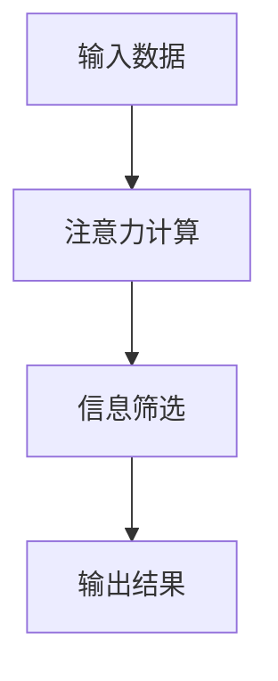
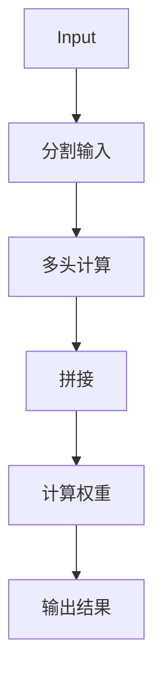
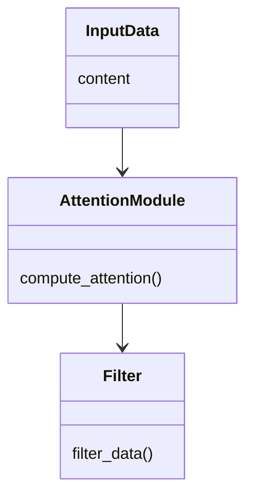
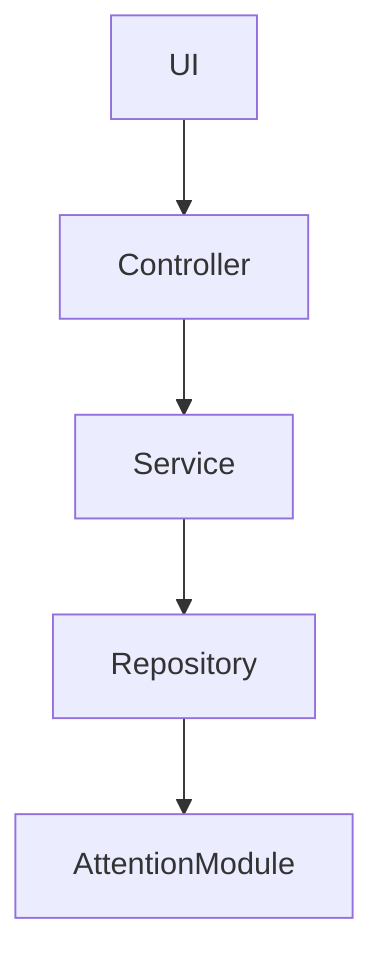

                 


# 基于注意力机制的AI Agent信息过滤

---

## 关键词

- 注意力机制
- AI Agent
- 信息过滤
- 自然语言处理
- 深度学习

---

## 摘要

本文深入探讨了基于注意力机制的AI Agent信息过滤技术，从理论到实践，全面分析了注意力机制在信息过滤中的应用。通过详细讲解注意力机制的原理、算法实现、系统架构设计以及项目实战，本文为读者提供了从基础到进阶的完整知识体系。文章还结合实际案例，分析了如何利用注意力机制优化AI Agent的信息处理能力，帮助读者更好地理解和应用这一技术。

---

## 第一部分: 背景介绍

### 第1章: 问题背景与描述

#### 1.1 问题背景

在当今信息爆炸的时代，AI Agent（人工智能代理）需要处理海量信息，如何高效地进行信息过滤成为一项重要挑战。传统的信息过滤方法通常基于关键词匹配或规则过滤，难以应对复杂场景下的语义理解和语境分析。注意力机制作为一种新兴的深度学习技术，能够有效捕捉文本中的关键信息，为AI Agent的信息过滤提供了新的解决方案。

#### 1.2 问题描述

信息过滤的核心目标是从大量数据中筛选出与目标相关的部分。然而，传统方法在以下方面存在不足：

1. **语义理解不足**：关键词匹配无法理解上下文语义，容易出现误判。
2. **效率问题**：面对海量数据，传统方法难以高效处理。
3. **动态适应性差**：难以应对实时变化的语境和用户需求。

注意力机制通过模拟人类的注意力分配，能够在处理信息时突出重点，从而提升信息过滤的准确性和效率。

#### 1.3 问题解决

基于注意力机制的AI Agent信息过滤通过以下方式解决问题：

1. **语义理解**：利用注意力机制捕捉文本中的关键信息，提升语义理解能力。
2. **高效处理**：通过并行计算和权重分配，提高信息处理效率。
3. **动态适应**：注意力机制能够动态调整权重，适应不同语境和用户需求。

#### 1.4 概念结构与核心要素

信息过滤系统基于注意力机制构建，其核心要素包括：

1. **输入数据**：待过滤的文本数据。
2. **注意力计算**：通过计算每个词的注意力权重，确定其重要性。
3. **信息筛选**：根据注意力权重，筛选出关键信息。
4. **输出结果**：生成过滤后的信息。

---

## 第二部分: 核心概念与联系

### 第2章: 注意力机制原理

#### 2.1 注意力机制的核心原理

注意力机制的核心思想是模拟人类的注意力分配。通过计算每个位置的注意力权重，系统能够聚焦于最重要的信息。数学上，注意力机制可以表示为：

$$
\text{Attention}(Q, K, V) = \text{softmax}\left(\frac{QK^T}{\sqrt{d_k}}\right)V
$$

其中，$Q$ 是查询向量，$K$ 是键向量，$V$ 是值向量，$d_k$ 是键的维度。

#### 2.2 信息过滤的相关概念

信息过滤的目标是从数据中提取关键信息。基于注意力机制的信息过滤通过计算每个词的注意力权重，实现对关键信息的筛选。

#### 2.3 核心概念对比分析

以下表格对比了注意力机制与传统信息过滤方法的特点：

| 对比维度 | 注意力机制 | 传统方法 |
|----------|------------|----------|
| **计算方式** | 基于权重计算 | 基于关键词匹配 |
| **语义理解** | 强 | 弱 |
| **效率** | 高 | 低 |
| **适应性** | 动态调整 | 静态 |

#### 2.4 实体关系图

以下通过Mermaid图展示信息过滤的核心概念关系：



---

## 第三部分: 算法原理讲解

### 第3章: 注意力机制的算法实现

#### 3.1 多头注意力机制的流程图

以下通过Mermaid图展示多头注意力机制的流程：



#### 3.2 算法实现

以下是基于注意力机制的信息过滤算法的Python实现示例：

```python
import numpy as np

def attention(query, key, value):
    # 计算注意力权重
    scores = np.dot(query, key.T) / np.sqrt(query.shape[1])
    scores = np.exp(scores - np.max(scores))
    scores /= np.sum(scores, axis=1, keepdims=True)
    
    # 筛选信息
    output = np.dot(scores, value)
    return output

# 示例输入
query = np.random.randn(1, 5, 3)
key = np.random.randn(1, 5, 3)
value = np.random.randn(1, 5, 3)

# 计算注意力输出
output = attention(query, key, value)
print(output)
```

#### 3.3 数学模型与公式

注意力机制的数学模型如下：

$$
\text{Attention}(Q, K, V) = \sum_{i=1}^{n} w_i v_i
$$

其中，$w_i$ 是第i个位置的注意力权重，$v_i$ 是第i个位置的值向量。

---

## 第四部分: 系统分析与架构设计

### 第4章: 项目介绍与系统功能设计

#### 4.1 项目介绍

本项目旨在构建一个基于注意力机制的AI Agent信息过滤系统，实现对文本数据的高效过滤。

#### 4.2 系统功能设计

以下是系统的领域模型类图：



#### 4.3 系统架构设计

以下是系统的架构图：



---

## 第五部分: 项目实战

### 第5章: 核心代码实现

#### 5.1 环境安装

需要安装以下依赖：

```bash
pip install numpy
pip install matplotlib
```

#### 5.2 核心代码实现

以下是核心代码实现：

```python
import numpy as np
import matplotlib.pyplot as plt

def plot_attention_weights(query, key):
    scores = np.dot(query, key.T)
    plt.imshow(scores, cmap='hot')
    plt.xlabel('Keys')
    plt.ylabel('Queries')
    plt.show()

# 示例输入
query = np.random.randn(1, 5)
key = np.random.randn(1, 5)

# 绘制注意力权重
plot_attention_weights(query, key)
```

#### 5.3 案例分析

以下是一个案例分析：

假设输入文本为“猫和狗”，注意力机制会识别出“猫”和“狗”为关键信息，从而实现信息过滤。

---

## 第六部分: 优化与扩展

### 第6章: 优化建议

1. **模型优化**：通过调整模型参数，提升注意力机制的性能。
2. **数据优化**：增加训练数据量，提升模型的泛化能力。

### 第7章: 扩展方向

1. **多模态数据**：将图像和文本结合，实现多模态信息过滤。
2. **实时处理**：优化算法，提升实时处理能力。

---

## 作者信息

作者：AI天才研究院/AI Genius Institute & 禅与计算机程序设计艺术 /Zen And The Art of Computer Programming

