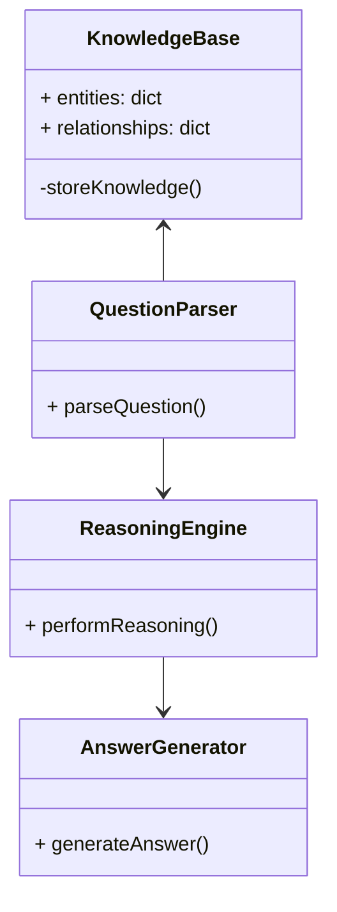
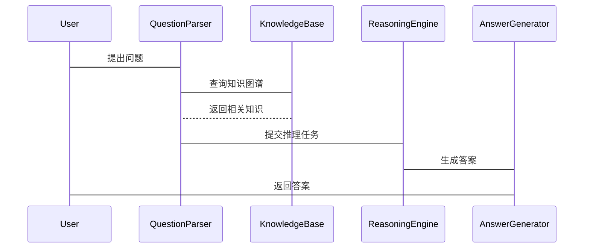

                 


# 基于知识图谱的AI Agent常识推理

> 关键词：知识图谱, AI Agent, 常识推理, 知识表示, 推理算法, 系统架构

> 摘要：本文探讨了基于知识图谱的AI Agent常识推理的实现方法，从背景介绍、核心概念到算法原理、系统架构，再到项目实战，全面解析了如何利用知识图谱构建智能推理系统。

---

# 第一部分: 知识图谱与AI Agent概述

## 第1章: 知识图谱与AI Agent概述

### 1.1 知识图谱的定义与特点

知识图谱是一种以图结构表示知识的数据库，节点表示实体，边表示实体之间的关系。其特点包括：

- **可扩展性**：支持大规模数据的存储与查询。
- **语义丰富性**：通过实体关系网络提供语义理解。
- **可推理性**：支持基于知识图谱的推理。

### 1.2 AI Agent的定义与特点

AI Agent是一种智能体，能够感知环境、自主决策并执行任务。其特点包括：

- **自主性**：无需外部干预。
- **反应性**：能实时响应环境变化。
- **学习能力**：通过经验改进性能。

### 1.3 知识图谱与AI Agent的结合

知识图谱为AI Agent提供知识库支持，AI Agent利用知识图谱进行推理和决策。这种结合在问答系统、对话系统等领域有广泛应用。

---

## 第2章: 常识推理的背景与挑战

### 2.1 常识推理的定义

常识推理是指AI系统基于常识知识库进行推理，解决日常问题。其核心问题包括：

- **知识表示**：如何高效表示常识。
- **推理算法**：如何从知识库中提取有用信息。

### 2.2 知识图谱在常识推理中的作用

知识图谱通过结构化的知识表示，为常识推理提供支持。其作用包括：

- **提供上下文**：帮助AI理解问题背景。
- **支持推理**：通过图结构进行路径分析。

### 2.3 AI Agent在常识推理中的应用

AI Agent利用知识图谱进行常识推理，应用场景包括：

- **智能问答**：回答用户问题。
- **对话系统**：生成自然对话。

---

# 第二部分: 知识图谱与AI Agent的核心概念与联系

## 第3章: 知识图谱的核心概念与原理

### 3.1 知识图谱的构建过程

知识图谱的构建包括：

1. **数据收集**：从多种数据源获取数据。
2. **数据清洗**：去除噪声数据。
3. **实体识别**：识别文本中的实体。
4. **关系抽取**：提取实体间的关系。
5. **知识融合**：整合多个数据源的信息。
6. **知识存储**：存储到图数据库中。

### 3.2 知识图谱的表示方法

知识图谱的表示方法包括：

- **基于图的表示**：使用节点和边表示实体及其关系。
- **基于向量的表示**：使用向量空间模型表示实体和关系。
- **嵌入表示**：通过深度学习模型生成低维嵌入。

### 3.3 知识图谱的推理机制

知识图谱的推理机制包括：

- **基于规则的推理**：利用逻辑规则进行推理。
- **基于概率的推理**：利用概率论进行推理。
- **基于深度学习的推理**：利用神经网络进行推理。

---

## 第4章: AI Agent的核心概念与原理

### 4.1 AI Agent的感知与决策

AI Agent的感知与决策包括：

1. **感知模块**：通过传感器或数据源获取信息。
2. **决策模块**：基于感知信息做出决策。

### 4.2 AI Agent的知识表示与推理

AI Agent的知识表示与推理包括：

1. **知识表示**：将知识表示为符号或图结构。
2. **推理算法**：利用推理算法从知识库中推导新知识。

### 4.3 AI Agent的交互与学习

AI Agent的交互与学习包括：

1. **人机交互**：与用户进行交互。
2. **在线学习**：通过与环境交互学习新知识。
3. **群智计算**：通过多个AI Agent协作完成任务。

---

## 第5章: 知识图谱与AI Agent的核心概念联系

知识图谱为AI Agent提供知识支持，AI Agent利用知识图谱进行推理和决策。它们的结合在智能问答、对话系统等领域发挥了重要作用。

---

# 第三部分: 算法原理与系统架构设计

## 第6章: 算法原理

### 6.1 算法选择与原理

选择基于知识图谱的常识推理算法，如基于路径的推理算法。该算法通过在知识图谱中查找最短路径来推断实体关系。

### 6.2 算法实现

以下是基于路径的推理算法的实现代码：

```python
def find_shortest_path(graph, start, end):
    visited = {}
    queue = [(start, [start])]
    
    while queue:
        current, path = queue.pop(0)
        if current not in visited:
            visited[current] = path
            for neighbor in graph[current]:
                if neighbor == end:
                    return path + [neighbor]
                queue.append((neighbor, path + [neighbor]))
    return visited.get(end, None)
```

### 6.3 数学模型与公式

基于路径的推理算法的数学模型可以表示为：

$$
\text{最短路径} = \argmin_{p \in P} \sum_{(s, t) \in p} w(s, t)
$$

其中，\(P\) 是所有可能路径的集合，\(w(s, t)\) 是边 \(s \rightarrow t\) 的权重。

---

## 第7章: 系统架构设计

### 7.1 问题场景

设计一个基于知识图谱的智能问答系统，用户提出问题，系统利用知识图谱进行推理并给出答案。

### 7.2 系统功能设计

系统功能包括：

- **知识库管理**：管理知识图谱。
- **问答模块**：处理用户问题。
- **推理引擎**：执行推理操作。

### 7.3 系统架构设计

以下是系统架构的类图：



---

## 第8章: 系统接口与交互设计

### 8.1 接口设计

系统接口包括：

- `GET /knowledge`：获取知识图谱数据。
- `POST /reasoning`：提交推理任务。

### 8.2 交互流程图

以下是交互流程图：



---

# 第四部分: 项目实战

## 第9章: 项目实战

### 9.1 环境安装

安装所需的Python库：

```bash
pip install networkx
pip install numpy
pip install matplotlib
```

### 9.2 核心代码实现

以下是核心代码：

```python
import networkx as nx

def build_knowledge_graph():
    G = nx.Graph()
    G.add_nodes_from(["A", "B", "C"])
    G.add_edges_from([("A", "B"), ("B", "C")])
    return G

def shortest_path(G, start, end):
    return nx.shortest_path(G, start, end)

if __name__ == "__main__":
    graph = build_knowledge_graph()
    path = shortest_path(graph, "A", "C")
    print(f"Shortest path: {path}")
```

### 9.3 代码解读与分析

该代码构建了一个简单的知识图谱，并使用NetworkX库计算最短路径。通过调用`shortest_path`函数，可以获取从"A"到"C"的最短路径。

### 9.4 实际案例分析

以一个简单的问答场景为例，用户询问"A和C的关系"。系统通过推理得出"A与C的关系是通过B间接相连"。

---

# 第五部分: 总结与展望

## 第10章: 总结与展望

### 10.1 最佳实践

- 知识图谱的构建需要选择合适的数据源和工具。
- 推理算法的选择应根据具体任务需求。

### 10.2 小结

本文详细介绍了基于知识图谱的AI Agent常识推理的实现方法，包括知识图谱的构建、推理算法的设计以及系统架构的实现。

### 10.3 注意事项

- 数据质量和推理算法的准确性直接影响系统的性能。
- 知识图谱的规模和复杂度会影响推理效率。

### 10.4 拓展阅读

建议进一步阅读以下内容：

- 知识图谱的嵌入表示方法。
- 基于深度学习的常识推理模型。

---

作者：AI天才研究院 & 禅与计算机程序设计艺术

