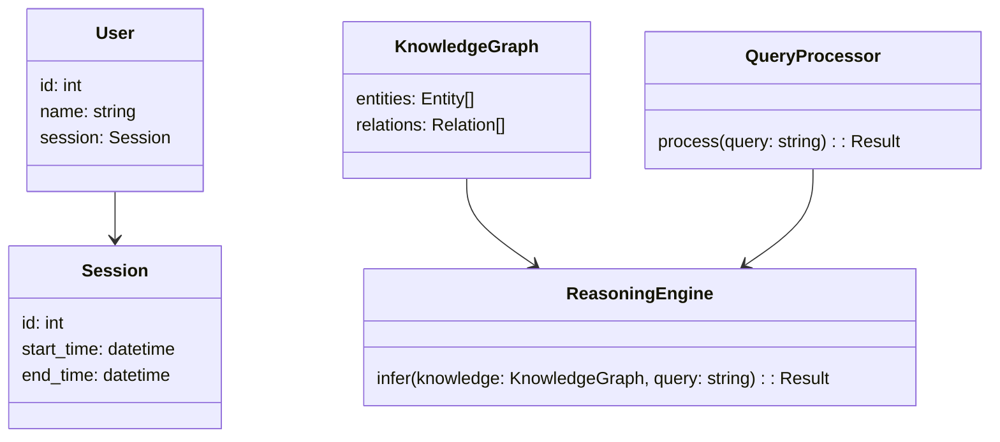
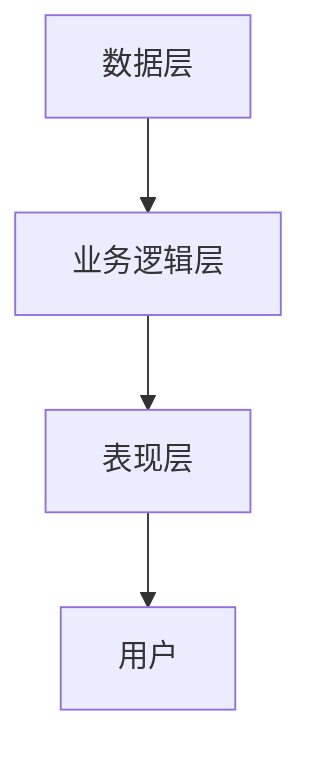
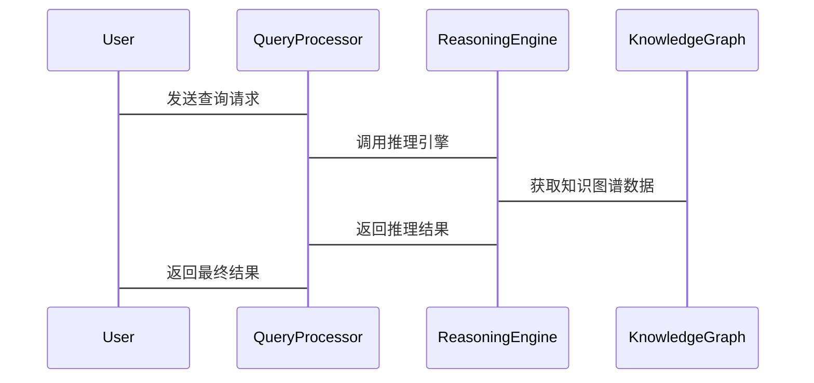

                 


# 基于知识图谱的AI Agent推理系统

---

## 关键词
知识图谱, AI Agent, 推理系统, 符号逻辑, 概率推理, 系统架构, 实践案例

---

## 摘要
知识图谱是一种强大的知识表示形式，而AI Agent则具备自主推理和决策的能力。本文将详细介绍基于知识图谱的AI Agent推理系统，从知识图谱的构建与表示、AI Agent的基本概念与能力，到推理算法的原理与实现，再到系统的架构设计与项目实战。文章通过理论与实践相结合的方式，深入剖析基于知识图谱的AI Agent推理系统的构建过程，为读者提供全面的技术指导。

---

# 第1章: 知识图谱与AI Agent概述

## 1.1 知识图谱的背景与定义
### 1.1.1 知识图谱的定义与特点
知识图谱是一种以图结构形式表示知识的语义网络，由实体和关系组成，具有语义丰富、结构化的特点。

### 1.1.2 知识图谱的构建方法
知识图谱的构建通常包括数据采集、实体识别、关系抽取等步骤。

### 1.1.3 知识图谱的应用场景
知识图谱广泛应用于搜索引擎、智能问答、推荐系统等领域。

## 1.2 AI Agent的基本概念
### 1.2.1 AI Agent的定义与分类
AI Agent是具有感知环境、自主决策和执行任务的智能体，可分为简单反射Agent和基于模型的Agent。

### 1.2.2 AI Agent的核心能力
AI Agent具备感知、推理、规划和学习等核心能力。

### 1.2.3 AI Agent的典型应用
AI Agent在智能助手、自动驾驶、机器人等领域有广泛应用。

## 1.3 知识图谱与AI Agent的结合
### 1.3.1 知识图谱在AI Agent中的作用
知识图谱为AI Agent提供丰富的知识表示和推理基础。

### 1.3.2 知识图谱驱动的推理机制
知识图谱通过符号逻辑和概率推理等方法，驱动AI Agent的推理过程。

### 1.3.3 知识图谱与AI Agent的协同工作
知识图谱为AI Agent提供知识支持，AI Agent通过推理能力增强知识图谱的动态更新与应用。

---

# 第2章: 知识图谱的构建与表示

## 2.1 知识图谱的构建过程
### 2.1.1 数据采集与预处理
从多种数据源采集数据，并进行清洗和预处理。

### 2.1.2 实体识别与抽取
通过NLP技术识别文本中的实体，并建立实体间的关系。

### 2.1.3 关系抽取与构建
抽取实体之间的关系，并构建三元组形式的知识图谱。

## 2.2 知识图谱的表示方法
### 2.2.1 图表示法
使用图结构表示实体和关系，适合知识的层次化组织。

### 2.2.2 三元组表示法
通过（主体，谓词，宾语）的形式表示知识，简洁且易于处理。

### 2.2.3 知识图谱的层次化表示
将知识图谱划分为多个层次，便于管理和查询。

## 2.3 知识图谱的存储与管理
### 2.3.1 图数据库的选择
常用图数据库如Neo4j，支持高效的图结构查询。

### 2.3.2 知识图谱的存储结构
采用节点和边的方式存储实体和关系。

### 2.3.3 知识图谱的查询语言
使用SPARQL等查询语言进行知识图谱的复杂查询。

---

# 第3章: 知识图谱驱动的推理算法

## 3.1 符号逻辑推理
### 3.1.1 基于规则的推理
通过预定义的规则进行推理，例如使用合取（AND）、析取（OR）、蕴含（→）等逻辑操作。

$$A \land B \rightarrow C$$

### 3.1.2 基于逻辑的推理
使用谓词逻辑进行推理，例如一阶逻辑表达式：

$$\forall x (P(x) \rightarrow Q(x))$$

### 3.1.3 常见的符号逻辑推理算法
- 布尔逻辑推理
- �谓词逻辑推理
- 语义网络推理

## 3.2 概率推理
### 3.2.1 贝叶斯网络推理
通过贝叶斯网络进行概率推理，计算条件概率。

$$P(A|B) = \frac{P(B|A)P(A)}{P(B)}$$

### 3.2.2 马尔可夫逻辑网络推理
结合逻辑规则和概率推理，构建马尔可夫逻辑网络进行推断。

### 3.2.3 常见的概率推理算法
- 贝叶斯推理
- 马尔可夫链推理
- 隐马尔可夫模型推理

---

# 第4章: AI Agent推理系统的设计与实现

## 4.1 系统需求分析
### 4.1.1 问题场景介绍
设计一个基于知识图谱的智能问答系统，帮助用户解答复杂问题。

### 4.1.2 项目介绍
开发一个支持多轮对话的智能问答系统，利用知识图谱进行推理。

## 4.2 系统功能设计
### 4.2.1 领域模型设计
使用Mermaid绘制领域模型类图，展示系统的功能模块。



### 4.2.2 系统架构设计
使用分层架构设计系统，包括数据层、业务逻辑层和表现层。



### 4.2.3 系统接口设计
定义系统的主要接口，如查询接口、推理接口和结果返回接口。

### 4.2.4 系统交互设计
使用Mermaid绘制系统交互序列图，展示用户与系统之间的交互流程。



---

# 第5章: 项目实战

## 5.1 环境安装与配置
### 5.1.1 安装Python和依赖库
安装Python 3.8以上版本，安装必要的库如Neo4j、networkx等。

### 5.1.2 配置知识图谱存储环境
选择合适的图数据库，配置Neo4j环境。

## 5.2 系统核心实现
### 5.2.1 知识抽取模块
编写代码从文本中抽取实体和关系。

```python
from spacy.lang.zh import Chinese
import spacy

# 初始化模型
nlp = Chinese()

# 文本处理
text = "苹果公司成立于1971年，乔布斯是创始人之一。"
doc = nlp(text)

# 实体识别
ents = [(ent.text, ent.label_) for ent in doc.ents]
print(ents)
```

### 5.2.2 推理算法实现
实现基于符号逻辑的推理算法。

```python
def infer(knowledge_graph, query):
    # 简单的规则推理
    result = []
    for rule in knowledge_graph.rules:
        if rule.match(query):
            result.append(rule.infer(query))
    return result
```

## 5.3 实际案例分析
### 5.3.1 案例介绍
分析一个智能问答系统的案例，展示知识图谱和推理算法的应用。

### 5.3.2 代码实现与解读
展示核心代码的实现，详细解读每部分的功能。

### 5.3.3 经验总结
总结项目实施中的经验教训，优化建议。

---

# 第6章: 系统优化与扩展

## 6.1 系统优化
### 6.1.1 推理算法优化
优化符号逻辑推理和概率推理算法，提高推理效率。

### 6.1.2 知识图谱优化
优化知识图谱的构建和存储，提升查询性能。

## 6.2 系统扩展
### 6.2.1 新功能开发
扩展系统功能，如支持多语言推理或情感分析。

### 6.2.2 新算法引入
引入新的推理算法，如图神经网络推理，提升系统的智能化水平。

---

# 作者

作者：AI天才研究院/AI Genius Institute & 禅与计算机程序设计艺术 /Zen And The Art of Computer Programming

