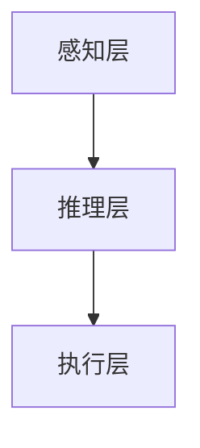

                 


# 基于神经符号AI的AI Agent可解释性增强

> 关键词：神经符号AI，AI Agent，可解释性，混合架构，注意力机制

> 摘要：本文探讨了如何通过神经符号AI增强AI Agent的可解释性。文章首先介绍神经符号AI与AI Agent的基本概念，分析当前AI系统在可解释性方面的挑战。接着，深入解析神经符号AI的核心原理，结合具体的算法实现，阐述其在AI Agent中的应用。通过系统架构设计和项目实战，展示如何在实际场景中增强AI Agent的可解释性。最后，总结了神经符号AI在AI Agent中的优势，并提出了未来研究的方向。

---

## 第一部分：神经符号AI与AI Agent概述

### 第1章：神经符号AI与AI Agent基础

#### 1.1 神经符号AI的定义与特点

神经符号AI是将符号推理与神经网络相结合的新兴技术，旨在结合符号AI的可解释性和神经网络的强大的特征学习能力。以下是神经符号AI的几个关键特点：

- **符号表示**：通过符号表示知识和逻辑推理，使得模型具有可解释性。
- **神经网络**：利用神经网络进行特征学习和模式识别，增强模型的灵活性。
- **混合架构**：将符号推理与神经网络结合，形成互补的优势。

#### 1.2 AI Agent的基本概念

AI Agent是一种能够感知环境、做出决策并执行动作的智能实体。AI Agent的核心功能包括：

- **感知**：通过传感器或数据输入获取环境信息。
- **推理**：基于感知信息进行逻辑推理，形成决策。
- **执行**：根据推理结果执行动作，与环境交互。

#### 1.3 神经符号AI在AI Agent中的作用

神经符号AI通过结合符号推理和神经网络，为AI Agent提供了以下优势：

- **可解释性**：符号推理使得决策过程更透明。
- **学习能力**：神经网络增强了模型的自适应性和灵活性。
- **复杂任务处理**：神经符号AI能够处理复杂任务，同时保持可解释性。

---

### 第2章：可解释性AI的背景与挑战

#### 2.1 可解释性AI的重要性

在AI系统中，可解释性是用户信任和系统调试的关键因素。对于AI Agent而言，可解释性尤为重要，因为它需要与人类进行交互并做出解释。

#### 2.2 当前AI系统的可解释性问题

传统神经网络模型被视为“黑箱”，难以解释其决策过程。这种不可解释性限制了AI Agent在关键领域的应用，如医疗和金融。

#### 2.3 增强AI Agent可解释性的挑战

- **模型复杂性**：神经网络的深度和复杂性导致可解释性困难。
- **符号与神经网络的结合**：如何有效结合符号推理与神经网络是技术难点。

---

### 第3章：神经符号AI的核心原理

#### 3.1 符号AI的基本原理

符号AI通过符号表示和逻辑推理进行知识处理。例如，使用逻辑规则进行推理。

#### 3.2 神经网络的基本原理

神经网络通过层次化特征学习，提取数据中的模式。例如，卷积神经网络用于图像识别。

#### 3.3 神经符号AI的结合方式

神经符号AI可以通过以下方式结合符号推理与神经网络：

- **神经网络驱动符号推理**：神经网络生成符号表示，用于符号推理。
- **符号指导神经网络**：符号知识指导神经网络的学习过程。

---

### 第4章：AI Agent的系统架构

#### 4.1 AI Agent的基本架构

AI Agent通常包括感知层、推理层和执行层。感知层负责数据输入，推理层进行逻辑推理，执行层负责动作输出。

#### 4.2 神经符号AI在AI Agent中的架构设计

神经符号AI在AI Agent中的架构设计包括：

- **感知层**：使用神经网络进行特征提取。
- **推理层**：结合符号推理和神经网络进行决策。
- **执行层**：根据推理结果执行动作。

---

### 第5章：神经符号AI的算法实现

#### 5.1 注意力机制在神经符号AI中的应用

注意力机制用于神经符号AI中的特征选择。例如，在自然语言处理中，注意力机制可以用于选择重要的词语。

#### 5.2 神经符号AI中的符号规则融合

符号规则可以通过约束条件融合到神经网络中。例如，在图像分类任务中，符号规则可以用于约束模型的输出。

---

## 第二部分：系统架构与项目实战

### 第6章：系统架构设计

#### 6.1 问题场景介绍

以医疗诊断为例，设计一个基于神经符号AI的AI Agent系统。

#### 6.2 系统功能设计

- **感知层**：收集患者的症状和病史。
- **推理层**：结合症状和病史进行推理，生成诊断结果。
- **执行层**：输出诊断结果并建议治疗方案。

#### 6.3 系统架构设计

使用Mermaid图展示系统架构：



---

### 第7章：项目实战

#### 7.1 环境安装

安装必要的库，如TensorFlow和符号逻辑库。

#### 7.2 核心代码实现

以下是一个简单的神经符号AI模型实现：

```python
import tensorflow as tf
from tensorflow.keras import layers

# 定义符号规则
symbol_rules = {
    '规则1': '如果A则B',
    '规则2': '如果B则C'
}

# 定义神经网络部分
model = tf.keras.Sequential([
    layers.Dense(64, activation='relu'),
    layers.Dense(1, activation='sigmoid')
])

# 编译模型
model.compile(optimizer='adam', loss='binary_crossentropy')
```

---

### 第8章：小结

神经符号AI通过结合符号推理与神经网络，为AI Agent提供了强大的可解释性。本文通过理论分析和项目实战，展示了如何在实际场景中增强AI Agent的可解释性。

---

## 作者信息

作者：AI天才研究院/AI Genius Institute & 禅与计算机程序设计艺术 /Zen And The Art of Computer Programming

