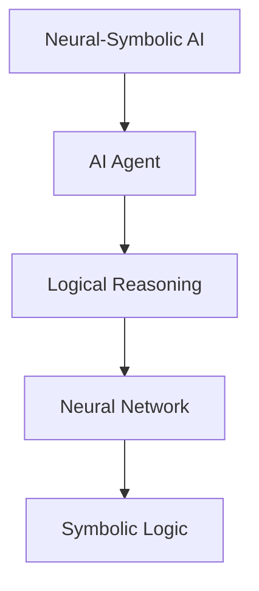
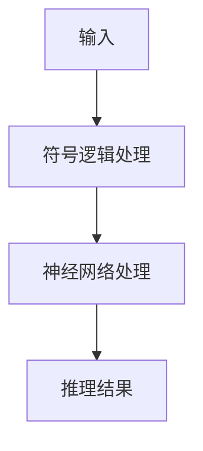
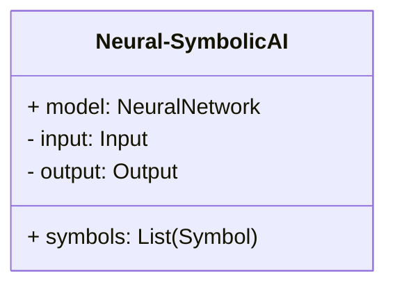
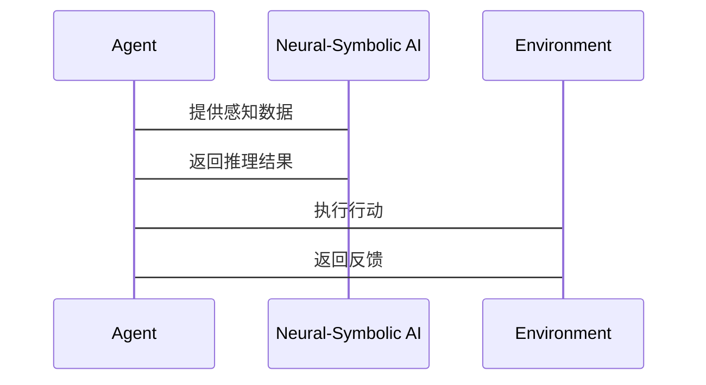

                 


```markdown
# 基于神经符号AI的AI Agent逻辑推理

> 关键词：神经符号AI，AI Agent，逻辑推理，符号逻辑，神经网络，人工智能

> 摘要：本文将介绍神经符号AI在AI Agent中的应用，特别是其在逻辑推理方面的能力。通过对神经符号AI与AI Agent的结合，探讨其在逻辑推理中的优势和实现机制，包括算法原理、系统架构设计以及实际案例分析。

---

# 第一部分: 背景介绍

## 第1章: 神经符号AI与AI Agent概述

### 1.1 神经符号AI的基本概念
#### 1.1.1 神经符号AI的定义
神经符号AI（Neural-Symbolic AI）是一种结合了符号逻辑和神经网络的人工智能方法。它通过将符号逻辑与神经网络的表示能力相结合，能够在处理符号逻辑的同时，利用神经网络强大的模式识别能力。

#### 1.1.2 神经符号AI的特点
神经符号AI的特点包括：
- **符号表示**：能够处理符号逻辑，适用于需要明确推理规则的任务。
- **神经网络能力**：利用神经网络进行特征学习和模式识别。
- **结合优势**：将符号逻辑的精确性和神经网络的学习能力结合起来。

#### 1.1.3 神经符号AI与传统符号AI的区别
- 传统符号AI依赖于预定义的规则和逻辑推理，缺乏学习能力。
- 神经符号AI结合了神经网络的学习能力和符号逻辑的精确推理，能够自适应地优化推理过程。

### 1.2 AI Agent的基本概念
#### 1.2.1 AI Agent的定义
AI Agent（人工智能代理）是一种能够感知环境、自主决策并采取行动的智能实体。它可以理解、学习、推理和执行任务。

#### 1.2.2 AI Agent的类型
AI Agent可以分为以下几种类型：
- **反应式AI Agent**：基于当前感知做出反应，没有内部状态。
- **认知式AI Agent**：具有复杂推理和规划能力，能够处理复杂任务。
- **学习式AI Agent**：能够通过经验优化自身行为。

#### 1.2.3 AI Agent的核心功能
AI Agent的核心功能包括：
- **感知**：从环境中获取信息。
- **推理**：基于感知信息进行逻辑推理。
- **决策**：根据推理结果做出决策。
- **行动**：执行决策动作。

### 1.3 神经符号AI在AI Agent中的应用
#### 1.3.1 神经符号AI的优势
神经符号AI在AI Agent中的优势在于其能够结合符号逻辑的精确性和神经网络的学习能力，适用于需要复杂推理的任务。

#### 1.3.2 神经符号AI在逻辑推理中的作用
神经符号AI通过符号逻辑推理和神经网络的结合，能够在复杂环境中进行推理和决策。

#### 1.3.3 神经符号AI与AI Agent的结合
神经符号AI为AI Agent提供了更强大的推理能力，使其能够处理复杂逻辑任务。

---

## 第2章: 问题背景与描述

### 2.1 传统AI Agent的局限性
#### 2.1.1 符号逻辑推理的不足
传统符号逻辑推理依赖于预定义规则，缺乏灵活性和自适应性。

#### 2.1.2 神经网络在逻辑推理中的挑战
神经网络擅长模式识别和分类，但在符号逻辑推理方面存在不足。

### 2.2 神经符号AI的解决方案
#### 2.2.1 神经符号AI的核心思想
通过结合符号逻辑和神经网络，神经符号AI能够在保持符号逻辑精确性的同时，具备学习能力。

#### 2.2.2 神经符号AI如何解决传统AI Agent的不足
神经符号AI通过符号逻辑推理和神经网络的结合，弥补了传统符号逻辑推理的不足。

### 2.3 问题解决与边界
#### 2.3.1 神经符号AI在AI Agent中的具体应用
神经符号AI适用于需要复杂逻辑推理的任务，如知识图谱推理和规划问题。

#### 2.3.2 神经符号AI的边界与外延
神经符号AI目前主要应用于推理和决策任务，但在处理复杂动态环境和大规模数据方面仍存在挑战。

#### 2.3.3 神经符号AI的潜在应用场景
神经符号AI的潜在应用场景包括智能助手、自动驾驶和智能机器人等领域。

---

# 第二部分: 核心概念与联系

## 第3章: 神经符号AI的核心原理

### 3.1 神经符号AI的原理
#### 3.1.1 神经网络与符号逻辑的结合
神经符号AI通过将符号逻辑嵌入到神经网络中，实现了逻辑推理和学习能力的结合。

#### 3.1.2 神经符号AI的数学模型
神经符号AI的数学模型包括符号逻辑规则和神经网络的权重参数。

#### 3.1.3 神经符号AI的训练方法
神经符号AI的训练方法结合了符号逻辑规则和神经网络的端到端训练。

### 3.2 AI Agent的逻辑推理机制
#### 3.2.1 符号逻辑推理的基本原理
符号逻辑推理基于预定义的逻辑规则进行推理。

#### 3.2.2 神经网络在逻辑推理中的应用
神经网络通过学习特征表示，辅助符号逻辑推理。

#### 3.2.3 神经符号AI的逻辑推理流程
神经符号AI的逻辑推理流程包括符号逻辑推理和神经网络推理的结合。

### 3.3 神经符号AI与AI Agent的关系
#### 3.3.1 神经符号AI在AI Agent中的作用
神经符号AI为AI Agent提供了更强大的推理能力。

#### 3.3.2 AI Agent在神经符号AI中的作用
AI Agent通过神经符号AI的推理能力，能够更好地完成任务。

#### 3.3.3 神经符号AI与AI Agent的关系图


---

## 第4章: 神经符号AI与AI Agent的核心概念对比

### 4.1 神经符号AI与AI Agent的核心概念对比
| 概念 | 神经符号AI | AI Agent |
|------|------------|----------|
| 核心任务 | 逻辑推理 | 感知、推理、决策、行动 |
| 输入 | 符号逻辑和数据 | 环境信息 |
| 输出 | 推理结果 | 行动 |

### 4.2 神经符号AI的ER实体关系图
```mermaid
er
actor(AI Agent) -|> entity(Neural-Symbolic AI)
```

---

# 第三部分: 算法原理讲解

## 第5章: 神经符号AI的算法流程

### 5.1 神经符号AI的算法流程图


### 5.2 神经符号AI的算法实现
```python
def neural_symbolic_inference(input, symbols, model):
    # 符号逻辑处理
    symbolic_input = preprocess(input, symbols)
    # 神经网络推理
    output = model.inference(symbolic_input)
    return output
```

### 5.3 神经符号AI的数学模型
$$ P(y|x) = \sigma(Wx + b) $$

### 5.4 神经符号AI的推理过程
1. **输入处理**：将输入数据转换为符号表示。
2. **神经网络推理**：通过神经网络进行特征提取和推理。
3. **符号逻辑推理**：结合符号逻辑规则进行最终推理。

---

## 第6章: 神经符号AI的逻辑推理数学公式

### 6.1 符号逻辑推理
$$ \text{如果} \ A \text{且} B，\text{则} C $$

### 6.2 神经网络推理
$$ y = \text{sigmoid}(Wx + b) $$

---

# 第四部分: 系统分析与架构设计

## 第7章: AI Agent的逻辑推理系统

### 7.1 系统功能设计


### 7.2 系统架构设计


### 7.3 系统接口设计
- **输入接口**：接收感知数据和符号逻辑规则。
- **输出接口**：输出推理结果和行动指令。

### 7.4 系统交互流程图


---

## 第8章: 神经符号AI的系统架构

### 8.1 神经符号AI的系统架构


---

# 第五部分: 项目实战

## 第9章: 项目实现

### 9.1 环境安装
```bash
pip install neural-symbolic-ai
```

### 9.2 核心代码实现
```python
class NeuralSymbolicAI:
    def __init__(self, symbols):
        self.symbols = symbols
        self.model = NeuralNetwork()

    def infer(self, input):
        symbolic_input = preprocess(input, self.symbols)
        result = self.model.predict(symbolic_input)
        return result
```

### 9.3 代码解读与分析
- **NeuralSymbolicAI类**：初始化符号逻辑规则和神经网络模型。
- **infer方法**：处理输入数据，进行符号逻辑处理和神经网络推理。

### 9.4 案例分析
通过一个具体案例，展示神经符号AI在AI Agent中的应用。

---

## 第10章: 总结与展望

### 10.1 总结
神经符号AI结合了符号逻辑和神经网络的优势，为AI Agent提供了强大的推理能力。

### 10.2 未来研究方向
- 提高神经符号AI的推理效率。
- 拓展神经符号AI在更多领域的应用。

---

作者：AI天才研究院/AI Genius Institute & 禅与计算机程序设计艺术 /Zen And The Art of Computer Programming
```

