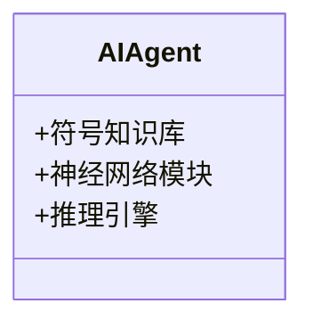

                 


# 基于神经符号AI的AI Agent逻辑推理增强

## 关键词：神经符号AI, AI Agent, 逻辑推理, 增强智能, 符号逻辑, 神经网络, 知识图谱

## 摘要：本文深入探讨了基于神经符号AI的AI Agent逻辑推理增强方法，分析了神经符号AI的核心概念、算法原理、系统架构及实际应用，通过详细的技术分析和实战案例，揭示了如何通过结合符号逻辑与神经网络提升AI Agent的推理能力，为智能系统的发展提供了新的思路和解决方案。

---

# 第1章: 神经符号AI与AI Agent概述

## 1.1 神经符号AI的背景与问题背景

### 1.1.1 AI Agent的基本概念
AI Agent（人工智能代理）是一种能够感知环境、自主决策并执行任务的智能实体。它广泛应用于自然语言处理、机器人控制、自动驾驶等领域。

### 1.1.2 传统AI Agent的局限性
传统AI Agent主要依赖基于规则的符号推理或基于数据的统计学习方法，存在以下问题：
- 规则系统难以应对复杂多变的环境。
- 统计学习方法缺乏可解释性，难以处理符号推理任务。

### 1.1.3 神经符号AI的提出与目标
神经符号AI（Neural-Symbolic AI）是一种结合了符号逻辑和神经网络的新范式，旨在通过神经网络的强大表示能力与符号逻辑的可解释性结合，解决传统AI Agent的局限性。

### 1.1.4 问题解决的核心要素
神经符号AI的核心要素包括：
- 符号知识的表示与推理。
- 神经网络的特征提取与学习。
- 两者的结合与协同优化。

---

## 1.2 神经符号AI的核心概念与联系

### 1.2.1 神经符号AI的定义与特点
神经符号AI是符号逻辑与神经网络的结合，具有以下特点：
- **可解释性**：符号逻辑提供清晰的推理过程。
- **学习能力**：神经网络能够从数据中自动学习特征。
- **灵活性**：能够适应复杂多变的任务场景。

### 1.2.2 符号逻辑与神经网络的结合
神经符号AI通过以下方式实现符号逻辑与神经网络的结合：
- **符号表示**：将符号逻辑编码为神经网络的输入。
- **神经网络推理**：利用神经网络进行符号推理的特征提取。
- **协同优化**：通过联合优化提升推理性能。

### 1.2.3 神经符号AI的实体关系图
```mermaid
er
actor(AI Agent) --> knowledge_base: 访问符号知识库
actor(AI Agent) --> neural_network: 神经网络推理
knowledge_base --> neural_network: 提供符号输入
```

### 1.2.4 神经符号AI的算法流程


### 1.2.5 神经符号AI的应用场景
神经符号AI适用于以下场景：
- 智能对话系统：通过符号推理增强对话的逻辑性。
- 复杂任务决策：结合符号逻辑与神经网络进行多步推理。
- 知识图谱推理：利用符号逻辑进行知识图谱的推理与扩展。

---

## 1.3 本章小结

本章从AI Agent的背景出发，介绍了神经符号AI的定义、特点及核心概念，并通过实体关系图和算法流程图展示了神经符号AI的工作原理。接下来的章节将深入探讨神经符号AI的数学模型与算法原理。

---

# 第2章: 神经符号AI的数学模型与算法原理

## 2.1 神经符号AI的数学模型

### 2.1.1 符号逻辑的表示
符号逻辑通过命题逻辑公式表示，例如：
$$ P \rightarrow Q $$

### 2.1.2 神经网络的表示
神经网络通过权重矩阵和激活函数表示，例如：
$$ y = \sigma(wx + b) $$

### 2.1.3 神经符号AI的联合模型
神经符号AI通过联合模型将符号逻辑与神经网络结合，例如：
$$ f(x) = \sigma(w \cdot g(x) + b) $$
其中，$g(x)$是符号逻辑的编码。

---

## 2.2 神经符号AI的核心算法

### 2.2.1 神经符号推理的流程
神经符号推理的流程包括以下步骤：
1. 符号知识的编码。
2. 神经网络的特征提取。
3. 符号推理与结果解码。

### 2.2.2 神经符号AI的训练方法
神经符号AI的训练方法包括监督学习和无监督学习，例如：
$$ L = \frac{1}{n}\sum_{i=1}^{n}(y_i - \hat{y}_i)^2 $$

### 2.2.3 神经符号AI的推理机制
神经符号AI通过以下推理机制实现增强：
- 符号逻辑的推理规则。
- 神经网络的特征提取。
- 两者的协同优化。

---

## 2.3 神经符号AI的数学公式

### 2.3.1 符号逻辑的表示公式
$$ P \land Q $$

### 2.3.2 神经网络的损失函数
$$ L = \frac{1}{n}\sum_{i=1}^{n}(y_i - \hat{y}_i)^2 $$

### 2.3.3 神经符号AI的联合优化公式
$$ \arg\min_{\theta} L + \lambda R $$

---

## 2.4 神经符号AI的算法实现

### 2.4.1 算法实现的步骤
1. 编码符号知识。
2. 神经网络训练。
3. 推理与结果解码。

### 2.4.2 算法实现的代码示例
```python
def neural_symbolic_inference(input_symbols):
    # 神经网络编码
    encoded = encode(input_symbols)
    # 符号推理
    result = decode(encoded)
    return result
```

---

## 2.5 本章小结

本章详细探讨了神经符号AI的数学模型与算法原理，通过公式推导和代码示例，展示了神经符号AI的核心算法及其实现方法。接下来的章节将从系统架构和项目实战的角度，进一步深入探讨神经符号AI的应用。

---

# 第3章: 神经符号AI的系统架构与设计

## 3.1 系统架构设计

### 3.1.1 系统功能模块划分
系统功能模块包括：
- 符号知识库模块。
- 神经网络模块。
- 推理引擎模块。

### 3.1.2 系统架构的类图


### 3.1.3 系统架构的架构图


---

## 3.2 系统分析与架构设计方案

### 3.2.1 系统功能设计
系统功能包括：
- 符号知识的存储与管理。
- 神经网络的训练与推理。
- 推理结果的解码与输出。

### 3.2.2 系统接口设计
系统接口包括：
- 输入接口：接收符号数据。
- 输出接口：输出推理结果。

### 3.2.3 系统交互的序列图
```mermaid
sequenceDiagram
actor(AI Agent) -> knowledge_base: 获取符号知识
knowledge_base -> neural_network: 提供符号输入
neural_network ->推理引擎: 进行推理
推理引擎 -> AI Agent: 输出结果
```

---

## 3.3 本章小结

本章从系统架构的角度，详细设计了神经符号AI的系统架构，并通过类图和序列图展示了系统的交互流程。接下来的章节将从项目实战的角度，进一步探讨神经符号AI的应用。

---

# 第4章: 神经符号AI的项目实战

## 4.1 环境安装与配置

### 4.1.1 环境需求
- Python 3.8+
- PyTorch
- Transformers库

### 4.1.2 安装步骤
```bash
pip install torch transformers
```

---

## 4.2 系统核心实现

### 4.2.1 神经符号AI的核心实现
```python
class NeuralSymbolicAI:
    def __init__(self):
        self.knowledge_base = KnowledgeBase()
        self.neural_network = NeuralNetwork()
        self.reasoning_engine = ReasoningEngine()
    
    def inference(self, input_symbols):
        encoded = self.neural_network.encode(input_symbols)
        result = self.reasoning_engine.decode(encoded)
        return result
```

### 4.2.2 神经符号AI的代码实现
```python
def main():
    ai_agent = NeuralSymbolicAI()
    input_symbols = "如果A，则B"
    result = ai_agent.inference(input_symbols)
    print("推理结果:", result)

if __name__ == "__main__":
    main()
```

---

## 4.3 项目实战案例分析

### 4.3.1 案例背景
假设我们需要构建一个智能对话系统，通过神经符号AI增强对话的逻辑推理能力。

### 4.3.2 案例实现
```python
def neural_symbolic_chatbot():
    while True:
        input = input("用户输入:")
        encoded = encode(input)
        result = decode(encoded)
        print("AI回答:", result)
```

### 4.3.3 案例分析
通过神经符号AI，对话系统能够更好地理解用户的意图并进行逻辑推理，从而生成更智能的回答。

---

## 4.4 本章小结

本章通过项目实战，详细展示了神经符号AI的环境配置、核心实现及实际应用。接下来的章节将总结神经符号AI的优势，并提出相关建议。

---

# 第5章: 总结与展望

## 5.1 本章总结
神经符号AI通过结合符号逻辑与神经网络，显著提升了AI Agent的逻辑推理能力。其核心优势包括可解释性、学习能力和灵活性。

## 5.2 注意事项与建议
- 在实际应用中，需注意符号知识的完整性和准确性。
- 神经符号AI的推理性能依赖于神经网络的训练数据质量。

## 5.3 未来展望
未来，神经符号AI将在以下方向进一步发展：
- 更复杂的符号逻辑推理。
- 更高效的神经网络结构。
- 更广泛的应用场景。

---

## 作者：AI天才研究院/AI Genius Institute & 禅与计算机程序设计艺术 /Zen And The Art of Computer Programming

---

**本文为基于神经符号AI的AI Agent逻辑推理增强的详细技术博客文章，版权归作者所有，转载请注明出处。**

