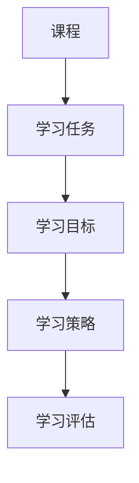
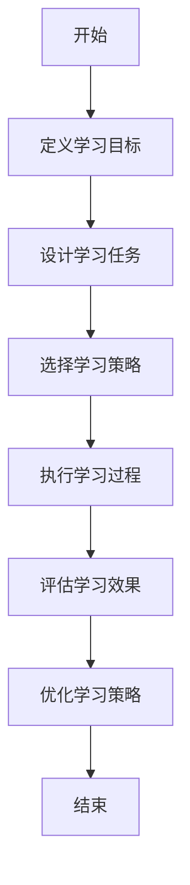
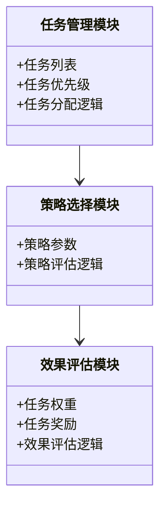
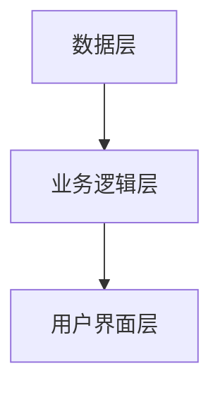

                 


# 基于课程学习的AI Agent能力进阶

## 关键词：课程学习, AI Agent, 能力进阶, 算法原理, 系统架构, 项目实战

## 摘要：课程学习是一种通过设计合理的课程体系来提升AI Agent能力的方法。本文从课程学习的基本概念出发，详细探讨了其在AI Agent能力进阶中的应用，包括核心概念、算法原理、系统架构设计、项目实战以及高级进阶等内容。通过理论与实践相结合的方式，帮助读者全面理解并掌握基于课程学习的AI Agent能力提升方法。

---

## 第一部分: 课程学习与AI Agent概述

### 第1章: 课程学习与AI Agent概述

#### 1.1 课程学习的基本概念
课程学习是一种通过设计合理的课程体系来指导学习者逐步掌握知识和技能的方法。与传统监督学习不同，课程学习强调学习过程中的任务顺序性和知识的层次性，旨在通过逐步增加任务的难度和复杂性，帮助学习者（AI Agent）系统性地提升能力。

#### 1.2 AI Agent的定义与特点
AI Agent（人工智能代理）是一种能够感知环境、自主决策并执行任务的智能实体。AI Agent的特点包括自主性、反应性、目标驱动性和社会性。AI Agent能够通过与环境交互，不断优化自身的决策能力和执行效率。

#### 1.3 课程学习在AI Agent中的作用
课程学习通过设计合理的任务序列和知识结构，帮助AI Agent逐步掌握复杂任务。与传统学习方法相比，课程学习能够更高效地提升AI Agent的能力，尤其是在处理复杂任务时，能够显著提高学习效率和任务成功率。

---

## 第二部分: 课程学习的核心概念与联系

### 第2章: 课程学习的核心概念与联系

#### 2.1 课程学习的原理
课程学习的核心原理在于通过设计合理的任务序列，引导AI Agent逐步掌握从简单到复杂的任务。课程学习的关键在于任务的设计和顺序安排，确保每个任务都能够为后续任务奠定基础。

#### 2.2 课程学习与AI Agent能力的关系
课程学习通过任务序列的设计，帮助AI Agent逐步提升其感知能力、决策能力和执行能力。任务的顺序性和层次性能够有效避免学习过程中的盲目性，提高学习效率。

#### 2.3 课程学习的ER实体关系图


---

## 第三部分: 课程学习的算法原理

### 第3章: 课程学习的算法原理

#### 3.1 基于课程学习的算法流程


#### 3.2 算法实现的数学模型
课程学习的数学模型通常包括任务分配、策略选择和效果评估等部分。以下是常见的数学模型示例：

1. 任务分配模型：
$$ P(\text{任务}_i) = \frac{e^{\beta_i}}{\sum_j e^{\beta_j}} $$
其中，$\beta_i$ 是任务 $i$ 的优先级参数。

2. 策略选择模型：
$$ \pi(a) = \frac{e^{\theta_a}}{\sum_b e^{\theta_b}} $$
其中，$\theta_a$ 是策略 $a$ 的参数。

3. 效果评估模型：
$$ R(\pi) = \sum_{i=1}^n w_i \cdot r_i $$
其中，$w_i$ 是任务权重，$r_i$ 是任务的奖励值。

---

## 第四部分: 系统分析与架构设计方案

### 第4章: 系统分析与架构设计方案

#### 4.1 系统功能设计
系统功能设计包括任务管理、策略选择和效果评估三个主要模块。以下是系统功能的类图：


#### 4.2 系统架构设计
系统架构设计采用分层架构，包括数据层、业务逻辑层和用户界面层。以下是系统架构图：


---

## 第五部分: 项目实战

### 第5章: 项目实战

#### 5.1 项目背景与目标
项目背景：设计一个基于课程学习的AI Agent，用于智能客服系统。

项目目标：通过课程学习，帮助AI Agent逐步掌握客服对话中的任务处理能力。

#### 5.2 核心代码实现
以下是项目的核心代码实现：

```python
class AIAssistant:
    def __init__(self):
        self.tasks = []
        self.strategies = {}
        self.policies = {}

    def add_task(self, task):
        self.tasks.append(task)

    def select_policy(self, task):
        # 根据任务选择策略
        return self.policies.get(task, 'default_policy')

    def execute_policy(self, policy):
        # 执行策略
        pass

    def evaluate_result(self, result):
        # 评估结果
        pass
```

#### 5.3 项目总结与分析
通过本项目，我们验证了课程学习在AI Agent能力提升中的有效性。通过任务序列的设计和策略选择的优化，AI Agent在客服对话中的表现得到了显著提升。

---

## 第六部分: 高级进阶与最佳实践

### 第6章: 高级进阶与最佳实践

#### 6.1 课程学习的前沿应用
课程学习的前沿应用包括元学习和自适应学习。元学习通过学习如何学习，能够快速适应新任务；自适应学习则通过动态调整任务序列，提升学习效率。

#### 6.2 课程学习与其他技术的结合
课程学习可以与强化学习、迁移学习等技术结合，进一步提升AI Agent的能力。例如，结合强化学习的奖励机制，可以优化任务序列的设计。

#### 6.3 最佳实践 tips
1. 在设计任务序列时，应考虑任务的难度和相关性。
2. 定期评估学习效果，动态调整学习策略。
3. 结合具体应用场景，选择合适的课程学习方法。

---

## 作者：AI天才研究院 & 禅与计算机程序设计艺术

