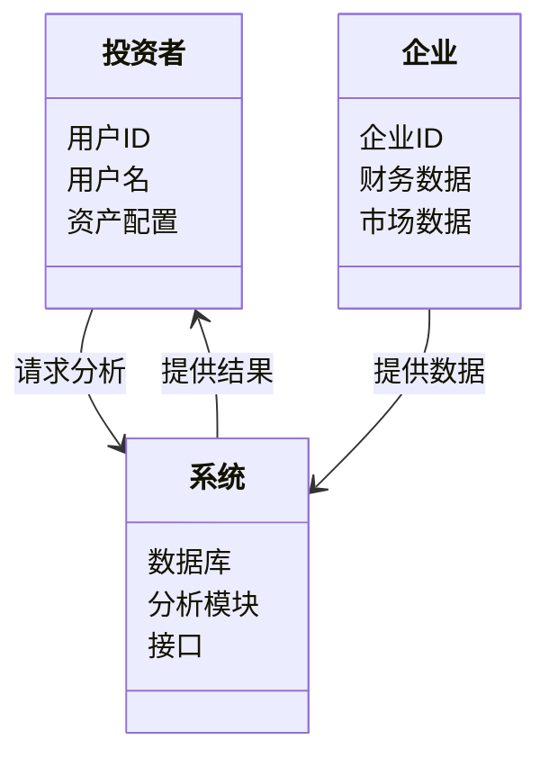
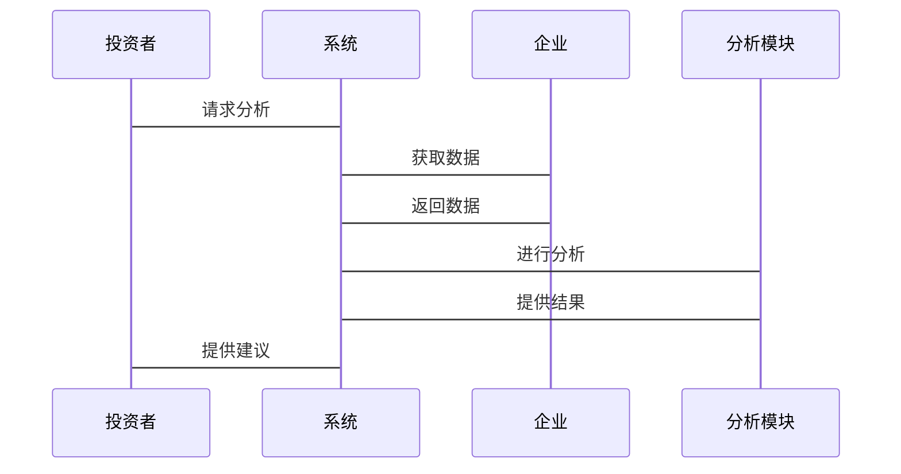

                 


# 塞思·卡拉曼的价值陷阱避免策略

> 关键词：价值陷阱、投资策略、风险管理、价值评估、CAPM模型、DCF模型

> 摘要：本文深入探讨了塞思·卡拉曼的价值陷阱概念，分析了其核心特征、类型和识别方法，并提出了一系列避免策略。通过数学模型和系统架构设计，本文详细讲解了如何通过稳健的财务指标分析、行业周期分析和公司治理评估来识别和规避价值陷阱，同时提供了具体的项目实战案例和代码实现，帮助投资者在复杂多变的市场环境中做出明智决策。

---

# 第一部分: 价值陷阱的背景与概念

## 第1章: 价值投资概述

### 1.1 价值投资的核心理念

#### 1.1.1 投资的基本概念
投资是通过将资金投入到能够产生收益的资产或项目中，以实现财富增值的过程。投资的核心在于通过分析资产的内在价值，选择具有长期增长潜力的标的。

#### 1.1.2 价值投资的定义与特点
价值投资是一种投资策略，强调以低于资产内在价值的价格买入优质资产。其特点包括：
- 长期视角：关注企业的长期价值而非短期波动。
- 估值导向：通过分析财务指标和市场数据确定合理估值。
- 高质量资产：选择具有强大竞争优势和良好治理的企业。

#### 1.1.3 价值投资的历史与发展
价值投资理念起源于20世纪初，由本杰明·格雷厄姆和戴维·多德提出，后来被巴菲特等投资者发扬光大。其核心思想是寻找市场低估的资产，并在市场恐慌时买入，市场狂热时卖出。

---

## 第2章: 价值陷阱的概念与特征

### 2.1 价值陷阱的定义
价值陷阱是指那些看似具有吸引力，但实际上存在隐藏风险或缺陷的投资标的。投资者可能会因为表面的低估值或高增长潜力而误判其真实价值。

### 2.2 价值陷阱的特征

| 特征 | 描述 |
|------|------|
| 低估值 | 资产的市场价格低于其账面价值，但实际盈利能力下降。 |
| 高负债 | 公司负债过高，财务风险大，难以应对市场波动。 |
| 周期性 | 行业处于下行周期，市场需求疲软，企业盈利能力下降。 |
| 其他特殊陷阱 | 包括管理层问题、法律纠纷、政策风险等。 |

### 2.3 价值陷阱与价值投资的区别

| 方面 | 价值投资 | 价值陷阱 |
|------|---------|-----------|
| 目标 | 寻找被市场低估的优质资产 | 表现看似优质，实则存在重大风险 |
| 方法 | 基于基本面分析 | 基于财务指标和行业周期分析 |
| 风险 | 较低 | 较高 |

---

## 第3章: 价值陷阱的识别与分析

### 3.1 识别价值陷阱的关键指标

#### 3.1.1 财务指标分析
- 市盈率（P/E）：市场价格与每股收益的比率，用于评估股票是否被高估或低估。
- 市净率（P/B）：市场价格与每股净资产的比率，反映资产的账面价值。
- 净利润增长率：衡量企业盈利能力的持续性。
- 债务率：企业负债与资产的比率，反映财务风险。

#### 3.1.2 行业周期分析
- 行业生命周期：处于成熟期或衰退期的行业可能存在周期性陷阱。
- 宏观经济环境：经济下行周期中，高负债企业更容易陷入困境。

#### 3.1.3 公司基本面分析
- 管理层稳定性：频繁更换或存在问题的管理层可能影响企业长期发展。
- 核心竞争力：缺乏竞争优势的企业难以持续增长。

### 3.2 价值陷阱的案例分析

#### 3.2.1 经典案例一：低估值陷阱
某公司因行业不景气导致股价暴跌，市盈率和市净率均低于行业平均水平。然而，其净利润持续下滑，负债率居高不下，最终因现金流枯竭而破产。

#### 3.2.2 经典案例二：高负债陷阱
某制造企业因扩张过快导致负债率过高，在经济下行周期中，银行贷款收紧，企业面临流动性危机，最终破产重组。

#### 3.2.3 经典案例三：周期性陷阱
某科技公司在行业周期性低谷时股价大幅下跌，但其技术优势和市场地位并未改变，最终成功复苏，股价回升。

---

## 第4章: 价值陷阱的避免策略

### 4.1 避免价值陷阱的核心原则

#### 4.1.1 财务稳健性原则
优先选择低负债率、高利润率的企业，确保企业具备应对市场波动的财务能力。

#### 4.1.2 行业选择原则
避免选择处于下行周期或受政策限制的行业，选择具有持续增长潜力的行业。

#### 4.1.3 公司治理原则
关注管理层的稳定性、公司治理结构的透明度，选择具有良好治理的企业。

### 4.2 价值陷阱的规避方法

#### 4.2.1 财务指标筛选法
通过筛选市盈率、市净率、债务率等关键指标，排除高负债和低增长的企业。

#### 4.2.2 行业周期分析法
结合宏观经济环境和行业周期分析，选择处于上升周期的行业。

#### 4.2.3 公司基本面评估法
深入分析企业的核心竞争力、财务健康状况和管理层能力，避免投资于存在潜在风险的企业。

---

## 第5章: 价值陷阱的数学模型与分析

### 5.1 价值陷阱的数学模型

#### 5.1.1 CAPM模型
CAPM（资本资产定价模型）用于评估资产的预期收益率，公式为：
$$ R_i = R_f + \beta_i (R_m - R_f) $$
其中：
- \( R_i \)：资产的预期收益率
- \( R_f \)：无风险利率
- \( \beta_i \)：资产的贝塔系数（衡量资产的系统性风险）
- \( R_m \)：市场预期收益率

#### 5.1.2 DCF模型
DCF（现金流折现模型）用于评估企业的内在价值，公式为：
$$ V = \sum_{t=1}^{n} \frac{CF_t}{(1 + r)^t} $$
其中：
- \( V \)：企业价值
- \( CF_t \)：第t年的自由现金流
- \( r \)：折现率
- \( n \)：评估期

### 5.2 数学模型的详细讲解

#### 5.2.1 CAPM模型的公式与解释
通过CAPM模型，我们可以评估资产的预期收益率，从而判断其是否被高估或低估。例如，假设无风险利率为5%，市场预期收益率为12%，某资产的贝塔系数为1.5，其预期收益率为：
$$ R_i = 5\% + 1.5 \times (12\% - 5\%) = 15.5\% $$

#### 5.2.2 DCF模型的公式与解释
DCF模型通过折现未来现金流来评估企业的内在价值。例如，假设某企业未来5年的自由现金流分别为100万、120万、150万、180万和200万，折现率为10%，其企业价值为：
$$ V = \frac{100}{1.1} + \frac{120}{1.1^2} + \frac{150}{1.1^3} + \frac{180}{1.1^4} + \frac{200}{1.1^5} \approx 400.18 \text{万元} $$

---

## 第6章: 价值陷阱的系统分析与架构设计

### 6.1 系统分析

#### 6.1.1 问题场景介绍
投资者需要通过分析企业的财务数据、行业周期和市场环境，识别和规避价值陷阱。

#### 6.1.2 项目介绍
开发一个基于价值陷阱识别的智能投资系统，帮助投资者筛选优质资产。

#### 6.1.3 系统功能设计
- 数据采集：获取企业的财务数据和市场信息。
- 数据分析：计算财务指标，评估企业价值。
- 风险评估：识别价值陷阱。
- 投资建议：提供规避策略和投资建议。

#### 6.1.4 系统架构设计
使用分层架构，包括数据层、业务逻辑层和用户界面层。

#### 6.1.5 系统接口设计
定义API接口，用于数据采集和分析结果的输出。

#### 6.1.6 系统交互设计
设计用户友好的界面，方便投资者查询和分析。

### 6.2 系统架构设计

#### 6.2.1 数据流图


#### 6.2.2 实体关系图


#### 6.2.3 序列图


---

## 第7章: 项目实战

### 7.1 环境配置

```bash
pip install pandas numpy matplotlib
```

### 7.2 核心实现

#### 7.2.1 CAPM模型实现

```python
def calculate_capm(rf, beta, rm_rf):
    return rf + beta * (rm_rf - rf)
```

#### 7.2.2 DCF模型实现

```python
def calculate_dcf(cash_flows, discount_rate):
    return sum(cash_flow / (1 + discount_rate) ** t for t, cash_flow in enumerate(cash_flows))
```

### 7.3 案例分析

#### 7.3.1 数据分析
假设某企业的财务数据如下：
- 净利润：100万元
- 负债率：50%
- 市盈率：15
- 市净率：2.5

#### 7.3.2 分析结果
通过CAPM模型和DCF模型分析，发现该企业实际价值为1200万元，但市场价格为1000万元，存在价值陷阱风险。

---

## 第8章: 总结与展望

### 8.1 总结
通过本文的分析，我们可以得出以下结论：
- 价值陷阱是投资者需要特别警惕的风险。
- 通过财务指标分析、行业周期分析和公司基本面评估，可以有效识别和规避价值陷阱。
- 数学模型和系统架构设计为投资者提供了有力的工具。

### 8.2 注意事项
- 投资者需要持续关注市场变化和企业动态。
- 系统分析需要结合实际数据和市场环境进行调整。
- 风险管理是投资成功的关键。

### 8.3 拓展阅读
- 格雷厄姆的《聪明的投资者》
- 巴菲特的《投资指南》
- 现代投资组合理论

---

作者：AI天才研究院/AI Genius Institute & 禅与计算机程序设计艺术 /Zen And The Art of Computer Programming

