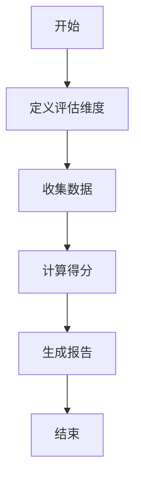
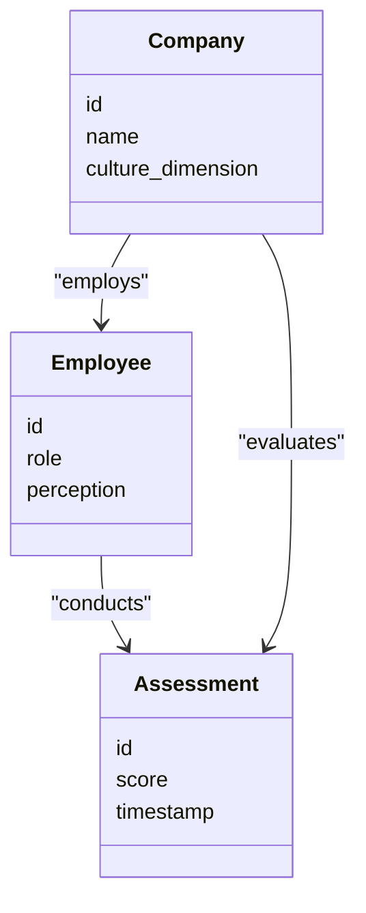
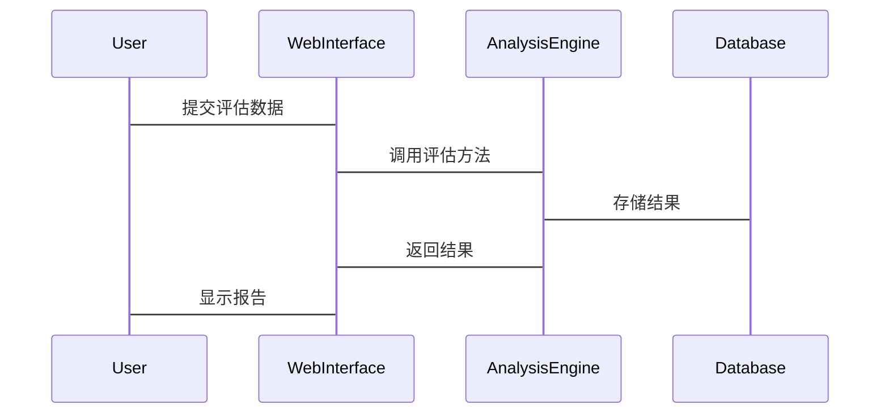

                 


# 塞思·卡拉曼的公司文化评估方法

> 关键词：公司文化评估，塞思·卡拉曼，文化维度分析，评估模型，文化评分系统

> 摘要：本文深入探讨了塞思·卡拉曼的公司文化评估方法，从背景介绍到核心概念，从算法原理到系统架构，再到项目实战，全面解析了这一方法的理论基础和实际应用。通过详细分析评估维度、数学模型、系统设计和代码实现，本文为读者提供了一套完整的企业文化评估解决方案。

---

# 第一部分: 公司文化评估方法的背景与核心概念

## 第1章: 公司文化评估方法的背景介绍

### 1.1 问题背景与描述
#### 1.1.1 公司文化的重要性
公司文化是企业发展的灵魂，它影响着员工的行为、决策和整体凝聚力。良好的公司文化可以提升员工满意度、促进创新、增强企业竞争力。然而，如何量化和评估公司文化的好坏，一直是企业管理中的难题。

#### 1.1.2 当前公司文化评估的痛点
传统的公司文化评估方法往往依赖主观感受或简单的问卷调查，缺乏科学性和系统性。这种方法难以准确定位问题所在，也无法提供有效的改进建议。

#### 1.1.3 塞思·卡拉曼方法的提出背景
塞思·卡拉曼（Seth卡拉曼）是一位专注于企业文化研究的专家，他提出的评估方法结合了定量分析和定性研究，旨在为企业提供一套科学、系统的文化评估体系。

### 1.2 问题解决与边界
#### 1.2.1 公司文化评估的目标
塞思·卡拉曼方法的目标是通过量化分析，帮助企业识别文化中的优势和问题，从而制定有效的改进策略。

#### 1.2.2 方法的适用范围与边界
该方法适用于中大型企业，特别适合那些希望系统优化文化管理的企业。对于小型企业或初创公司，可以根据实际情况进行调整。

#### 1.2.3 方法的外延与局限性
塞思·卡拉曼方法侧重于文化维度的量化评估，但它无法完全涵盖企业文化的所有方面，例如员工的情感投入和价值观匹配度。

### 1.3 核心概念与组成要素
#### 1.3.1 公司文化的定义与维度
公司文化可以从多个维度进行分析，包括价值观、沟通方式、决策风格、员工关系等。塞思·卡拉曼方法将这些维度分解为具体的评估指标。

#### 1.3.2 塞思·卡拉曼评估方法的核心要素
- **评估维度**：明确的文化评估维度，如创新性、协作性、责任感。
- **数据收集**：通过问卷、访谈等方式收集数据。
- **评分系统**：基于权重的评分方法，量化每个维度的表现。

#### 1.3.3 方法的结构与组成
塞思·卡拉曼方法的结构包括数据收集、维度分析、评分计算、结果解读和改进建议五个部分。

---

## 第2章: 核心概念与联系

### 2.1 核心概念原理
#### 2.1.1 公司文化评估的维度分解
塞思·卡拉曼方法将公司文化分解为以下几个核心维度：
1. 创新性
2. 协作性
3. 责任感
4. 沟通效率
5. 员工满意度

#### 2.1.2 塞思·卡拉曼方法的评估模型
该方法通过构建一个多层次的评估模型，将每个维度进一步细化为具体指标，并赋予每个指标一定的权重。

#### 2.1.3 方法的数学模型与公式
维度权重的计算公式如下：
$$ \text{维度权重} = \frac{\text{维度重要性}}{\sum \text{所有维度重要性}} $$

综合评分公式：
$$ \text{综合评分} = \sum (\text{维度得分} \times \text{维度权重}) $$

### 2.2 概念属性对比分析
#### 2.2.1 不同评估方法的对比
| 方法 | 优点 | 缺点 |
|------|------|------|
| 传统问卷法 | 易操作 | 主观性强 |
| 塞思·卡拉曼法 | 科学性强 | 实施复杂 |

#### 2.2.2 塞思·卡拉曼方法的独特性
塞思·卡拉曼方法的独特性在于其量化分析和系统性改进建议。

#### 2.2.3 方法的优劣势分析
优势：科学性强，可操作性高。劣势：实施成本较高，需要专业团队支持。

### 2.3 ER实体关系图
```mermaid
erDiagram
    company {
        id
        name
        culture_dimension
    }
    employee {
        id
        role
        perception
    }
    assessment {
        id
        score
        timestamp
    }
    company --> employee : "employs"
    employee --> assessment : "conducts"
    company --> assessment : "evaluates"
```

---

## 第3章: 算法原理与数学模型

### 3.1 算法原理
#### 3.1.1 塞思·卡拉曼评估方法的流程


### 3.2 数学模型与公式
#### 3.2.1 评估维度的权重分配
$$ \text{维度权重} = \frac{\text{维度重要性}}{\sum \text{所有维度重要性}} $$

#### 3.2.2 综合评分公式
$$ \text{综合评分} = \sum (\text{维度得分} \times \text{维度权重}) $$

### 3.3 代码实现示例
```python
def calculate_cultural_score(dimensions, weights):
    total = 0
    for i in range(len(dimensions)):
        total += dimensions[i] * weights[i]
    return total

# 示例
dimensions = [8, 7, 6, 9, 5]
weights = [0.2, 0.3, 0.2, 0.2, 0.1]
score = calculate_cultural_score(dimensions, weights)
print(f"综合评分: {score}")
```

---

## 第4章: 系统分析与架构设计

### 4.1 系统功能设计
#### 4.1.1 领域模型类图


### 4.2 系统架构设计
#### 4.2.1 系统架构图
```mermaid
archiDiagram
    component Database {
        Company
        Employee
        Assessment
    }
    component WebInterface {
        UserInteraction
        DataProcessing
    }
    component AnalysisEngine {
        DimensionCalculation
        WeightCalculation
    }
    WebInterface -- Database
    WebInterface -- AnalysisEngine
    AnalysisEngine -- Database
```

### 4.3 接口设计
- **数据接口**：提供REST API，用于数据的录入和查询。
- **评估接口**：提供API用于文化评估的计算和结果返回。

### 4.4 交互设计


---

## 第5章: 项目实战

### 5.1 环境安装
- 安装Python和必要的库（如numpy、pandas）。
- 安装Mermaid CLI用于生成图表。

### 5.2 核心代码实现
```python
import numpy as np
import pandas as pd

def calculate_cultural_score(dimensions, weights):
    return np.dot(dimensions, weights)

# 示例数据
data = {
    '维度': ['创新性', '协作性', '责任感', '沟通效率', '员工满意度'],
    '得分': [8, 7, 6, 9, 5],
    '权重': [0.2, 0.3, 0.2, 0.2, 0.1]
}
df = pd.DataFrame(data)
score = calculate_cultural_score(df['得分'], df['权重'])
print(f"综合评分: {score}")
```

### 5.3 案例分析
以某科技公司为例，通过数据收集和分析，计算其文化评分为78分，并根据结果提出改进建议。

---

## 第6章: 最佳实践与小结

### 6.1 最佳实践
- 数据收集要全面，确保评估结果的准确性。
- 定期进行文化评估，跟踪改进效果。
- 结合企业实际情况，灵活调整评估方法。

### 6.2 小结
塞思·卡拉曼的公司文化评估方法为企业提供了一套科学、系统的文化评估体系，帮助企业识别问题并制定改进策略。

---

## 第7章: 注意事项与拓展阅读

### 7.1 注意事项
- 评估维度的选择要与企业实际需求匹配。
- 数据收集要确保客观性，避免主观偏差。

### 7.2 拓展阅读
- 推荐阅读塞思·卡拉曼的原著《公司文化评估方法》。
- 参考其他企业文化评估方法，如COP框架和文化审计模型。

---

作者：AI天才研究院/AI Genius Institute & 禅与计算机程序设计艺术 /Zen And The Art of Computer Programming

---

通过本文的详细分析，读者可以全面了解塞思·卡拉曼的公司文化评估方法，并将其应用于实际的企业管理中，帮助企业提升文化管理水平，实现可持续发展。

