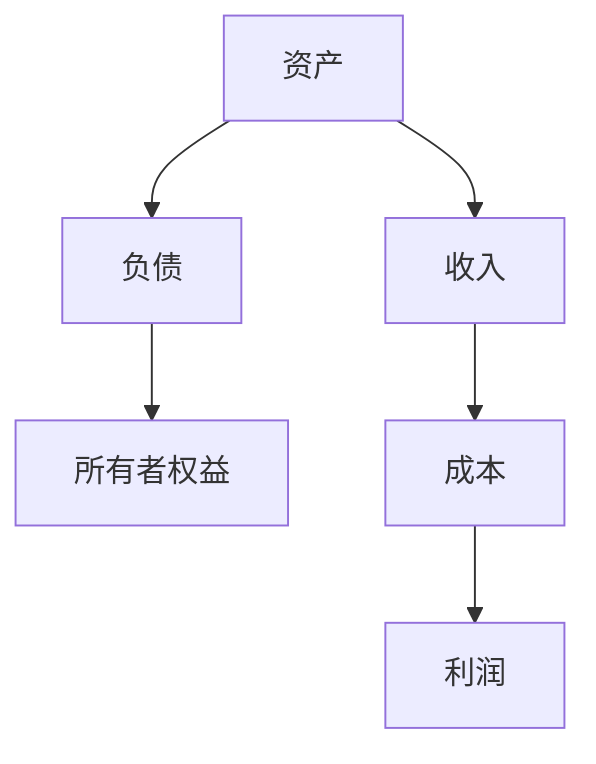
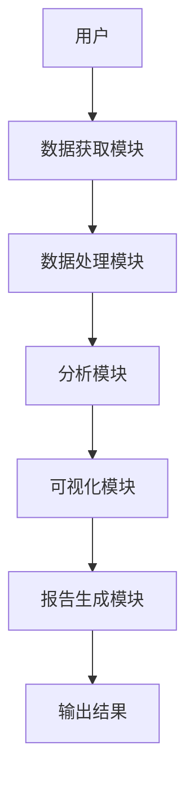

                 


# 《塞思·卡拉曼的公司财务报表深度解析》

## 关键词：财务报表分析、公司财务、利润表、资产负债表、现金流量表

## 摘要：  
本文将深入解析塞思·卡拉曼的公司财务报表，从基础概念到高级分析，结合实际案例和系统设计，帮助读者全面掌握财务报表的分析方法。通过详细解读财务报表的核心组成部分、分析方法和实际应用，本文旨在为财务分析师、企业管理者和投资者提供实用的工具和见解，以做出更明智的商业决策。

---

## 第一部分: 公司财务报表分析基础

### 第1章: 财务报表分析的背景与目标

#### 1.1 财务报表分析的背景介绍

##### 1.1.1 什么是公司财务报表
公司财务报表是企业财务状况、经营成果和现金流量的正式记录，通常包括资产负债表、利润表和现金流量表。财务报表是企业与外部利益相关者（如投资者、债权人和监管机构）沟通的重要工具。

##### 1.1.2 财务报表的三大核心报表
- **资产负债表（Balance Sheet）**：反映企业在某一特定日期的资产、负债和所有者权益的状况。
- **利润表（Income Statement）**：展示企业在一定会计期间的收入、费用和利润情况。
- **现金流量表（Cash Flow Statement）**：记录企业在一定会计期间内现金和现金等价物的流入与流出情况。

##### 1.1.3 财务报表分析的重要性
财务报表分析是评估企业财务健康状况、经营效率和未来发展前景的重要手段。通过分析财务报表，投资者可以评估企业的盈利能力、偿债能力和成长潜力，从而做出更明智的投资决策。

---

#### 1.2 财务报表分析的目标与意义

##### 1.2.1 财务报表分析的主要目标
- 评估企业的财务健康状况。
- 评估企业的盈利能力。
- 评估企业的偿债能力。
- 评估企业的经营效率。
- 评估企业的成长潜力。

##### 1.2.2 财务报表分析对企业决策的作用
- 帮助企业管理层优化资源配置。
- 帮助投资者评估投资风险和收益。
- 帮助债权人评估企业的偿债能力。
- 帮助监管机构监督企业合规性。

##### 1.2.3 财务报表分析对投资者的价值
- 揭示企业的财务状况和经营成果。
- 帮助投资者评估企业的内在价值。
- 帮助投资者识别潜在的投资机会和风险。

---

#### 1.3 财务报表分析的基本方法与工具

##### 1.3.1 常用财务分析工具
- **比率分析（Ratio Analysis）**：通过计算各种财务比率，评估企业的偿债能力、盈利能力和发展能力。
- **趋势分析（Trend Analysis）**：通过分析财务数据的变化趋势，评估企业的财务状况和经营成果。
- **行业比较（Peer Comparison）**：将企业的财务数据与同行业其他企业进行比较，评估企业的相对表现。

##### 1.3.2 数据可视化在财务分析中的应用
- 使用图表（如柱状图、折线图、饼图等）展示财务数据。
- 使用仪表盘实时监控企业的财务状况。

##### 1.3.3 财务分析的基本流程
1. **数据收集**：获取企业的财务报表数据。
2. **数据整理**：对数据进行清洗和标准化处理。
3. **数据分析**：通过比率分析、趋势分析等方法对数据进行深入分析。
4. **结果解读**：根据分析结果，评估企业的财务状况和经营成果。
5. **报告撰写**：撰写财务分析报告，提出改进建议。

---

### 第2章: 财务报表的核心组成部分

#### 2.1 资产负债表

##### 2.1.1 资产负债表的定义与结构
资产负债表是企业在某一特定日期的资产、负债和所有者权益的清单。其基本结构如下：

$$
\text{资产} = \text{负债} + \text{所有者权益}
$$

##### 2.1.2 资产、负债、所有者权益的关系
- **资产**：企业拥有的资源，包括流动资产（如现金、应收账款）和非流动资产（如固定资产、无形资产）。
- **负债**：企业欠款的金额，包括流动负债（如应付账款、短期借款）和非流动负债（如长期借款）。
- **所有者权益**：企业资产减去负债后，属于所有者的部分，包括股本、资本公积和 retained earnings（未分配利润）。

##### 2.1.3 资产负债表的重要性
资产负债表能够反映企业的财务状况，帮助评估企业的偿债能力和财务健康状况。

---

#### 2.2 利润表

##### 2.2.1 利润表的定义与结构
利润表是企业在一定会计期间的收入、费用和利润的清单。其基本结构如下：

$$
\text{利润} = \text{收入} - \text{费用}
$$

##### 2.2.2 收入、成本、利润的关系
- **收入**：企业在一定会计期间内通过销售商品或提供服务所获得的总收入。
- **成本**：与收入直接相关的成本，包括原材料成本、人工成本等。
- **利润**：企业在一定会计期间内的净收益，是收入减去费用后的结果。

##### 2.2.3 利润表的分析重点
- 利润表的分析重点在于评估企业的盈利能力，包括毛利率、净利率等指标。

---

#### 2.3 现金流量表

##### 2.3.1 现金流量表的定义与结构
现金流量表是企业在一定会计期间内现金和现金等价物的流入与流出的清单。其基本结构包括经营活动、投资活动和筹资活动的现金流。

##### 2.3.2 经营活动、投资活动、筹资活动的现金流
- **经营活动现金流**：与企业日常经营相关的现金流。
- **投资活动现金流**：与企业投资活动相关的现金流。
- **筹资活动现金流**：与企业筹资活动相关的现金流。

##### 2.3.3 现金流量表与资产负债表的关系
现金流量表与资产负债表密切相关，现金流量的变化会影响资产负债表中的现金及等价物项目。

---

### 第3章: 财务报表分析的核心概念与联系

#### 3.1 财务报表分析的核心概念

##### 3.1.1 资产负债表的核心要素
- 资产、负债和所有者权益是资产负债表的核心要素，三者之间存在平衡关系。

##### 3.1.2 利润表的核心要素
- 收入和费用是利润表的核心要素，两者之差即为利润。

##### 3.1.3 现金流量表的核心要素
- 经营活动、投资活动和筹资活动的现金流是现金流量表的核心要素。

#### 3.2 财务报表分析的实体关系图



---

## 第二部分: 财务报表分析的高级方法

### 第4章: 财务报表分析的高级方法

#### 4.1 财务报表分析的高级方法

##### 4.1.1 财务比率分析
财务比率分析是财务报表分析的重要方法，常用的财务比率包括：

- **流动性比率**：如流动资产/流动负债（流动比率）。
- **偿债能力比率**：如总负债/所有者权益（资产负债率）。
- **盈利能力比率**：如净利润/收入（净利率）。
- **经营效率比率**：如存货周转率。

##### 4.1.2 财务比率分析的实现步骤
1. **数据收集**：获取企业的财务报表数据。
2. **数据整理**：对数据进行清洗和标准化处理。
3. **数据分析**：通过公式计算各种财务比率。
4. **结果解读**：根据财务比率的数值，评估企业的财务状况。

##### 4.1.3 财务比率分析的代码实现

```python
import pandas as pd

# 假设我们有一个包含财务数据的DataFrame df
# 计算流动比率（流动资产 / 流动负债）
流动资产 = df['流动资产']
流动负债 = df['流动负债']
流动比率 =流动资产 /流动负债

# 计算资产负债率（总负债 / 总资产）
总负债 = df['总负债']
总资产 = df['总资产']
资产负债率 =总负债 /总资产

# 计算净利率（净利润 / 收入）
净利润 = df['净利润']
收入 = df['收入']
净利率 =净利润 /收入

# 打印结果
print(f"流动比率: {流动比率}")
print(f"资产负债率: {资产负债率}")
print(f"净利率: {净利率}")
```

---

### 第5章: 财务报表分析的系统架构

#### 5.1 系统功能设计

##### 5.1.1 领域模型


##### 5.1.2 系统架构设计


---

## 第三部分: 项目实战与最佳实践

### 第6章: 项目实战

#### 6.1 项目介绍

##### 6.1.1 项目背景
假设我们有一家制造企业的财务数据，我们需要通过财务报表分析来评估其财务状况。

#### 6.1.2 项目目标
通过分析企业的财务报表，评估其盈利能力、偿债能力和成长潜力。

#### 6.1.3 数据获取与清洗
1. **数据获取**：从企业的财务报表中获取资产负债表、利润表和现金流量表的数据。
2. **数据清洗**：检查数据的完整性和准确性，处理异常值。

#### 6.1.4 数据分析
1. **比率分析**：计算流动比率、资产负债率和净利率。
2. **趋势分析**：分析过去三年的财务数据，识别趋势。
3. **行业比较**：将企业的财务数据与同行业其他企业进行比较。

#### 6.1.5 可视化与报告
1. **生成图表**：使用柱状图展示流动比率的变化趋势。
2. **生成报告**：撰写财务分析报告，提出改进建议。

#### 6.1.6 代码实现
```python
import pandas as pd
import matplotlib.pyplot as plt

# 假设我们有一个包含三年财务数据的DataFrame df
years = ['2020', '2021', '2022']
df = pd.DataFrame({
    '流动资产': [100, 120, 130],
    '流动负债': [50, 60, 70],
    '总收入': [200, 220, 240],
    '总费用': [150, 160, 170],
    '净利润': [50, 60, 70]
})

# 计算流动比率
流动比率 = df['流动资产'] / df['流动负债']

# 计算净利率
净利率 = df['净利润'] / df['总收入']

# 绘制流动比率变化趋势图
plt.figure(figsize=(10, 5))
plt.plot(years,流动比率, label='流动比率')
plt.title('流动比率变化趋势')
plt.xlabel('年份')
plt.ylabel('流动比率')
plt.legend()
plt.show()

# 绘制净利率变化趋势图
plt.figure(figsize=(10, 5))
plt.plot(years,净利率, label='净利率')
plt.title('净利率变化趋势')
plt.xlabel('年份')
plt.ylabel('净利率')
plt.legend()
plt.show()
```

---

### 第7章: 最佳实践与小结

#### 7.1 最佳实践

##### 7.1.1 数据的准确性与完整性
在进行财务报表分析之前，确保数据的准确性和完整性是至关重要的。任何错误的数据都可能导致分析结果的偏差。

##### 7.1.2 分析方法的选择
根据分析目标选择合适的分析方法。例如，如果需要评估企业的偿债能力，可以使用流动比率和资产负债率；如果需要评估企业的盈利能力，可以使用净利率。

##### 7.1.3 数据可视化的重要性
通过数据可视化工具（如图表），可以更直观地展示分析结果，帮助读者更好地理解数据。

---

#### 7.2 小结

财务报表分析是评估企业财务状况和经营成果的重要工具。通过本文的深入解析，读者可以掌握财务报表的核心概念、分析方法和实际应用。在实际操作中，建议结合企业的实际情况，灵活运用各种分析方法，以做出更明智的商业决策。

---

## 作者：AI天才研究院/AI Genius Institute & 禅与计算机程序设计艺术 /Zen And The Art of Computer Programming

