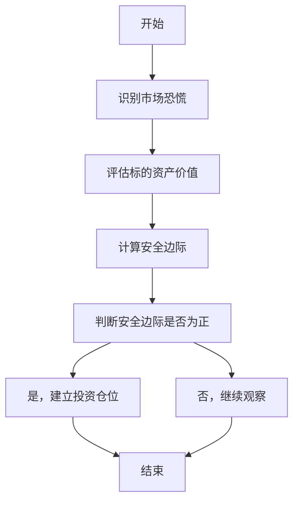
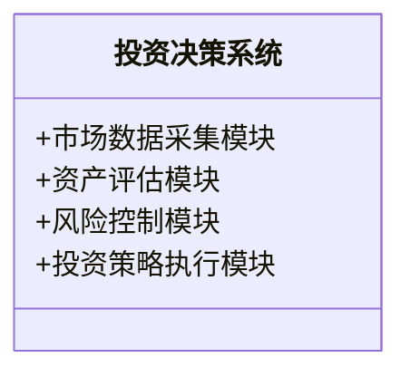

                 


# 塞思·卡拉曼的特殊情况投资策略

## 关键词：塞思·卡拉曼, 特殊情况投资, 价值投资, 逆向思维, 安全边际, 投资策略

## 摘要：塞思·卡拉曼是投资领域中特殊情况投资策略的重要倡导者。本文详细探讨了塞思·卡拉曼的投资理念、数学模型、系统架构以及实战案例。通过逆向思维和安全边际的概念，结合具体的投资策略和算法，本文为读者提供了全面的分析和指导，帮助读者在特殊情况下做出明智的投资决策。

---

# 第一部分: 塞思·卡拉曼的特殊情况投资策略概述

## 第1章: 特殊情况投资策略的背景与定义

### 1.1 投资领域的背景与挑战

#### 1.1.1 传统投资策略的局限性

传统投资策略通常依赖于市场趋势和历史数据分析，但在特殊情况下（如市场崩盘、经济危机等），这些策略往往表现不佳。塞思·卡拉曼指出，传统的基于趋势的投资方法在市场剧烈波动时容易失效，尤其是在市场参与者情绪恐慌时，价格可能严重偏离其真实价值。

#### 1.1.2 特殊情况投资的兴起

特殊情况投资是一种专注于在市场非正常状态下寻找投资机会的策略。随着金融市场的复杂化和波动性增加，这种情况变得越来越常见。塞思·卡拉曼通过其独特的逆向思维和对安全边际的重视，为投资者提供了一种在特殊情况下获利的方法。

#### 1.1.3 塞思·卡拉曼的贡献与影响力

塞思·卡拉曼以其对特殊情况投资的深入研究和实践经验，成为该领域的权威人物。他的策略不仅在理论上得到了广泛认可，还在实际投资中取得了显著的成果，影响了无数投资者。

---

### 1.2 特殊情况投资的定义与特点

#### 1.2.1 特殊情况投资的核心概念

特殊情况投资是指在市场出现极端情况（如公司困境、行业衰退、市场恐慌等）时，通过深入分析和评估，寻找那些被市场低估但具有潜在恢复能力的投资标的。这种策略的核心在于利用市场的非理性波动，捕捉价值低估的机会。

#### 1.2.2 与传统投资策略的对比

与传统投资策略相比，特殊情况投资更加注重安全边际和风险控制。传统策略可能更关注市场的趋势和波动性，而特殊情况投资则更注重标的的基本面分析和潜在恢复能力。

#### 1.2.3 特殊情况投资的适用场景

特殊情况投资适用于市场处于极端波动状态，如经济危机、行业衰退、公司财务危机等情况。在这些情况下，市场往往低估了一些具有潜在价值的企业，为投资者提供了获利的机会。

---

## 第2章: 塞思·卡拉曼的投资理念与方法论

### 2.1 塞思·卡拉曼的投资哲学

#### 2.1.1 价值投资与逆向思维

塞思·卡拉曼的投资哲学深受价值投资的影响，但更加强调逆向思维。他认为，市场参与者在恐慌时往往做出非理性决策，这为理性投资者提供了以低于公允价值的价格买入优质资产的机会。

#### 2.1.2 安全边际的概念与应用

安全边际是塞思·卡拉曼策略的核心要素。他通过计算资产的内在价值，并与市场价格进行对比，确保在买入时有足够的安全空间，以应对市场的不确定性。

#### 2.1.3 风险控制与长期收益的关系

塞思·卡拉曼强调，风险控制是实现长期收益的关键。他通过严格评估资产的安全边际和潜在恢复能力，降低了投资的风险，从而实现了稳定的长期收益。

---

### 2.2 特殊情况投资的核心策略

#### 2.2.1 逆向投资的逻辑与步骤

逆向投资的核心在于在市场恐慌时寻找低估的机会。塞思·卡拉曼的逆向投资策略包括以下步骤：
1. **识别市场恐慌**：通过分析市场情绪和价格波动，判断是否存在非理性下跌。
2. **评估标的资产价值**：计算资产的内在价值，确定其是否被市场低估。
3. **建立投资组合**：在确认低估后，逐步建立仓位，等待市场恢复。

#### 2.2.2 套利机会的识别与评估

套利机会通常出现在市场不完全有效的情况下。塞思·卡拉曼通过分析不同市场、资产或金融工具之间的价格差异，寻找套利机会。他强调，套利应基于充分的市场分析和风险评估。

#### 2.2.3 特殊情况下的估值方法

在特殊情况下，传统的估值方法可能失效。塞思·卡拉曼提出了一种基于资产基本面的估值方法，结合市场情绪和潜在恢复能力，对资产进行重新评估。

---

## 第3章: 特殊情况投资的数学模型与算法

### 3.1 投资决策的数学模型

#### 3.1.1 基于安全边际的价值评估模型

安全边际可以通过以下公式计算：
$$ \text{安全边际} = \text{内在价值} - \text{市场价格} $$

塞思·卡拉曼建议投资者在安全边际为正时进行投资，以确保足够的安全空间。

#### 3.1.2 风险调整后的收益计算公式

风险调整后的收益可以通过以下公式计算：
$$ \text{风险调整后收益} = \text{预期收益} - \text{风险溢价} $$

塞思·卡拉曼强调，风险溢价应根据市场环境和资产特性进行调整。

#### 3.1.3 套利机会的收益-风险分析

套利机会的收益-风险分析可以通过以下步骤进行：
1. 计算套利的预期收益。
2. 评估套利的风险（如流动性风险、信用风险等）。
3. 计算风险调整后的收益，判断是否值得投资。

---

### 3.2 算法原理与流程图

#### 3.2.1 投资决策的算法流程

以下是投资决策算法的流程图：



---

## 第4章: 特殊情况投资的系统架构与实现

### 4.1 投资决策系统的架构设计

#### 4.1.1 系统功能模块划分

以下是投资决策系统的功能模块划分：



---

### 4.2 系统实现与代码示例

#### 4.2.1 环境安装与配置

为了实现投资决策系统，我们需要安装以下环境：
- Python 3.8 或更高版本
- Pandas、NumPy 等数据处理库
- Matplotlib 或 Seaborn 进行数据可视化

---

#### 4.2.2 核心算法的Python代码实现

以下是基于安全边际的估值模型的Python代码：

```python
import pandas as pd
import numpy as np

def calculate_intrinsic_value(fundamentals, market_price):
    # 计算内在价值（简化模型）
    intrinsic_value = fundamentals[' revenue'] * 0.5
    return intrinsic_value

def calculate_margin_of_safety(intrinsic_value, market_price):
    # 计算安全边际
    margin_of_safety = intrinsic_value - market_price
    return margin_of_safety

# 示例数据
fundamentals = {
    'revenue': 1000000,
    'net_income': 200000
}
market_price = 500000

# 计算内在价值和安全边际
intrinsic_value = calculate_intrinsic_value(fundamentals, market_price)
margin_of_safety = calculate_margin_of_safety(intrinsic_value, market_price)

print(f"内在价值: {intrinsic_value}")
print(f"安全边际: {margin_of_safety}")
```

---

## 第5章: 特殊情况投资的实战案例分析

### 5.1 实战案例的选择与分析

#### 5.1.1 案例背景与目标

假设在2020年新冠疫情爆发期间，许多企业面临财务危机，市场恐慌情绪蔓延。塞思·卡拉曼通过其特殊情况投资策略，寻找那些基本面良好但被市场低估的企业。

#### 5.1.2 数据收集与处理

通过分析企业的财务报表和市场数据，评估其内在价值和安全边际。

#### 5.1.3 投资策略的实施过程

1. **识别市场恐慌**：通过市场指数和情绪指标判断市场处于恐慌状态。
2. **评估标的资产价值**：计算企业的内在价值。
3. **计算安全边际**：确定投资的安全空间。
4. **建立投资仓位**：在安全边际为正时，逐步买入资产。

---

## 第6章: 特殊情况投资的最佳实践与注意事项

### 6.1 投资策略的优化与调整

#### 6.1.1 理论与实践的结合

投资者需要根据实际情况调整投资策略，结合市场环境和资产特性进行优化。

#### 6.1.2 不同市场环境下的策略调整

在不同市场环境下，投资者应灵活调整策略，例如在牛市中减少逆向投资的比例，在熊市中增加安全边际的考量。

#### 6.1.3 投资组合的动态管理

投资组合应定期评估和调整，以应对市场变化和潜在风险。

---

### 6.2 投资过程中的注意事项

#### 6.2.1 风险控制的要点

投资者应始终关注风险控制，特别是在市场波动剧烈时，避免过度杠杆和集中投资。

#### 6.2.2 数据来源的可靠性

确保数据来源的可靠性和准确性，特别是在特殊情况下，数据的真实性和及时性尤为重要。

#### 6.2.3 投资决策的伦理与道德

投资者应遵循伦理和道德规范，避免利用非公开信息或操纵市场行为进行投资。

---

## 第7章: 总结与展望

### 7.1 本书的核心内容回顾

塞思·卡拉曼的特殊情况投资策略通过逆向思维和安全边际的概念，为投资者提供了一种在特殊情况下获利的方法。本文详细探讨了其投资理念、数学模型、系统架构和实战案例，为读者提供了全面的指导。

### 7.2 展望

随着金融市场的复杂化和波动性增加，特殊情况投资策略的重要性日益凸显。未来，投资者需要更加注重风险控制和资产的基本面分析，以应对日益复杂的市场环境。

---

作者：AI天才研究院/AI Genius Institute & 禅与计算机程序设计艺术 /Zen And The Art of Computer Programming

