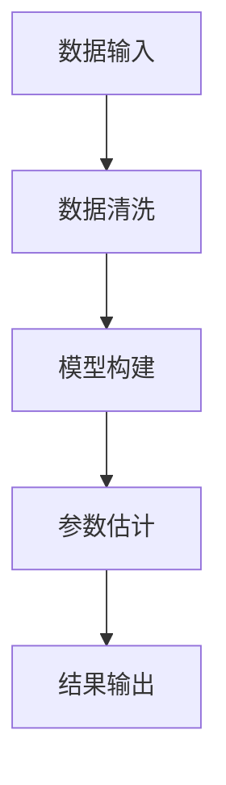
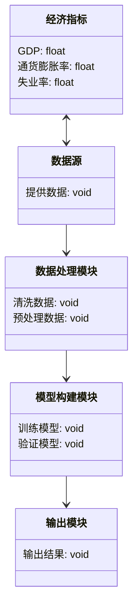
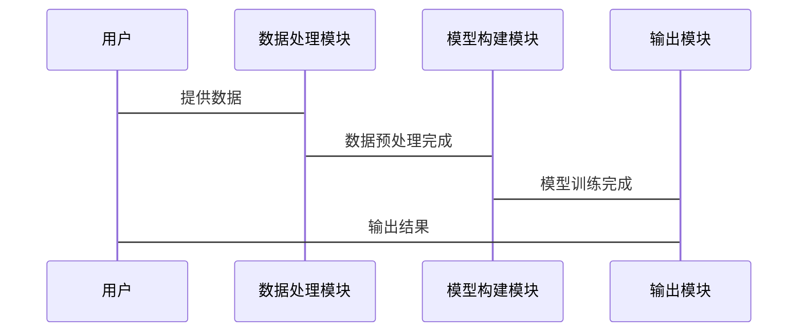

                 


# 塞思卡拉曼的宏观经济分析

## 关键词：宏观经济分析, 宏观经济模型, 经济政策, 宏观经济预测, 宏观经济数据

## 摘要：  
本文将详细介绍宏观经济分析的核心概念、算法原理、系统架构和项目实战。通过塞思卡拉曼的宏观经济分析方法，我们将探讨如何利用数据驱动的模型和算法来预测和优化宏观经济政策，从而为企业和社会提供科学的决策支持。

---

## 第一部分: 宏观经济分析基础

### 第1章: 宏观经济分析概述

#### 1.1 宏观经济分析的基本概念

- **1.1.1 宏观经济分析的定义**  
  宏观经济分析是研究整个经济体系运行规律的学科，旨在理解经济变量之间的相互关系及其对经济整体的影响。

- **1.1.2 宏观经济分析的核心目标**  
  宏观经济分析的目标包括预测经济趋势、评估政策效果、优化资源配置等。

- **1.1.3 宏观经济分析的边界与外延**  
  宏观经济分析通常不考虑个体行为的细节，而是关注整体经济运行的规律。

#### 1.2 宏观经济分析的背景与意义

- **1.2.1 当前全球经济面临的挑战**  
  当前全球经济面临通货膨胀、经济衰退和不平等加剧等问题，宏观经济分析在解决这些问题中起着关键作用。

- **1.2.2 宏观经济分析在政策制定中的作用**  
  宏观经济分析为政府制定货币政策、财政政策提供了科学依据。

- **1.2.3 宏观经济分析对企业的价值**  
  企业可以通过宏观经济分析预测市场趋势，优化经营策略。

#### 1.3 宏观经济分析的核心要素

- **1.3.1 国内生产总值（GDP）的概念与计算**  
  GDP是衡量一个国家或地区经济规模的重要指标，包括消费、投资、政府支出和净出口。

- **1.3.2 通货膨胀与通货紧缩的定义与影响**  
  通货膨胀指物价水平持续上涨，通货紧缩则相反，两者都会影响经济运行。

- **1.3.3 失业率的分类与衡量标准**  
  失业率分为摩擦性失业、结构性失业和周期性失业，是衡量经济健康的重要指标。

#### 1.4 本章小结  
本章介绍了宏观经济分析的基本概念、目标、边界以及核心要素，为后续分析奠定了基础。

---

### 第2章: 宏观经济分析的核心概念与联系

#### 2.1 宏观经济分析的核心概念

- **2.1.1 总需求与总供给的定义**  
  总需求指全社会在一定价格水平下愿意购买的总量，总供给是全社会在一定价格水平下愿意提供的总量。

- **2.1.2 消费、投资、政府支出与净出口的构成**  
  消费是居民的最终支出，投资是企业用于资本形成的支出，政府支出是政府购买商品和服务的支出，净出口是出口减去进口。

- **2.1.3 货币供应与利率的关系**  
  货币供应增加会导致利率下降，反之亦然。

#### 2.2 宏观经济核心概念的属性特征对比

| 概念       | 定义                               | 计量方式       | 影响因素         |
|------------|------------------------------------|----------------|------------------|
| GDP        | 国内生产总值                       | 名义GDP，实际GDP | 价格水平，产出水平 |
| 通货膨胀   | 物价水平上涨                       | 消费者价格指数（CPI） | 货币供应，需求拉动 |
| 失业率      | 劳动力市场中未就业人口比例         | 失业率数据       | 经济周期，结构性因素 |

#### 2.3 宏观经济分析的ER实体关系图


#### 2.4 本章小结  
本章通过对比分析和实体关系图，揭示了宏观经济核心概念之间的联系。

---

### 第3章: 宏观经济分析的算法原理

#### 3.1 宏观经济模型的构建原理

- **3.1.1 IS-LM模型的原理与应用**  
  IS-LM模型描述了产品市场和货币市场的均衡，用于分析宏观经济政策的效果。

- **3.1.2 AD-AS模型的构建与解释**  
  AD-AS模型描述了总需求（AD）和总供给（AS）的相互作用，用于分析价格水平和产出水平的决定。

- **3.1.3 消费者选择理论的数学表达**  
  消费者选择理论通过效用函数描述消费者在预算约束下的选择行为。

#### 3.2 宏观经济分析的数学模型

- **3.2.1 GDP的计算公式**  
  $$ GDP = C + I + G + (X - M) $$  

- **3.2.2 消费函数的数学表达**  
  $$ C = aY + b $$  

- **3.2.3 利率与投资的关系**  
  $$ I = r^{-1} $$  

#### 3.3 宏观经济分析的算法流程图



#### 3.4 本章小结  
本章通过数学模型和流程图，详细讲解了宏观经济分析的算法原理。

---

## 第4章: 宏观经济数据的系统分析与架构设计

### 4.1 宏观经济数据的系统分析

- **4.1.1 数据收集的来源与方法**  
  数据来源包括政府统计机构、国际组织和市场调研公司，数据收集方法包括抽样调查和非抽样调查。

- **4.1.2 数据清洗与预处理的步骤**  
  数据清洗包括处理缺失值、异常值和重复值，预处理包括标准化和归一化。

- **4.1.3 数据分析与建模的步骤**  
  数据分析包括描述性分析和诊断性分析，建模步骤包括特征选择、模型训练和模型验证。

#### 4.2 宏观经济数据的系统架构设计

- **4.2.1 系统功能设计（领域模型类图）**



- **4.2.2 系统架构设计（架构图）**


- **4.2.3 系统交互设计（序列图）**



#### 4.3 本章小结  
本章通过系统分析与架构设计，详细介绍了宏观经济数据的处理流程和系统实现方案。

---

## 第5章: 宏观经济分析的项目实战

### 5.1 项目背景与目标

- **5.1.1 项目背景**  
  本项目旨在利用宏观经济分析方法，预测未来经济趋势，为政策制定提供支持。

- **5.1.2 项目目标**  
  构建一个宏观经济预测模型，实现对GDP、通货膨胀率和失业率的预测。

### 5.2 环境安装与配置

- **5.2.1 环境要求**  
  需要安装Python 3.8及以上版本，安装Jupyter Notebook和相关库（如NumPy、Pandas、Scikit-learn）。

### 5.3 核心代码实现

```python
import numpy as np
import pandas as pd
from sklearn.linear_model import LinearRegression

# 示例数据加载
data = pd.DataFrame({
    'GDP': [5, 6, 7, 8, 9],
    '通货膨胀率': [2, 3, 4, 5, 6],
    '失业率': [6, 5, 4, 3, 2]
})

# 数据预处理
X = data[['GDP', '通货膨胀率']]
y = data['失业率']

# 模型训练
model = LinearRegression()
model.fit(X, y)

# 模型预测
new_GDP = np.array([[7, 4]])
predicted_unemployment = model.predict(new_GDP)
print(predicted_unemployment)
```

### 5.4 代码解读与分析

- **5.4.1 数据加载与预处理**  
  使用Pandas加载数据，并进行必要的数据清洗和预处理。

- **5.4.2 模型训练**  
  使用Scikit-learn的LinearRegression模型进行训练，得到回归系数。

- **5.4.3 模型预测**  
  使用训练好的模型对新数据进行预测，输出结果。

### 5.5 实际案例分析

- **5.5.1 数据来源与处理**  
  数据来源：某国家过去十年的GDP、通货膨胀率和失业率数据。

- **5.5.2 模型应用与结果解读**  
  通过模型预测未来一年的失业率，并分析其对政策制定的影响。

#### 5.6 本章小结  
本章通过项目实战，详细讲解了宏观经济分析的具体实现过程，包括环境配置、数据处理、模型训练和结果解读。

---

## 第6章: 最佳实践与总结

### 6.1 小结

- 宏观经济分析是理解经济运行规律的重要工具，通过对核心概念和算法原理的分析，我们可以更好地预测和优化经济政策。

### 6.2 注意事项

- 在进行宏观经济分析时，需要注意数据的准确性和模型的适用性，避免片面性。

### 6.3 拓展阅读

- 建议进一步阅读《宏观经济学》（作者：N. Gregory Mankiw）和《计量经济学》（作者：Jeffrey M. Wooldridge）等经典著作。

---

## 作者：AI天才研究院/AI Genius Institute & 禅与计算机程序设计艺术 /Zen And The Art of Computer Programming

---

以上是《塞思卡拉曼的宏观经济分析》的完整目录和内容大纲，涵盖了从基础概念到项目实战的全过程。通过本文，读者可以系统地了解宏观经济分析的核心内容和实际应用。

