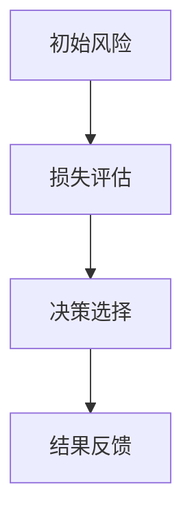
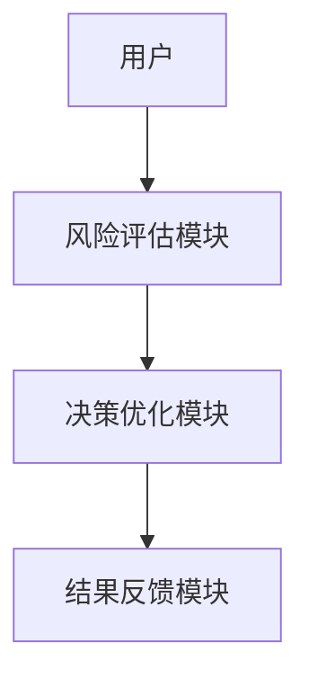

                 


# 塞思卡拉曼的风险规避策略

## 关键词  
风险规避，塞思卡拉曼，行为经济学，决策优化，损失厌恶

## 摘要  
塞思·卡拉曼（Cass Sunstein）作为行为经济学领域的权威专家，提出了许多关于风险规避的重要理论。本文从风险规避的核心概念出发，深入分析其决策模型和算法，结合系统架构设计和实际案例，详细解读塞思·卡拉曼的风险规避策略。文章最后总结了最佳实践和注意事项，为读者提供全面的指导。

---

# 第一部分: 塞思卡拉曼风险规避策略的理论基础

## 第1章: 风险规避的核心概念与背景

### 1.1 问题背景与问题描述  
在现代决策科学中，风险规避是一个核心议题。塞思·卡拉曼的研究揭示了人类在面对风险时的行为偏差，这为我们理解和优化风险决策提供了重要理论依据。  

#### 1.1.1 风险决策中的行为偏差  
人类在面对风险时，往往受到认知偏差的影响，比如损失厌恶、确认偏差等。这些偏差会导致非理性决策。  

#### 1.1.2 塞思·卡拉曼理论的核心问题  
卡拉曼的研究聚焦于个体和集体在风险决策中的行为模式，尤其是如何通过制度设计来优化风险决策。  

#### 1.1.3 风险规避的边界与外延  
风险规避不仅涉及个人决策，还包括集体决策和社会制度的设计。  

### 1.2 核心概念与联系  
#### 1.2.1 风险规避的定义与属性特征对比  
风险规避是指个体或组织在决策过程中主动降低或避免潜在损失的行为。与风险中性和风险偏好不同，风险规避强调的是损失的最小化。  

| 概念 | 定义 | 特征 |  
|------|------|------|  
| 风险规避 | 主动降低风险的行为 | 损失厌恶、确定性偏好 |  
| 风险中性 | 对风险持中立态度 | 风险中立、预期效用 |  
| 风险偏好 | 偏好高风险高回报 | 风险寻求、冒险倾向 |  

#### 1.2.2 ER实体关系图架构  
通过ER图，我们可以清晰地理解风险规避的核心要素及其关系。  

```mermaid
erd
actor 风险主体 {
    风险感知
    风险评估
}
actor 风险行为 {
    决策选择
    结果反馈
}
```

---

## 第2章: 风险规避的决策模型与算法  

### 2.1 算法原理讲解  
#### 2.1.1 风险决策树的构建  
决策树是一种常用的决策分析工具，用于在不同风险场景下选择最优策略。  



#### 2.1.2 基于损失厌恶的优化算法  
损失厌恶是指人们对损失的敏感程度高于收益。通过损失厌恶函数，我们可以优化风险决策。  

```python
def loss_averse_function(loss):
    return (loss)**0.5  # 使用平方根函数表示损失厌恶
```

### 2.2 数学模型与公式  
#### 2.2.1 风险规避函数  
$$ V(r) = \sqrt{r} $$  
其中，r 表示风险水平，平方根函数表示损失厌恶。  

#### 2.2.2 前景理论中的概率加权函数  
$$ w(p) = p^\alpha (1-p)^\beta $$  
其中，p 是概率，α 和 β 是参数，控制概率加权的效果。  

---

## 第3章: 系统分析与架构设计  

### 3.1 问题场景介绍  
#### 3.1.1 风险规避的典型场景  
- 金融投资中的风险控制  
- 医疗决策中的风险评估  
- 企业战略中的风险规避  

#### 3.1.2 系统目标与范围  
设计一个基于塞思·卡拉曼理论的风险规避系统，用于优化个体和集体的决策过程。  

### 3.2 系统功能设计  
#### 3.2.1 领域模型  


#### 3.2.2 系统架构设计  


---

## 第4章: 项目实战与案例分析  

### 4.1 环境安装与配置  
#### 4.1.1 Python环境安装  
安装Python 3.8及以上版本。  

#### 4.1.2 必要库的安装  
- numpy  
- matplotlib  
- pandas  

### 4.2 核心代码实现  
#### 4.2.1 风险规避函数实现  
```python
import numpy as np
import matplotlib.pyplot as plt

def risk_aversion_function(r):
    return (r)**0.5

r_values = np.linspace(0, 10, 100)
result = risk_aversion_function(r_values)

plt.plot(r_values, result)
plt.xlabel('风险水平')
plt.ylabel('风险规避值')
plt.show()
```

### 4.3 案例分析与解读  
#### 4.3.1 金融投资中的风险规避策略  
在金融投资中，投资者可以通过风险规避函数优化投资组合，降低潜在损失。  

#### 4.3.2 医疗决策中的风险规避策略  
在医疗决策中，医生可以通过风险规避模型评估不同治疗方案的风险，选择最优方案。  

---

## 第5章: 最佳实践、小结与拓展阅读  

### 5.1 最佳实践 tips  
- 在实际应用中，结合具体场景调整风险规避函数。  
- 定期更新风险模型，以适应新的风险环境。  

### 5.2 小结  
塞思·卡拉曼的风险规避策略为我们提供了重要的理论指导。通过行为经济学的视角，我们可以更好地理解风险决策，并优化实际应用中的决策过程。  

### 5.3 注意事项  
- 风险规避模型需要结合具体场景进行调整。  
- 避免过度简化风险模型，忽略重要风险因素。  

### 5.4 拓展阅读  
- 《风险规避与决策优化》  
- 《行为经济学与风险决策》  

---

## 作者：AI天才研究院/AI Genius Institute & 禅与计算机程序设计艺术/Zen And The Art of Computer Programming

